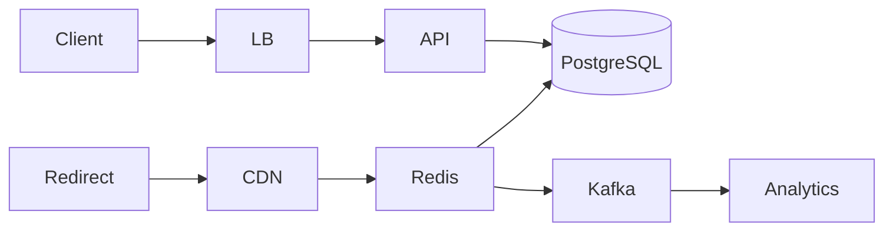

# Design URL Shortener — Case Study

**Case Study ID:** CS-HLD-C01
**Track:** Classic HLD
**Companies:** Google, Amazon, Meta, Bitly
**Difficulty:** Medium
**Related question:** [Q01-url-shortener.md](../../../System%20Design%20-%20High%20Level%20Design/03-classic-hld/questions/Q01-url-shortener.md)

---

## Part 1 — Business Context

**Industry analog:** Bitly — URL shortening for marketing campaigns with click analytics.

Marketing teams share 100M new links/day; redirects hit 10B/day (100:1 read-heavy). Peak redirect QPS ~350K requires CDN + Redis. Product also wants custom aliases for enterprise tier.

**Success:** Sub-50ms p99 redirect (cache hit), 99.99% redirect availability, analytics lag < 1 min.

---

## Part 2 — Stakeholders & Personas

| Persona | Goals | Pain points | Success metric |
|---------|-------|-------------|----------------|
| End user | Complete core flows quickly | Slow, unreliable UX | Task completion rate > 95% |
| Product owner | Ship MVP on schedule | Scope creep | On-time V1 delivery |
| SRE / platform | Meet SLO with observability | Opaque failures | Error budget > 0 monthly |
| Security / compliance | Data protection, audit trail | Regulatory breach | Zero critical findings |

---

## Part 3 — Requirements

### Functional Requirements (MoSCoW)

| Priority | Requirement | Acceptance criteria |
|----------|-------------|---------------------|
| Must | Core Design a URL shortening service like bit.ly: long URLs → sho… | E2E test passes |
| Won't (MVP) | Multi-region active-active | Documented in PRD |
| Won't (MVP) | Advanced ML personalization | Documented in PRD |

### Non-Functional Requirements

| Attribute | Target | Measurement |
|-----------|--------|-------------|
| Latency | p99 < 200ms | APM / distributed tracing |
| Availability | 99.9% | Uptime SLO dashboard |
| Throughput | 10K peak QPS (scale phase) | Load test report |
| Security | AuthN/Z, encryption at rest/transit | Annual pen test |
| Maintainability | Modular services, ADRs documented | Change failure rate < 15% |

### Clarifying Questions (Discovery Phase)

| # | Question | Expected answer |
|---|----------|-----------------|
| 1 | Short URL length? | 7 characters, base62 |
| 2 | Read/write ratio? | 100:1 |
| 3 | New URLs/day? | 100M creates, 10B redirects |
| 4 | Custom aliases? | Optional premium feature |
| 5 | Expiration? | Optional TTL; default none |
| 6 | Analytics? | Click count, referrer, geo — async |
| 7 | Abuse? | Malware scan, blocklist |
| 8 | Collision? | Must be unique globally |

---

---

## Part 4 — Constraints

| Constraint | Detail | Impact on design |
|------------|--------|------------------|
| Read QPS | 350K peak redirects | CDN + Redis mandatory |
| Storage | ~180 TB over 10 years | Shard Postgres by code hash |
| Abuse | Malware links damage brand | Async scan + blocklist |
| ID uniqueness | Global collision-free | Counter + base62 or hash+retry |

---

## Part 5 — Tradeoffs & Architecture Decision Records

### ADR-001: ID generation

**Status:** Accepted  
**Context:** 100M creates/day; must be unique globally.  
**Decision:** Distributed counter ranges per shard + base62 encode.  
**Consequences:** Ordered IDs; counter service is critical path.  
**Alternatives considered:** Hash+retry — viable; mention in interview for distributed writes.


### ADR-002: Redirect HTTP code

**Status:** Accepted  
**Context:** SEO and browser caching behavior.  
**Decision:** HTTP 301 permanent redirect.  
**Consequences:** Browsers cache; good for static short links.  
**Alternatives considered:** 302 — for links that change destination frequently.


### Tradeoffs Summary (from design analysis)


| Decision | A | B | Pick |
|----------|---|---|------|
| Redirect code | 301 | 302 | 301 for permanent short links |
| Cache | Redis | CDN only | Both — CDN for viral links |
| DB | SQL | NoSQL | SQL fine; Dynamo for extreme scale |

---


---

## Part 6 — Capacity & Cost Estimation

```
Creates: 100M/day → 1,160 write QPS peak ~3.5K
Redirects: 10B/day → 116K QPS avg → ~350K peak

Storage 10 years: 100M/day × 3650 × 500 bytes ≈ 180 TB
7-char base62 = 62^7 ≈ 3.5 trillion codes — plenty
```

**Bottleneck:** Read path at 350K QPS — cache is mandatory.

---

### Cost ballpark (V1)

- Compute: $5–15K/mo\n- Managed DB/cache: $3–8K/mo\n- LLM API (if applicable): usage-based; budget caps per tenant

---

## Part 7 — High-Level Design

### Problem recap

Design a URL shortening service like bit.ly: long URLs → short codes, redirect on click, optional analytics.

---

### Architecture

```
CREATE: Client → API → Idempotency check → Counter/Hash → Write DB → return short URL

REDIRECT: Client → CDN edge → Redis (99% hit) → on miss DB → 301 redirect
                                              ↓
                                         Async: analytics Kafka
```



---

### Component choices

| Component | Choice | Why |
|-----------|--------|-----|
| ID generation | Distributed counter + base62 | Ordered, no collision |
| Alternative | MD5(url)[:7] + retry | No counter SPOF; collision handling |
| Cache | Redis cluster | 350K read QPS |
| DB | PostgreSQL sharded by hash(code) | Durable mapping |
| Redirect | 301 permanent | SEO/cache friendly |

---

### Deep dive topics

**Option A — Counter service (Twitter Snowflake style):**
> "A dedicated ID service increments a counter; API encodes to base62. Counter ranges pre-allocated per DB shard to avoid coordination."

**Option B — Hash + retry:**
> "Hash long URL + salt; on collision, append nonce and retry. Good for distributed writes without central counter."

**Pick:** Counter for dense URLs; mention hash for interview variety.

---

### Failure modes

- Redis down: DB fallback with rate limit to protect DB
- Counter service down: failover to backup range or hash mode
- Hot key viral link: local cache on edge POP

---

---

## Part 8 — Low-Level Design (LLD Boundary)

At the HLD level, defer class-level design to the LLD round. Sketch the **object model** the interviewer may ask for:

### Core object clusters

- **Service facade** — orchestrates use cases\n- **Domain entities** — hold business state\n- **Strategy interfaces** — swappable algorithms

### Patterns to mention in LLD follow-up

| Pattern | Use |
|---------|-----|
| Strategy | Swappable algorithms (allocation, routing, pricing) |
| Repository | Persistence abstraction behind domain |
| Factory | Complex object creation |
| Observer | Event notifications |

### Pivot script

> "At object level I'd model the core domain entities with a service facade and Strategy for variation points. "
> "For distributed scale, I'd add the cache, queue, and shard layers from the HLD — happy to go deeper on either."


## Part 9 — Implementation Roadmap

| Phase | Timeline | Scope | Out of scope |
|-------|----------|-------|--------------|
| MVP | 2 weeks | Single-region, core user flows, manual ops | Multi-region, advanced analytics |
| V1 | 3 months | Production SLO, auth, monitoring, connector integrations | Custom ML models |
| Scale | 12 months | Auto-scaling, cost optimization, enterprise compliance | Edge deployment |

**MVP success criteria for Design URL Shortener:** Core flows demo-ready; p99 within 2× target; on-call runbook draft.

---

## Part 10 — Operations

### SLI / SLO

| SLI | Definition | SLO |
|-----|------------|-----|
| Availability | successful_requests / total_requests | 99.9% monthly |
| Latency | p99 response time | < 300ms |

### Observability

- **Metrics:** Request rate, error rate, latency histograms, queue depth, cache hit ratio
- **Logs:** Structured JSON with `trace_id`, `tenant_id`, `user_id`
- **Traces:** OpenTelemetry across API → workers → DB/cache/LLM

### Deployment

- Blue/green or canary via CI/CD; feature flags for risky changes
- Database migrations backward-compatible; expand-contract pattern

### Incident Runbook

**Scenario:** p99 latency spike 3× baseline.

1. Check error budget burn in Grafana
2. Identify hot shard / tenant via trace tags
3. Scale workers or enable degradation mode
4. Post-incident: ADR if architecture change needed

### Security Checklist

- Authentication via org SSO (OIDC)
- Authorization at API + data layer
- Encryption at rest (AES-256) and in transit (TLS 1.3)
- Audit log for admin and sensitive reads
- Secrets in vault; no keys in code


---

## Part 11 — Interview Walkthrough (30 min)

> This is a 30-minute senior loop for **Design URL Shortener**. Spend 5 minutes on context, 10 on HLD, 10 on LLD/boundaries, 5 on ops.

> "URL shortener at 100M creates and 10B redirects daily — 100:1 read-heavy. 350K peak read QPS means Redis and CDN are non-negotiable."

> "Create path: client POSTs long URL. API validates, checks idempotency key for retries, gets unique ID from counter service, encodes base62 seven characters, stores mapping in Postgres sharded by hash of code, returns short URL."

> "Redirect path: GET hits CDN first for hottest URLs. Then Redis cluster — sub-millisecond. On miss, Postgres lookup, cache populate, HTTP 301. Analytics via Kafka so redirect stays fast."

> "Custom aliases: reserved namespace check in DB unique index. Expired links: TTL in Redis + periodic DB cleanup."

> "I'll use 301 redirects, counter-based IDs with pre-allocated ranges per shard to avoid a single counter bottleneck."

> ---

> If the interviewer pivots to object design, I sketch the service boundaries and DTOs — detailed classes are in the LLD case study.


---

## Part 11b — Practical Learning Lab

### Hands-on exercises

1. **Whiteboard (15 min):** Draw HLD distributed components from memory after reading Parts 1–5.
2. **Tradeoff drill (10 min):** Pick one ADR and argue the rejected alternative for 2 minutes.
3. **Failure mode (10 min):** Pick one failure from Part 7/10; write a 5-step runbook.
4. **Pivot practice (5 min):** Practice the HLD↔LLD pivot script aloud.
5. **Timed mock (45 min):** Use the linked question file without looking at this case study.

### Production readiness checklist

- [ ] SLO defined and dashboarded
- [ ] Load test at 2× expected peak QPS
- [ ] Chaos test: kill one dependency; verify degradation
- [ ] Security review: auth, encryption, audit
- [ ] Runbook linked from on-call playbook
- [ ] Cost model reviewed with FinOps
- [ ] ADRs stored in repo `docs/adr/`

### Industry comparison

| Capability | Bitly — link shortening, analytics, and branded domains (reference) | This design (MVP) | Scale phase |
|------------|----------------------|-------------------|-------------|
| Core flow | Production-grade | MVP scope in Part 9 | Part 9 Scale column |
| Reliability | Multi-region | Single-region 99.9% | Multi-region failover |
| Observability | Full APM + SRE | Metrics + traces + logs | SLO error budgets |
| Security | Enterprise compliance | Checklist in Part 10 | SOC2 / pen test |


### Senior interviewer rubric

| Signal | Strong | Weak |
|--------|--------|------|
| Requirements | Measurable NFRs stated upfront | Vague "it should scale" |
| Constraints | Names budget, team, timeline | Ignores constraints |
| Tradeoffs | ADR with rejected alternative | Single option only |
| Depth | Failure modes unprompted | Happy path only |
| Communication | Structured 30-min narrative | Jumps to diagram |


---

## Part 12 — Related Links

- **Question file:** [Q01-url-shortener.md](../../../System%20Design%20-%20High%20Level%20Design/03-classic-hld/questions/Q01-url-shortener.md)
- **Template:** [case-study-template.md](../../00-framework/case-study-template.md)
- **Industry standards:** [industry-standards-reference.md](../../00-framework/industry-standards-reference.md)

- [Classic Patterns](../../../System%20Design%20-%20Low%20Level%20Design/02-classic-ood/00-classic-patterns.md)
- [Caching](../../../System%20Design%20-%20High%20Level%20Design/01-core-concepts/caching.md)
