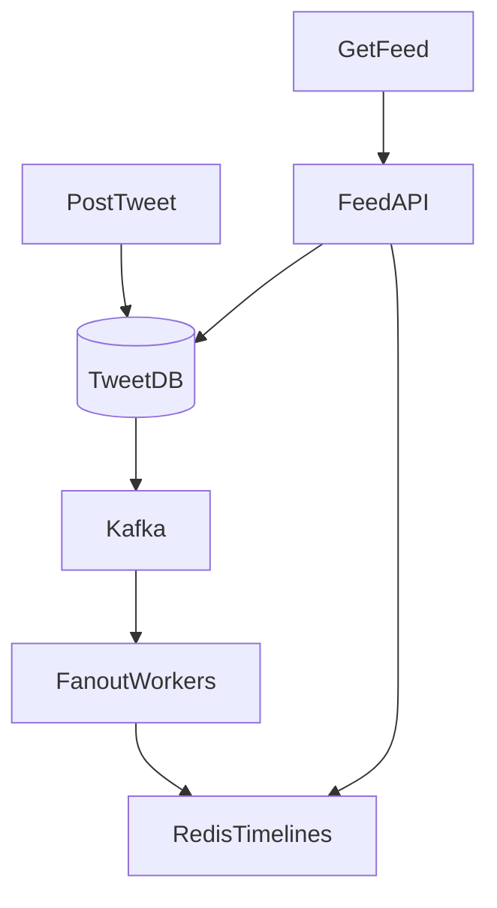

# Design Twitter/X News Feed — Case Study

**Case Study ID:** CS-HLD-C02
**Track:** Classic HLD
**Companies:** Meta, Twitter, LinkedIn
**Difficulty:** Hard
**Related question:** [Q02-twitter-feed.md](../../../System%20Design%20-%20High%20Level%20Design/03-classic-hld/questions/Q02-twitter-feed.md)
**Paired case study:** [CS-PAIR-06-twitter-news-feed.md](../../paired/CS-PAIR-06-twitter-news-feed.md)

---

## Part 1 — Business Context

**Industry analog:** Twitter/X and LinkedIn feed — fan-out on write vs read

This case study examines **Design Twitter/X News Feed** — a system type commonly built at Meta and similar organizations. Design a social media home timeline: users follow others, see tweets in reverse chronological or ranked feed.

---

**Why now:** Teams with 3–5 YOE full-stack backgrounds are expected to connect product requirements to concrete architecture — especially with GenAI/LLM components where cost, safety, and correctness trade off sharply.

**Success definition:** Meet NFR targets, ship MVP within constraints, and articulate tradeoffs using ADRs.

---

## Part 2 — Stakeholders & Personas

| Persona | Goals | Pain points | Success metric |
|---------|-------|-------------|----------------|
| End user | Complete core flows quickly | Slow, unreliable UX | Task completion rate > 95% |
| Product owner | Ship MVP on schedule | Scope creep | On-time V1 delivery |
| SRE / platform | Meet SLO with observability | Opaque failures | Error budget > 0 monthly |
| Security / compliance | Data protection, audit trail | Regulatory breach | Zero critical findings |

---

## Part 3 — Requirements

### Functional Requirements (MoSCoW)

| Priority | Requirement | Acceptance criteria |
|----------|-------------|---------------------|
| Must | Core Design a social media home timeline: users follow others, se… | E2E test passes |
| Won't (MVP) | Multi-region active-active | Documented in PRD |
| Won't (MVP) | Advanced ML personalization | Documented in PRD |

### Non-Functional Requirements

| Attribute | Target | Measurement |
|-----------|--------|-------------|
| Latency | p99 < 200ms | APM / distributed tracing |
| Availability | 99.9% | Uptime SLO dashboard |
| Throughput | 10K peak QPS (scale phase) | Load test report |
| Security | AuthN/Z, encryption at rest/transit | Annual pen test |
| Maintainability | Modular services, ADRs documented | Change failure rate < 15% |

### Clarifying Questions (Discovery Phase)

| # | Question | Expected answer |
|---|----------|-----------------|
| 1 | DAU? | 300M |
| 2 | Tweets/day? | 500M posts |
| 3 | Avg follows? | 200; max celebrities 50M |
| 4 | Feed latency? | p99 < 200ms |
| 5 | Consistency? | Eventual OK — seconds delay fine |
| 6 | Media? | Separate media service; link in tweet |
| 7 | Ranking? | MVP chronological; extension ML rank |

---

---

## Part 4 — Constraints

| Constraint | Detail | Impact on design |
|------------|--------|------------------|
| Budget | $50K/month infra at V1 scale | Prefer managed services over self-host |
| Team | 2 backend, 1 frontend, 1 ML engineer | MVP scope strictly bounded |
| Timeline | MVP in 8 weeks | Defer nice-to-have features |
| Tech | Cloud-native on AWS/GCP | Use existing org SSO and VPC |
| Build vs buy | Buy vector DB / LLM API; build orchestration | Focus engineering on differentiation |

---

## Part 5 — Tradeoffs & Architecture Decision Records

### ADR-001: Primary architecture pattern

**Status:** Accepted  
**Context:** Need to balance delivery speed, operability, and scale for Design Twitter/X News Feed.  
**Decision:** Event-driven async for writes; cache-heavy sync read path.  
**Consequences:** Higher eventual consistency on analytics; simpler peak handling.  
**Alternatives considered:** Fully synchronous CRUD — rejected due to peak QPS.


### ADR-002: Data store selection

**Status:** Accepted  
**Context:** Mixed OLTP, cache, and search/vector needs.  
**Decision:** PostgreSQL for source of truth; Redis for hot path; specialized index where needed.  
**Consequences:** Operational complexity of multiple stores; optimal per access pattern.  
**Alternatives considered:** Single document DB — rejected for strong consistency requirements.


### ADR-003: Multi-tenancy model

**Status:** Accepted  
**Context:** B2B SaaS with strict isolation requirements.  
**Decision:** Logical tenant_id on all rows + encryption per tenant for sensitive payloads.  
**Consequences:** Cost-effective vs physical isolation; requires rigorous integration tests.  
**Alternatives considered:** Database-per-tenant — rejected at 10K tenant scale.


### Tradeoffs Summary (from design analysis)


| Approach | Write cost | Read cost | Pick |
|----------|------------|-----------|------|
| Fan-out on write | High | Low | Normal users |
| Fan-out on read | Low | High | Celebrities |
| Hybrid | Balanced | Balanced | Production Twitter |

---


---

## Part 6 — Capacity & Cost Estimation

```
500M tweets/day → 5,800 write QPS peak ~17K
300M DAU × 100 feed loads/day = 30B reads/day → 347K QPS peak ~1M

Fan-out on write for average user: 200 followers × 17K write QPS = 3.4M writes/sec — too high
→ Hybrid fan-out required
```

---

### Cost ballpark (V1)

- Compute: $5–15K/mo\n- Managed DB/cache: $3–8K/mo\n- LLM API (if applicable): usage-based; budget caps per tenant

---

## Part 7 — High-Level Design

### Problem recap

Design a social media home timeline: users follow others, see tweets in reverse chronological or ranked feed.

---

### Architecture

```
POST: Client → Tweet API → Tweet DB → Kafka "tweet_created"
       → Fanout Workers → Redis timeline per follower (for normal users)
       → Skip fanout for users with > 100K followers (celebrities)

READ: Client → Feed API → Redis timelines (merge) → fetch celebrity tweets on read → return
```



---

### Component choices

| Component | Choice | Alternative |\n|-----------|--------|-------------|\n| API | Stateless REST/gRPC | GraphQL |

### Deep dive topics

| User type | Strategy |
|-------------|----------|
| Normal (< 10K followers) | Fan-out on write to Redis sorted set |
| Celebrity (> 100K) | Fan-out on read — merge at read time |
| Medium | Fan-out to active followers only |

**Redis timeline:** `ZADD timeline:{user_id} timestamp tweet_id` — top 800 tweets cached.

**Read merge:** Union follower timelines from Redis + query celebrity tweets from DB for followed celebrities in last 24h.

---

### Failure modes

- Fanout worker lag: stale feed OK; show indicator
- Redis down: fall back to fan-out on read (slow)
- Celebrity merge timeout: return cached timeline without celebrity tweets

---

---

## Part 8 — Low-Level Design (LLD Boundary)

At the HLD level, defer class-level design to the LLD round. Sketch the **object model** the interviewer may ask for:

### Core object clusters

- **Service facade** — orchestrates use cases\n- **Domain entities** — hold business state\n- **Strategy interfaces** — swappable algorithms

### Patterns to mention in LLD follow-up

| Pattern | Use |
|---------|-----|
| Strategy | Swappable algorithms (allocation, routing, pricing) |
| Repository | Persistence abstraction behind domain |
| Factory | Complex object creation |
| Observer | Event notifications |

### Pivot script

> "At object level I'd model the core domain entities with a service facade and Strategy for variation points. "
> "For distributed scale, I'd add the cache, queue, and shard layers from the HLD — happy to go deeper on either."


## Part 9 — Implementation Roadmap

| Phase | Timeline | Scope | Out of scope |
|-------|----------|-------|--------------|
| MVP | 2 weeks | Single-region, core user flows, manual ops | Multi-region, advanced analytics |
| V1 | 3 months | Production SLO, auth, monitoring, connector integrations | Custom ML models |
| Scale | 12 months | Auto-scaling, cost optimization, enterprise compliance | Edge deployment |

**MVP success criteria for Design Twitter/X News Feed:** Core flows demo-ready; p99 within 2× target; on-call runbook draft.

---

## Part 10 — Operations

### SLI / SLO

| SLI | Definition | SLO |
|-----|------------|-----|
| Availability | successful_requests / total_requests | 99.9% monthly |
| Latency | p99 response time | < 300ms |

### Observability

- **Metrics:** Request rate, error rate, latency histograms, queue depth, cache hit ratio
- **Logs:** Structured JSON with `trace_id`, `tenant_id`, `user_id`
- **Traces:** OpenTelemetry across API → workers → DB/cache/LLM

### Deployment

- Blue/green or canary via CI/CD; feature flags for risky changes
- Database migrations backward-compatible; expand-contract pattern

### Incident Runbook

**Scenario:** p99 latency spike 3× baseline.

1. Check error budget burn in Grafana
2. Identify hot shard / tenant via trace tags
3. Scale workers or enable degradation mode
4. Post-incident: ADR if architecture change needed

### Security Checklist

- Authentication via org SSO (OIDC)
- Authorization at API + data layer
- Encryption at rest (AES-256) and in transit (TLS 1.3)
- Audit log for admin and sensitive reads
- Secrets in vault; no keys in code


---

## Part 11 — Interview Walkthrough (30 min)

> This is a 30-minute senior loop for **Design Twitter/X News Feed**. Spend 5 minutes on context, 10 on HLD, 10 on LLD/boundaries, 5 on ops.

> "300M DAU, 500M tweets daily, average 200 follows — classic hybrid fan-out problem."

> "Post tweet: write to tweet DB sharded by user_id, publish tweet_created to Kafka. Fanout workers consume: if author has under 100K followers, push tweet_id into each follower's Redis sorted set timeline. If celebrity, skip fanout — we'll pull on read."

> "Read feed: Feed API fetches precomputed timeline from Redis — O(1) for normal case. For any followed celebrities, parallel fetch their recent tweets from DB and merge-sort by timestamp. Return top 50."

> "At 17K write QPS, naive fan-out to 200 followers each would be millions of writes per second — impossible. Hybrid is mandatory. Medium users might fan-out only to active users in last 7 days."

> "Extensions: ML ranking reorders top 200 candidates; separate hot path for photos via media CDN."

> ---

> If the interviewer pivots to object design, I sketch the service boundaries and DTOs — detailed classes are in the LLD case study.


---

## Part 11b — Practical Learning Lab

### Hands-on exercises

1. **Whiteboard (15 min):** Draw HLD distributed components from memory after reading Parts 1–5.
2. **Tradeoff drill (10 min):** Pick one ADR and argue the rejected alternative for 2 minutes.
3. **Failure mode (10 min):** Pick one failure from Part 7/10; write a 5-step runbook.
4. **Pivot practice (5 min):** Practice the HLD↔LLD pivot script aloud.
5. **Timed mock (45 min):** Use the linked question file without looking at this case study.

### Production readiness checklist

- [ ] SLO defined and dashboarded
- [ ] Load test at 2× expected peak QPS
- [ ] Chaos test: kill one dependency; verify degradation
- [ ] Security review: auth, encryption, audit
- [ ] Runbook linked from on-call playbook
- [ ] Cost model reviewed with FinOps
- [ ] ADRs stored in repo `docs/adr/`

### Industry comparison

| Capability | Twitter/X and LinkedIn feed — fan-out on write vs read (reference) | This design (MVP) | Scale phase |
|------------|----------------------|-------------------|-------------|
| Core flow | Production-grade | MVP scope in Part 9 | Part 9 Scale column |
| Reliability | Multi-region | Single-region 99.9% | Multi-region failover |
| Observability | Full APM + SRE | Metrics + traces + logs | SLO error budgets |
| Security | Enterprise compliance | Checklist in Part 10 | SOC2 / pen test |


### Senior interviewer rubric

| Signal | Strong | Weak |
|--------|--------|------|
| Requirements | Measurable NFRs stated upfront | Vague "it should scale" |
| Constraints | Names budget, team, timeline | Ignores constraints |
| Tradeoffs | ADR with rejected alternative | Single option only |
| Depth | Failure modes unprompted | Happy path only |
| Communication | Structured 30-min narrative | Jumps to diagram |


---

## Part 12 — Related Links

- **Question file:** [Q02-twitter-feed.md](../../../System%20Design%20-%20High%20Level%20Design/03-classic-hld/questions/Q02-twitter-feed.md)
- **End-to-end pair:** [CS-PAIR-06-twitter-news-feed.md](../../paired/CS-PAIR-06-twitter-news-feed.md)
- **Template:** [case-study-template.md](../../00-framework/case-study-template.md)
- **Industry standards:** [industry-standards-reference.md](../../00-framework/industry-standards-reference.md)

- [Classic Patterns](../../../System%20Design%20-%20Low%20Level%20Design/02-classic-ood/00-classic-patterns.md)
- [Caching](../../../System%20Design%20-%20High%20Level%20Design/01-core-concepts/caching.md)
