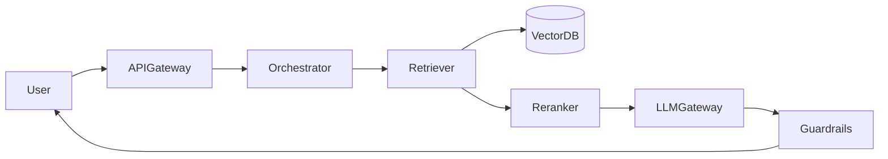

# Design Long-Context Document Chat (100K+) — Case Study

**Case Study ID:** CS-HLD-G33
**Track:** Gen AI / LLM HLD
**Companies:** Anthropic, Google
**Difficulty:** Hard
**Related question:** [Q33-long-context-document-chat.md](../../System Design - High Level Design/02-genai-llm-hld/questions/Q33-long-context-document-chat.md)

---

## Part 1 — Business Context

**Industry analog:** Leading products in the Design Long-Context Document Chat (100K+) domain

This case study examines **Design Long-Context Document Chat (100K+)** — a system type commonly built at Anthropic and similar organizations. Design a production system for: **Long-Context Document Chat (100K+)**.

---

**Why now:** Teams with 3–5 YOE full-stack backgrounds are expected to connect product requirements to concrete architecture — especially with GenAI/LLM components where cost, safety, and correctness trade off sharply.

**Success definition:** Meet NFR targets, ship MVP within constraints, and articulate tradeoffs using ADRs.

---

## Part 2 — Stakeholders & Personas

| Persona | Goals | Pain points | Success metric |
|---------|-------|-------------|----------------|
| End user | Complete core flows quickly | Slow, unreliable UX | Task completion rate > 95% |
| Product owner | Ship MVP on schedule | Scope creep | On-time V1 delivery |
| SRE / platform | Meet SLO with observability | Opaque failures | Error budget > 0 monthly |
| Security / compliance | Data protection, audit trail | Regulatory breach | Zero critical findings |

---

## Part 3 — Requirements

### Functional Requirements (MoSCoW)

| Priority | Requirement | Acceptance criteria |
|----------|-------------|---------------------|
| Must | Core user-facing capability for long-context document chat (100k+) | Verified in integration tests |
| Must | Session/history management where applicable | Verified in integration tests |
| Must | Admin: model version, prompt version, usage dashboards | Verified in integration tests |
| Must | hierarchical summarization | Verified in integration tests |
| Won't (MVP) | Multi-region active-active | Documented in PRD |
| Won't (MVP) | Advanced ML personalization | Documented in PRD |

### Non-Functional Requirements

| Attribute | Target | Measurement |
|-----------|--------|-------------|
| Latency | p99 < 500ms sync API; p99 < 8s LLM | APM / distributed tracing |
| Availability | 99.9% | Uptime SLO dashboard |
| Throughput | 10K peak QPS (scale phase) | Load test report |
| Security | AuthN/Z, encryption at rest/transit | Annual pen test |
| Maintainability | Modular services, ADRs documented | Change failure rate < 15% |
| LLM faithfulness | Citation accuracy > 95% on eval set | Offline eval pipeline |

**From requirements analysis:**
- Availability: 99.9%
- p99 latency: TTFT < 500ms for streaming
- Cost visibility per tenant/query
- Audit log for prompts, retrieval sources, responses
- Security: auth, PII handling, prompt injection defense

---

### Clarifying Questions (Discovery Phase)

| # | Question | Expected answer |
|---|----------|-----------------|
| 1 | B2B multi-tenant or consumer? | Assume 200K token docs unless stated |
| 2 | Latency target for first token? | < 500ms TTFT, full response < 15s |
| 3 | Must answers be grounded/cited? | Yes for RAG/legal/medical |
| 4 | Self-host models or API? | Start API; self-host at > 50M tokens/day |
| 5 | Data residency / compliance? | Mention GDPR, SOC2; HIPAA if medical |
| 6 | Human in the loop? | Escalation path for low-confidence |
| 7 | Scale? | 200K token docs, full doc vs chunk tradeoff |
| 8 | Offline/batch vs real-time? | Per focus: hierarchical summarization |
| 9 | Multi-modal input? | Text primary |
| 10 | Evaluation before deploy? | Golden set + regression gate |

---

---

## Part 4 — Constraints

| Constraint | Detail | Impact on design |
|------------|--------|------------------|
| Budget | $50K/month infra at V1 scale | Prefer managed services over self-host |
| Team | 2 backend, 1 frontend, 1 ML engineer | MVP scope strictly bounded |
| Timeline | MVP in 8 weeks | Defer nice-to-have features |
| Tech | Cloud-native on AWS/GCP | Use existing org SSO and VPC |
| Build vs buy | Buy vector DB / LLM API; build orchestration | Focus engineering on differentiation |

---

## Part 5 — Tradeoffs & Architecture Decision Records

### ADR-001: Primary architecture pattern

**Status:** Accepted  
**Context:** Need to balance delivery speed, operability, and scale for Design Long-Context Document Chat (100K+).  
**Decision:** Event-driven async for writes; cache-heavy sync read path.  
**Consequences:** Higher eventual consistency on analytics; simpler peak handling.  
**Alternatives considered:** Fully synchronous CRUD — rejected due to peak QPS.


### ADR-002: Data store selection

**Status:** Accepted  
**Context:** Mixed OLTP, cache, and search/vector needs.  
**Decision:** PostgreSQL for source of truth; Redis for hot path; specialized index where needed.  
**Consequences:** Operational complexity of multiple stores; optimal per access pattern.  
**Alternatives considered:** Single document DB — rejected for strong consistency requirements.


### ADR-003: Multi-tenancy model

**Status:** Accepted  
**Context:** B2B SaaS with strict isolation requirements.  
**Decision:** Logical tenant_id on all rows + encryption per tenant for sensitive payloads.  
**Consequences:** Cost-effective vs physical isolation; requires rigorous integration tests.  
**Alternatives considered:** Database-per-tenant — rejected at 10K tenant scale.


### Tradeoffs Summary (from design analysis)


| Decision | Option A | Option B | Recommendation |
|----------|----------|----------|----------------|
| Knowledge | RAG | Fine-tune | RAG for dynamic data |
| LLM | API | Self-host | API until token volume justifies GPU ops |
| Vector DB | pgvector | Pinecone | pgvector < 50M vectors |
| Agent vs chain | Single-shot RAG | Multi-step agent | Agent only when tools needed |

---


---

## Part 6 — Capacity & Cost Estimation

| Metric | Estimate |
|--------|----------|
| Scale | 200K token docs |
| Throughput | full doc vs chunk tradeoff |
| Avg tokens/query | 2K in + 500 out |
| Peak factor | 3× average |
| Embedding storage | ~6KB per 1536-dim vector |
| GPU need (if self-host) | 1 GPU ~ 50-100 concurrent streams (7B class) |

**Bottleneck callout:** LLM inference GPU pool or vector DB QPS at peak — scale horizontally with queue + autoscale.

---

### Cost ballpark (V1)

- Compute: $5–15K/mo\n- Managed DB/cache: $3–8K/mo\n- LLM API (if applicable): usage-based; budget caps per tenant

---

## Part 7 — High-Level Design

### Problem recap

Design a production system for: **Long-Context Document Chat (100K+)**.

---

### Architecture

```
User → API Gateway → Orchestrator → Hybrid Retriever → Reranker → LLM Gateway → Guardrails → SSE
                                        ↑
                                    VectorDB ← Ingestion Pipeline ← S3
```



---

### Component choices

| Component | Choice | Alternative |
|-----------|--------|-------------|
| API | FastAPI / Go gateway | Node for SSE-heavy |
| LLM | OpenAI API → vLLM at scale | Anthropic, Bedrock |
| Vector DB | pgvector → Pinecone | Weaviate, Milvus |
| Cache | Redis (sessions, semantic cache) | — |
| Queue | Kafka (ingestion, events) | SQS for simpler |
| Object storage | S3 | GCS, Azure Blob |
| Observability | Datadog + OpenTelemetry | Prometheus/Grafana |

---

### Deep dive topics

### 1. Retrieval & grounding
Hybrid BM25 + vector search; rerank top 20 → 5; refuse when max score < threshold.

### 2. Context window budget
System prompt + retrieved chunks + history + user query must fit model limit; summarize old turns.

### 3. Model routing
Classifier routes simple queries to small model (70% cost savings); complex to large model.

### 4. Safety & eval
Input/output guardrails; golden dataset blocks deploy on faithfulness regression > 5%.

---

### Failure modes

| Failure | Mitigation |
|---------|------------|
| LLM timeout | Fallback smaller model; return partial stream |
| Empty retrieval | "I don't know" — no hallucination |
| Vector DB down | Keyword-only fallback or graceful 503 |
| GPU saturation | Queue + 503 with retry-after |
| Prompt injection | Input guard + delimiter isolation |

---

---

## Part 8 — Low-Level Design (LLD Boundary)

At the HLD level, defer class-level design to the LLD round. Sketch the **object model** the interviewer may ask for:

### Core object clusters

- **Service facade** — orchestrates use cases\n- **Domain entities** — hold business state\n- **Strategy interfaces** — swappable algorithms

### Patterns to mention in LLD follow-up

| Pattern | Use |
|---------|-----|
| Strategy | Swappable algorithms (allocation, routing, pricing) |
| Repository | Persistence abstraction behind domain |
| Factory | Complex object creation |
| Observer | Event notifications |

### Pivot script

> "At object level I'd model the core domain entities with a service facade and Strategy for variation points. "
> "For distributed scale, I'd add the cache, queue, and shard layers from the HLD — happy to go deeper on either."


## Part 9 — Implementation Roadmap

| Phase | Timeline | Scope | Out of scope |
|-------|----------|-------|--------------|
| MVP | 2 weeks | Single-region, core user flows, manual ops | Multi-region, advanced analytics |
| V1 | 3 months | Production SLO, auth, monitoring, connector integrations | Custom ML models |
| Scale | 12 months | Auto-scaling, cost optimization, enterprise compliance | Edge deployment |

**MVP success criteria for Design Long-Context Document Chat (100K+):** Core flows demo-ready; p99 within 2× target; on-call runbook draft.

---

## Part 10 — Operations

### SLI / SLO

| SLI | Definition | SLO |
|-----|------------|-----|
| Availability | successful_requests / total_requests | 99.9% monthly |
| Latency | p99 response time | < 8s |

### Observability

- **Metrics:** Request rate, error rate, latency histograms, queue depth, cache hit ratio
- **Logs:** Structured JSON with `trace_id`, `tenant_id`, `user_id`
- **Traces:** OpenTelemetry across API → workers → DB/cache/LLM

### Deployment

- Blue/green or canary via CI/CD; feature flags for risky changes
- Database migrations backward-compatible; expand-contract pattern

### Incident Runbook

**Scenario:** p99 latency spike 3× baseline.

1. Check error budget burn in Grafana
2. Identify hot shard / tenant via trace tags
3. Scale workers or enable degradation mode
4. Post-incident: ADR if architecture change needed

### Security Checklist

- Authentication via org SSO (OIDC)
- Authorization at API + data layer
- Encryption at rest (AES-256) and in transit (TLS 1.3)
- Audit log for admin and sensitive reads
- Secrets in vault; no keys in code
- Prompt injection tests in CI
- Output guardrails on PII and policy violations


---

## Part 11 — Interview Walkthrough (30 min)

> This is a 30-minute senior loop for **Design Long-Context Document Chat (100K+)**. Spend 5 minutes on context, 10 on HLD, 10 on LLD/boundaries, 5 on ops.

> **Opening:** "Before I draw the architecture, I want to confirm scope. We're designing long-context document chat (100k+) at scale — roughly 200K token docs with full doc vs chunk tradeoff. I'll focus on the core query path and ingestion if needed, and cover safety and cost."

> **Estimates:** "At peak 3× average, we need horizontal scaling on the stateless API and LLM gateway layers. Token throughput is the main cost driver — I'll add model routing and semantic caching."

> **Diagram:** "I'll draw two paths: ingestion pipeline for knowledge updates, and the online query path. User hits API gateway for auth and rate limits. The orchestrator builds the prompt — for RAG systems, we embed the query, hybrid search vector DB + BM25, rerank to top 5 chunks, then call LLM gateway with streaming SSE."

> **Deep dive:** "Key decision: hierarchical summarization. For hallucination mitigation, we require citations grounded in retrieved chunks and block answers when retrieval confidence is low. Prompt injection is handled by isolating system instructions from user and document content."

> **Tradeoffs:** "I'd start with managed LLM API and pgvector on existing Postgres for vectors under 50M chunks. Migrate to self-hosted vLLM when token spend exceeds ops breakeven — typically 50-100M tokens per month."

> **Failure modes:** "LLM gateway has circuit breakers. If retrieval is empty, we don't ask the model to invent — we return a honest limitation message. All requests logged for audit and eval sampling."

> **Close:** "Happy to deep-dive on chunking strategy, agent tool loop, or GPU capacity planning."

> ---

> If the interviewer pivots to object design, I sketch the service boundaries and DTOs — detailed classes are in the LLD case study.


---

## Part 11b — Practical Learning Lab

### Hands-on exercises

1. **Whiteboard (15 min):** Draw HLD distributed components from memory after reading Parts 1–5.
2. **Tradeoff drill (10 min):** Pick one ADR and argue the rejected alternative for 2 minutes.
3. **Failure mode (10 min):** Pick one failure from Part 7/10; write a 5-step runbook.
4. **Pivot practice (5 min):** Practice the HLD↔LLD pivot script aloud.
5. **Timed mock (45 min):** Use the linked question file without looking at this case study.

### Production readiness checklist

- [ ] SLO defined and dashboarded
- [ ] Load test at 2× expected peak QPS
- [ ] Chaos test: kill one dependency; verify degradation
- [ ] Security review: auth, encryption, audit
- [ ] Runbook linked from on-call playbook
- [ ] Cost model reviewed with FinOps
- [ ] ADRs stored in repo `docs/adr/`

### Industry comparison

| Capability | Leading products in the Design Long-Context Document Chat (100K+) domain (reference) | This design (MVP) | Scale phase |
|------------|----------------------|-------------------|-------------|
| Core flow | Production-grade | MVP scope in Part 9 | Part 9 Scale column |
| Reliability | Multi-region | Single-region 99.9% | Multi-region failover |
| Observability | Full APM + SRE | Metrics + traces + logs | SLO error budgets |
| Security | Enterprise compliance | Checklist in Part 10 | SOC2 / pen test |


### OWASP LLM Top 10 Mapping

| Risk | Mitigation in this design |
|------|---------------------------|
| LLM01 Prompt injection | Input sanitization; separate system/user channels |
| LLM06 Sensitive disclosure | ACL on retrieval; redact PII in logs |
| LLM09 Overreliance | Citations, confidence scores, refuse when uncertain |
| LLM10 Model theft | API keys in vault; rate limits per tenant |


### Senior interviewer rubric

| Signal | Strong | Weak |
|--------|--------|------|
| Requirements | Measurable NFRs stated upfront | Vague "it should scale" |
| Constraints | Names budget, team, timeline | Ignores constraints |
| Tradeoffs | ADR with rejected alternative | Single option only |
| Depth | Failure modes unprompted | Happy path only |
| Communication | Structured 30-min narrative | Jumps to diagram |


---

## Part 12 — Related Links

- **Question file:** [Q33-long-context-document-chat.md](../../System Design - High Level Design/02-genai-llm-hld/questions/Q33-long-context-document-chat.md)
- **Template:** [case-study-template.md](../00-framework/case-study-template.md)
- **Industry standards:** [industry-standards-reference.md](../00-framework/industry-standards-reference.md)

- [Gen AI Framework](../00-genai-hld-framework.md)
- [RAG Deep Dive](../01-rag-pipeline-deep-dive.md)
- [Interview Framework](../../00-interview-framework/01-hld-round-flow.md)
