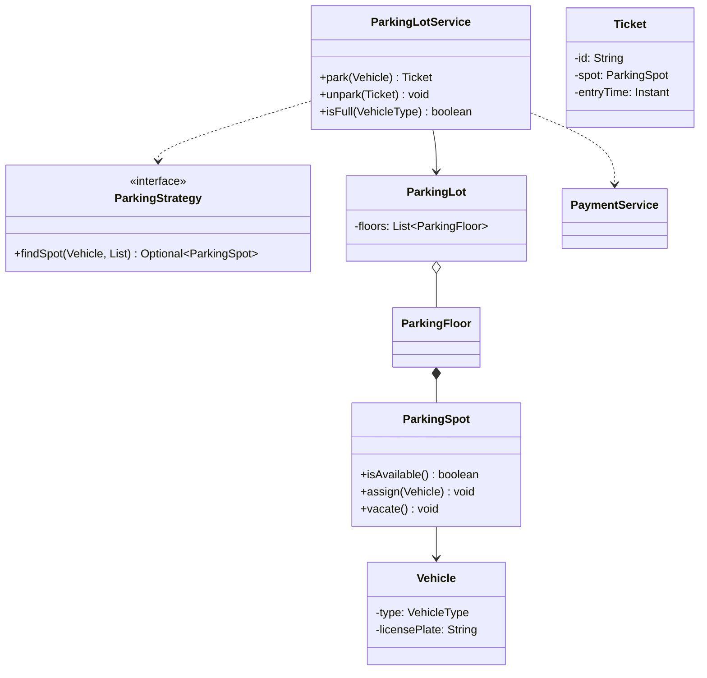
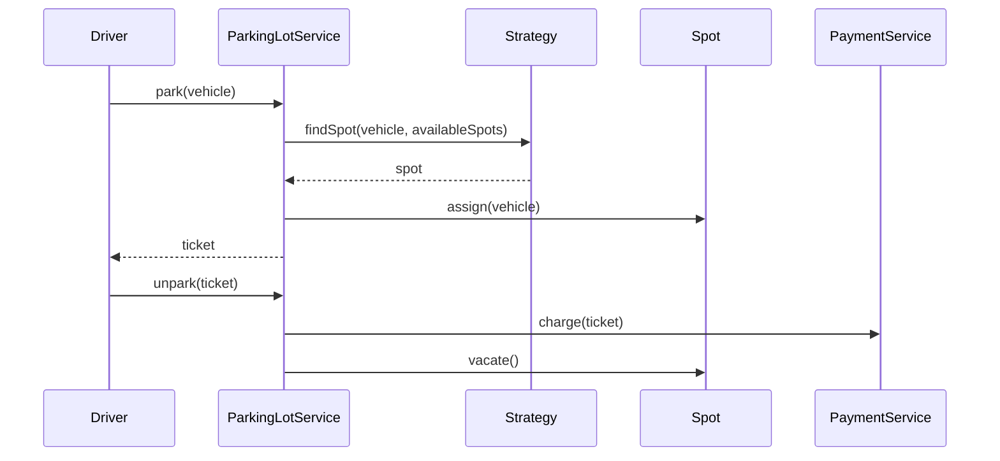

# Design Parking Lot — Case Study

**Case Study ID:** CS-LLD-O01
**Track:** Classic OOD
**Companies:** Amazon, Microsoft, Google, Oracle
**Difficulty:** Medium
**Related question:** [Q01-parking-lot.md](../../System Design - Low Level Design/02-classic-ood/questions/Q01-parking-lot.md)
**Paired case study:** [CS-PAIR-02-parking-lot-at-scale.md](../paired/CS-PAIR-02-parking-lot-at-scale.md)

---

## Part 1 — Business Context

**Industry analog:** ParkMobile / SP+ — mobile parking with garage occupancy.

Design the **in-process object model** for a multi-floor garage: motorcycles, cars, trucks; multiple entry gates concurrent; ticket on entry, payment on exit.

**Success:** Correct spot assignment, thread-safe concurrent gates, extensible allocation policy.

---

## Part 2 — Stakeholders & Personas

| Persona | Goals | Pain points | Success metric |
|---------|-------|-------------|----------------|
| End user | Complete core flows quickly | Slow, unreliable UX | Task completion rate > 95% |
| Product owner | Ship MVP on schedule | Scope creep | On-time V1 delivery |
| SRE / platform | Meet SLO with observability | Opaque failures | Error budget > 0 monthly |
| Security / compliance | Data protection, audit trail | Regulatory breach | Zero critical findings |

---

## Part 3 — Requirements

### Functional Requirements (MoSCoW)

| Priority | Requirement | Acceptance criteria |
|----------|-------------|---------------------|
| Must | **Functional:** | Verified in integration tests |
| Must | Park vehicle → assign spot, issue ticket | Verified in integration tests |
| Must | Unpark with ticket → free spot | Verified in integration tests |
| Must | Report availability by vehicle type | Verified in integration tests |
| Must | Reject when no compatible spot available | Verified in integration tests |
| Won't (MVP) | Multi-region active-active | Documented in PRD |
| Won't (MVP) | Advanced ML personalization | Documented in PRD |

### Non-Functional Requirements

| Attribute | Target | Measurement |
|-----------|--------|-------------|
| Latency | p99 < 200ms | APM / distributed tracing |
| Availability | 99.9% | Uptime SLO dashboard |
| Throughput | 10K peak QPS (scale phase) | Load test report |
| Security | AuthN/Z, encryption at rest/transit | Annual pen test |
| Maintainability | Modular services, ADRs documented | Change failure rate < 15% |

**From requirements analysis:**
:**
- Thread-safe entry/exit at multiple gates
- Extensible allocation policy (Strategy)
- SOLID — payment separate from parking

---

### Clarifying Questions (Discovery Phase)

| # | Question | Expected answer |
|---|----------|-----------------|
| 1 | Single building or multi-building? | Single parking lot, multiple floors |
| 2 | Vehicle types? | Motorcycle, car, truck — different spot sizes |
| 3 | Multi-threaded entry gates? | Yes — multiple gates concurrent |
| 4 | Payment in scope? | MVP: ticket on entry; payment interface on exit |
| 5 | Spot allocation policy? | Configurable — nearest first default |
| 6 | Persistence? | In-memory |
| 7 | Electric charging? | Extension — not MVP |
| 8 | Valet? | Extension |

---

---

## Part 4 — Constraints

| Constraint | Detail | Impact on design |
|------------|--------|------------------|
| Scope | Single building, in-memory MVP | No distributed registry in LLD round |
| Concurrency | Multiple entry gates | Sync per spot, not whole lot |
| Extensibility | New spot types (EV charging) later | Strategy + Open-Closed |

---

## Part 5 — Tradeoffs & Architecture Decision Records

### ADR-001: Spot allocation

**Status:** Accepted  
**Context:** Multiple policies: nearest, cheapest, largest-first.  
**Decision:** Strategy pattern — `ParkingStrategy` interface.  
**Consequences:** Test policies in isolation; inject at construction.  
**Alternatives considered:** if/else in service — rejected when 2+ policies.


### ADR-002: Concurrency granularity

**Status:** Accepted  
**Context:** Multiple gates park/unpark simultaneously.  
**Decision:** Synchronize on `ParkingSpot` during assign/vacate.  
**Consequences:** Finer than lot-level lock; avoids unnecessary blocking.  
**Alternatives considered:** Synchronize whole lot — simpler but lower throughput.


### Tradeoffs Summary (from design analysis)


| Decision | A | B | Pick |
|----------|---|---|------|
| Allocation | if/else | Strategy | Strategy — 2+ policies |
| Spot state | enum | State pattern | enum Occupied/Available |
| Thread safety | sync lot | sync per spot | sync per spot — finer granularity |
| Ticket ID | UUID | AtomicLong | AtomicLong — readable tickets |

---


---

## Part 6 — Capacity & Cost Estimation

**Scale projection:** Start with single-region MVP; model QPS and storage at 10× current load before Scale phase.

### Cost ballpark (V1)

- Compute: $5–15K/mo\n- Managed DB/cache: $3–8K/mo\n- LLM API (if applicable): usage-based; budget caps per tenant

---

## Part 7 — High-Level Design (Scale Projection / HLD Boundary)

The LLD object model is correct for **single-process / in-memory MVP**. When the interviewer pivots to scale:

### Scale triggers

| Signal | HLD addition |
|--------|--------------|
| Multiple instances | Stateless API behind load balancer |
| Shared state | Redis / distributed cache |
| Write contention | Message queue + async workers |
| Global users | Multi-region read replicas; CDN |

| Scale signal | HLD addition |
|--------------|-------------|
| 500 garages nationwide | Central registry service + Redis occupancy |
| Real-time availability app | WebSocket fan-out from occupancy events |
| Sensor-based spots | IoT ingestion → event bus → update spot state |

### Distributed sketch

```
Client → CDN → LB → API (stateless) → Cache → DB
                              ↓
                         Message queue → Workers
```

### Pivot script

> "My object model stays — ParkingLotService, Strategy, entities. "
> "At scale I'd add a central occupancy registry in Redis, event bus for cross-garage sync, and shard by buildingId."


---

## Part 8 — Low-Level Design

### Problem recap

Design a parking lot with multiple floors and spot types (compact, large, handicap). Support vehicle entry (park), exit (unpark), and display availability. Optional: payment on exit.

---

### Core entities

| Entity | Role |
|--------|------|
| `ParkingLot` | Root aggregate — floors, tickets |
| `ParkingFloor` | Collection of spots on one level |
| `ParkingSpot` | Holds one vehicle; has SpotType |
| `Vehicle` | Type + license plate |
| `Ticket` | Issued on park; used on exit |
| `ParkingLotService` | Orchestrates park/unpark |
| `ParkingStrategy` | Spot allocation algorithm |
| `PaymentService` | Optional exit payment |

**Nouns → classes:** `ParkingLot`, `ParkingFloor`, `ParkingSpot`, `Vehicle`, `Ticket`, `ParkingLotService`, `ParkingStrategy`  
**Verbs → methods:** `park(Vehicle)`, `unpark(Ticket)`, `isFull(VehicleType)`

---

### Class diagram

```
┌─────────────────────┐       ┌──────────────────┐
│  ParkingLotService  │──────>│ ParkingStrategy  │<<interface>>
│─────────────────────│       │──────────────────│
│ - lot               │       │ +findSpot()      │
│ - strategy          │       └────────┬─────────┘
│ - paymentService    │                │ implements
│─────────────────────│       ┌────────▼─────────┐
│ +park(Vehicle)      │       │ NearestFirst...  │
│ +unpark(Ticket)     │       └──────────────────┘
└─────────┬───────────┘
          │ owns
          ▼
┌─────────────────────┐     ┌──────────────────┐
│     ParkingLot      │◇───>│  ParkingFloor    │
└─────────────────────┘ 1 * └────────┬─────────┘
                                     │ *
                                     ▼
                            ┌──────────────────┐
                            │   ParkingSpot    │
                            │ - type: SpotType │
                            │ - vehicle        │
                            └──────────────────┘
```



---

### Public API

```java
public class ParkingLotService {
    public Ticket park(Vehicle vehicle);
    public void unpark(Ticket ticket);
    public boolean isFull(VehicleType type);
}
```

---

### Design patterns & SOLID

| Pattern | Application |
|---------|-------------|
| Strategy | Spot allocation — nearest, cheapest, largest-first |
| Factory | Optional Vehicle factory from plate + type |

**SOLID:**
- **S:** PaymentService only handles payment
- **O:** New strategy without editing park loop
- **L:** All Vehicle types work in park()
- **D:** Service depends on ParkingStrategy interface

---

### Sequence diagrams



---

### Concurrency & edge cases

- **check-then-act** on spot: synchronize on `ParkingSpot` during assign/vacate
- Lot full for vehicle type → `LotFullException`
- Invalid/expired ticket on exit → `InvalidTicketException`
- Motorcycle in compact spot OK; truck needs large spot

---

---

## Part 9 — Implementation Roadmap

| Phase | Timeline | Scope | Out of scope |
|-------|----------|-------|--------------|
| MVP | 2 weeks | Single-region, core user flows, manual ops | Multi-region, advanced analytics |
| V1 | 3 months | Production SLO, auth, monitoring, connector integrations | Custom ML models |
| Scale | 12 months | Auto-scaling, cost optimization, enterprise compliance | Edge deployment |

**MVP success criteria for Design Parking Lot:** Core flows demo-ready; p99 within 2× target; on-call runbook draft.

---

## Part 10 — Operations

### SLI / SLO

| SLI | Definition | SLO |
|-----|------------|-----|
| Availability | successful_requests / total_requests | 99.9% monthly |
| Latency | p99 response time | < 300ms |

### Observability

- **Metrics:** Request rate, error rate, latency histograms, queue depth, cache hit ratio
- **Logs:** Structured JSON with `trace_id`, `tenant_id`, `user_id`
- **Traces:** OpenTelemetry across API → workers → DB/cache/LLM

### Deployment

- Blue/green or canary via CI/CD; feature flags for risky changes
- Database migrations backward-compatible; expand-contract pattern

### Incident Runbook

**Scenario:** p99 latency spike 3× baseline.

1. Check error budget burn in Grafana
2. Identify hot shard / tenant via trace tags
3. Scale workers or enable degradation mode
4. Post-incident: ADR if architecture change needed

### Security Checklist

- Authentication via org SSO (OIDC)
- Authorization at API + data layer
- Encryption at rest (AES-256) and in transit (TLS 1.3)
- Audit log for admin and sensitive reads
- Secrets in vault; no keys in code


---

## Part 11 — Interview Walkthrough (30 min)

> This is a 30-minute senior loop for **Design Parking Lot**. Spend 5 minutes on context, 10 on HLD, 10 on LLD/boundaries, 5 on ops.

> "I'll design an in-memory parking lot for one building with multiple floors and concurrent entry gates."
>
> "Three clusters: structure — Lot, Floor, Spot; workflow — Service, Ticket, Payment; variation — ParkingStrategy for allocation."
>
> "Vehicle has type — motorcycle, car, truck. Spot has compatible types via SpotType enum."
>
> "park() asks strategy for a spot from available compatible spots, assigns vehicle, issues ticket with spot reference and timestamp."
>
> "unpark() validates ticket, calls PaymentService, vacates spot. synchronize on spot for thread safety."
>
> "Strategy pattern for nearest-first vs other policies — injected at construction."
>
> "Extensions: electric charging via new spot type; valet as separate service facade."
>
> "If interviewer asks millions of users — pivot to HLD with central occupancy service and Redis; object model stays."

> ---

> If the interviewer asks about millions of users, I pivot: same object model, but add Redis cache, message queue, and sharded DB — see HLD case study.


---

## Part 11b — Practical Learning Lab

### Hands-on exercises

1. **Whiteboard (15 min):** Draw LLD object model and patterns from memory after reading Parts 1–5.
2. **Tradeoff drill (10 min):** Pick one ADR and argue the rejected alternative for 2 minutes.
3. **Failure mode (10 min):** Pick one failure from Part 7/10; write a 5-step runbook.
4. **Pivot practice (5 min):** Practice the HLD↔LLD pivot script aloud.
5. **Timed mock (45 min):** Use the linked question file without looking at this case study.

### Production readiness checklist

- [ ] SLO defined and dashboarded
- [ ] Load test at 2× expected peak QPS
- [ ] Chaos test: kill one dependency; verify degradation
- [ ] Security review: auth, encryption, audit
- [ ] Runbook linked from on-call playbook
- [ ] Cost model reviewed with FinOps
- [ ] ADRs stored in repo `docs/adr/`

### Industry comparison

| Capability | SP+ and ParkMobile — multi-garage occupancy and payments (reference) | This design (MVP) | Scale phase |
|------------|----------------------|-------------------|-------------|
| Core flow | Production-grade | MVP scope in Part 9 | Part 9 Scale column |
| Reliability | Multi-region | Single-region 99.9% | Multi-region failover |
| Observability | Full APM + SRE | Metrics + traces + logs | SLO error budgets |
| Security | Enterprise compliance | Checklist in Part 10 | SOC2 / pen test |


### Senior interviewer rubric

| Signal | Strong | Weak |
|--------|--------|------|
| Requirements | Measurable NFRs stated upfront | Vague "it should scale" |
| Constraints | Names budget, team, timeline | Ignores constraints |
| Tradeoffs | ADR with rejected alternative | Single option only |
| Depth | Failure modes unprompted | Happy path only |
| Communication | Structured 30-min narrative | Jumps to diagram |


---

## Part 12 — Related Links

- **Question file:** [Q01-parking-lot.md](../../System Design - Low Level Design/02-classic-ood/questions/Q01-parking-lot.md)
- **End-to-end pair:** [CS-PAIR-02-parking-lot-at-scale.md](../paired/CS-PAIR-02-parking-lot-at-scale.md)
- **Template:** [case-study-template.md](../00-framework/case-study-template.md)
- **Industry standards:** [industry-standards-reference.md](../00-framework/industry-standards-reference.md)

- [Strategy pattern](../../01-core-concepts/design-patterns-gof.md)
- [Concurrency fundamentals](../../01-core-concepts/concurrency-fundamentals.md)
- [Java implementation](../../09-code-implementations/java/classic/parking-lot/) (full)
- [HLD Parking Lot / Elevator](../System%20Design%20-%20High%20Level%20Design/03-classic-hld/questions/Q30-parking-lot-elevator.md)
