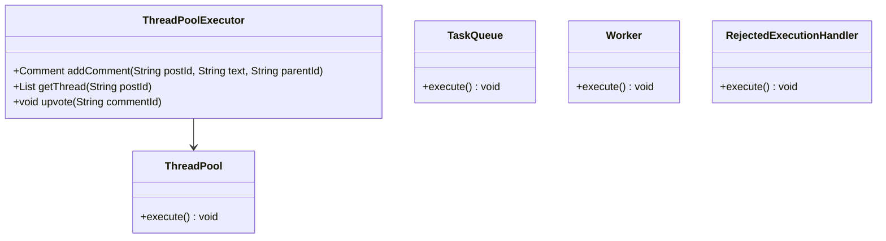
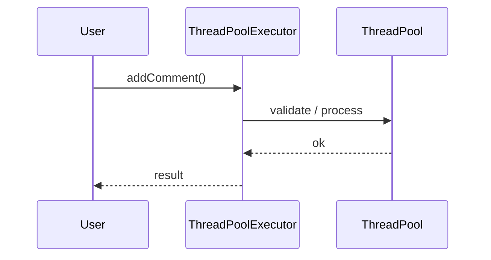
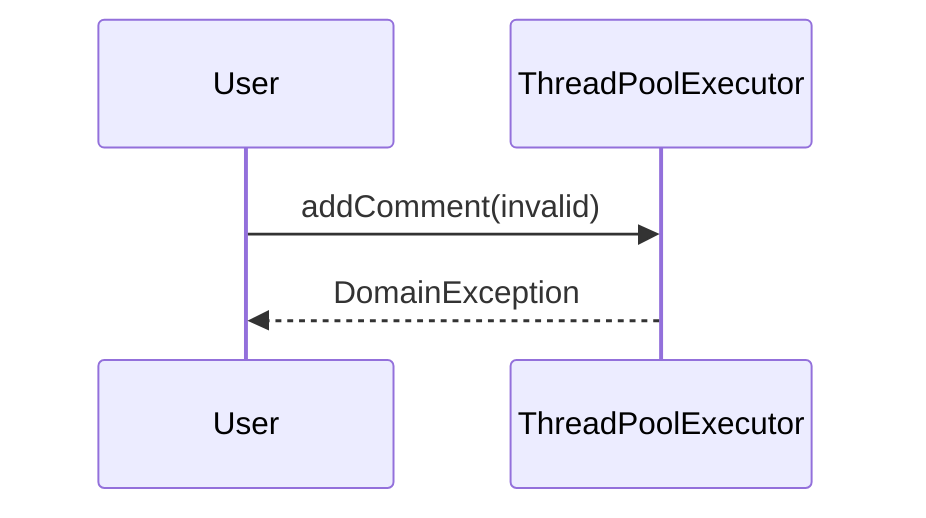

# Thread Pool Executor — Case Study

**Case Study ID:** CS-LLD-X07
**Track:** Concurrency LLD
**Companies:** Amazon, Google
**Difficulty:** Hard
**Related question:** [Q07-thread-pool-executor.md](../../../System%20Design%20-%20Low%20Level%20Design/04-concurrency-lld/questions/Q07-thread-pool-executor.md)

---

## Part 1 — Business Context

**Industry analog:** Java ExecutorService and ForkJoinPool

This case study examines **Thread Pool Executor** — a system type commonly built at Amazon and similar organizations. Design fixed thread pool with task queue, worker threads, rejection policy.

---

**Why now:** Teams with 3–5 YOE full-stack backgrounds are expected to connect product requirements to concrete architecture — especially with GenAI/LLM components where cost, safety, and correctness trade off sharply.

**Success definition:** Meet NFR targets, ship MVP within constraints, and articulate tradeoffs using ADRs.

---

## Part 2 — Stakeholders & Personas

| Persona | Goals | Pain points | Success metric |
|---------|-------|-------------|----------------|
| End user | Complete core flows quickly | Slow, unreliable UX | Task completion rate > 95% |
| Product owner | Ship MVP on schedule | Scope creep | On-time V1 delivery |
| SRE / platform | Meet SLO with observability | Opaque failures | Error budget > 0 monthly |
| Security / compliance | Data protection, audit trail | Regulatory breach | Zero critical findings |

---

## Part 3 — Requirements

### Functional Requirements (MoSCoW)

| Priority | Requirement | Acceptance criteria |
|----------|-------------|---------------------|
| Must | **Functional:** | Verified in integration tests |
| Must | ThreadPoolExecutor handles primary workflow described in requirements | Verified in integration tests |
| Must | Validate inputs before state changes | Verified in integration tests |
| Must | Enforce domain constraints with exceptions | Verified in integration tests |
| Must | Support listing and lookup of core entities | Verified in integration tests |
| Won't (MVP) | Multi-region active-active | Documented in PRD |
| Won't (MVP) | Advanced ML personalization | Documented in PRD |

### Non-Functional Requirements

| Attribute | Target | Measurement |
|-----------|--------|-------------|
| Latency | p99 < 200ms | APM / distributed tracing |
| Availability | 99.9% | Uptime SLO dashboard |
| Throughput | 10K peak QPS (scale phase) | Load test report |
| Security | AuthN/Z, encryption at rest/transit | Annual pen test |
| Maintainability | Modular services, ADRs documented | Change failure rate < 15% |

**From requirements analysis:**
:**
- Clear separation of concerns (SOLID)
- Open-Closed via ThreadPool interface at variation points
- Constructor injection for testability
- Correctness under concurrent access — no data races
- Avoid deadlock — consistent lock ordering where multiple locks

---

### Clarifying Questions (Discovery Phase)

| # | Question | Expected answer |
|---|----------|-----------------|
| 1 | What is MVP scope for Thread Pool Executor? | Core entities + 2 primary user flows |
| 2 | Persistence required? | In-memory; Repository interface if interviewer asks |
| 3 | Multi-threaded access? | Yes if multiple users/gates — else single-threaded |
| 4 | Pool size? | Fixed N worker threads |
| 5 | Queue type? | Bounded BlockingQueue |
| 6 | Rejection policy? | Abort, caller-runs, or block |
| 7 | Shutdown? | Graceful drain then interrupt |

---

---

## Part 4 — Constraints

| Constraint | Detail | Impact on design |
|------------|--------|------------------|
| Budget | $50K/month infra at V1 scale | Prefer managed services over self-host |
| Team | 2 backend, 1 frontend, 1 ML engineer | MVP scope strictly bounded |
| Timeline | MVP in 8 weeks | Defer nice-to-have features |
| Tech | Cloud-native on AWS/GCP | Use existing org SSO and VPC |
| Build vs buy | Buy vector DB / LLM API; build orchestration | Focus engineering on differentiation |

---

## Part 5 — Tradeoffs & Architecture Decision Records

### ADR-001: Primary architecture pattern

**Status:** Accepted  
**Context:** Need to balance delivery speed, operability, and scale for Thread Pool Executor.  
**Decision:** Event-driven async for writes; cache-heavy sync read path.  
**Consequences:** Higher eventual consistency on analytics; simpler peak handling.  
**Alternatives considered:** Fully synchronous CRUD — rejected due to peak QPS.


### ADR-002: Data store selection

**Status:** Accepted  
**Context:** Mixed OLTP, cache, and search/vector needs.  
**Decision:** PostgreSQL for source of truth; Redis for hot path; specialized index where needed.  
**Consequences:** Operational complexity of multiple stores; optimal per access pattern.  
**Alternatives considered:** Single document DB — rejected for strong consistency requirements.


### ADR-003: Multi-tenancy model

**Status:** Accepted  
**Context:** B2B SaaS with strict isolation requirements.  
**Decision:** Logical tenant_id on all rows + encryption per tenant for sensitive payloads.  
**Consequences:** Cost-effective vs physical isolation; requires rigorous integration tests.  
**Alternatives considered:** Database-per-tenant — rejected at 10K tenant scale.


### Tradeoffs Summary (from design analysis)


| Decision | A | B | Pick |
|----------|---|---|------|
| Variation | if/else | Concurrency | Concurrency — 2+ behaviors |
| State | enum | State pattern | enum for simple lifecycles |
| Storage | in-memory | Repository | in-memory MVP |
| API return | primitive | domain object | domain object — type safety |

---


---

## Part 6 — Capacity & Cost Estimation

**Scale projection:** Start with single-region MVP; model QPS and storage at 10× current load before Scale phase.

### Cost ballpark (V1)

- Compute: $5–15K/mo\n- Managed DB/cache: $3–8K/mo\n- LLM API (if applicable): usage-based; budget caps per tenant

---

## Part 7 — High-Level Design (Scale Projection / HLD Boundary)

The LLD object model is correct for **single-process / in-memory MVP**. When the interviewer pivots to scale:

### Scale triggers

| Signal | HLD addition |
|--------|--------------|
| Multiple instances | Stateless API behind load balancer |
| Shared state | Redis / distributed cache |
| Write contention | Message queue + async workers |
| Global users | Multi-region read replicas; CDN |


### Distributed sketch

```
Client → CDN → LB → API (stateless) → Cache → DB
                              ↓
                         Message queue → Workers
```

### Pivot script

> "My object model stays — ParkingLotService, Strategy, entities. "
> "At scale I'd add a central occupancy registry in Redis, event bus for cross-garage sync, and shard by buildingId."


---

## Part 8 — Low-Level Design

### Problem recap

Design fixed thread pool with task queue, worker threads, rejection policy.

---

### Core entities

| Entity | Role |
|--------|------|
| `ThreadPool` | Worker set |
| `TaskQueue` | Pending work |
| `Worker` | Runnable loop |
| `RejectedExecutionHandler` | Overflow policy |

**Nouns → classes:** `ThreadPool`, `TaskQueue`, `Worker`, `RejectedExecutionHandler`  
**Verbs → methods:** `addComment()`, `getThread()`, `upvote()`

---

### Class diagram

```
┌─────────────────────┐       ┌──────────────────┐
│  ThreadPoolExecutor │──────>│ Concurrency      │<<interface>>
│─────────────────────│       │──────────────────│
│ +orchestrate()      │       │ +apply()         │
└─────────┬───────────┘       └────────┬─────────┘
          │ owns                       │ implements
          ▼                   ┌────────▼─────────┐
┌─────────────────────┐       │ ConcreteConcurrency│
│  ThreadPool         │       └──────────────────┘
└─────────┬───────────┘
          │ *
          ▼
┌─────────────────────┐     ┌──────────────────┐
│  TaskQueue          │────>│  Worker          │
└─────────────────────┘     └──────────────────┘
```



---

### Public API

```java
public class ThreadPoolExecutor {
    public Comment addComment(String postId, String text, String parentId);
    public List<Comment> getThread(String postId);
    public void upvote(String commentId);
}
```

---

### Design patterns & SOLID

| Pattern | Application |
|---------|-------------|
| Concurrency | Thread-safe design for Thread Pool Executor |
| Synchronization | Locks, volatile, or concurrent collections |

**SOLID:**
- **S:** ThreadPoolExecutor orchestrates; entities hold state
- **O:** New behavior via new ThreadPool impl
- **D:** Depend on ThreadPool interface

---

### Sequence diagrams

**Happy path:**



**Failure path:**



---

### Concurrency & edge cases

- Identify shared mutable state across threads
- Use synchronized, Lock, or concurrent collections appropriately
- Avoid deadlock — consistent lock acquisition order
- Document happens-before relationships for interview clarity

---

---

## Part 9 — Implementation Roadmap

| Phase | Timeline | Scope | Out of scope |
|-------|----------|-------|--------------|
| MVP | 2 weeks | Single-region, core user flows, manual ops | Multi-region, advanced analytics |
| V1 | 3 months | Production SLO, auth, monitoring, connector integrations | Custom ML models |
| Scale | 12 months | Auto-scaling, cost optimization, enterprise compliance | Edge deployment |

**MVP success criteria for Thread Pool Executor:** Core flows demo-ready; p99 within 2× target; on-call runbook draft.

---

## Part 10 — Operations

### SLI / SLO

| SLI | Definition | SLO |
|-----|------------|-----|
| Availability | successful_requests / total_requests | 99.9% monthly |
| Latency | p99 response time | < 300ms |

### Observability

- **Metrics:** Request rate, error rate, latency histograms, queue depth, cache hit ratio
- **Logs:** Structured JSON with `trace_id`, `tenant_id`, `user_id`
- **Traces:** OpenTelemetry across API → workers → DB/cache/LLM

### Deployment

- Blue/green or canary via CI/CD; feature flags for risky changes
- Database migrations backward-compatible; expand-contract pattern

### Incident Runbook

**Scenario:** p99 latency spike 3× baseline.

1. Check error budget burn in Grafana
2. Identify hot shard / tenant via trace tags
3. Scale workers or enable degradation mode
4. Post-incident: ADR if architecture change needed

### Security Checklist

- Authentication via org SSO (OIDC)
- Authorization at API + data layer
- Encryption at rest (AES-256) and in transit (TLS 1.3)
- Audit log for admin and sensitive reads
- Secrets in vault; no keys in code


---

## Part 11 — Interview Walkthrough (30 min)

> This is a 30-minute senior loop for **Thread Pool Executor**. Spend 5 minutes on context, 10 on HLD, 10 on LLD/boundaries, 5 on ops.

> "I'll design Thread Pool Executor — clarify in-memory scope and MVP flows first."
>
> "Entities: `ThreadPool`, `TaskQueue`, `Worker`, `RejectedExecutionHandler`. Domain structure separate from `ThreadPoolExecutor` orchestration."
>
> "Problem: Design fixed thread pool with task queue, worker threads, rejection policy."
>
> "`ThreadPool` — worker set; owns its own invariants."
>
> "`TaskQueue` — pending work; owns its own invariants."
>
> "`Worker` — runnable loop; owns its own invariants."
>
> "`ThreadPoolExecutor` validates input, coordinates entities, returns typed results."
>
> "Identify variation points — inject interfaces for Open-Closed extensibility."
>
> "Walk happy path on whiteboard, then failure case with domain exception."
>
> "Tradeoff: enum vs State pattern; Strategy vs if/else — pick with justification."

> ---

> If the interviewer asks about millions of users, I pivot: same object model, but add Redis cache, message queue, and sharded DB — see HLD case study.


---

## Part 11b — Practical Learning Lab

### Hands-on exercises

1. **Whiteboard (15 min):** Draw LLD object model and patterns from memory after reading Parts 1–5.
2. **Tradeoff drill (10 min):** Pick one ADR and argue the rejected alternative for 2 minutes.
3. **Failure mode (10 min):** Pick one failure from Part 7/10; write a 5-step runbook.
4. **Pivot practice (5 min):** Practice the HLD↔LLD pivot script aloud.
5. **Timed mock (45 min):** Use the linked question file without looking at this case study.

### Production readiness checklist

- [ ] SLO defined and dashboarded
- [ ] Load test at 2× expected peak QPS
- [ ] Chaos test: kill one dependency; verify degradation
- [ ] Security review: auth, encryption, audit
- [ ] Runbook linked from on-call playbook
- [ ] Cost model reviewed with FinOps
- [ ] ADRs stored in repo `docs/adr/`

### Industry comparison

| Capability | Java ExecutorService and ForkJoinPool (reference) | This design (MVP) | Scale phase |
|------------|----------------------|-------------------|-------------|
| Core flow | Production-grade | MVP scope in Part 9 | Part 9 Scale column |
| Reliability | Multi-region | Single-region 99.9% | Multi-region failover |
| Observability | Full APM + SRE | Metrics + traces + logs | SLO error budgets |
| Security | Enterprise compliance | Checklist in Part 10 | SOC2 / pen test |


### Senior interviewer rubric

| Signal | Strong | Weak |
|--------|--------|------|
| Requirements | Measurable NFRs stated upfront | Vague "it should scale" |
| Constraints | Names budget, team, timeline | Ignores constraints |
| Tradeoffs | ADR with rejected alternative | Single option only |
| Depth | Failure modes unprompted | Happy path only |
| Communication | Structured 30-min narrative | Jumps to diagram |


---

## Part 12 — Related Links

- **Question file:** [Q07-thread-pool-executor.md](../../../System%20Design%20-%20Low%20Level%20Design/04-concurrency-lld/questions/Q07-thread-pool-executor.md)
- **Template:** [case-study-template.md](../../00-framework/case-study-template.md)
- **Industry standards:** [industry-standards-reference.md](../../00-framework/industry-standards-reference.md)

- [Concurrency LLD track](../../../System%20Design%20-%20Low%20Level%20Design/04-concurrency-lld/README.md)
- [Strategy pattern](../../../System%20Design%20-%20Low%20Level%20Design/01-core-concepts/design-patterns-gof.md)
- [SOLID principles](../../../System%20Design%20-%20Low%20Level%20Design/01-core-concepts/solid-principles.md)
- [Concurrency fundamentals](../../../System%20Design%20-%20Low%20Level%20Design/01-core-concepts/concurrency-fundamentals.md)
- [Java implementation](../../../System Design - Low Level Design/09-code-implementations/java/concurrency/thread-pool-executor/) (full)
