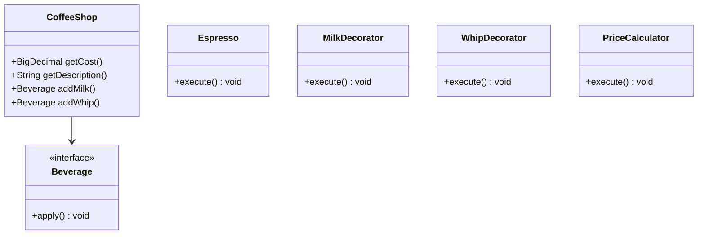
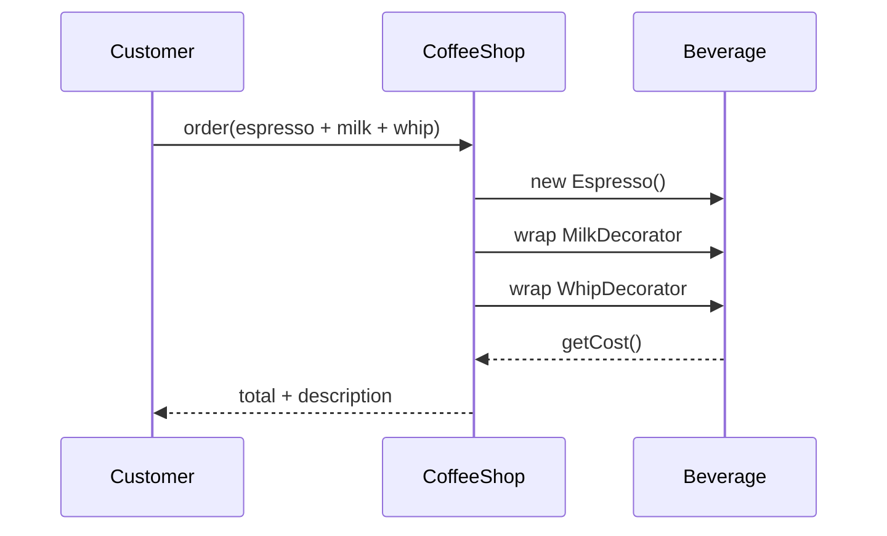
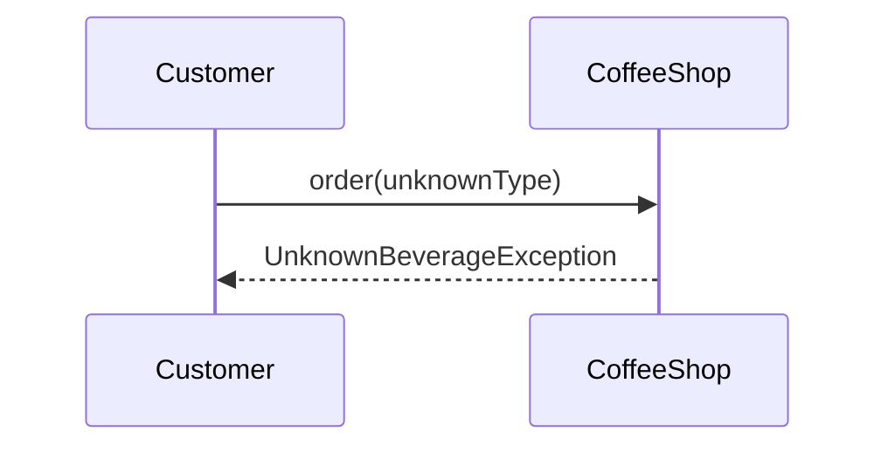

# Decorator — Coffee Shop — Case Study

**Case Study ID:** CS-LLD-P08
**Track:** Design Patterns
**Companies:** Starbucks
**Difficulty:** Medium
**Related question:** [Q08-decorator-coffee.md](../../System Design - Low Level Design/03-design-patterns/questions/Q08-decorator-coffee.md)

---

## Part 1 — Business Context

**Industry analog:** Leading products in the Decorator — Coffee Shop domain

This case study examines **Decorator — Coffee Shop** — a system type commonly built at Starbucks and similar organizations. Design decorator adding milk, whip, caramel to base coffee with dynamic price.

---

**Why now:** Teams with 3–5 YOE full-stack backgrounds are expected to connect product requirements to concrete architecture — especially with GenAI/LLM components where cost, safety, and correctness trade off sharply.

**Success definition:** Meet NFR targets, ship MVP within constraints, and articulate tradeoffs using ADRs.

---

## Part 2 — Stakeholders & Personas

| Persona | Goals | Pain points | Success metric |
|---------|-------|-------------|----------------|
| End user | Complete core flows quickly | Slow, unreliable UX | Task completion rate > 95% |
| Product owner | Ship MVP on schedule | Scope creep | On-time V1 delivery |
| SRE / platform | Meet SLO with observability | Opaque failures | Error budget > 0 monthly |
| Security / compliance | Data protection, audit trail | Regulatory breach | Zero critical findings |

---

## Part 3 — Requirements

### Functional Requirements (MoSCoW)

| Priority | Requirement | Acceptance criteria |
|----------|-------------|---------------------|
| Must | **Functional:** | Verified in integration tests |
| Must | Compose beverage from base + zero or more add-on decorators | Verified in integration tests |
| Must | getCost() sums base and all decorator prices | Verified in integration tests |
| Must | getDescription() lists full recipe chain | Verified in integration tests |
| Must | Add decorators at runtime — open for extension | Verified in integration tests |
| Won't (MVP) | Multi-region active-active | Documented in PRD |
| Won't (MVP) | Advanced ML personalization | Documented in PRD |

### Non-Functional Requirements

| Attribute | Target | Measurement |
|-----------|--------|-------------|
| Latency | p99 < 200ms | APM / distributed tracing |
| Availability | 99.9% | Uptime SLO dashboard |
| Throughput | 10K peak QPS (scale phase) | Load test report |
| Security | AuthN/Z, encryption at rest/transit | Annual pen test |
| Maintainability | Modular services, ADRs documented | Change failure rate < 15% |

**From requirements analysis:**
:**
- Clear separation of concerns (SOLID)
- Open-Closed via Beverage interface at variation points
- Constructor injection for testability
- Thread-safe if concurrent access is in clarifying assumptions

---

### Clarifying Questions (Discovery Phase)

| # | Question | Expected answer |
|---|----------|-----------------|
| 1 | Which add-ons? | Milk, whip, caramel, extra shot — each adds cost |
| 2 | Base beverages? | Espresso, HouseBlend, DarkRoast |
| 3 | Can add-ons stack? | Yes — milk + whip on same base |
| 4 | Size variants? | Extension — Tall/Grande via decorator or enum |
| 5 | Discount rules? | Extension — CouponDecorator |
| 6 | Takeaway vs dine-in? | Out of scope |
| 7 | Recipe display? | getDescription() returns full stack string |
| 8 | Pricing source? | Each component reports getCost() |

---

---

## Part 4 — Constraints

| Constraint | Detail | Impact on design |
|------------|--------|------------------|
| Budget | $50K/month infra at V1 scale | Prefer managed services over self-host |
| Team | 2 backend, 1 frontend, 1 ML engineer | MVP scope strictly bounded |
| Timeline | MVP in 8 weeks | Defer nice-to-have features |
| Tech | Cloud-native on AWS/GCP | Use existing org SSO and VPC |
| Build vs buy | Buy vector DB / LLM API; build orchestration | Focus engineering on differentiation |

---

## Part 5 — Tradeoffs & Architecture Decision Records

### ADR-001: Primary architecture pattern

**Status:** Accepted  
**Context:** Need to balance delivery speed, operability, and scale for Decorator — Coffee Shop.  
**Decision:** Event-driven async for writes; cache-heavy sync read path.  
**Consequences:** Higher eventual consistency on analytics; simpler peak handling.  
**Alternatives considered:** Fully synchronous CRUD — rejected due to peak QPS.


### ADR-002: Data store selection

**Status:** Accepted  
**Context:** Mixed OLTP, cache, and search/vector needs.  
**Decision:** PostgreSQL for source of truth; Redis for hot path; specialized index where needed.  
**Consequences:** Operational complexity of multiple stores; optimal per access pattern.  
**Alternatives considered:** Single document DB — rejected for strong consistency requirements.


### ADR-003: Multi-tenancy model

**Status:** Accepted  
**Context:** B2B SaaS with strict isolation requirements.  
**Decision:** Logical tenant_id on all rows + encryption per tenant for sensitive payloads.  
**Consequences:** Cost-effective vs physical isolation; requires rigorous integration tests.  
**Alternatives considered:** Database-per-tenant — rejected at 10K tenant scale.


### Tradeoffs Summary (from design analysis)


| Decision | A | B | Pick |
|----------|---|---|------|
| Variation | if/else | Decorator | Decorator — 2+ behaviors |
| State | enum | State pattern | enum for simple lifecycles |
| Storage | in-memory | Repository | in-memory MVP |
| API return | primitive | domain object | domain object — type safety |

---


---

## Part 6 — Capacity & Cost Estimation

**Scale projection:** Start with single-region MVP; model QPS and storage at 10× current load before Scale phase.

### Cost ballpark (V1)

- Compute: $5–15K/mo\n- Managed DB/cache: $3–8K/mo\n- LLM API (if applicable): usage-based; budget caps per tenant

---

## Part 7 — High-Level Design (Scale Projection / HLD Boundary)

The LLD object model is correct for **single-process / in-memory MVP**. When the interviewer pivots to scale:

### Scale triggers

| Signal | HLD addition |
|--------|--------------|
| Multiple instances | Stateless API behind load balancer |
| Shared state | Redis / distributed cache |
| Write contention | Message queue + async workers |
| Global users | Multi-region read replicas; CDN |


### Distributed sketch

```
Client → CDN → LB → API (stateless) → Cache → DB
                              ↓
                         Message queue → Workers
```

### Pivot script

> "My object model stays — ParkingLotService, Strategy, entities. "
> "At scale I'd add a central occupancy registry in Redis, event bus for cross-garage sync, and shard by buildingId."


---

## Part 8 — Low-Level Design

### Problem recap

Design decorator adding milk, whip, caramel to base coffee with dynamic price.

---

### Core entities

| Entity | Role |
|--------|------|
| `Beverage` | Component interface |
| `Espresso` | Concrete |
| `MilkDecorator` | Add-on |
| `WhipDecorator` | Add-on |
| `PriceCalculator` | Sum cost |

**Nouns → classes:** `Beverage`, `Espresso`, `MilkDecorator`, `WhipDecorator`, `PriceCalculator`  
**Verbs → methods:** `getCost()`, `getDescription()`, `addMilk()`, `addWhip()`

---

### Class diagram

```
┌─────────────────────┐       ┌──────────────────┐
│  CoffeeShop         │──────>│ Decorator        │<<interface>>
│─────────────────────│       │──────────────────│
│ +orchestrate()      │       │ +apply()         │
└─────────┬───────────┘       └────────┬─────────┘
          │ owns                       │ implements
          ▼                   ┌────────▼─────────┐
┌─────────────────────┐       │ ConcreteDecorator│
│  Beverage           │       └──────────────────┘
└─────────┬───────────┘
          │ *
          ▼
┌─────────────────────┐     ┌──────────────────┐
│  Espresso           │────>│  MilkDecorator   │
└─────────────────────┘     └──────────────────┘
```



---

### Public API

```java
public class CoffeeShop {
    public BigDecimal getCost();
    public String getDescription();
    public Beverage addMilk();
    public Beverage addWhip();
}
```

---

### Design patterns & SOLID

| Pattern | Application |
|---------|-------------|
| Decorator | Wrap Beverage with add-ons dynamically |
| Component | Beverage interface unifies base and decorated |

**SOLID:**
- **S:** CoffeeDecorator orchestrates; entities hold state
- **O:** New behavior via new Beverage impl
- **D:** Depend on Beverage interface

---

### Sequence diagrams

**Happy path:**



**Failure path:**



---

### Concurrency & edge cases

- Immutable decorator chain — thread-safe after construction
- Unknown base type → UnknownBeverageException
- Null wrap target → NullPointerException — validate in constructor
- Deep stack — no hard limit in MVP

---

---

## Part 9 — Implementation Roadmap

| Phase | Timeline | Scope | Out of scope |
|-------|----------|-------|--------------|
| MVP | 2 weeks | Single-region, core user flows, manual ops | Multi-region, advanced analytics |
| V1 | 3 months | Production SLO, auth, monitoring, connector integrations | Custom ML models |
| Scale | 12 months | Auto-scaling, cost optimization, enterprise compliance | Edge deployment |

**MVP success criteria for Decorator — Coffee Shop:** Core flows demo-ready; p99 within 2× target; on-call runbook draft.

---

## Part 10 — Operations

### SLI / SLO

| SLI | Definition | SLO |
|-----|------------|-----|
| Availability | successful_requests / total_requests | 99.9% monthly |
| Latency | p99 response time | < 300ms |

### Observability

- **Metrics:** Request rate, error rate, latency histograms, queue depth, cache hit ratio
- **Logs:** Structured JSON with `trace_id`, `tenant_id`, `user_id`
- **Traces:** OpenTelemetry across API → workers → DB/cache/LLM

### Deployment

- Blue/green or canary via CI/CD; feature flags for risky changes
- Database migrations backward-compatible; expand-contract pattern

### Incident Runbook

**Scenario:** p99 latency spike 3× baseline.

1. Check error budget burn in Grafana
2. Identify hot shard / tenant via trace tags
3. Scale workers or enable degradation mode
4. Post-incident: ADR if architecture change needed

### Security Checklist

- Authentication via org SSO (OIDC)
- Authorization at API + data layer
- Encryption at rest (AES-256) and in transit (TLS 1.3)
- Audit log for admin and sensitive reads
- Secrets in vault; no keys in code


---

## Part 11 — Interview Walkthrough (30 min)

> This is a 30-minute senior loop for **Decorator — Coffee Shop**. Spend 5 minutes on context, 10 on HLD, 10 on LLD/boundaries, 5 on ops.

> "Beverage interface declares getCost() and getDescription()."
>
> "Concrete bases: Espresso, HouseBlend implement Beverage directly."
>
> "Decorator abstract class implements Beverage and holds wrapped Beverage."
>
> "MilkDecorator adds milk cost/description delegating to inner beverage."
>
> "Customer order builds chain: new MilkDecorator(new WhipDecorator(new Espresso()))."
>
> "Open-Closed: new add-on = new Decorator subclass, no change to existing code."
>
> "Contrast with subclass explosion — Latte extends EspressoWithMilk extends..."
>
> "This is canonical Gang-of-Four Decorator interview question."

> ---

> If the interviewer asks about millions of users, I pivot: same object model, but add Redis cache, message queue, and sharded DB — see HLD case study.


---

## Part 11b — Practical Learning Lab

### Hands-on exercises

1. **Whiteboard (15 min):** Draw LLD object model and patterns from memory after reading Parts 1–5.
2. **Tradeoff drill (10 min):** Pick one ADR and argue the rejected alternative for 2 minutes.
3. **Failure mode (10 min):** Pick one failure from Part 7/10; write a 5-step runbook.
4. **Pivot practice (5 min):** Practice the HLD↔LLD pivot script aloud.
5. **Timed mock (45 min):** Use the linked question file without looking at this case study.

### Production readiness checklist

- [ ] SLO defined and dashboarded
- [ ] Load test at 2× expected peak QPS
- [ ] Chaos test: kill one dependency; verify degradation
- [ ] Security review: auth, encryption, audit
- [ ] Runbook linked from on-call playbook
- [ ] Cost model reviewed with FinOps
- [ ] ADRs stored in repo `docs/adr/`

### Industry comparison

| Capability | Leading products in the Decorator — Coffee Shop domain (reference) | This design (MVP) | Scale phase |
|------------|----------------------|-------------------|-------------|
| Core flow | Production-grade | MVP scope in Part 9 | Part 9 Scale column |
| Reliability | Multi-region | Single-region 99.9% | Multi-region failover |
| Observability | Full APM + SRE | Metrics + traces + logs | SLO error budgets |
| Security | Enterprise compliance | Checklist in Part 10 | SOC2 / pen test |


### Senior interviewer rubric

| Signal | Strong | Weak |
|--------|--------|------|
| Requirements | Measurable NFRs stated upfront | Vague "it should scale" |
| Constraints | Names budget, team, timeline | Ignores constraints |
| Tradeoffs | ADR with rejected alternative | Single option only |
| Depth | Failure modes unprompted | Happy path only |
| Communication | Structured 30-min narrative | Jumps to diagram |


---

## Part 12 — Related Links

- **Question file:** [Q08-decorator-coffee.md](../../System Design - Low Level Design/03-design-patterns/questions/Q08-decorator-coffee.md)
- **Template:** [case-study-template.md](../00-framework/case-study-template.md)
- **Industry standards:** [industry-standards-reference.md](../00-framework/industry-standards-reference.md)

- [Strategy pattern](../../01-core-concepts/design-patterns-gof.md)
- [SOLID principles](../../01-core-concepts/solid-principles.md)
- [Concurrency fundamentals](../../01-core-concepts/concurrency-fundamentals.md)
- [Java implementation](../../09-code-implementations/java/patterns/decorator-coffee/) (full)
