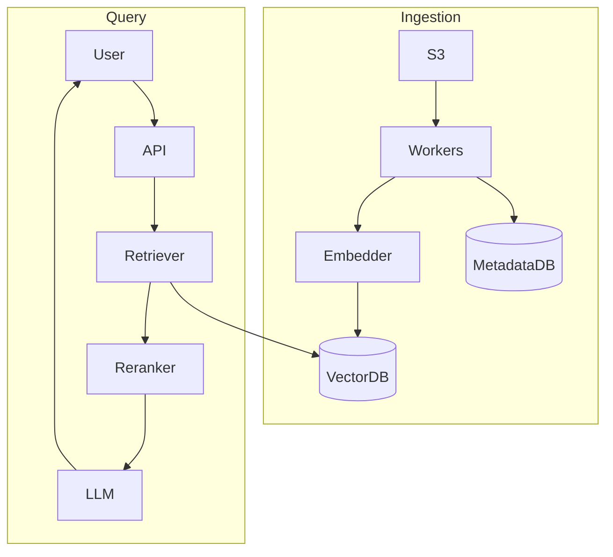
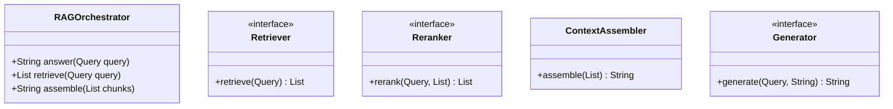
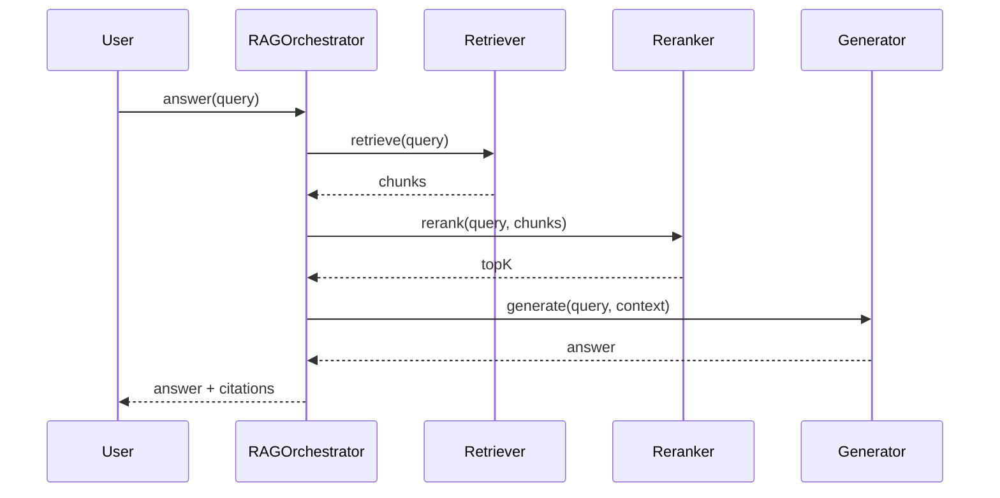
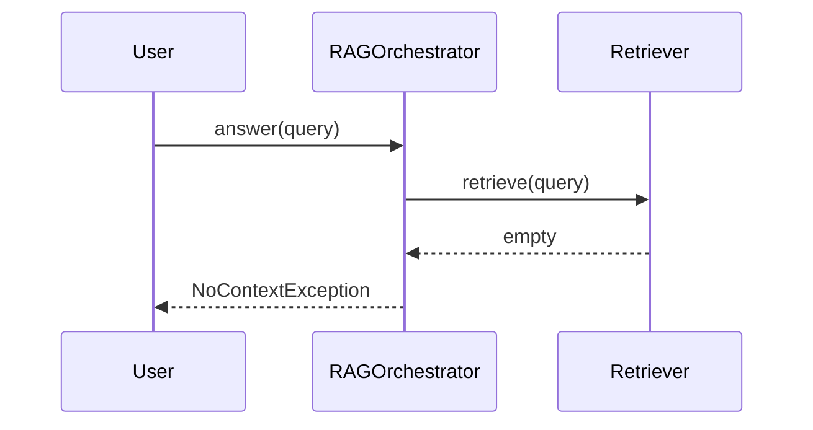

# Enterprise RAG Document Q&A — End-to-End Case Study

**Case Study ID:** CS-PAIR-01
**Track:** Paired HLD + LLD
**HLD case study:** [CS-HLD-G02](../hld/genai/CS-HLD-G02-rag-document-qa.md)
**LLD case study:** [CS-LLD-A01](../lld/genai/CS-LLD-A01-rag-orchestrator.md)
**HLD question:** [Q02-rag-document-qa.md](../../System%20Design%20-%20High%20Level%20Design/02-genai-llm-hld/questions/Q02-rag-document-qa.md)
**LLD question:** [Q01-rag-orchestrator.md](../../System Design - Low Level Design/05-genai-llm-lld/questions/Q01-rag-orchestrator.md)

> Read this document for the **full stack narrative**. Use individual HLD/LLD case studies for depth on one round type.

---

## Part 1 — Business Context

**Industry analog:** Glean and Notion AI — employees search internal docs with AI-generated answers.

Acme Corp (fictional enterprise) has 10K B2B tenants, 10M documents, and 50M queries/day. Legal and compliance require **citations on every answer** and **zero cross-tenant data leaks**. The product team must ship MVP in 8 weeks with a team of 4 engineers.

**Why now:** GenAI made semantic search accessible, but enterprises won't adopt without ACL-aware retrieval and hallucination controls.

**Success:** p99 query latency < 8s, citation accuracy > 95%, SOC2 Type II within 12 months.

---

## Part 2 — Stakeholders & Personas

| Persona | Goals | Pain points | Success metric |
|---------|-------|-------------|----------------|
| End user | Complete core flows quickly | Slow, unreliable UX | Task completion rate > 95% |
| Product owner | Ship MVP on schedule | Scope creep | On-time V1 delivery |
| SRE / platform | Meet SLO with observability | Opaque failures | Error budget > 0 monthly |
| Security / compliance | Data protection, audit trail | Regulatory breach | Zero critical findings |

---

## Part 3 — Requirements

### Functional Requirements (MoSCoW)

| Priority | Requirement | Acceptance criteria |
|----------|-------------|---------------------|
| Must | Document upload + Drive/Confluence sync | E2E ingest → query in staging |
| Must | Q&A with page-level citations | Eval set faithfulness > 95% |
| Must | Tenant admin + usage dashboard | Admin can view audit log |
| Must | GDPR delete purges vectors in 24h | Integration test confirms zero chunks |
| Won't (MVP) | Multi-region active-active | Documented in PRD |
| Won't (MVP) | Advanced ML personalization | Documented in PRD |

### Non-Functional Requirements

| Attribute | Target | Measurement |
|-----------|--------|-------------|
| Latency | p99 < 8s end-to-end query | Distributed tracing |
| Availability | 99.9% | Monthly error budget |
| Isolation | Zero cross-tenant retrieval in pen test | Security CI suite |
| Ingestion lag | < 15 min for connector updates | Pipeline lag metric |

**From requirements analysis:**
- 99.9% availability
- Tenant data isolation (logical + encryption)
- Audit log: who queried what, which chunks retrieved
- Ingestion lag < 15 min for updates

---

### Clarifying Questions (Discovery Phase)

| # | Question | Expected answer |
|---|----------|-----------------|
| 1 | Document types? | PDF, DOCX, HTML, Markdown, Slack export |
| 2 | Tenants? | 10K enterprises, strict isolation |
| 3 | Citations required? | Yes — page/section references |
| 4 | Update frequency? | Daily sync from Confluence/Drive + manual upload |
| 5 | Max doc size? | 500 pages; 10M docs total across platform |
| 6 | ACL? | User only sees docs they have permission to |
| 7 | Latency? | p99 < 8s end-to-end |
| 8 | Hallucination tolerance? | Near zero — must cite or refuse |
| 9 | Languages? | English MVP; multilingual extension |
| 10 | Compliance? | SOC2, GDPR delete, optional HIPAA |

---

---

## Part 4 — Constraints

| Constraint | Detail | Impact on design |
|------------|--------|------------------|
| Budget | $80K/mo infra + $120K/mo LLM API at scale | Semantic cache + model routing |
| Team | 2 backend, 1 ML, 1 infra | Buy Pinecone; build orchestration |
| Timeline | MVP 8 weeks | English only; 3 connector types |
| Compliance | SOC2, GDPR delete within 24h | Audit log on every query |
| Hallucination | Near-zero tolerance | Citation validator + refuse path |

---

## Part 5 — Tradeoffs & Architecture Decision Records

### ADR-001: Vector store at 100M chunks

**Status:** Accepted  
**Context:** 100M vectors × 1536 dims ≈ 600 GB; need hybrid search.  
**Decision:** Pinecone managed + Elasticsearch BM25 with reciprocal rank fusion.  
**Consequences:** Vendor cost; ops simplicity; proven at scale.  
**Alternatives considered:** pgvector — rejected above 30M vectors per index.


### ADR-002: ACL enforcement point

**Status:** Accepted  
**Context:** Users must never retrieve unauthorized chunks.  
**Decision:** Metadata filter in vector DB query before ranking — never post-filter only.  
**Consequences:** Slightly slower queries; security invariant testable in CI.  
**Alternatives considered:** Post-filter after retrieval — rejected (leak risk + wasted compute).


### ADR-003: Answer format

**Status:** Accepted  
**Context:** Need machine-verifiable citations.  
**Decision:** Structured JSON: `{answer, citations[]}` + NLI faithfulness check.  
**Consequences:** Easier validation; slightly higher latency.  
**Alternatives considered:** Free text — rejected for enterprise compliance.


### Tradeoffs Summary (from design analysis)


| Decision | A | B | Pick |
|----------|---|---|------|
| Vector store | pgvector | Pinecone | Pinecone at 100M vectors |
| Chunk size | 256 | 512 | 512 with overlap for contracts |
| Answer style | Free text | Structured JSON | JSON with `answer` + `citations[]` for validation |

---


---

## Part 6 — Capacity & Cost Estimation

```
10K tenants × 1K docs avg = 10M documents
10 pages/doc avg × 10 chunks/page = 100M chunks

Vector storage: 100M × 1536 dims × 4 bytes ≈ 600 GB
Metadata Postgres: ~200 GB
Queries: 50M/day → 580 QPS avg, ~1,750 peak

Embedding on ingest: batch 100 chunks/call → ~1M API calls on full reindex
```

---

### Cost ballpark (V1)

- Compute: $5–15K/mo\n- Managed DB/cache: $3–8K/mo\n- LLM API (if applicable): usage-based; budget caps per tenant

---

## Part 7 — High-Level Design

### Problem recap

Design an enterprise document Q&A system: employees upload PDFs, Word docs, wikis; ask natural language questions; receive grounded answers with citations. Multi-tenant B2B SaaS.

---

### Architecture

**Ingestion:**
```
Connector/Webhook → S3 → SQS → Parser Worker → Chunker → Embed Batch API → VectorDB
                              ↓
                         Metadata DB (doc_id, tenant_id, ACL, version)
```

**Query:**
```
User → API GW → AuthZ (doc ACL filter) → Query Embed → Hybrid Search → Reranker
    → Prompt Builder → LLM Gateway → Citation Validator → Response
```



---

### Component choices

| Component | Choice | Alternative |
|-----------|--------|-------------|
| Vector DB | Pinecone (managed) | pgvector if < 30M vectors per tenant |
| Hybrid search | Elasticsearch + vector | Weaviate native hybrid |
| Parser | Unstructured.io | Custom per format |
| Chunking | 512 tokens, 10% overlap | Semantic chunking for contracts |
| Reranker | Cohere rerank-3 | cross-encoder self-host |
| LLM | GPT-4 class with strict system prompt | Claude for long context |

---

### Deep dive topics

### 1. ACL enforcement
Every chunk stores `tenant_id`, `doc_id`, `allowed_groups[]`. Query adds metadata filter BEFORE vector search — never post-filter only.

### 2. Chunking for citations
Store `page_number`, `section_heading`, `char_offset` in metadata. Prompt: "Answer only from context; cite as [doc_name, p.X]."

### 3. Hybrid retrieval
BM25 catches SKUs and legal clause numbers; vectors catch paraphrases. Reciprocal Rank Fusion merges lists.

### 4. Freshness
On doc update: increment `version`, delete old chunk IDs async, re-ingest. Query excludes `version < current`.

### 5. Hallucination guard
Post-LLM: extract citation markers; verify each claim sentence has supporting chunk via NLI model; else regenerate or refuse.

---

### Failure modes

| Failure | Mitigation |
|---------|------------|
| No chunks above score threshold | Return "No relevant documents found" |
| LLM invents citation | Citation validator strips or regenerates |
| Ingestion backlog | Scale workers; priority queue for premium tenants |
| Cross-tenant leak | Filter in DB query; security test in CI |

---

---

## Part 8 — Low-Level Design (Full)


### Problem recap

Design in-process RAG orchestrator: retrieve, rerank, assemble context, generate.

---

### Core entities

| Entity | Role |
|--------|------|
| `RAGOrchestrator` | Pipeline |
| `Retriever` | Fetch chunks |
| `Reranker` | Score order |
| `ContextAssembler` | Prompt build |
| `Generator` | LLM interface |

**Nouns → classes:** `RAGOrchestrator`, `Retriever`, `Reranker`, `ContextAssembler`, `Generator`  
**Verbs → methods:** `answer(Query)`, `retrieve(Query)`, `assemble(chunks)`

---

### Class diagram

```
┌─────────────────────┐       ┌──────────────────┐
│  RAGOrchestrator    │──────>│ Pipeline         │<<interface>>
│─────────────────────│       │──────────────────│
│ +orchestrate()      │       │ +apply()         │
└─────────┬───────────┘       └────────┬─────────┘
          │ owns                       │ implements
          ▼                   ┌────────▼─────────┐
┌─────────────────────┐       │ ConcretePipeline │
│  RAGOrchestrator    │       └──────────────────┘
└─────────┬───────────┘
          │ *
          ▼
┌─────────────────────┐     ┌──────────────────┐
│  Retriever          │────>│  Reranker        │
└─────────────────────┘     └──────────────────┘
```



---

### Public API

```java
public class RAGOrchestrator {
    public String answer(Query query);
    public List<RetrievedChunk> retrieve(Query query);
    public String assemble(List<RetrievedChunk> chunks);
}
```

---

### Design patterns & SOLID

| Pattern | Application |
|---------|-------------|
| Pipeline | Sequential stages with shared Query context |
| Strategy | Swappable Retriever/Reranker/Generator |

**SOLID:**
- **S:** RAGOrchestrator orchestrates; entities hold state
- **O:** New behavior via new Retriever impl
- **D:** Depend on Retriever interface

---

### Sequence diagrams

**Happy path:**



**Failure path:**



---

### Concurrency & edge cases

- Pipeline stages sequential in MVP — parallel retrieve+embed is HLD
- Empty retrieval → NoContextException or fallback message
- Token overflow → TruncationStrategy trims oldest chunks
- Generator timeout → wrap in CompletableFuture at HLD layer

---

---

## Part 9 — Implementation Roadmap

| Phase | Timeline | Scope | Out of scope |
|-------|----------|-------|--------------|
| MVP | 2 weeks | Single-region, core user flows, manual ops | Multi-region, advanced analytics |
| V1 | 3 months | Production SLO, auth, monitoring, connector integrations | Custom ML models |
| Scale | 12 months | Auto-scaling, cost optimization, enterprise compliance | Edge deployment |

**MVP success criteria for RAG Orchestrator:** Core flows demo-ready; p99 within 2× target; on-call runbook draft.

---

## Part 10 — Operations

### SLI / SLO

| SLI | Definition | SLO |
|-----|------------|-----|
| Availability | successful_requests / total_requests | 99.9% monthly |
| Latency | p99 response time | < 8s |

### Observability

- **Metrics:** Request rate, error rate, latency histograms, queue depth, cache hit ratio
- **Logs:** Structured JSON with `trace_id`, `tenant_id`, `user_id`
- **Traces:** OpenTelemetry across API → workers → DB/cache/LLM

### Deployment

- Blue/green or canary via CI/CD; feature flags for risky changes
- Database migrations backward-compatible; expand-contract pattern

### Incident Runbook

**Scenario:** p99 latency spike 3× baseline.

1. Check error budget burn in Grafana
2. Identify hot shard / tenant via trace tags
3. Scale workers or enable degradation mode
4. Post-incident: ADR if architecture change needed

### Security Checklist

- Authentication via org SSO (OIDC)
- Authorization at API + data layer
- Encryption at rest (AES-256) and in transit (TLS 1.3)
- Audit log for admin and sensitive reads
- Secrets in vault; no keys in code
- Prompt injection tests in CI
- Output guardrails on PII and policy violations


---

## Part 11 — Interview Walkthrough (30 min)

> This is a 30-minute senior loop for **RAG Orchestrator**. Spend 5 minutes on context, 10 on HLD, 10 on LLD/boundaries, 5 on ops.

> "RAGOrchestrator coordinates retrieve-rerank-generate pipeline behind single answer() API."
>
> "Query carries user text, tenantId, maxTokens, and metadata."
>
> "Retriever interface abstracts vector DB — LLD uses in-memory stub."
>
> "Reranker re-scores chunks; default passthrough if not configured."
>
> "ContextAssembler builds prompt string respecting TokenBudget."
>
> "Generator interface wraps LLMProvider — returns completion text."
>
> "Each stage is independently testable with mocks — OCP."
>
> "HLD adds Pinecone, embedding service, queue; LLD pipeline shape unchanged."

> ---

> If the interviewer asks about millions of users, I pivot: same object model, but add Redis cache, message queue, and sharded DB — see HLD case study.


---

## Part 11b — Practical Learning Lab

### Hands-on exercises

1. **Whiteboard (15 min):** Draw LLD object model and patterns from memory after reading Parts 1–5.
2. **Tradeoff drill (10 min):** Pick one ADR and argue the rejected alternative for 2 minutes.
3. **Failure mode (10 min):** Pick one failure from Part 7/10; write a 5-step runbook.
4. **Pivot practice (5 min):** Practice the HLD↔LLD pivot script aloud.
5. **Timed mock (45 min):** Use the linked question file without looking at this case study.

### Production readiness checklist

- [ ] SLO defined and dashboarded
- [ ] Load test at 2× expected peak QPS
- [ ] Chaos test: kill one dependency; verify degradation
- [ ] Security review: auth, encryption, audit
- [ ] Runbook linked from on-call playbook
- [ ] Cost model reviewed with FinOps
- [ ] ADRs stored in repo `docs/adr/`

### Industry comparison

| Capability | LangChain / LlamaIndex RAG pipeline — retrieve, rerank, generate (reference) | This design (MVP) | Scale phase |
|------------|----------------------|-------------------|-------------|
| Core flow | Production-grade | MVP scope in Part 9 | Part 9 Scale column |
| Reliability | Multi-region | Single-region 99.9% | Multi-region failover |
| Observability | Full APM + SRE | Metrics + traces + logs | SLO error budgets |
| Security | Enterprise compliance | Checklist in Part 10 | SOC2 / pen test |


### OWASP LLM Top 10 Mapping

| Risk | Mitigation in this design |
|------|---------------------------|
| LLM01 Prompt injection | Input sanitization; separate system/user channels |
| LLM06 Sensitive disclosure | ACL on retrieval; redact PII in logs |
| LLM09 Overreliance | Citations, confidence scores, refuse when uncertain |
| LLM10 Model theft | API keys in vault; rate limits per tenant |


### Senior interviewer rubric

| Signal | Strong | Weak |
|--------|--------|------|
| Requirements | Measurable NFRs stated upfront | Vague "it should scale" |
| Constraints | Names budget, team, timeline | Ignores constraints |
| Tradeoffs | ADR with rejected alternative | Single option only |
| Depth | Failure modes unprompted | Happy path only |
| Communication | Structured 30-min narrative | Jumps to diagram |


---

## Part 12 — Related Links

- **Question file:** [Q01-rag-orchestrator.md](../../System%20Design%20-%20Low%20Level%20Design/05-genai-llm-lld/questions/Q01-rag-orchestrator.md)
- **End-to-end pair:** [CS-PAIR-01-enterprise-rag.md](CS-PAIR-01-enterprise-rag.md)
- **Template:** [case-study-template.md](../00-framework/case-study-template.md)
- **Industry standards:** [industry-standards-reference.md](../00-framework/industry-standards-reference.md)

- [Gen AI LLD memory map](../../System%20Design%20-%20Low%20Level%20Design/05-genai-llm-lld/memory-map-genai-lld.md)
- [Strategy pattern](../../System%20Design%20-%20Low%20Level%20Design/01-core-concepts/design-patterns-gof.md)
- [SOLID principles](../../System%20Design%20-%20Low%20Level%20Design/01-core-concepts/solid-principles.md)
- [Concurrency fundamentals](../../System%20Design%20-%20Low%20Level%20Design/01-core-concepts/concurrency-fundamentals.md)
- [Java implementation](../../System Design - Low Level Design/09-code-implementations/java/genai/rag-orchestrator/RAGOrchestratorService.java) (full)
- [HLD counterpart](../../System%20Design%20-%20High%20Level%20Design/02-genai-llm-hld/questions/Q02-rag-document-qa.md)
