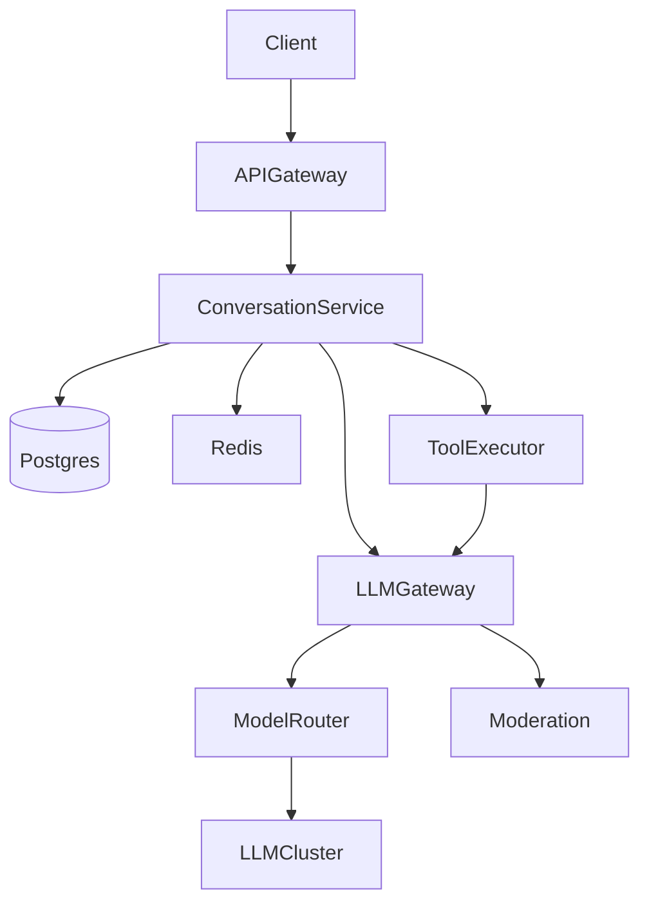
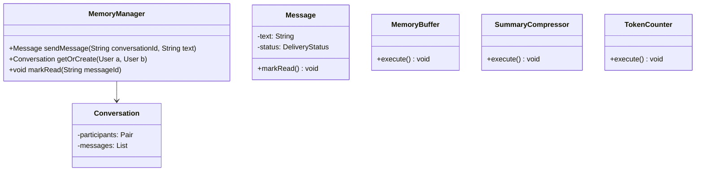
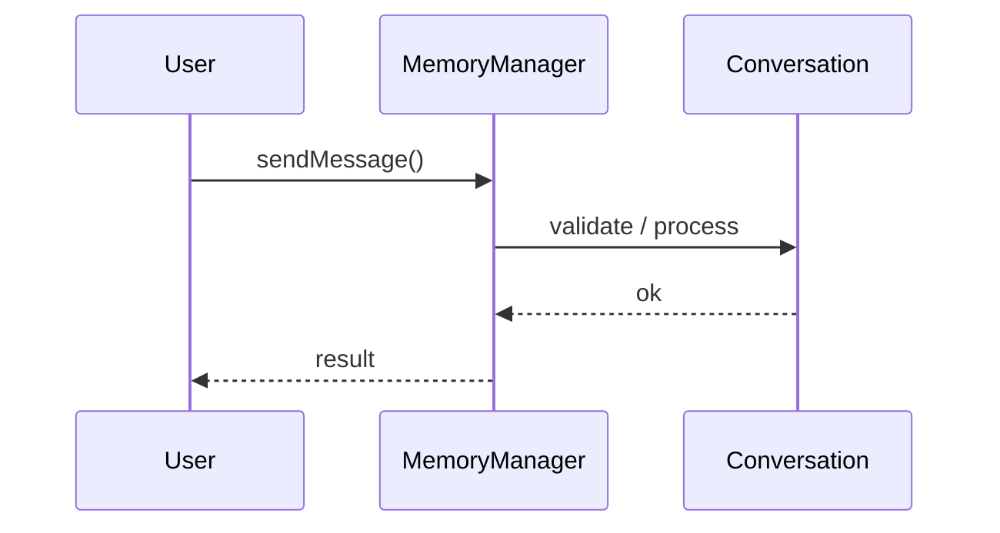
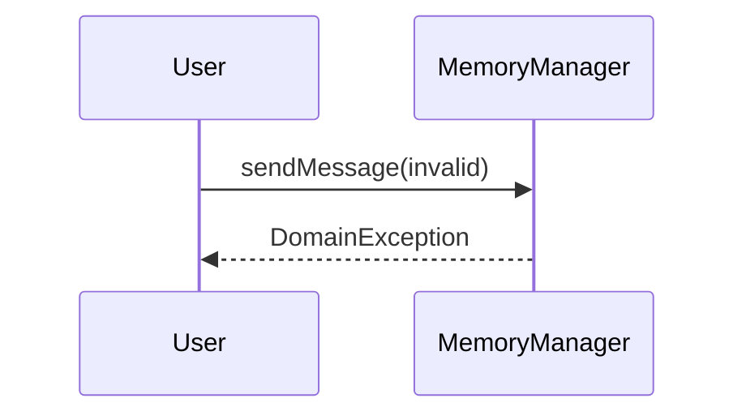

# ChatGPT-like Conversational AI — End-to-End Case Study

**Case Study ID:** CS-PAIR-03
**Track:** Paired HLD + LLD
**HLD case study:** [CS-HLD-G01](../hld/genai/CS-HLD-G01-design-chatgpt-clone.md)
**LLD case study:** [CS-LLD-A04](../lld/genai/CS-LLD-A04-conversation-memory-manager.md)
**HLD question:** [Q01-design-chatgpt-clone.md](../../System Design - High Level Design/02-genai-llm-hld/questions/Q01-design-chatgpt-clone.md)
**LLD question:** [Q04-conversation-memory-manager.md](../../System Design - Low Level Design/05-genai-llm-lld/questions/Q04-conversation-memory-manager.md)

> Read this document for the **full stack narrative**. Use individual HLD/LLD case studies for depth on one round type.

---

## Part 1 — Business Context

**Industry analog:** ChatGPT — conversational UI with streaming, memory, and optional tools.

100M MAU, billions of messages, streaming tokens via SSE, multi-model routing, content moderation.

---

## Part 2 — Stakeholders & Personas

| Persona | Goals | Pain points | Success metric |
|---------|-------|-------------|----------------|
| End user | Complete core flows quickly | Slow, unreliable UX | Task completion rate > 95% |
| Product owner | Ship MVP on schedule | Scope creep | On-time V1 delivery |
| SRE / platform | Meet SLO with observability | Opaque failures | Error budget > 0 monthly |
| Security / compliance | Data protection, audit trail | Regulatory breach | Zero critical findings |

---

## Part 3 — Requirements

### Functional Requirements (MoSCoW)

| Priority | Requirement | Acceptance criteria |
|----------|-------------|---------------------|
| Must | Multi-turn chat with context window management | Verified in integration tests |
| Must | Streaming token delivery (SSE) | Verified in integration tests |
| Must | Conversation CRUD (list, rename, delete) | Verified in integration tests |
| Must | Model selection (user or auto-route) | Verified in integration tests |
| Must | Tool/plugin execution loop | Verified in integration tests |
| Must | File upload → parse → inject into context | Verified in integration tests |
| Must | Rate limits per tier (free vs paid) | Verified in integration tests |
| Won't (MVP) | Multi-region active-active | Documented in PRD |
| Won't (MVP) | Advanced ML personalization | Documented in PRD |

### Non-Functional Requirements

| Attribute | Target | Measurement |
|-----------|--------|-------------|
| Latency | p99 < 500ms sync API; p99 < 8s LLM | APM / distributed tracing |
| Availability | 99.9% | Uptime SLO dashboard |
| Throughput | 10K peak QPS (scale phase) | Load test report |
| Security | AuthN/Z, encryption at rest/transit | Annual pen test |
| Maintainability | Modular services, ADRs documented | Change failure rate < 15% |
| LLM faithfulness | Citation accuracy > 95% on eval set | Offline eval pipeline |

**From requirements analysis:**
- 99.9% availability
- TTFT p99 < 500ms; full response < 30s for long answers
- Global deployment (US, EU regions for data residency)
- Audit log for abuse investigation

---

### Clarifying Questions (Discovery Phase)

| # | Question | Expected answer |
|---|----------|-----------------|
| 1 | Consumer or enterprise? | Consumer MVP; mention B2B tenant isolation as extension |
| 2 | DAU and messages/day? | 100M DAU, 500M messages/day |
| 3 | Streaming required? | Yes — SSE token stream, TTFT < 500ms |
| 4 | Conversation history? | Yes — persist per user, load last N turns |
| 5 | Plugins / tools? | Yes — web browse, code exec, image gen as tools |
| 6 | Multi-model? | GPT-4 class + smaller fast model for routing |
| 7 | Moderation? | Input/output content filters |
| 8 | Data retention? | User can delete history; no train on user data (enterprise) |
| 9 | File upload? | Images/docs in chat — triggers RAG sub-path |
| 10 | Auth? | OAuth + optional API keys for developers |

---

---

## Part 4 — Constraints

| Constraint | Detail | Impact on design |
|------------|--------|------------------|
| Budget | $50K/month infra at V1 scale | Prefer managed services over self-host |
| Team | 2 backend, 1 frontend, 1 ML engineer | MVP scope strictly bounded |
| Timeline | MVP in 8 weeks | Defer nice-to-have features |
| Tech | Cloud-native on AWS/GCP | Use existing org SSO and VPC |
| Build vs buy | Buy vector DB / LLM API; build orchestration | Focus engineering on differentiation |

---

## Part 5 — Tradeoffs & Architecture Decision Records

### ADR-001: Primary architecture pattern

**Status:** Accepted  
**Context:** Need to balance delivery speed, operability, and scale for Design ChatGPT-like Conversational AI.  
**Decision:** Event-driven async for writes; cache-heavy sync read path.  
**Consequences:** Higher eventual consistency on analytics; simpler peak handling.  
**Alternatives considered:** Fully synchronous CRUD — rejected due to peak QPS.


### ADR-002: Data store selection

**Status:** Accepted  
**Context:** Mixed OLTP, cache, and search/vector needs.  
**Decision:** PostgreSQL for source of truth; Redis for hot path; specialized index where needed.  
**Consequences:** Operational complexity of multiple stores; optimal per access pattern.  
**Alternatives considered:** Single document DB — rejected for strong consistency requirements.


### ADR-003: Multi-tenancy model

**Status:** Accepted  
**Context:** B2B SaaS with strict isolation requirements.  
**Decision:** Logical tenant_id on all rows + encryption per tenant for sensitive payloads.  
**Consequences:** Cost-effective vs physical isolation; requires rigorous integration tests.  
**Alternatives considered:** Database-per-tenant — rejected at 10K tenant scale.


### Tradeoffs Summary (from design analysis)


| Decision | A | B | Pick |
|----------|---|---|------|
| History store | Postgres | DynamoDB | Postgres + read replicas; shard by user_id |
| Transport | SSE | WebSocket | SSE for token stream; WS if bidirectional plugins |
| Tool execution | Sync in request | Async job | Sync for <10s tools; async + notify for long jobs |

---


---

## Part 6 — Capacity & Cost Estimation

```
DAU = 100M
Messages/user/day = 5 → 500M messages/day
QPS = 500M / 86400 ≈ 5,800 avg → ~17,000 peak

Avg tokens: 1.5K input + 400 output per message
Daily tokens = 500M × 1.9K ≈ 950B tokens/day

Conversation storage: 100M users × 20 convos × 50KB ≈ 100 TB (with compression less)

GPU: If self-host 70B equiv — thousands of GPUs; realistic answer: managed API + regional gateways
```

**Bottleneck:** LLM inference throughput and conversation DB read latency for history assembly.

---

### Cost ballpark (V1)

- Compute: $5–15K/mo\n- Managed DB/cache: $3–8K/mo\n- LLM API (if applicable): usage-based; budget caps per tenant

---

## Part 7 — High-Level Design

### Problem recap

Design a conversational AI platform like ChatGPT: multi-turn chat, streaming responses, conversation history, plugins/tools, and multi-model support at global scale.

---

### Architecture

```
┌────────┐     ┌─────────────┐     ┌──────────────────┐     ┌─────────────┐
│ Client │────▶│ API Gateway │────▶│ Conversation Svc │────▶│ LLM Gateway │
└────────┘     └─────────────┘     └────────┬─────────┘     └──────┬──────┘
                                            │                       │
                                     ┌──────▼──────┐         ┌──────▼──────┐
                                     │ Redis cache │         │Model Router │
                                     │ + Postgres  │         │ GPT-4 / mini│
                                     └─────────────┘         └──────┬──────┘
                                                                    │
                              ┌─────────────────────────────────────┤
                              ▼                                     ▼
                       ┌─────────────┐                      ┌─────────────┐
                       │ Tool Executor│◀── agent loop ────│  Moderation │
                       └─────────────┘                      └─────────────┘
```



---

### Component choices

| Component | Choice | Why |
|-----------|--------|-----|
| Conversation store | Postgres + Redis hot cache | ACID for billing; cache recent convos |
| LLM | API initially; regional gateway | Ops complexity of self-host at 100M DAU |
| Streaming | SSE from API gateway | Simpler than WebSocket for one-way tokens |
| Tool sandbox | Firecracker/gVisor containers | Isolate code exec |
| Moderation | Classifier + blocklist | Before and after LLM |
| File parsing | Unstructured + S3 | Upload → extract text for context |

---

### Deep dive topics

### 1. Context window management
Load last K turns; summarize older turns into rolling summary stored in DB. Budget: system (2K) + tools (1K) + history (8K) + user message (4K).

### 2. Agent loop for tools
LLM returns `tool_call` JSON → validate schema → execute with timeout → append observation → re-call LLM until `finish` or max 5 steps.

### 3. Model routing
Intent classifier: chitchat/FAQ → small model; reasoning/code → large model. Saves ~60% cost.

### 4. Streaming architecture
LLM gateway opens stream to provider; API gateway proxies SSE to client; heartbeat every 15s to keep connection alive.

---

### Failure modes

| Failure | Behavior |
|---------|----------|
| LLM timeout | Partial response saved; offer retry |
| Moderation hit | Block response; generic message |
| Tool sandbox escape | Prevented by gVisor; kill on timeout |
| DB slow | Serve from Redis cache; degrade history to last 3 turns |

---

---

## Part 8 — Low-Level Design (Full)


### Problem recap

Design sliding-window + summary memory for multi-turn chat context.

---

### Core entities

| Entity | Role |
|--------|------|
| `Conversation` | Session |
| `Message` | Turn |
| `MemoryBuffer` | Window |
| `SummaryCompressor` | Long context |
| `TokenCounter` | Budget |

**Nouns → classes:** `Conversation`, `Message`, `MemoryBuffer`, `SummaryCompressor`, `TokenCounter`  
**Verbs → methods:** `sendMessage()`, `getOrCreate()`, `markRead()`

---

### Class diagram

```
┌─────────────────────┐       ┌──────────────────┐
│  MemoryManager      │──────>│ Strategy         │<<interface>>
│─────────────────────│       │──────────────────│
│ +orchestrate()      │       │ +apply()         │
└─────────┬───────────┘       └────────┬─────────┘
          │ owns                       │ implements
          ▼                   ┌────────▼─────────┐
┌─────────────────────┐       │ ConcreteStrategy │
│  Conversation       │       └──────────────────┘
└─────────┬───────────┘
          │ *
          ▼
┌─────────────────────┐     ┌──────────────────┐
│  Message            │────>│  MemoryBuffer    │
└─────────────────────┘     └──────────────────┘
```



---

### Public API

```java
public class MemoryManager {
    public Message sendMessage(String conversationId, String text);
    public Conversation getOrCreate(User a, User b);
    public void markRead(String messageId);
}
```

---

### Design patterns & SOLID

| Pattern | Application |
|---------|-------------|
| Strategy | Swappable pipeline components |
| Chain of Responsibility | Sequential processing stages |

**SOLID:**
- **S:** MemoryManager orchestrates; entities hold state
- **O:** New behavior via new MemoryBuffer impl
- **D:** Depend on MemoryBuffer interface

---

### Sequence diagrams

**Happy path:**



**Failure path:**



---

### Concurrency & edge cases

- Single-threaded MVP unless clarifying assumes concurrent access
- If multi-user: synchronize on mutable aggregates or use concurrent collections
- Fail fast on invalid input with domain exceptions
- Idempotent retries where duplicate operations are possible

---

---

## Part 9 — Implementation Roadmap

| Phase | Timeline | Scope | Out of scope |
|-------|----------|-------|--------------|
| MVP | 2 weeks | Single-region, core user flows, manual ops | Multi-region, advanced analytics |
| V1 | 3 months | Production SLO, auth, monitoring, connector integrations | Custom ML models |
| Scale | 12 months | Auto-scaling, cost optimization, enterprise compliance | Edge deployment |

**MVP success criteria for Conversation Memory Manager:** Core flows demo-ready; p99 within 2× target; on-call runbook draft.

---

## Part 10 — Operations

### SLI / SLO

| SLI | Definition | SLO |
|-----|------------|-----|
| Availability | successful_requests / total_requests | 99.9% monthly |
| Latency | p99 response time | < 8s |

### Observability

- **Metrics:** Request rate, error rate, latency histograms, queue depth, cache hit ratio
- **Logs:** Structured JSON with `trace_id`, `tenant_id`, `user_id`
- **Traces:** OpenTelemetry across API → workers → DB/cache/LLM

### Deployment

- Blue/green or canary via CI/CD; feature flags for risky changes
- Database migrations backward-compatible; expand-contract pattern

### Incident Runbook

**Scenario:** p99 latency spike 3× baseline.

1. Check error budget burn in Grafana
2. Identify hot shard / tenant via trace tags
3. Scale workers or enable degradation mode
4. Post-incident: ADR if architecture change needed

### Security Checklist

- Authentication via org SSO (OIDC)
- Authorization at API + data layer
- Encryption at rest (AES-256) and in transit (TLS 1.3)
- Audit log for admin and sensitive reads
- Secrets in vault; no keys in code
- Prompt injection tests in CI
- Output guardrails on PII and policy violations


---

## Part 11 — Interview Walkthrough (30 min)

> This is a 30-minute senior loop for **Conversation Memory Manager**. Spend 5 minutes on context, 10 on HLD, 10 on LLD/boundaries, 5 on ops.

> "I'll design Conversation Memory Manager — clarify in-memory scope and MVP flows first."
>
> "Entities: `Conversation`, `Message`, `MemoryBuffer`, `SummaryCompressor`, `TokenCounter`. Domain structure separate from `MemoryManager` orchestration."
>
> "Problem: Design sliding-window + summary memory for multi-turn chat context."
>
> "`Conversation` — session; owns its own invariants."
>
> "`Message` — turn; owns its own invariants."
>
> "`MemoryBuffer` — window; owns its own invariants."
>
> "`MemoryManager` validates input, coordinates entities, returns typed results."
>
> "Identify variation points — inject interfaces for Open-Closed extensibility."
>
> "Walk happy path on whiteboard, then failure case with domain exception."
>
> "Tradeoff: enum vs State pattern; Strategy vs if/else — pick with justification."

> ---

> If the interviewer asks about millions of users, I pivot: same object model, but add Redis cache, message queue, and sharded DB — see HLD case study.


---

## Part 11b — Practical Learning Lab

### Hands-on exercises

1. **Whiteboard (15 min):** Draw LLD object model and patterns from memory after reading Parts 1–5.
2. **Tradeoff drill (10 min):** Pick one ADR and argue the rejected alternative for 2 minutes.
3. **Failure mode (10 min):** Pick one failure from Part 7/10; write a 5-step runbook.
4. **Pivot practice (5 min):** Practice the HLD↔LLD pivot script aloud.
5. **Timed mock (45 min):** Use the linked question file without looking at this case study.

### Production readiness checklist

- [ ] SLO defined and dashboarded
- [ ] Load test at 2× expected peak QPS
- [ ] Chaos test: kill one dependency; verify degradation
- [ ] Security review: auth, encryption, audit
- [ ] Runbook linked from on-call playbook
- [ ] Cost model reviewed with FinOps
- [ ] ADRs stored in repo `docs/adr/`

### Industry comparison

| Capability | ChatGPT conversation history and summarization (reference) | This design (MVP) | Scale phase |
|------------|----------------------|-------------------|-------------|
| Core flow | Production-grade | MVP scope in Part 9 | Part 9 Scale column |
| Reliability | Multi-region | Single-region 99.9% | Multi-region failover |
| Observability | Full APM + SRE | Metrics + traces + logs | SLO error budgets |
| Security | Enterprise compliance | Checklist in Part 10 | SOC2 / pen test |


### OWASP LLM Top 10 Mapping

| Risk | Mitigation in this design |
|------|---------------------------|
| LLM01 Prompt injection | Input sanitization; separate system/user channels |
| LLM06 Sensitive disclosure | ACL on retrieval; redact PII in logs |
| LLM09 Overreliance | Citations, confidence scores, refuse when uncertain |
| LLM10 Model theft | API keys in vault; rate limits per tenant |


### Senior interviewer rubric

| Signal | Strong | Weak |
|--------|--------|------|
| Requirements | Measurable NFRs stated upfront | Vague "it should scale" |
| Constraints | Names budget, team, timeline | Ignores constraints |
| Tradeoffs | ADR with rejected alternative | Single option only |
| Depth | Failure modes unprompted | Happy path only |
| Communication | Structured 30-min narrative | Jumps to diagram |


---

## Part 12 — Related Links

- **Question file:** [Q04-conversation-memory-manager.md](../System Design - Low Level Design/05-genai-llm-lld/questions/Q04-conversation-memory-manager.md)
- **End-to-end pair:** [CS-PAIR-03-chatgpt-conversational-ai.md](paired/CS-PAIR-03-chatgpt-conversational-ai.md)
- **Template:** [case-study-template.md](00-framework/case-study-template.md)
- **Industry standards:** [industry-standards-reference.md](00-framework/industry-standards-reference.md)

- [Gen AI LLD memory map](../../05-genai-llm-lld/memory-map-genai-lld.md)
- [Strategy pattern](../../01-core-concepts/design-patterns-gof.md)
- [SOLID principles](../../01-core-concepts/solid-principles.md)
- [Concurrency fundamentals](../../01-core-concepts/concurrency-fundamentals.md)
- [Java implementation](../../09-code-implementations/java/genai/conversation-memory-manager/) (full)
