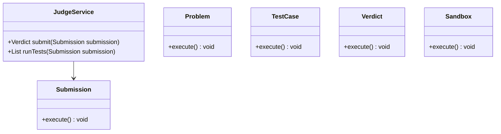
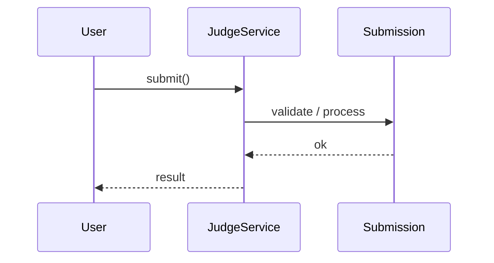
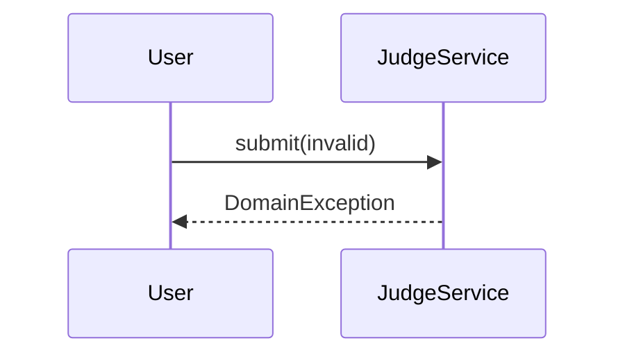

# Online Judge (LeetCode) — End-to-End Case Study

**Case Study ID:** CS-PAIR-14
**Track:** Paired HLD + LLD
**HLD case study:** [CS-HLD-C29](../hld/classic/CS-HLD-C29-online-judge-leetcode.md)
**LLD case study:** [CS-LLD-O61](../lld/classic-ood/CS-LLD-O61-online-judge.md)
**HLD question:** [Q29-online-judge-leetcode.md](../../System%20Design%20-%20High%20Level%20Design/03-classic-hld/questions/Q29-online-judge-leetcode.md)
**LLD question:** [Q61-online-judge.md](../../System Design - Low Level Design/02-classic-ood/questions/Q61-online-judge.md)

> Read this document for the **full stack narrative**. Use individual HLD/LLD case studies for depth on one round type.

---

## Part 1 — Business Context

**Industry analog:** LeetCode judge workers and sandbox

This case study examines **Design Online Judge (LeetCode)** — a system type commonly built at Amazon and similar organizations. Design a scalable system for: **Online Judge (LeetCode)**.

---

**Why now:** Teams with 3–5 YOE full-stack backgrounds are expected to connect product requirements to concrete architecture — especially with GenAI/LLM components where cost, safety, and correctness trade off sharply.

**Success definition:** Meet NFR targets, ship MVP within constraints, and articulate tradeoffs using ADRs.

---

## Part 2 — Stakeholders & Personas

| Persona | Goals | Pain points | Success metric |
|---------|-------|-------------|----------------|
| End user | Complete core flows quickly | Slow, unreliable UX | Task completion rate > 95% |
| Product owner | Ship MVP on schedule | Scope creep | On-time V1 delivery |
| SRE / platform | Meet SLO with observability | Opaque failures | Error budget > 0 monthly |
| Security / compliance | Data protection, audit trail | Regulatory breach | Zero critical findings |

---

## Part 3 — Requirements

### Functional Requirements (MoSCoW)

| Priority | Requirement | Acceptance criteria |
|----------|-------------|---------------------|
| Must | Core features for online judge (leetcode) | Verified in integration tests |
| Must | User authentication and authorization | Verified in integration tests |
| Must | test case runner | Verified in integration tests |
| Won't (MVP) | Multi-region active-active | Documented in PRD |
| Won't (MVP) | Advanced ML personalization | Documented in PRD |

### Non-Functional Requirements

| Attribute | Target | Measurement |
|-----------|--------|-------------|
| Latency | p99 < 200ms | APM / distributed tracing |
| Availability | 99.9% | Uptime SLO dashboard |
| Throughput | 10K peak QPS (scale phase) | Load test report |
| Security | AuthN/Z, encryption at rest/transit | Annual pen test |
| Maintainability | Modular services, ADRs documented | Change failure rate < 15% |

**From requirements analysis:**
- High availability: 99.9%+
- Low latency on hot read path
- Horizontally scalable
- Observable: metrics, tracing, alerting

---

### Clarifying Questions (Discovery Phase)

| # | Question | Expected answer |
|---|----------|-----------------|
| 1 | Scale (DAU, QPS)? | 100K submissions/day |
| 2 | Read vs write ratio? | sandbox exec |
| 3 | Latency requirements? | p99 < 200ms for reads unless media |
| 4 | Consistency requirements? | Eventual OK for feeds; strong for payments/booking |
| 5 | Geographic scope? | Global with multi-region if large scale |
| 6 | Mobile vs web? | Both — design API-first |
| 7 | MVP scope? | Core test case runner |
| 8 | Durability? | No data loss for user content/transactions |
| 9 | CAP preference? | Depends on domain — state explicitly |
| 10 | Out of scope? | Admin UI, ML model training internals |

---

---

## Part 4 — Constraints

| Constraint | Detail | Impact on design |
|------------|--------|------------------|
| Budget | $50K/month infra at V1 scale | Prefer managed services over self-host |
| Team | 2 backend, 1 frontend, 1 ML engineer | MVP scope strictly bounded |
| Timeline | MVP in 8 weeks | Defer nice-to-have features |
| Tech | Cloud-native on AWS/GCP | Use existing org SSO and VPC |
| Build vs buy | Buy vector DB / LLM API; build orchestration | Focus engineering on differentiation |

---

## Part 5 — Tradeoffs & Architecture Decision Records

### ADR-001: Primary architecture pattern

**Status:** Accepted  
**Context:** Need to balance delivery speed, operability, and scale for Design Online Judge (LeetCode).  
**Decision:** Event-driven async for writes; cache-heavy sync read path.  
**Consequences:** Higher eventual consistency on analytics; simpler peak handling.  
**Alternatives considered:** Fully synchronous CRUD — rejected due to peak QPS.


### ADR-002: Data store selection

**Status:** Accepted  
**Context:** Mixed OLTP, cache, and search/vector needs.  
**Decision:** PostgreSQL for source of truth; Redis for hot path; specialized index where needed.  
**Consequences:** Operational complexity of multiple stores; optimal per access pattern.  
**Alternatives considered:** Single document DB — rejected for strong consistency requirements.


### ADR-003: Multi-tenancy model

**Status:** Accepted  
**Context:** B2B SaaS with strict isolation requirements.  
**Decision:** Logical tenant_id on all rows + encryption per tenant for sensitive payloads.  
**Consequences:** Cost-effective vs physical isolation; requires rigorous integration tests.  
**Alternatives considered:** Database-per-tenant — rejected at 10K tenant scale.


### Tradeoffs Summary (from design analysis)


| Decision | Option A | Option B | Recommendation |
|----------|----------|----------|----------------|
| Architecture | Monolith | Microservices | Monolith early; split hot paths at scale |
| DB | SQL | NoSQL | SQL for transactions; Cassandra for chat/logs |
| Fan-out | On write | On read | Hybrid for social feeds |
| Consistency | Strong | Eventual | Match to business requirement |

---


---

## Part 6 — Capacity & Cost Estimation

| Metric | Estimate |
|--------|----------|
| Scale | 100K submissions/day |
| Traffic pattern | sandbox exec |
| QPS (derived) | Calculate: daily requests / 86400 × peak factor 3 |
| Storage (5 yr) | Estimate records × size × replication |
| Bandwidth | QPS × avg payload size |

**Example math to say aloud:**
> "If 100M DAU × 50 requests/day = 5B requests/day ≈ 58K QPS average, ~175K peak. Storage: [run numbers for this domain]."

**Bottleneck:** Identify primary — DB writes, fan-out, geo index, or bandwidth.

---

### Cost ballpark (V1)

- Compute: $5–15K/mo\n- Managed DB/cache: $3–8K/mo\n- LLM API (if applicable): usage-based; budget caps per tenant

---

## Part 7 — High-Level Design

### Problem recap

Design a scalable system for: **Online Judge (LeetCode)**.

---

### Architecture

```
Submission → Queue → Sandbox Workers (Docker) → Result DB
```

---

### Component choices

| Component | Choice | Alternative |
|-----------|--------|-------------|
| API | REST + internal gRPC | GraphQL for mobile BFF |
| Load balancer | L7 ALB | NLB for TCP-heavy |
| Cache | Redis | Memcached for simple KV |
| Primary DB | PostgreSQL / Cassandra* | *Cassandra for chat/write-heavy |
| Search | Elasticsearch | Postgres FTS if simple |
| Queue | Kafka | SQS for simpler workloads |
| Blob storage | S3 | For media/files |
| CDN | CloudFront/Akamai | Static and media delivery |

---

### Deep dive topics

### 1. Data model
Define primary entities, partition/shard key, and indexes for hot queries.

### 2. Hot path optimization
Caching strategy (cache-aside, TTL), CDN for static/media, read replicas.

### 3. Scaling strategy
Horizontal stateless services; shard DB by natural key (user_id, conversation_id, region).

### 4. Consistency & conflicts
Eventual consistency where OK; optimistic locking for inventory/booking; idempotency for payments.

---

### Failure modes

| Failure | Mitigation |
|---------|------------|
| DB primary down | Failover to replica; brief write unavailability |
| Cache down | Fall through to DB; circuit breaker prevents overload |
| Queue lag | Scale consumers; backpressure on producers |
| Region outage | DNS failover; multi-region replicas |
| Dependency timeout | Circuit breaker; cached fallback response |

---

---

## Part 8 — Low-Level Design (Full)


### Problem recap

Design code judge: submit solution, compile, run tests, verdict.

---

### Core entities

| Entity | Role |
|--------|------|
| `Submission` | Code + problem |
| `Problem` | Test cases |
| `TestCase` | Input/expected |
| `Verdict` | AC/WA/TLE |
| `Sandbox` | Isolated runner |

**Nouns → classes:** `Submission`, `Problem`, `TestCase`, `Verdict`, `Sandbox`  
**Verbs → methods:** `submit()`, `runTests()`

---

### Class diagram

```
┌─────────────────────┐       ┌──────────────────┐
│  JudgeService       │──────>│ Strategy         │<<interface>>
│─────────────────────│       │──────────────────│
│ +orchestrate()      │       │ +apply()         │
└─────────┬───────────┘       └────────┬─────────┘
          │ owns                       │ implements
          ▼                   ┌────────▼─────────┐
┌─────────────────────┐       │ ConcreteStrategy │
│  Submission         │       └──────────────────┘
└─────────┬───────────┘
          │ *
          ▼
┌─────────────────────┐     ┌──────────────────┐
│  Problem            │────>│  TestCase        │
└─────────────────────┘     └──────────────────┘
```



---

### Public API

```java
public class JudgeService {
    public Verdict submit(Submission submission);
    public List<TestResult> runTests(Submission submission);
}
```

---

### Design patterns & SOLID

| Pattern | Application |
|---------|-------------|
| Strategy | Variation point in Online Judge |

**SOLID:**
- **S:** JudgeService orchestrates; entities hold state
- **O:** New behavior via new TestRunner impl
- **D:** Depend on TestRunner interface

---

### Sequence diagrams

**Happy path:**



**Failure path:**



---

### Concurrency & edge cases

- Single-threaded MVP unless clarifying assumes concurrent access
- If multi-user: synchronize on mutable aggregates or use concurrent collections
- Fail fast on invalid input with domain exceptions
- Idempotent retries where duplicate operations are possible

---

---

## Part 9 — Implementation Roadmap

| Phase | Timeline | Scope | Out of scope |
|-------|----------|-------|--------------|
| MVP | 2 weeks | Single-region, core user flows, manual ops | Multi-region, advanced analytics |
| V1 | 3 months | Production SLO, auth, monitoring, connector integrations | Custom ML models |
| Scale | 12 months | Auto-scaling, cost optimization, enterprise compliance | Edge deployment |

**MVP success criteria for Online Judge:** Core flows demo-ready; p99 within 2× target; on-call runbook draft.

---

## Part 10 — Operations

### SLI / SLO

| SLI | Definition | SLO |
|-----|------------|-----|
| Availability | successful_requests / total_requests | 99.9% monthly |
| Latency | p99 response time | < 300ms |

### Observability

- **Metrics:** Request rate, error rate, latency histograms, queue depth, cache hit ratio
- **Logs:** Structured JSON with `trace_id`, `tenant_id`, `user_id`
- **Traces:** OpenTelemetry across API → workers → DB/cache/LLM

### Deployment

- Blue/green or canary via CI/CD; feature flags for risky changes
- Database migrations backward-compatible; expand-contract pattern

### Incident Runbook

**Scenario:** p99 latency spike 3× baseline.

1. Check error budget burn in Grafana
2. Identify hot shard / tenant via trace tags
3. Scale workers or enable degradation mode
4. Post-incident: ADR if architecture change needed

### Security Checklist

- Authentication via org SSO (OIDC)
- Authorization at API + data layer
- Encryption at rest (AES-256) and in transit (TLS 1.3)
- Audit log for admin and sensitive reads
- Secrets in vault; no keys in code


---

## Part 11 — Interview Walkthrough (30 min)

> This is a 30-minute senior loop for **Online Judge**. Spend 5 minutes on context, 10 on HLD, 10 on LLD/boundaries, 5 on ops.

> "I'll design Online Judge — clarify in-memory scope and MVP flows first."
>
> "Entities: `Submission`, `Problem`, `TestCase`, `Verdict`, `Sandbox`. Domain structure separate from `JudgeService` orchestration."
>
> "Problem: Design code judge: submit solution, compile, run tests, verdict."
>
> "`Submission` — code + problem; owns its own invariants."
>
> "`Problem` — test cases; owns its own invariants."
>
> "`TestCase` — input/expected; owns its own invariants."
>
> "`JudgeService` validates input, coordinates entities, returns typed results."
>
> "Identify variation points — inject interfaces for Open-Closed extensibility."
>
> "Walk happy path on whiteboard, then failure case with domain exception."
>
> "Tradeoff: enum vs State pattern; Strategy vs if/else — pick with justification."

> ---

> If the interviewer asks about millions of users, I pivot: same object model, but add Redis cache, message queue, and sharded DB — see HLD case study.


---

## Part 11b — Practical Learning Lab

### Hands-on exercises

1. **Whiteboard (15 min):** Draw LLD object model and patterns from memory after reading Parts 1–5.
2. **Tradeoff drill (10 min):** Pick one ADR and argue the rejected alternative for 2 minutes.
3. **Failure mode (10 min):** Pick one failure from Part 7/10; write a 5-step runbook.
4. **Pivot practice (5 min):** Practice the HLD↔LLD pivot script aloud.
5. **Timed mock (45 min):** Use the linked question file without looking at this case study.

### Production readiness checklist

- [ ] SLO defined and dashboarded
- [ ] Load test at 2× expected peak QPS
- [ ] Chaos test: kill one dependency; verify degradation
- [ ] Security review: auth, encryption, audit
- [ ] Runbook linked from on-call playbook
- [ ] Cost model reviewed with FinOps
- [ ] ADRs stored in repo `docs/adr/`

### Industry comparison

| Capability | LeetCode — submit, compile, run, verdict (reference) | This design (MVP) | Scale phase |
|------------|----------------------|-------------------|-------------|
| Core flow | Production-grade | MVP scope in Part 9 | Part 9 Scale column |
| Reliability | Multi-region | Single-region 99.9% | Multi-region failover |
| Observability | Full APM + SRE | Metrics + traces + logs | SLO error budgets |
| Security | Enterprise compliance | Checklist in Part 10 | SOC2 / pen test |


### Senior interviewer rubric

| Signal | Strong | Weak |
|--------|--------|------|
| Requirements | Measurable NFRs stated upfront | Vague "it should scale" |
| Constraints | Names budget, team, timeline | Ignores constraints |
| Tradeoffs | ADR with rejected alternative | Single option only |
| Depth | Failure modes unprompted | Happy path only |
| Communication | Structured 30-min narrative | Jumps to diagram |


---

## Part 12 — Related Links

- **Question file:** [Q61-online-judge.md](../../System%20Design%20-%20Low%20Level%20Design/02-classic-ood/questions/Q61-online-judge.md)
- **End-to-end pair:** [CS-PAIR-14-online-judge.md](CS-PAIR-14-online-judge.md)
- **Template:** [case-study-template.md](../00-framework/case-study-template.md)
- **Industry standards:** [industry-standards-reference.md](../00-framework/industry-standards-reference.md)

- [Strategy pattern](../../System%20Design%20-%20Low%20Level%20Design/01-core-concepts/design-patterns-gof.md)
- [SOLID principles](../../System%20Design%20-%20Low%20Level%20Design/01-core-concepts/solid-principles.md)
- [Concurrency fundamentals](../../System%20Design%20-%20Low%20Level%20Design/01-core-concepts/concurrency-fundamentals.md)
- [Java implementation](../../System Design - Low Level Design/09-code-implementations/java/classic/online-judge/README.md) (skeleton)
