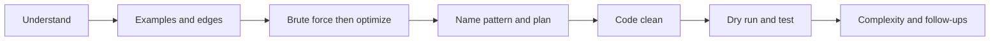

# DSA Coding Round — 45-Minute Flow

Top-company coding rounds follow a rhythm. Owning the structure signals seniority and keeps you calm.

---

## Timeline

```
1. Understand (3–5m) → 2. Examples + edge (2–3m) → 3. Brute + optimize (3–5m)
→ 4. Name pattern + plan (2m) → 5. Code (12–18m) → 6. Test/dry-run (4–6m)
→ 7. Complexity + follow-ups (3m)
```



---

## 1. Understand (don't skip)

Restate the problem. Ask about:

- Input size and value ranges
- Sorted? duplicates? negatives? empty?
- Expected output format, in-place vs new
- One answer vs all answers

## 2. Examples + edge cases

Write 1 normal example + 1 edge (empty, single, all same). This clarifies the spec and seeds your dry-run later.

## 3. Brute force, then optimize

State the obvious solution and its complexity first:

> "Brute force is checking all pairs, O(N^2). I think we can do O(N) with a hashmap."

This shows you can always produce *a* solution, then improve — interviewers reward this.

## 4. Name the pattern + plan

Say the pattern out loud and outline in words/pseudocode. Get a nod before coding.

## 5. Code cleanly

- Edge case first.
- Meaningful names.
- Narrate invariants as you type.
- Don't go silent for 5 minutes.

## 6. Test / dry-run

Trace a small example line-by-line. Then run the edge cases. Fix bugs you find — finding your own bug is a strong signal.

## 7. Complexity + follow-ups

State time and space and **why**. Volunteer a tradeoff or a follow-up ("if input were streaming…").

---

## What to do when stuck

| Situation | Move |
|-----------|------|
| No idea | Solve brute force first, then look for repeated work |
| Brute too slow | Ask: "what am I recomputing?" → hashmap / DP / two pointers |
| Forgot algorithm detail | State the idea, implement the part you know, narrate the gap |
| Off-by-one | Dry-run the boundary explicitly |
| Truly stuck | Ask a clarifying question — often hints at the intended pattern |

---

## Communication scorecard (what they grade)

- Clarifies before coding
- States complexity unprompted
- Names tradeoffs / alternatives
- Clean, bug-light code
- Tests own code
- Calm recovery when stuck

---

## Related

- [How to Approach Any Problem (UMPIRE)](01-how-to-approach-any-problem.md)
- [Senior SWE Signals](05-senior-swe-signals.md)
