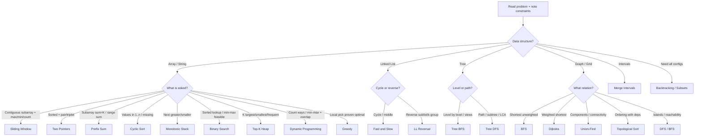

# Pattern Recognition Decision Tree

The skill that wins interviews: **read a problem → identify the pattern in under 60 seconds.** Walk this tree top-down.

---

## Master Decision Tree

---

## Quick Routing Rules (memorize these 12)

| If the problem says… | Pattern |
|----------------------|---------|
| "contiguous subarray/substring" + longest/shortest/max | **Sliding Window** |
| "sorted array" + "two numbers / pair / triplet" | **Two Pointers** |
| "subarray sum equals K" (with negatives) | **Prefix Sum + Hashmap** |
| "numbers from 1 to n" + missing/duplicate | **Cyclic Sort** |
| "next greater / warmer / span / histogram" | **Monotonic Stack** |
| "sorted" + search OR "minimize the max / Kth" | **Binary Search** |
| "K largest / smallest / most frequent / median" | **Heap** |
| "merge K sorted" | **K-way Merge** |
| "intervals" + overlap/merge/rooms | **Merge Intervals** |
| "all subsets / permutations / combinations / N-Queens" | **Backtracking** |
| "min/max cost, number of ways" + reuse | **DP** |
| "prerequisites / build order / cycle in directed" | **Topological Sort** |

---

## Tie-Breakers (when two patterns fit)

| Conflict | Decide by |
|----------|-----------|
| Sliding Window vs Prefix Sum | Negatives present → Prefix Sum; all-positive contiguous → Sliding Window |
| Two Pointers vs Hashmap | Sorted/in-place → Two Pointers; unsorted O(N) lookup → Hashmap |
| DP vs Greedy | Can you prove greedy? If counterexample exists → DP |
| DP vs Backtracking | Need count/optimum → DP; need the actual configurations → Backtracking |
| Union-Find vs DFS | Many dynamic unions/queries → Union-Find; one-shot components → DFS |
| BFS vs Dijkstra | Unweighted → BFS; weighted (non-negative) → Dijkstra |

---

## 60-Second Recognition Drill

1. What is the **input type**? (array, list, tree, graph, intervals)
2. What is the **goal verb**? (find, count, generate, order, optimize)
3. Any **magic words**? (sorted, contiguous, K, prefix, prerequisite, all)
4. What does **N** allow? (see complexity table in [foundations](../00-foundations/01-how-to-approach-any-problem.md))
5. State: "This looks like **<pattern>** because **<cue>**."

---

## Related

- [Cue Dictionary](02-cue-dictionary.md) — exhaustive keyword → pattern table
- [Pattern Master Index](00-pattern-master-index.md)
- [Flashcards](memory-map-flashcards.md)
