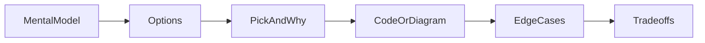

# React Interview Round Flow — 45–60 Minutes

Senior frontend interviews combine **concept depth**, **live coding**, and **system/UI design**. Own the structure.

---

## Round Types

| Round | Duration | Focus |
|-------|----------|-------|
| Concepts / deep dive | 30–45 min | Hooks, rendering, performance, architecture |
| Live coding | 45–60 min | Component + state + edge cases |
| UI / product build | 45–60 min | Chat UI, dashboard, form wizard, design tradeoffs |
| Take-home review | 30 min | Your code — patterns, tests, a11y |

---

## The 6-Step Answer Flow (Any React Question)

```
1. Mental model (1–2 min) → 2. Options (2 min) → 3. Pick + why (2 min)
→ 4. Implementation sketch (5–10 min) → 5. Edge cases (3 min) → 6. Tradeoffs (2 min)
```



---

## Step 1: Mental Model (Senior Signal)

Start with **how React works**, not the API name:

> "React reconciles a tree of elements against the previous tree, computes a minimal set of DOM mutations, and commits in the render phase. Side effects run after paint in useEffect — or during render for certain sync patterns I'd avoid unless necessary."

**Map question → concept:**

| Question theme | Mental model anchor |
|----------------|---------------------|
| Why re-render? | State/props/context change → schedule update |
| Keys | Identity for list reconciliation |
| useMemo | Cache expensive computation between renders |
| Context perf | All consumers re-render when value changes |
| Streaming AI | SSE + incremental state append + abort |

---

## Step 2: Options (Always Name 2–3)

| Bad | Good |
|-----|------|
| "I'd use useState" | "Local state, Context, or Zustand — for this scope I'd pick…" |
| "React Query" | "SWR, RTK Query, or TanStack Query depending on cache needs…" |

Use [Decision Picker](04-decision-picker.md) as your cheat sheet.

---

## Step 3: Pick + Why (Scope First)

Bound the problem like HLD MVP:

> "For a chat sidebar MVP I'll use local state + Context for theme only. I won't introduce Redux until we need time-travel debug or middleware for analytics."

---

## Step 4: Implementation Sketch

- Component tree (boxes + data flow arrows)
- State location (lift vs colocate)
- Key APIs / hooks
- TypeScript interfaces for props and API responses

**Live coding order:** Types → skeleton JSX → state → effects → loading/error/empty.

---

## Step 5: Edge Cases (Unprompted = Senior)

- Loading, error, empty states
- Race conditions (stale fetch, double submit)
- Accessibility (keyboard, ARIA, focus trap in modal)
- Performance (large lists, debounce)
- **GenAI:** stream abort, partial markdown, rate limit UI

---

## Step 6: Tradeoffs

| Decision | A | B | Pick |
|----------|---|---|------|
| State | useState | useReducer | reducer when 3+ related fields |
| Fetch | useEffect+fetch | TanStack Query | Query for server cache |
| List perf | map | virtualized list | virtualize > ~100 rows |

---

## Timed Mock Breakdown (45 min)

| Min | Activity |
|-----|----------|
| 0–5 | Clarify requirements (if build question) |
| 5–10 | Component tree + state diagram |
| 10–30 | Code core happy path |
| 30–38 | Error + loading + one a11y fix |
| 38–45 | Tradeoffs + "how I'd scale this" |

---

## Related

- [How to Explain React](02-how-to-explain-react.md)
- [Senior SWE Signals](03-senior-swe-signals.md)
- [Decision Picker](04-decision-picker.md)
