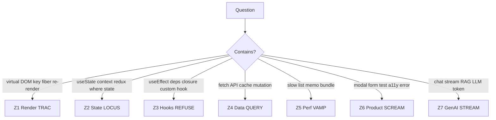

# Structured React Preparation & Memory Mapping

**Goal:** Walk into any React interview with a **mental filing system** — not memorized trivia, but recallable patterns you can explain in 30 seconds and implement in 30 minutes.

**For:** 3–5 YOE full-stack → Senior SWE (Gen AI / LLM roles included)

---

## The Confidence Formula

```
Confidence = Mental model (why) + Decision picker (what) + Spoken script (how) + One code pattern (show)
```

You do **not** need to memorize 80 answers. You need **7 memory zones** + **1 answer flow** + **daily 15-min drills**.

---

## Part 1 — The 7 Memory Zones (Your Brain Filing Cabinet)

Map every interview question to **one zone**. When you hear a question, say silently: *"This is Zone 3 — hooks/effects."*

| Zone | Name | Mnemonic | One-line anchor |
|------|------|----------|-----------------|
| **Z1** | **Render** | **TRAC** | Trigger → Render → reconcile → Commit |
| **Z2** | **State** | **LOCUS** | Local → lift → Context → URL → Server(store) |
| **Z3** | **Hooks** | **REFUSE** | Rules, Effects, Ref, useState, useReducer, Stable memo |
| **Z4** | **Data** | **QUERY** | Query cache, not useEffect fetch |
| **Z5** | **Perf** | **VAMP** | Virtualize, Avoid inline props, Memo after profile, lazy Split |
| **Z6** | **Product** | **SCREAM** | State, Composition, Render pure, Errors, A11y, Measure |
| **Z7** | **GenAI** | **STREAM** | Signal, Token append, Render safe, Error abort, A11y, Messages |

Print the full maps:
- Zones Z1–Z6 → [memory-map-master.md](memory-map-master.md)
- Zone Z7 → [memory-map-genai-react.md](../02-genai-llm-react/memory-map-genai-react.md)

---

## Part 2 — Question → Zone Router (Instant Recall)

When the interviewer asks… **route first**, then answer.



| Interview phrase | Zone | First sentence of your answer |
|------------------|------|-------------------------------|
| "Explain Virtual DOM" | Z1 | "React reconciles trees — it doesn't replace the whole DOM." |
| "Where would you put this state?" | Z2 | "I'd colocate first, then lift, Query for server data." |
| "useEffect running twice" | Z3 | "Strict Mode double-mount in dev — fix cleanup with abort." |
| "Fetch data on page load" | Z4 | "TanStack Query with queryKey — not raw useEffect." |
| "List is slow with 10k rows" | Z5 | "Profile first, then virtualize — TanStack Virtual." |
| "Design a modal / form" | Z6 | "Portal, focus trap, RHF+Zod, prevent double submit." |
| "Build ChatGPT UI" | Z7 | "Message array + fetch stream + AbortController + sanitize markdown." |

Full trigger list → [memory-map-flashcards.md](memory-map-flashcards.md)

---

## Part 3 — The Universal Answer Flow (MEMOP)

Use **MEMOP** for every question — concept or live coding:

| Step | Letter | Time | What you say/do |
|------|--------|------|-----------------|
| 1 | **M** — Mental model | 30s | How React works at a high level for this topic |
| 2 | **E** — Options | 30s | "There are three approaches: A, B, C…" |
| 3 | **M** — My pick | 30s | "For this scope I'd pick B because…" |
| 4 | **O** — Outline | 2–5m | Component tree / state shape / hook names |
| 5 | **P** — Pitfalls | 1m | Edge cases: loading, error, a11y, abort, keys |

**Example (useEffect stale closure):**
- **M:** "Effects close over values from the render they were created in."
- **E:** "Fix with deps, functional setState, or ref for latest value."
- **M:** "Exhaustive deps + AbortController cleanup."
- **O:** "Show interval example with cleanup."
- **P:** "Strict Mode, unmount setState, race on fast navigation."

Details → [01-react-round-flow.md](../00-interview-framework/01-react-round-flow.md)

---

## Part 4 — Layered Memory Maps (Learn in Order)

Build confidence in **4 layers**. Do not skip Layer 1.

### Layer 1 — Pipeline (Day 1–3) — *"How React thinks"*

Memorize **TRAC**:

```
T  Trigger     — setState / parent re-render / context change
R  Render      — pure function → React elements
A  reconcile   — diff fiber tree (keys matter!)
C  Commit      — DOM update → layoutEffect → paint → useEffect
```

**Confidence check:** Whiteboard TRAC in 60 seconds without notes.

---

### Layer 2 — Decisions (Day 4–7) — *"What to use when"*

Memorize **LOCUS** for state:

| Letter | Meaning | Tool |
|--------|---------|------|
| **L** | Local UI | `useState` / `useReducer` |
| **O** | Only lift if siblings need it | props |
| **C** | Context for low-churn global | theme, locale |
| **U** | URL for shareable navigation state | searchParams |
| **S** | Server state in cache | TanStack Query |

Memorize **QUERY** for data — never `useEffect(() => fetch())` as default in senior interviews.

Full tables → [04-decision-picker.md](../00-interview-framework/04-decision-picker.md)

**Confidence check:** Given "shopping cart + product list from API" — label each piece of state with LOCUS in 90 seconds.

---

### Layer 3 — Senior signals (Week 2) — *"What they expect at Senior"*

Memorize **SCREAM**:

- **S** — State colocated
- **C** — Composition (children, compound components)
- **R** — Render pure; effects for external sync only
- **E** — Error boundaries + query error UI
- **A** — Accessibility unprompted
- **M** — Measure (Profiler) before memo

**Confidence check:** Take any past project — explain it using SCREAM in 2 minutes.

---

### Layer 4 — GenAI UI (Week 3–4) — *"Full-stack differentiator"*

Memorize **STREAM** + message state shape:

```
status: sending | streaming | complete | error | aborted
```

**Confidence check:** Explain ChatGPT UI architecture (components + state + stream + stop) in 3 minutes.

---

## Part 5 — 4-Week Confidence Schedule (Structured)

### Week A — Foundation (Layers 1–2)

| Day | 20 min read | 15 min drill | 25 min speak |
|-----|-------------|--------------|--------------|
| Mon | [rendering-reconciliation.md](rendering-reconciliation.md) | Draw TRAC 3× | Q01 Virtual DOM script |
| Tue | [state-management.md](state-management.md) | LOCUS on 3 apps | Q06 useState vs reducer |
| Wed | [hooks-deep-dive.md](hooks-deep-dive.md) | REFUSE checklist | Q10 useEffect deps |
| Thu | [data-fetching-caching.md](data-fetching-caching.md) | Query vs useEffect | Q21 TanStack Query |
| Fri | [04-decision-picker.md](../00-interview-framework/04-decision-picker.md) | Random "what would you use?" | Q03 re-renders |
| Sat | [memory-map-master.md](memory-map-master.md) | Fill blank map from memory | Q02 keys + Q14 memo |
| Sun | **Mock 45 min** | — | One concept + one live code |

### Week B — Depth (Layer 3)

| Day | Focus | Questions (speak aloud) |
|-----|-------|-------------------------|
| Mon | Performance VAMP | Q14, Q20, Q43 |
| Tue | Patterns + errors | Q15, Q16, Q17 |
| Wed | Forms + auth | Q25, Q26, Q35 |
| Thu | Testing + TS | Q29, Q30, Q31 |
| Fri | Next/RSC | Q28, Q27 |
| Sat | Weak zones redo | Your lowest-confidence 5 |
| Sun | **Mock 60 min** | Q60 system design OR modal build |

### Week C — GenAI (Layer 4)

| Day | Focus | Questions |
|-----|-------|-----------|
| Mon–Wed | [GenAI framework](../02-genai-llm-react/00-genai-react-framework.md) + stream doc | Q01–Q07 |
| Thu–Fri | RAG + a11y | Q04, Q05, Q20 |
| Sat | All GenAI map from memory | Q08–Q19 |
| Sun | **Mock 60 min** | [Q01 streaming chat](../02-genai-llm-react/questions/Q01-build-streaming-chat-ui.md) live |

### Week D — Interview mode

| Day | Activity |
|-----|----------|
| Mon–Wed | [Company index](../04-company-question-index.md) — 5 Q/day for target company |
| Thu | Full loop: Z1 concept + Z7 build + tradeoffs |
| Fri | Flashcards closed-book 30 min |
| Sat | Light review maps only |
| Sun | Rest |

Full calendar → [6-week-plan.md](../05-study-schedule/6-week-plan.md)

---

## Part 6 — Daily 15-Minute Memory Drill (Non-Negotiable)

Do this **every study day** — builds interview reflexes.

### Drill A — Zone router (5 min)

Partner or flashcards: read question trigger → you say **zone + first sentence** only.

Example: *"Context re-renders whole app"* → **"Z2 — split context, memo value, or Zustand for high churn."**

### Drill B — Blank map (5 min)

On blank paper, redraw from memory:
1. TRAC pipeline
2. LOCUS state row
3. One hook rule (effects after paint)

Compare to [memory-map-master.md](memory-map-master.md). Mark gaps → tomorrow's read.

### Drill C — MEMOP one question (5 min)

Pick one question file. Close it. Speak full MEMOP answer in 3 minutes. Open file. Fix gaps.

---

## Part 7 — Confidence Checklist (Before Real Interview)

- [ ] I can draw **TRAC** in 60s
- [ ] I can assign **LOCUS** to any state in a product I describe
- [ ] I say **2 options** before my pick on every architecture question
- [ ] I mention **loading + error + a11y** without being asked
- [ ] I can sketch **streaming chat** (messages + abort + sanitize) in 5 min
- [ ] I know **3 questions** from [company index](../04-company-question-index.md) for my target company
- [ ] I did **2 timed mocks** this week (concept + code)

---

## Part 8 — When You Blank (Recovery Scripts)

| Situation | Say this |
|-----------|----------|
| Forgot API detail | "I'd reach for docs — the pattern is X; the exact API is Y-shaped." |
| Don't know library | "Conceptually I'd use a cache layer like TanStack Query; I've used similar with SWR." |
| Stuck on code | "Let me start with types and component shell, then wire state." |
| Wrong turn | "Actually — tradeoff: my first approach breaks when Z; I'd switch to…" *(recovering gracefully is senior)* |

---

## Quick Links — Your Prep Stack

| Resource | Purpose |
|----------|---------|
| [memory-map-master.md](memory-map-master.md) | Print — Zones Z1–Z6 |
| [memory-map-flashcards.md](memory-map-flashcards.md) | Trigger → one-line answer |
| [memory-map-visual-one-page.md](memory-map-visual-one-page.md) | Single-page poster |
| [04-decision-picker.md](../00-interview-framework/04-decision-picker.md) | What hook/pattern when |
| [03-senior-swe-signals.md](../00-interview-framework/03-senior-swe-signals.md) | What interviewers score |
| [80 questions](../03-classic-react/questions/) | Speak scripts |

---

## One Paragraph to Internalize Tonight

> React schedules updates when state, props, or context change. Components render pure elements; reconciliation diffs the tree — **keys identify list items**. I colocate state (**LOCUS**), put API data in **TanStack Query**, use effects only for external sync with cleanup. Before memoizing I profile. For AI products I stream with **fetch + AbortController**, sanitize markdown, and use **aria-live**. I always name options, pick one, and state tradeoffs.

That paragraph alone covers 70% of senior React interviews.
