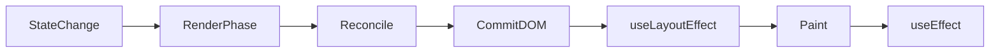

# Rendering & Reconciliation

How React turns state into pixels — the #1 senior interview foundation.

---

## Mental Model

1. **Trigger:** setState, parent re-render, context change
2. **Render phase:** Call components → produce React elements (pure)
3. **Reconciliation:** Diff fiber tree → mark DOM changes
4. **Commit phase:** Apply DOM updates, run layout effects, paint
5. **Effects:** useLayoutEffect → browser paint → useEffect

---

## Reconciliation Rules

| Scenario | React behavior |
|----------|----------------|
| Same component type, same position | Update props in place |
| Different component type | Unmount old, mount new (state lost) |
| List without stable keys | Reuse wrong DOM nodes → bugs |
| Conditional `{show && <A/>}` vs `{show ? <A/> : null}` | Similar; key matters if switching types |

---

## Keys — Interview Gold

> "Keys tell React which item in a list corresponds to which fiber. Use **stable unique IDs** from data. Index keys break when you sort, filter, or insert — focus and local state jump to wrong rows."

---

## Concurrent Features (React 18+)

| API | Use |
|-----|-----|
| `startTransition` | Mark updates non-urgent (typing stays smooth while heavy filter runs) |
| `useDeferredValue` | Defer displaying stale value until expensive render completes |
| `Suspense` | Wait for lazy component or data (with compatible data source) |

---

## Strict Mode (Dev)

Double-invokes render/effects to surface side effects. Mention you write **idempotent effects** with proper cleanup.

---

## Interview Script

> "When state updates, React schedules a re-render. Components return elements; React diffs against the previous tree using fiber. Keys identify list items. The commit phase mutates the DOM. Effects run after paint unless I need layout measurements — then useLayoutEffect. I avoid unnecessary re-renders by colocating state and memoizing only when Profiler shows cost."

---

## Related Questions

- [Q01 Virtual DOM vs Real DOM](../03-classic-react/questions/Q01-virtual-dom-reconciliation.md)
- [Q02 Why keys matter](../03-classic-react/questions/Q02-react-keys-lists.md)
- [Q03 Re-render triggers](../03-classic-react/questions/Q03-rerender-triggers.md)
