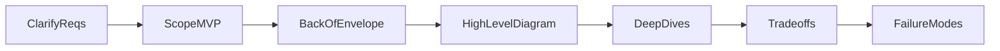

# HLD Round Flow — 45–60 Minute Timeline

Senior HLD interviews follow a predictable rhythm. Owning the structure signals seniority.

---

## The 7-Step Flow

```
1. Clarify (5–8 min) → 2. Scope MVP (2–3 min) → 3. Estimates (5 min)
→ 4. HLD Diagram (10–12 min) → 5. Deep Dives (15–20 min)
→ 6. Tradeoffs (5 min) → 7. Failure Modes (3–5 min)
```



---

## Step 1: Clarify Requirements (5–8 min)

**What to ask:**

| Category | Example questions |
|----------|-------------------|
| Users | Who uses this? B2B vs B2C? Mobile vs web? |
| Scale | DAU? Read/write ratio? Geographic distribution? |
| Latency | p50/p99 targets? Real-time vs batch OK? |
| Consistency | Strong consistency required or eventual OK? |
| Durability | Data loss tolerance? Backup/DR requirements? |
| Scope | MVP features vs nice-to-have? |

**Senior move:** Summarize back to interviewer:
> "So we're building X for Y users at Z scale, with p99 latency under N ms, and eventual consistency is acceptable for reads. Is that right?"

**Do NOT** start drawing until scope is aligned.

---

## Step 2: Scope MVP (2–3 min)

Explicitly bound the design:

> "For this round I'll design the core read/write path and data model. I'll mention search ranking and admin tooling as extensions but won't deep-dive unless you want to."

This prevents scope creep and shows prioritization.

---

## Step 3: Back-of-Envelope Estimates (5 min)

Always show math on the whiteboard:

```
DAU = 10M
Queries per user per day = 20
Total QPS = (10M × 20) / 86400 ≈ 2,300 avg
Peak (3×) ≈ 7,000 QPS

Storage: 10M users × 1KB profile = 10 GB
Growth 5 years × 3 = 30 GB → single DB OK initially
```

**Key formulas:**

| Metric | Formula |
|--------|---------|
| QPS | (requests per day) / 86,400 |
| Peak QPS | Average × 2–5 (use 3× default) |
| Storage | records × size per record × replication factor |
| Bandwidth | QPS × average payload size |

**Senior move:** Call out the bottleneck:
> "At 7K write QPS, a single Postgres primary becomes the bottleneck — I'll shard by user_id in deep dive."

---

## Step 4: High-Level Diagram (10–12 min)

Draw top-down in layers:

1. **Clients** (web, mobile, API consumers)
2. **Edge** (CDN, DNS, WAF)
3. **Load balancer** → **API Gateway**
4. **Services** (stateless, horizontally scalable)
5. **Data layer** (cache, primary DB, read replicas, object storage)
6. **Async layer** (queue, workers) — if needed

**Rules:**
- Number arrows 1, 2, 3 for narration
- Separate read path and write path if they differ
- Label protocols (HTTP, gRPC, WebSocket)

See [02-how-to-draw-diagrams.md](02-how-to-draw-diagrams.md) for full rules.

---

## Step 5: Deep Dives (15–20 min)

Interviewer picks 2–3 areas. Prepare these for any system:

1. **Data model / schema** — tables, keys, indexes
2. **Hot path optimization** — caching, denormalization
3. **Scaling strategy** — sharding key, replication
4. **Consistency** — how you handle conflicts
5. **API design** — key endpoints, idempotency

**Senior move:** When diving, restate the problem:
> "For the feed read path, the challenge is fan-out on write vs fan-out on read. Given our 1:100 write:read ratio, I'll use fan-out on write."

---

## Step 6: Tradeoffs (5 min)

Use explicit comparison language:

| Pattern | Pros | Cons | When |
|---------|------|------|------|
| SQL | ACID, joins | Harder to scale writes | < 10K write QPS |
| NoSQL | Scale, flexibility | Weaker consistency | High write volume |
| Push (fan-out on write) | Fast reads | Expensive writes | Read-heavy |
| Pull (fan-out on read) | Cheap writes | Slow reads for celebrities | Write-heavy |

> "I chose Redis cache-aside over write-through because our read pattern is bursty and stale data up to 60s is acceptable."

---

## Step 7: Failure Modes (3–5 min)

Always cover proactively:

- **Single points of failure** — DB primary, queue broker
- **Degradation** — serve stale cache if DB down
- **Idempotency** — duplicate requests on retry
- **Circuit breakers** — stop calling failing downstream
- **Disaster recovery** — multi-AZ, backups, RTO/RPO

> "If the recommendation service is down, we fall back to chronological feed — graceful degradation, not hard failure."

---

## Time Management Tips

| If running long | If running short |
|-----------------|------------------|
| Skip nice-to-have extensions | Add failure modes |
| Offer "I can go deeper on X or Y" | Do second diagram (write path) |
| Don't over-detail schema early | Proactively discuss cost |

---

## Gen AI Round Variations

Same 7 steps, but estimates include:

- **Tokens/sec** instead of just QPS
- **Embedding QPS** for ingestion
- **GPU memory** for model serving
- **Context window** limits

Add layers: Ingestion → Retrieval → LLM Gateway → Post-process.

See [02-genai-llm-hld/00-genai-hld-framework.md](../02-genai-llm-hld/00-genai-hld-framework.md).

---

## Red Flags (Avoid These)

- Drawing before clarifying
- No numbers / estimates
- Single diagram with no deep dive
- Only happy path — no failures
- Buzzwords without tradeoffs ("we'll use Kafka" — why?)
- Ignoring cost, security, observability

---

## Green Flags (Senior Signals)

- Structured thinking, clear narration
- Quantified decisions
- Explicit MVP vs extensions
- Proactive tradeoffs and failure modes
- Asks interviewer what they want to deep-dive
