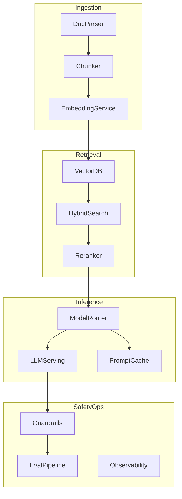

# Gen AI HLD Framework

Master framework for designing LLM-powered systems in HLD interviews.

---

## The Four Layers

```
1. INGESTION    — Get data in, parse, chunk, embed
2. RETRIEVAL    — Find relevant context (RAG, hybrid search)
3. INFERENCE    — LLM serving, routing, streaming
4. SAFETY & OPS — Guardrails, eval, cost, observability
```



---

## Interview Flow for Gen AI Questions

Same 7-step flow as classic HLD, plus:

| Step | Gen AI additions |
|------|------------------|
| Clarify | Doc types, grounding required?, multi-tenant?, model constraints |
| Estimate | Tokens/sec, embedding QPS, vector storage, GPU count |
| Diagram | Separate ingestion + query paths |
| Deep dive | Chunking, retrieval, hallucination, streaming |
| Tradeoffs | API vs self-host, RAG vs fine-tune, model size |
| Failures | LLM timeout, empty retrieval, prompt injection |

---

## Architecture Patterns

| Pattern | When | Components |
|---------|------|------------|
| **Simple chat** | No private data | API → LLM Gateway → stream |
| **RAG** | Enterprise docs, citations | Ingestion + vector DB + retriever |
| **Agent** | Multi-step tasks, tools | Orchestrator + tool registry + loop |
| **Fine-tune** | Domain style/format | Training pipeline + model registry |
| **Hybrid** | Best production systems | RAG + fine-tuned model + agents |

---

## Key Non-Functional Requirements

| NFR | Typical target |
|-----|----------------|
| Time to first token | < 500ms |
| Full response | < 10s for long answers |
| Retrieval latency | < 100ms p99 |
| Availability | 99.9% |
| Hallucination rate | < 2% on grounded answers |
| Cost per query | Track and optimize |

---

## Build vs Buy Decision

| Component | Buy (API) | Build (self-host) |
|-----------|-----------|-------------------|
| LLM | MVP, < 50M tokens/mo | > 50M tokens, data residency |
| Embeddings | Fast start | High volume, privacy |
| Vector DB | Pinecone managed | pgvector on existing Postgres |

---

## Related Deep Dives

- [RAG Pipeline](01-rag-pipeline-deep-dive.md)
- [LLM Inference](02-llm-inference-serving.md)
- [Agents](03-agents-tool-calling.md)
- [Eval & Safety](04-evaluation-safety-cost.md)
- [Memory Map](memory-map-genai.md)
- [40 Question Scripts](questions/)
