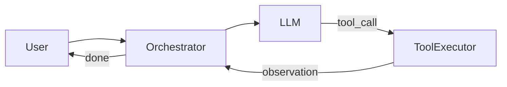

# Agents & Tool Calling

Design systems where LLMs plan, call tools, and iterate toward a goal.

---

## Agent Loop

```
1. Receive user goal
2. LLM plans next step (reasoning)
3. LLM emits tool call (structured JSON)
4. Execute tool in sandbox
5. Append observation to context
6. Repeat until done or max_steps (e.g., 10)
7. Return final answer
```



---

## Tool Registry

| Tool type | Examples | Safety |
|-----------|----------|--------|
| Search | Web, internal KB | Rate limit, allowlist domains |
| Database | SQL read-only | Query timeout, row limits |
| API | REST calls | OAuth, scoped permissions |
| Code exec | Python sandbox | No network, timeout, memory cap |
| File ops | Read/write workspace | Path allowlist |

**Schema:** OpenAPI-style function definitions passed to LLM (OpenAI function calling format).

---

## Multi-Agent Patterns

| Pattern | Description |
|---------|-------------|
| Supervisor | One agent delegates to specialists |
| Sequential | Pipeline: research → write → review |
| Parallel | Multiple agents, merge results |
| Debate | Agents critique each other |

---

## State Management

- **Conversation state:** Redis or DB per session
- **Agent state:** Current plan, tool results, step count
- **Checkpointing:** Resume long workflows after failure

---

## Orchestration Frameworks

| Framework | Role in interview |
|-----------|-------------------|
| LangChain | Prototype; mention you'd build custom at scale |
| Temporal / Airflow | Durable workflow execution |
| Custom orchestrator | Production control, observability |

**Senior take:** Frameworks for dev speed; custom gateway for prod scale and security.

---

## Failure Modes

| Failure | Mitigation |
|---------|------------|
| Infinite loop | max_steps, duplicate action detection |
| Tool timeout | Per-tool timeout, circuit breaker |
| Bad tool args | JSON schema validation before exec |
| Prompt injection via tool output | Sanitize observations |
| Cost explosion | Token budget per session |

---

## Browser / Computer Use Agents

- Sandboxed browser (Playwright in container)
- Allowlist URLs, no credential access
- Human-in-the-loop for sensitive actions
- Screenshot + DOM extraction as observations

---

## Interview Phrases

> "Max 10 agent steps; kill on repeated identical tool calls."
> "Tools run in sandboxed containers with 30s timeout, no outbound network for code exec."
> "Supervisor agent routes to research vs writer sub-agents."
