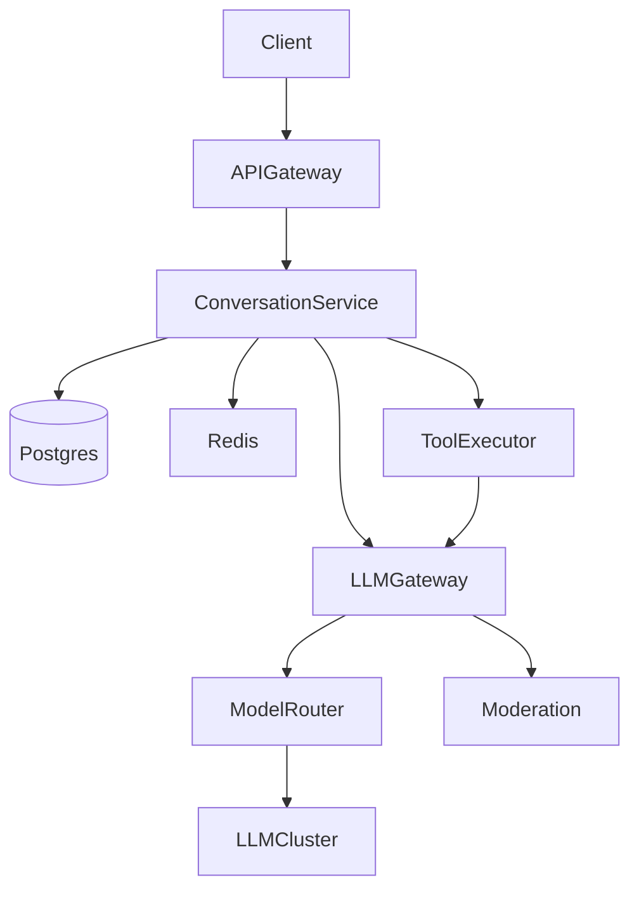

# Design ChatGPT-like Conversational AI

**Track:** Gen AI / LLM  
**Companies:** OpenAI, Microsoft, Google, Anthropic  
**Difficulty:** Hard  

---

## Problem Statement

Design a conversational AI platform like ChatGPT: multi-turn chat, streaming responses, conversation history, plugins/tools, and multi-model support at global scale.

---

## Clarifying Questions

| # | Question | Expected answer |
|---|----------|-----------------|
| 1 | Consumer or enterprise? | Consumer MVP; mention B2B tenant isolation as extension |
| 2 | DAU and messages/day? | 100M DAU, 500M messages/day |
| 3 | Streaming required? | Yes — SSE token stream, TTFT < 500ms |
| 4 | Conversation history? | Yes — persist per user, load last N turns |
| 5 | Plugins / tools? | Yes — web browse, code exec, image gen as tools |
| 6 | Multi-model? | GPT-4 class + smaller fast model for routing |
| 7 | Moderation? | Input/output content filters |
| 8 | Data retention? | User can delete history; no train on user data (enterprise) |
| 9 | File upload? | Images/docs in chat — triggers RAG sub-path |
| 10 | Auth? | OAuth + optional API keys for developers |

---

## Functional Requirements

- Multi-turn chat with context window management
- Streaming token delivery (SSE)
- Conversation CRUD (list, rename, delete)
- Model selection (user or auto-route)
- Tool/plugin execution loop
- File upload → parse → inject into context
- Rate limits per tier (free vs paid)

## Non-Functional Requirements

- 99.9% availability
- TTFT p99 < 500ms; full response < 30s for long answers
- Global deployment (US, EU regions for data residency)
- Audit log for abuse investigation

---

## Capacity Estimation

```
DAU = 100M
Messages/user/day = 5 → 500M messages/day
QPS = 500M / 86400 ≈ 5,800 avg → ~17,000 peak

Avg tokens: 1.5K input + 400 output per message
Daily tokens = 500M × 1.9K ≈ 950B tokens/day

Conversation storage: 100M users × 20 convos × 50KB ≈ 100 TB (with compression less)

GPU: If self-host 70B equiv — thousands of GPUs; realistic answer: managed API + regional gateways
```

**Bottleneck:** LLM inference throughput and conversation DB read latency for history assembly.

---

## HLD Diagram

```
┌────────┐     ┌─────────────┐     ┌──────────────────┐     ┌─────────────┐
│ Client │────▶│ API Gateway │────▶│ Conversation Svc │────▶│ LLM Gateway │
└────────┘     └─────────────┘     └────────┬─────────┘     └──────┬──────┘
                                            │                       │
                                     ┌──────▼──────┐         ┌──────▼──────┐
                                     │ Redis cache │         │Model Router │
                                     │ + Postgres  │         │ GPT-4 / mini│
                                     └─────────────┘         └──────┬──────┘
                                                                    │
                              ┌─────────────────────────────────────┤
                              ▼                                     ▼
                       ┌─────────────┐                      ┌─────────────┐
                       │ Tool Executor│◀── agent loop ────│  Moderation │
                       └─────────────┘                      └─────────────┘
```



---

## Component Choices

| Component | Choice | Why |
|-----------|--------|-----|
| Conversation store | Postgres + Redis hot cache | ACID for billing; cache recent convos |
| LLM | API initially; regional gateway | Ops complexity of self-host at 100M DAU |
| Streaming | SSE from API gateway | Simpler than WebSocket for one-way tokens |
| Tool sandbox | Firecracker/gVisor containers | Isolate code exec |
| Moderation | Classifier + blocklist | Before and after LLM |
| File parsing | Unstructured + S3 | Upload → extract text for context |

---

## Deep Dive Topics

### 1. Context window management
Load last K turns; summarize older turns into rolling summary stored in DB. Budget: system (2K) + tools (1K) + history (8K) + user message (4K).

### 2. Agent loop for tools
LLM returns `tool_call` JSON → validate schema → execute with timeout → append observation → re-call LLM until `finish` or max 5 steps.

### 3. Model routing
Intent classifier: chitchat/FAQ → small model; reasoning/code → large model. Saves ~60% cost.

### 4. Streaming architecture
LLM gateway opens stream to provider; API gateway proxies SSE to client; heartbeat every 15s to keep connection alive.

---

## Tradeoffs

| Decision | A | B | Pick |
|----------|---|---|------|
| History store | Postgres | DynamoDB | Postgres + read replicas; shard by user_id |
| Transport | SSE | WebSocket | SSE for token stream; WS if bidirectional plugins |
| Tool execution | Sync in request | Async job | Sync for <10s tools; async + notify for long jobs |

---

## Failure Modes

| Failure | Behavior |
|---------|----------|
| LLM timeout | Partial response saved; offer retry |
| Moderation hit | Block response; generic message |
| Tool sandbox escape | Prevented by gVisor; kill on timeout |
| DB slow | Serve from Redis cache; degrade history to last 3 turns |

---

## Interview Answer Script (18 min)

> "I'll design a ChatGPT-like system for 100M DAU and 500M messages per day. Let me confirm: streaming responses, conversation history, optional tools, and multi-model routing — all yes?"

> "On math: 5,800 QPS average, 17K peak. About 950 billion tokens daily if we average 1.9K tokens per message — so inference cost dominates. Architecture must include model routing and caching."

> "High level: clients hit a global API gateway for auth, rate limits, and SSE streaming. Conversation service loads user history from Postgres, cached in Redis for active sessions. It assembles the prompt within token budget — summarizing old turns if needed — and calls an internal LLM gateway."

> "The LLM gateway handles model routing, provider failover, token accounting, and streams tokens back. A moderation service filters input before the LLM and output before the user. For tools, we run an agent loop: the model requests a tool, we validate JSON schema, execute in a sandboxed container with a 30-second timeout, feed the result back, and repeat up to five steps."

> "For storage, conversations are sharded Postgres by user_id. Hot conversations live in Redis. File uploads go to S3, parsed to text, and injected as a system context block — not mixed raw into user messages to reduce prompt injection risk."

> "Tradeoffs: SSE over WebSocket for simplicity on token streaming. Start on managed LLM APIs with a gateway abstraction so we can move hot paths to self-hosted vLLM when unit economics justify thousands of GPUs."

> "Failures: circuit breaker on LLM provider; if down, queue message and notify user. Moderation blocks are logged. Tool failures return structured errors to the model so it can apologize and retry differently."

> "Extensions I'd mention but not deep-dive: voice mode (ASR/TTS), shared conversations, and enterprise SSO with zero data retention."

---

## Follow-Up Questions

1. How do you prevent prompt injection via uploaded PDFs?
2. Design the billing meter for tokens per subscription tier.
3. How would you A/B test a new model on 5% of traffic?
4. Compare WebSocket vs SSE for this use case.
5. How do you handle a viral spike 10× normal traffic?

---

## Related

- [Gen AI Framework](../00-genai-hld-framework.md)
- [LLM Inference](../02-llm-inference-serving.md)
- [Agents](../03-agents-tool-calling.md)
