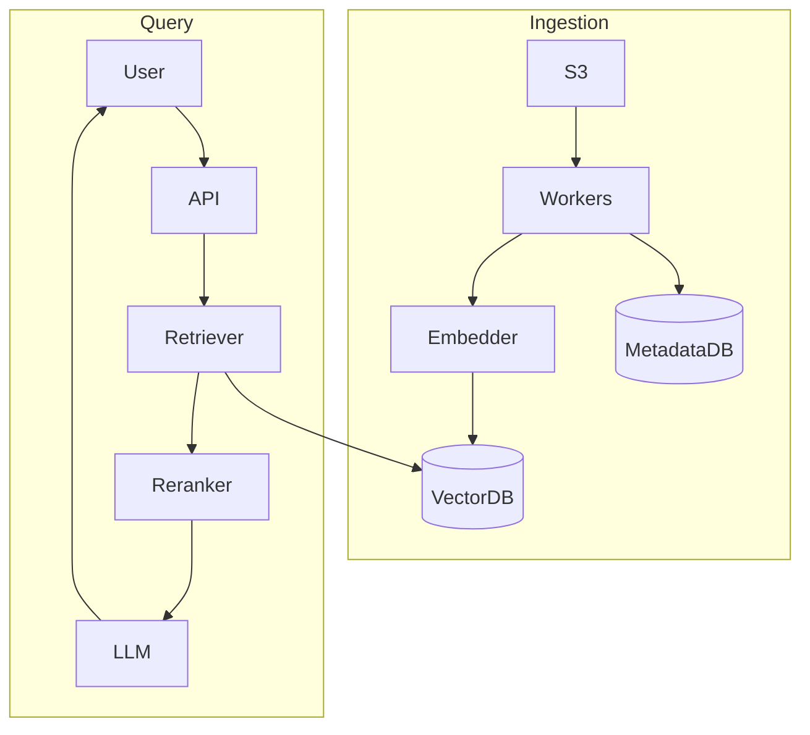

# Design Enterprise RAG Document Q&A

**Track:** Gen AI / LLM  
**Companies:** Anthropic, Databricks, Notion, Harvey, Glean  
**Difficulty:** Hard  

---

## Problem Statement

Design an enterprise document Q&A system: employees upload PDFs, Word docs, wikis; ask natural language questions; receive grounded answers with citations. Multi-tenant B2B SaaS.

---

## Clarifying Questions

| # | Question | Expected answer |
|---|----------|-----------------|
| 1 | Document types? | PDF, DOCX, HTML, Markdown, Slack export |
| 2 | Tenants? | 10K enterprises, strict isolation |
| 3 | Citations required? | Yes — page/section references |
| 4 | Update frequency? | Daily sync from Confluence/Drive + manual upload |
| 5 | Max doc size? | 500 pages; 10M docs total across platform |
| 6 | ACL? | User only sees docs they have permission to |
| 7 | Latency? | p99 < 8s end-to-end |
| 8 | Hallucination tolerance? | Near zero — must cite or refuse |
| 9 | Languages? | English MVP; multilingual extension |
| 10 | Compliance? | SOC2, GDPR delete, optional HIPAA |

---

## Functional Requirements

- Document upload and connector sync (Drive, Confluence, S3)
- Async ingestion pipeline with status UI
- Natural language Q&A with citations
- Per-tenant admin and usage analytics
- Document delete → purge vectors within 24h

## Non-Functional Requirements

- 99.9% availability
- Tenant data isolation (logical + encryption)
- Audit log: who queried what, which chunks retrieved
- Ingestion lag < 15 min for updates

---

## Capacity Estimation

```
10K tenants × 1K docs avg = 10M documents
10 pages/doc avg × 10 chunks/page = 100M chunks

Vector storage: 100M × 1536 dims × 4 bytes ≈ 600 GB
Metadata Postgres: ~200 GB
Queries: 50M/day → 580 QPS avg, ~1,750 peak

Embedding on ingest: batch 100 chunks/call → ~1M API calls on full reindex
```

---

## HLD Diagram

**Ingestion:**
```
Connector/Webhook → S3 → SQS → Parser Worker → Chunker → Embed Batch API → VectorDB
                              ↓
                         Metadata DB (doc_id, tenant_id, ACL, version)
```

**Query:**
```
User → API GW → AuthZ (doc ACL filter) → Query Embed → Hybrid Search → Reranker
    → Prompt Builder → LLM Gateway → Citation Validator → Response
```



---

## Component Choices

| Component | Choice | Alternative |
|-----------|--------|-------------|
| Vector DB | Pinecone (managed) | pgvector if < 30M vectors per tenant |
| Hybrid search | Elasticsearch + vector | Weaviate native hybrid |
| Parser | Unstructured.io | Custom per format |
| Chunking | 512 tokens, 10% overlap | Semantic chunking for contracts |
| Reranker | Cohere rerank-3 | cross-encoder self-host |
| LLM | GPT-4 class with strict system prompt | Claude for long context |

---

## Deep Dive Topics

### 1. ACL enforcement
Every chunk stores `tenant_id`, `doc_id`, `allowed_groups[]`. Query adds metadata filter BEFORE vector search — never post-filter only.

### 2. Chunking for citations
Store `page_number`, `section_heading`, `char_offset` in metadata. Prompt: "Answer only from context; cite as [doc_name, p.X]."

### 3. Hybrid retrieval
BM25 catches SKUs and legal clause numbers; vectors catch paraphrases. Reciprocal Rank Fusion merges lists.

### 4. Freshness
On doc update: increment `version`, delete old chunk IDs async, re-ingest. Query excludes `version < current`.

### 5. Hallucination guard
Post-LLM: extract citation markers; verify each claim sentence has supporting chunk via NLI model; else regenerate or refuse.

---

## Tradeoffs

| Decision | A | B | Pick |
|----------|---|---|------|
| Vector store | pgvector | Pinecone | Pinecone at 100M vectors |
| Chunk size | 256 | 512 | 512 with overlap for contracts |
| Answer style | Free text | Structured JSON | JSON with `answer` + `citations[]` for validation |

---

## Failure Modes

| Failure | Mitigation |
|---------|------------|
| No chunks above score threshold | Return "No relevant documents found" |
| LLM invents citation | Citation validator strips or regenerates |
| Ingestion backlog | Scale workers; priority queue for premium tenants |
| Cross-tenant leak | Filter in DB query; security test in CI |

---

## Interview Answer Script (20 min)

> "I'm designing enterprise RAG for 10K tenants and 10M documents, 50M queries daily, with mandatory citations and strict tenant isolation."

> "Ingestion is async: documents land in S3 from upload or connectors. Workers parse, chunk at 512 tokens with 10% overlap, batch-embed, and upsert to Pinecone with metadata — tenant_id, doc_id, ACL groups, page number, version. A Postgres metadata DB tracks document state and permissions."

> "On query, we authenticate, embed the question, and run hybrid search — BM25 in Elasticsearch plus vector search in Pinecone, merged with reciprocal rank fusion. Critically, ACL filters apply in the retrieval query, not after — so we never retrieve unauthorized chunks."

> "Top 20 chunks go to a reranker; we keep top 5. The prompt instructs answer-only-from-context with citations like [Policy Handbook, p.12]. LLM generates; then a citation validator checks that claims map to retrieved text using an NLI model. If faithfulness fails, we regenerate once or return a safe refusal."

> "For updates, CDC from connectors triggers re-ingestion; we version chunks and delete stale vectors. GDPR delete purges all vectors for a tenant within 24 hours."

> "Cost: batch embeddings on ingest; semantic cache for repeated enterprise FAQs. Model routing sends simple definitional questions to a smaller model."

> "This design prioritizes correctness over creativity — enterprise users prefer 'I don't know' over a confident wrong answer."

---

## Follow-Up Questions

1. How do you chunk tables in PDFs?
2. Design connector sync for Confluence with webhooks.
3. Compare RAG vs fine-tuning for this use case.
4. How to evaluate retrieval recall@5 offline?
5. Multi-lingual documents in one tenant?

---

## Related

- [RAG Deep Dive](../01-rag-pipeline-deep-dive.md)
- [Evaluation & Safety](../04-evaluation-safety-cost.md)
