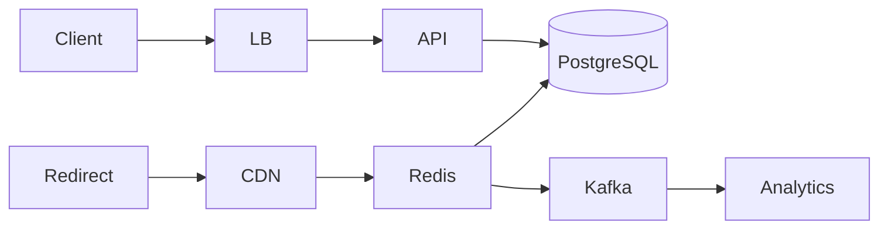

# Design URL Shortener

**Track:** Classic HLD  
**Companies:** Google, Amazon, Meta, Bitly  
**Difficulty:** Medium  

---

## Problem Statement

Design a URL shortening service like bit.ly: long URLs → short codes, redirect on click, optional analytics.

---

## Clarifying Questions

| # | Question | Expected answer |
|---|----------|-----------------|
| 1 | Short URL length? | 7 characters, base62 |
| 2 | Read/write ratio? | 100:1 |
| 3 | New URLs/day? | 100M creates, 10B redirects |
| 4 | Custom aliases? | Optional premium feature |
| 5 | Expiration? | Optional TTL; default none |
| 6 | Analytics? | Click count, referrer, geo — async |
| 7 | Abuse? | Malware scan, blocklist |
| 8 | Collision? | Must be unique globally |

---

## Capacity Estimation

```
Creates: 100M/day → 1,160 write QPS peak ~3.5K
Redirects: 10B/day → 116K QPS avg → ~350K peak

Storage 10 years: 100M/day × 3650 × 500 bytes ≈ 180 TB
7-char base62 = 62^7 ≈ 3.5 trillion codes — plenty
```

**Bottleneck:** Read path at 350K QPS — cache is mandatory.

---

## HLD Diagram

```
CREATE: Client → API → Idempotency check → Counter/Hash → Write DB → return short URL

REDIRECT: Client → CDN edge → Redis (99% hit) → on miss DB → 301 redirect
                                              ↓
                                         Async: analytics Kafka
```



---

## Component Choices

| Component | Choice | Why |
|-----------|--------|-----|
| ID generation | Distributed counter + base62 | Ordered, no collision |
| Alternative | MD5(url)[:7] + retry | No counter SPOF; collision handling |
| Cache | Redis cluster | 350K read QPS |
| DB | PostgreSQL sharded by hash(code) | Durable mapping |
| Redirect | 301 permanent | SEO/cache friendly |

---

## Deep Dive: ID Generation

**Option A — Counter service (Twitter Snowflake style):**
> "A dedicated ID service increments a counter; API encodes to base62. Counter ranges pre-allocated per DB shard to avoid coordination."

**Option B — Hash + retry:**
> "Hash long URL + salt; on collision, append nonce and retry. Good for distributed writes without central counter."

**Pick:** Counter for dense URLs; mention hash for interview variety.

---

## Deep Dive: Read Path

1. `GET /{code}` hits CDN — static redirect rules for ultra-hot links
2. Redis `GET code` → long URL
3. Miss → DB → populate Redis TTL 24h
4. Publish click event to Kafka (non-blocking)

---

## Tradeoffs

| Decision | A | B | Pick |
|----------|---|---|------|
| Redirect code | 301 | 302 | 301 for permanent short links |
| Cache | Redis | CDN only | Both — CDN for viral links |
| DB | SQL | NoSQL | SQL fine; Dynamo for extreme scale |

---

## Failure Modes

- Redis down: DB fallback with rate limit to protect DB
- Counter service down: failover to backup range or hash mode
- Hot key viral link: local cache on edge POP

---

## Interview Answer Script (15 min)

> "URL shortener at 100M creates and 10B redirects daily — 100:1 read-heavy. 350K peak read QPS means Redis and CDN are non-negotiable."

> "Create path: client POSTs long URL. API validates, checks idempotency key for retries, gets unique ID from counter service, encodes base62 seven characters, stores mapping in Postgres sharded by hash of code, returns short URL."

> "Redirect path: GET hits CDN first for hottest URLs. Then Redis cluster — sub-millisecond. On miss, Postgres lookup, cache populate, HTTP 301. Analytics via Kafka so redirect stays fast."

> "Custom aliases: reserved namespace check in DB unique index. Expired links: TTL in Redis + periodic DB cleanup."

> "I'll use 301 redirects, counter-based IDs with pre-allocated ranges per shard to avoid a single counter bottleneck."

---

## Follow-Up Questions

1. How to handle a link going viral (hot key)?
2. Design custom short domains per enterprise.
3. How to detect malicious URLs?
4. Shard Postgres by code prefix — how many shards?

---

## Related

- [Classic Patterns](../00-classic-patterns.md)
- [Caching](../../01-core-concepts/caching.md)
