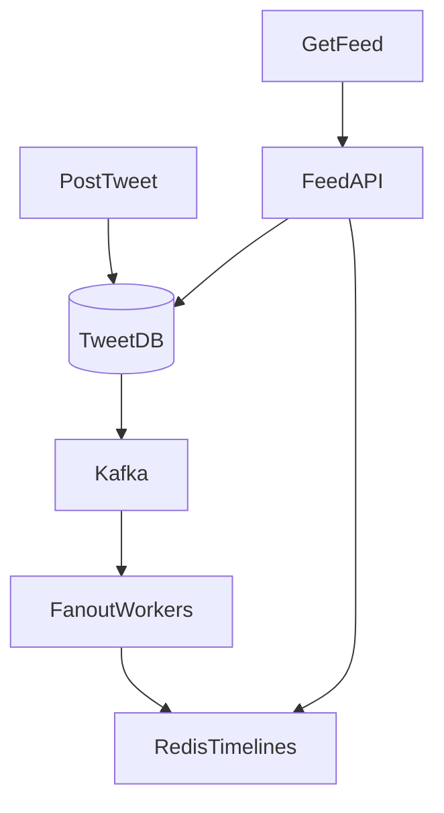

# Design Twitter/X News Feed

**Track:** Classic HLD  
**Companies:** Meta, Twitter, LinkedIn  
**Difficulty:** Hard  

---

## Case Study

> **Full case study:** [CS-HLD-C02-twitter-feed.md](../../../Case Studies/hld/classic/CS-HLD-C02-twitter-feed.md)
> **End-to-end pair:** [Twitter News Feed](../../../Case Studies/paired/CS-PAIR-06-twitter-news-feed.md)
> **Read order:** Case Study → this question (timed mock)

**Business context:** Real-world context modeled after Twitter/X and LinkedIn feed — fan-out on write vs read. Read the full case study for requirements, constraints, ADRs, and ops.

**Key constraints:** budget, timeline, team size, tech stack

---

## Problem Statement

Design a social media home timeline: users follow others, see tweets in reverse chronological or ranked feed.

---

## Clarifying Questions

| # | Question | Expected answer |
|---|----------|-----------------|
| 1 | DAU? | 300M |
| 2 | Tweets/day? | 500M posts |
| 3 | Avg follows? | 200; max celebrities 50M |
| 4 | Feed latency? | p99 < 200ms |
| 5 | Consistency? | Eventual OK — seconds delay fine |
| 6 | Media? | Separate media service; link in tweet |
| 7 | Ranking? | MVP chronological; extension ML rank |

---

## Capacity Estimation

```
500M tweets/day → 5,800 write QPS peak ~17K
300M DAU × 100 feed loads/day = 30B reads/day → 347K QPS peak ~1M

Fan-out on write for average user: 200 followers × 17K write QPS = 3.4M writes/sec — too high
→ Hybrid fan-out required
```

---

## HLD Diagram

```
POST: Client → Tweet API → Tweet DB → Kafka "tweet_created"
       → Fanout Workers → Redis timeline per follower (for normal users)
       → Skip fanout for users with > 100K followers (celebrities)

READ: Client → Feed API → Redis timelines (merge) → fetch celebrity tweets on read → return
```



---

## Deep Dive: Fan-out Strategy

| User type | Strategy |
|-------------|----------|
| Normal (< 10K followers) | Fan-out on write to Redis sorted set |
| Celebrity (> 100K) | Fan-out on read — merge at read time |
| Medium | Fan-out to active followers only |

**Redis timeline:** `ZADD timeline:{user_id} timestamp tweet_id` — top 800 tweets cached.

**Read merge:** Union follower timelines from Redis + query celebrity tweets from DB for followed celebrities in last 24h.

---

## Data Model

**Tweets:** `tweet_id, user_id, text, created_at, media_ids` — shard by `tweet_id` or `user_id`

**Follows:** `follower_id, followee_id` — index on follower_id

**Timeline cache:** Redis sorted set per user

---

## Tradeoffs

| Approach | Write cost | Read cost | Pick |
|----------|------------|-----------|------|
| Fan-out on write | High | Low | Normal users |
| Fan-out on read | Low | High | Celebrities |
| Hybrid | Balanced | Balanced | Production Twitter |

---

## Failure Modes

- Fanout worker lag: stale feed OK; show indicator
- Redis down: fall back to fan-out on read (slow)
- Celebrity merge timeout: return cached timeline without celebrity tweets

---

## Interview Answer Script (18 min)

> "300M DAU, 500M tweets daily, average 200 follows — classic hybrid fan-out problem."

> "Post tweet: write to tweet DB sharded by user_id, publish tweet_created to Kafka. Fanout workers consume: if author has under 100K followers, push tweet_id into each follower's Redis sorted set timeline. If celebrity, skip fanout — we'll pull on read."

> "Read feed: Feed API fetches precomputed timeline from Redis — O(1) for normal case. For any followed celebrities, parallel fetch their recent tweets from DB and merge-sort by timestamp. Return top 50."

> "At 17K write QPS, naive fan-out to 200 followers each would be millions of writes per second — impossible. Hybrid is mandatory. Medium users might fan-out only to active users in last 7 days."

> "Extensions: ML ranking reorders top 200 candidates; separate hot path for photos via media CDN."

---

## Follow-Up Questions

1. Design the follow/unfollow operation at scale.
2. How to implement @mentions and notifications?
3. Design tweet search (separate indexer).
4. How does ranking fit without breaking latency?

---

## Related

- [Classic Patterns](../00-classic-patterns.md)
- [Caching](../../01-core-concepts/caching.md)
