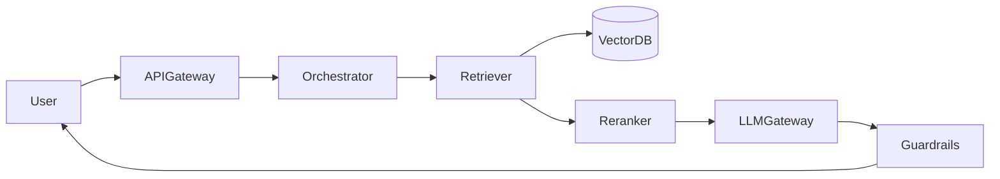

# Gen AI Layer Template

Use for RAG, chatbots, code assistants, and LLM-powered systems.

---

## Full Stack Diagram

```
┌─────────────────────────────────────────────────────────────────┐
│                        INGESTION (offline)                       │
│  Upload → ObjectStore → Parser → Chunker → Embedder → VectorDB  │
└─────────────────────────────────────────────────────────────────┘

┌─────────────────────────────────────────────────────────────────┐
│                        QUERY (online)                            │
│  User → API → QueryEmbed → Retriever → Reranker → LLM → Stream  │
│                              ↑                      ↓            │
│                          VectorDB              Guardrails → User   │
└─────────────────────────────────────────────────────────────────┘
```

---

## Ingestion Pipeline Detail

```
┌────────┐   ┌────────┐   ┌─────────┐   ┌──────────┐   ┌──────────┐
│  S3 /  │──▶│ Parser │──▶│ Chunker │──▶│ Embedder │──▶│ VectorDB │
│ Upload │   │ PDF/DOC│   │ 512 tok │   │  API     │   │ + metadata│
└────────┘   └────────┘   └─────────┘   └──────────┘   └──────────┘
                │
                └──▶ Metadata DB (doc_id, tenant, version, ACL)
```

---

## Query Pipeline Detail

```
User Query
    │
    ▼
┌─────────────┐
│ API Gateway │  auth, rate limit, tenant routing
└──────┬──────┘
       ▼
┌─────────────┐
│ Orchestrator│  build prompt, manage context window
└──────┬──────┘
       │
   ┌───┴───┐
   ▼       ▼
┌──────┐ ┌──────────┐
│Hybrid│ │ Prompt   │
│Search│ │ Cache    │
└──┬───┘ └──────────┘
   ▼
┌──────────┐
│ Reranker │  top 20 → top 5 chunks
└────┬─────┘
     ▼
┌─────────────┐
│ LLM Gateway │  model routing, streaming
└──────┬──────┘
       ▼
┌─────────────┐
│ Guardrails  │  PII, toxicity, citation check
└──────┬──────┘
       ▼
   SSE stream to client
```

---

## Agent Loop Template

```
User Goal
    ▼
┌─────────────┐
│   Planner   │  decompose into steps
└──────┬──────┘
       ▼
┌─────────────┐     ┌─────────────┐
│    LLM      │◀───▶│ Tool Registry│  search, DB, API, code exec
└──────┬──────┘     └─────────────┘
       │ tool call
       ▼
┌─────────────┐
│Tool Executor│  sandboxed, timeout, auth
└──────┬──────┘
       │ observation
       └──▶ loop until done or max steps
```

---

## Mermaid: RAG Query Path



---

## Components Checklist

| Layer | Components to mention |
|-------|----------------------|
| Ingestion | S3, SQS/Kafka, workers, parser, chunker |
| Embeddings | Embedding API or self-host, batch processing |
| Storage | Vector DB + metadata DB (Postgres) |
| Retrieval | Hybrid BM25 + vector, filters (tenant, ACL) |
| Inference | LLM gateway, streaming SSE, model router |
| Safety | Input/output filters, audit log |
| Ops | Token metrics, eval pipeline, feature flags |
