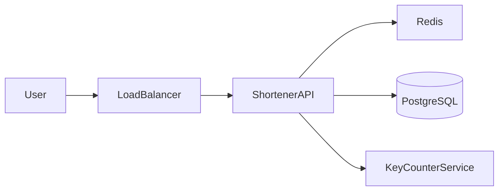
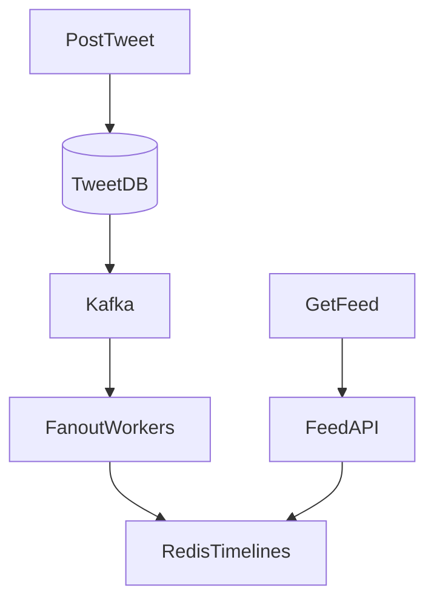
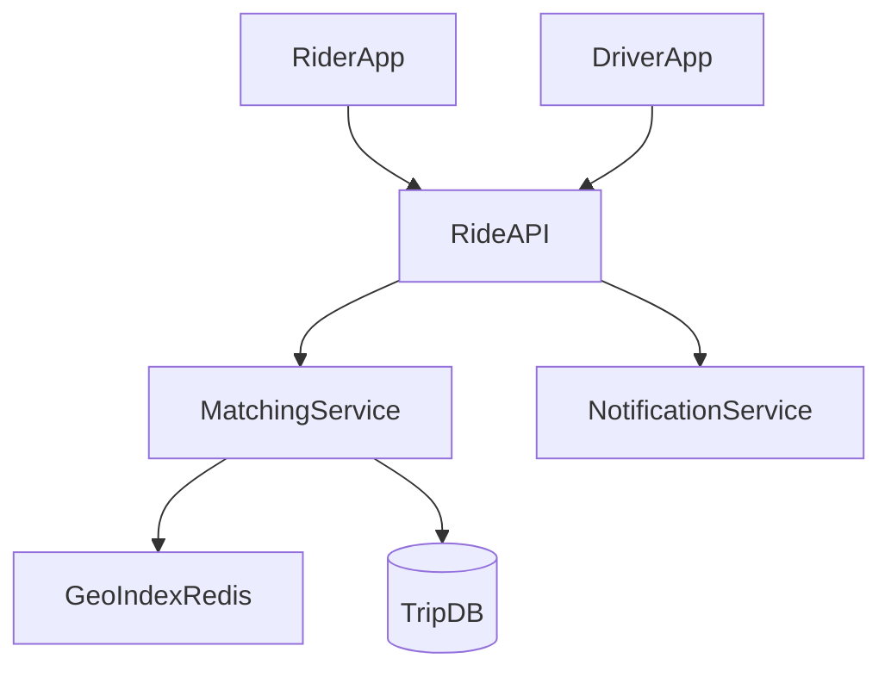
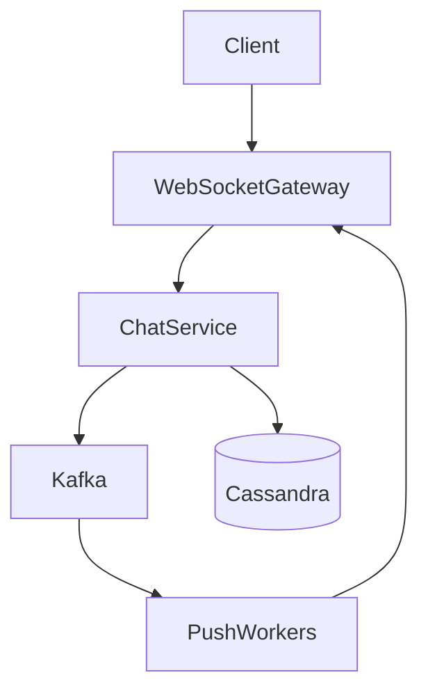
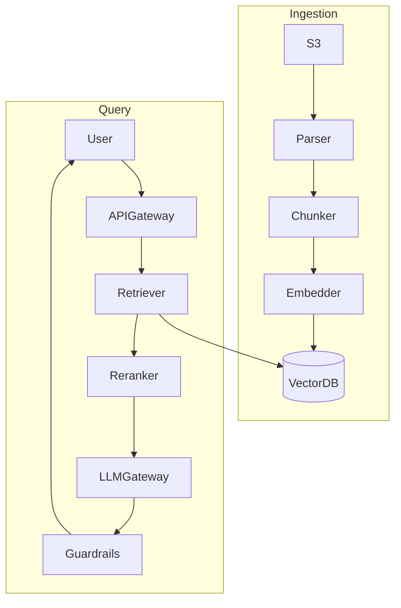
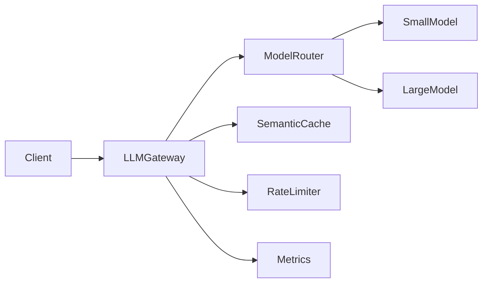
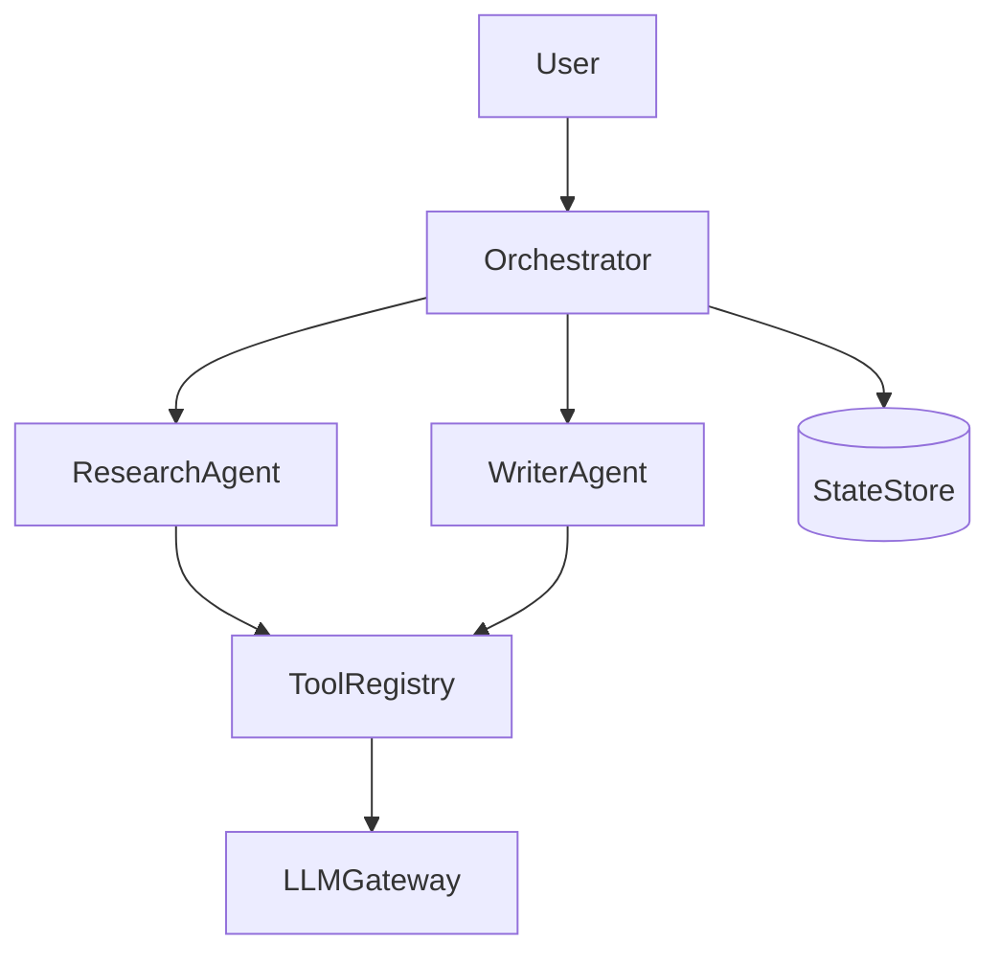
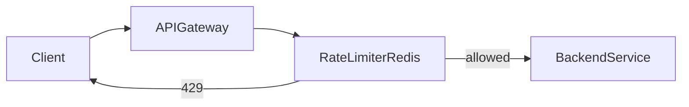

# Mermaid Diagram Examples

Ready-to-use Mermaid diagrams for practice and interviews.

---

## Classic: URL Shortener

---

## Classic: Twitter Feed (Fan-out)

---

## Classic: Uber Matching

---

## Classic: Chat System

---

## Gen AI: RAG System

---

## Gen AI: LLM API Gateway

---

## Gen AI: Multi-Agent Platform

---

## Distributed: Rate Limiter

---

## Notes for Live Interviews

- Many virtual whiteboards support Mermaid; if not, redraw as boxes
- Keep diagrams under 12 nodes for clarity
- Use subgraphs to group layers
