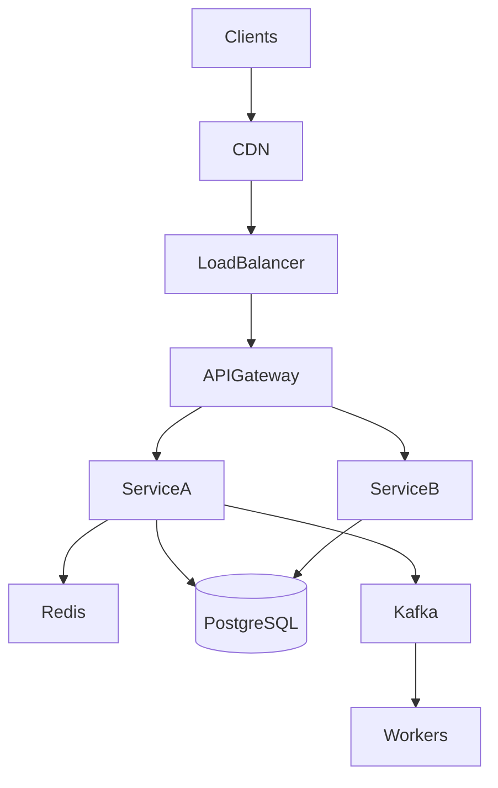

# Standard Layers Template

Copy this template for any classic HLD question.

---

## Layer 1: Clients & Edge

```
┌────────────┐  ┌────────────┐
│  Web App   │  │ Mobile App │
└─────┬──────┘  └─────┬──────┘
      └───────┬───────┘
              ▼
        ┌──────────┐
        │   DNS    │
        └────┬─────┘
             ▼
        ┌──────────┐
        │   CDN    │  (static assets, media)
        └────┬─────┘
             ▼
        ┌──────────┐
        │    LB    │
        └──────────┘
```

---

## Layer 2: API & Services

```
        ┌──────────────┐
        │ API Gateway  │  auth, rate limit, routing
        └──────┬───────┘
               │
    ┌──────────┼──────────┐
    ▼          ▼          ▼
┌────────┐ ┌────────┐ ┌────────┐
│Service1│ │Service2│ │Service3│
└───┬────┘ └───┬────┘ └───┬────┘
    │          │          │
    └──────────┼──────────┘
               ▼
```

---

## Layer 3: Data

```
        ┌──────────┐     ┌──────────────┐
        │  Redis   │     │  PostgreSQL  │
        │ (cache)  │     │  (primary)   │
        └──────────┘     └──────┬───────┘
                                ▼
                         ┌──────────────┐
                         │   Replica    │
                         └──────────────┘

        ┌──────────┐     ┌──────────────┐
        │   S3     │     │ Elasticsearch│
        │ (blobs)  │     │  (search)    │
        └──────────┘     └──────────────┘
```

---

## Layer 4: Async (if needed)

```
    ┌──────────┐         ┌──────────┐
    │  Kafka   │ ─ ─ ─ ▶ │ Workers  │
    └──────────┘         └──────────┘
```

---

## Read Path Template

1. Client → CDN (cache hit?) → return
2. Client → LB → API Gateway → Service
3. Service → Redis (cache hit?) → return
4. Cache miss → DB/replica → populate cache → return

---

## Write Path Template

1. Client → LB → API Gateway → Service
2. Service → validate → write primary DB
3. Invalidate/update cache
4. Publish event to queue (async side effects)
5. Workers process (notifications, index update, fan-out)

---

## Mermaid Template


