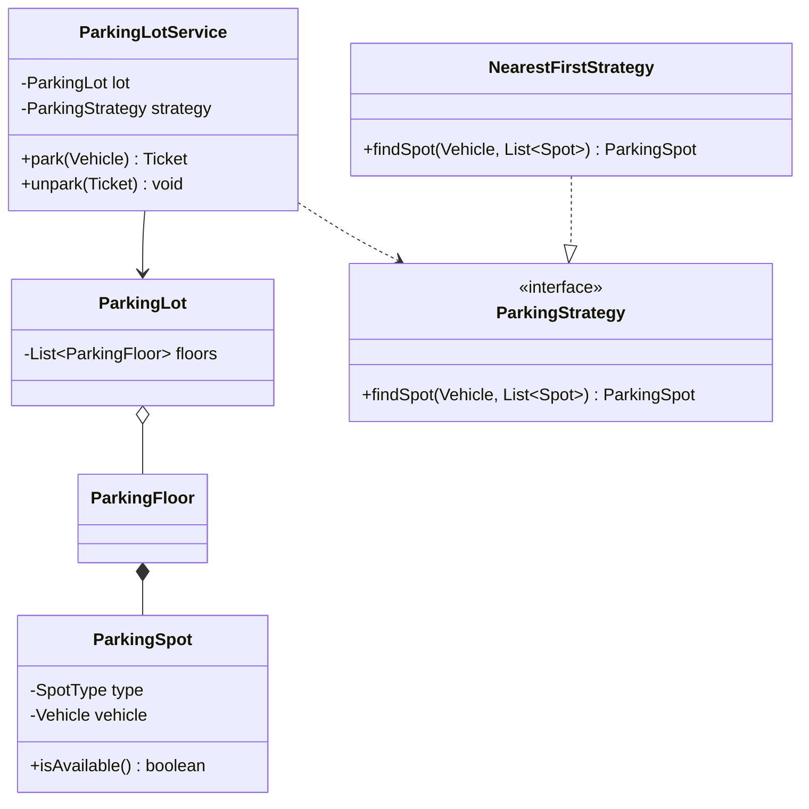

# How to Draw Class Diagrams — LLD Interviews

Whiteboard class diagrams are the core deliverable in LLD rounds. Clarity beats completeness.

---

## UML Symbols Quick Reference

| Symbol | Meaning | Example |
|--------|---------|---------|
| `+` | public | `+park(vehicle)` |
| `-` | private | `-spots: List` |
| `#` | protected | `#validate()` |
| `<<interface>>` | interface | `<<interface>> PaymentProcessor` |
| `<<enum>>` | enumeration | `<<enum>> VehicleType` |
| `───` | association | Vehicle uses Spot |
| `◇──` | aggregation | Lot has Floors (independent lifecycle) |
| `◆──` | composition | Floor contains Spots (same lifecycle) |
| `──▷` | inheritance | `Car extends Vehicle` |
| `..▷` | implements | `NearestFirstStrategy implements ParkingStrategy` |
| `1`, `*`, `0..1` | multiplicity | Lot `1` ── `*` Floor |

---

## Drawing Order (10 min)

```
1. Central entity (ParkingLot)           [30 sec]
2. Core neighbors (Floor, Spot, Vehicle) [2 min]
3. Enums (VehicleType, SpotType)         [1 min]
4. Service/workflow (Ticket, Payment)      [2 min]
5. Interfaces at variation points          [2 min]
6. Relationships + multiplicity          [2 min]
```

---

## ASCII Template — Service + Repository

```
┌─────────────────────┐       ┌──────────────────┐
│   ParkingLotService │──────>│ ParkingStrategy  │<<interface>>
│─────────────────────│       │──────────────────│
│ - lot: ParkingLot   │       │ +findSpot()      │
│ - strategy          │       └────────┬─────────┘
│─────────────────────│                │ implements
│ +park(Vehicle)      │       ┌────────▼─────────┐
│ +unpark(Ticket)     │       │ NearestFirst...  │
└─────────┬───────────┘       └──────────────────┘
          │ owns
          ▼
┌─────────────────────┐     ┌──────────────────┐
│     ParkingLot      │◇───>│  ParkingFloor    │
│─────────────────────│ 1 * │──────────────────│
│ - floors            │     │ - spots: List    │
└─────────────────────┘     └────────┬─────────┘
                                     │ *
                                     ▼
                            ┌──────────────────┐
                            │   ParkingSpot    │
                            │──────────────────│
                            │ - type: SpotType │
                            │ - vehicle        │
                            └──────────────────┘
```

---

## Mermaid classDiagram Rules



**Mermaid tips:**
- Use `<<interface>>` and `<<enum>>` stereotypes
- `*--` composition, `o--` aggregation, `-->` dependency
- `..|>` implements, `<|--` extends

---

## Common Relationship Mistakes

| Mistake | Fix |
|---------|-----|
| Everything inherits from everything | Use composition; inheritance only for true IS-A |
| God class with 20 methods | Split into Service + Domain entities |
| No interfaces | Add interface at every "we might change this" point |
| Missing enums | Use enum for fixed types (VehicleType, OrderStatus) |
| Drawing all getters/setters | Only show public API methods |

---

## When to Use Each Relationship

| Relationship | Use when |
|--------------|----------|
| Inheritance | True IS-A: `Sedan IS-A Vehicle` |
| Interface | CAN-DO capability: `Payable`, `Parkable` |
| Composition | Part cannot exist without whole: Spot in Floor |
| Aggregation | Part has independent lifecycle: Floor in Lot |
| Association | Uses temporarily: Service uses Strategy |

---

## Related

- [Diagram Playbook — Class Templates](../06-diagram-playbook/class-diagram-templates.md)
- [Mermaid Examples](../06-diagram-playbook/mermaid-examples.md)
- [UML Essentials](../01-core-concepts/uml-essentials.md)
