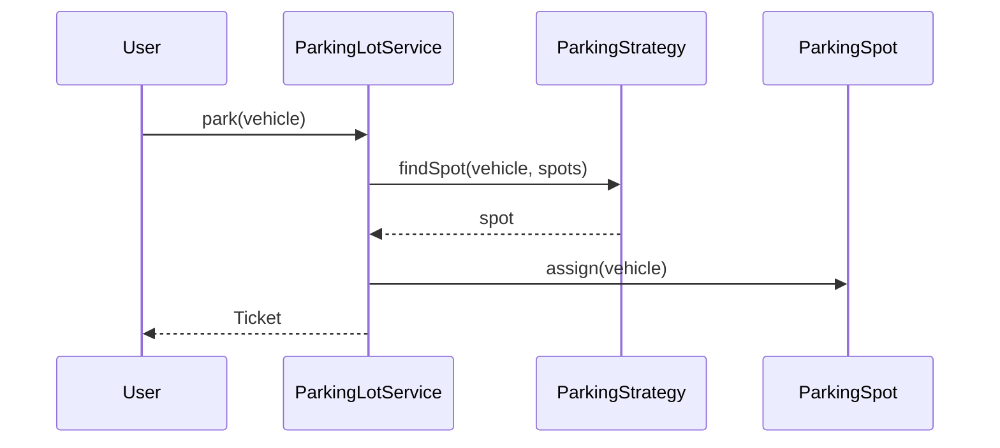
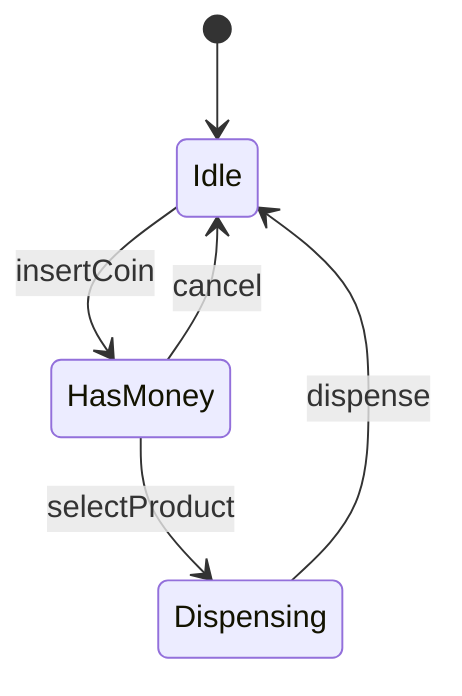

# UML Essentials — LLD Whiteboard

Three diagram types matter in LLD: **class**, **sequence**, **state**.

---

## Class Diagram

See [How to Draw Class Diagrams](../00-interview-framework/02-how-to-draw-class-diagrams.md).

**Minimum viable:** 4–8 classes, 1–2 interfaces, 1–2 enums, labeled relationships.

---

## Sequence Diagram

**Show time-ordered message flow between objects.**

```
Actor → Service → Strategy → Spot → Ticket
  |        |          |         |       |
  |--park->|          |         |       |
  |        |--findSpot->|       |       |
  |        |<--spot-----|       |       |
  |        |--assign------------>|       |
  |        |--issue--------------------->|
  |<--ticket------------------------------|
```

**Mermaid:**



Draw **2–3 flows:** happy path, failure (lot full), optional extension.

---

## State Diagram

**When object behavior depends on discrete states.**



Use for: vending machine, order lifecycle, elevator direction, TCP.

**Simple states?** Use enum instead of full State pattern.

---

## When to Draw Which

| Diagram | Draw when |
|---------|-----------|
| Class | Always — core deliverable |
| Sequence | 2+ objects collaborating in a flow |
| State | Lifecycle with 4+ states and transition rules |

---

## Related

- [Sequence Diagram Templates](../06-diagram-playbook/sequence-diagram-templates.md)
- [State Diagram Templates](../06-diagram-playbook/state-diagram-templates.md)
