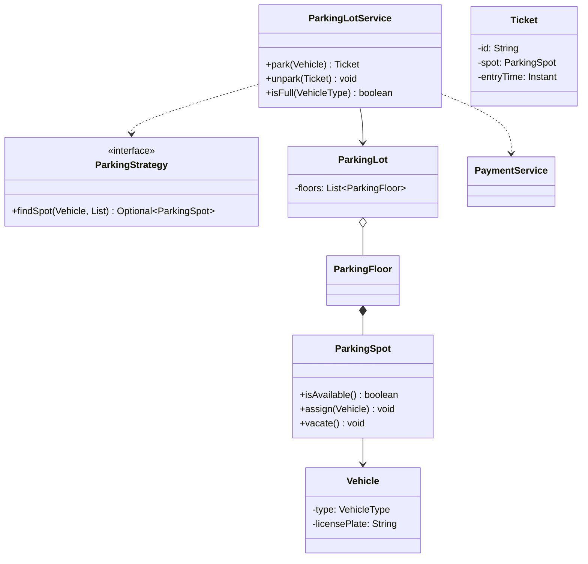
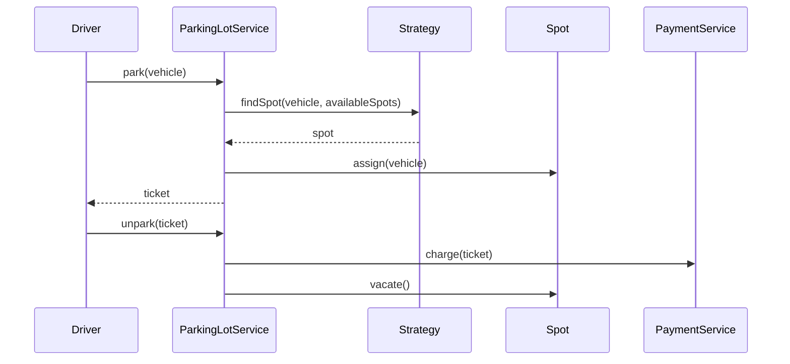

# Design Parking Lot

**Track:** Classic OOD  
**Companies:** Amazon, Microsoft, Google, Oracle  
**Difficulty:** Medium  

---

## Case Study

> **Full case study:** [CS-LLD-O01-parking-lot.md](../../../Case Studies/lld/classic-ood/CS-LLD-O01-parking-lot.md)
> **End-to-end pair:** [Parking Lot at Scale](../../../Case Studies/paired/CS-PAIR-02-parking-lot-at-scale.md)
> **Read order:** Case Study → this question → [Java implementation](../09-code-implementations/)

**Business context:** Design the **in-process object model** for a multi-floor garage: motorcycles, cars, trucks; multiple entry gates concurrent; ticket on entry, payment on exit.

**Key constraints:** Scope, Concurrency, Extensibility

---

## 1. Problem Statement

Design a parking lot with multiple floors and spot types (compact, large, handicap). Support vehicle entry (park), exit (unpark), and display availability. Optional: payment on exit.

---

## 2. Clarifying Questions

| # | Question | Expected answer |
|---|----------|-----------------|
| 1 | Single building or multi-building? | Single parking lot, multiple floors |
| 2 | Vehicle types? | Motorcycle, car, truck — different spot sizes |
| 3 | Multi-threaded entry gates? | Yes — multiple gates concurrent |
| 4 | Payment in scope? | MVP: ticket on entry; payment interface on exit |
| 5 | Spot allocation policy? | Configurable — nearest first default |
| 6 | Persistence? | In-memory |
| 7 | Electric charging? | Extension — not MVP |
| 8 | Valet? | Extension |

---

## 3. Functional & Non-Functional Requirements

**Functional:**
- Park vehicle → assign spot, issue ticket
- Unpark with ticket → free spot
- Report availability by vehicle type
- Reject when no compatible spot available

**Non-Functional:**
- Thread-safe entry/exit at multiple gates
- Extensible allocation policy (Strategy)
- SOLID — payment separate from parking

---

## 4. Core Entities & Relationships

| Entity | Role |
|--------|------|
| `ParkingLot` | Root aggregate — floors, tickets |
| `ParkingFloor` | Collection of spots on one level |
| `ParkingSpot` | Holds one vehicle; has SpotType |
| `Vehicle` | Type + license plate |
| `Ticket` | Issued on park; used on exit |
| `ParkingLotService` | Orchestrates park/unpark |
| `ParkingStrategy` | Spot allocation algorithm |
| `PaymentService` | Optional exit payment |

**Nouns → classes:** `ParkingLot`, `ParkingFloor`, `ParkingSpot`, `Vehicle`, `Ticket`, `ParkingLotService`, `ParkingStrategy`  
**Verbs → methods:** `park(Vehicle)`, `unpark(Ticket)`, `isFull(VehicleType)`

---

## 5. Class Diagram

```
┌─────────────────────┐       ┌──────────────────┐
│  ParkingLotService  │──────>│ ParkingStrategy  │<<interface>>
│─────────────────────│       │──────────────────│
│ - lot               │       │ +findSpot()      │
│ - strategy          │       └────────┬─────────┘
│ - paymentService    │                │ implements
│─────────────────────│       ┌────────▼─────────┐
│ +park(Vehicle)      │       │ NearestFirst...  │
│ +unpark(Ticket)     │       └──────────────────┘
└─────────┬───────────┘
          │ owns
          ▼
┌─────────────────────┐     ┌──────────────────┐
│     ParkingLot      │◇───>│  ParkingFloor    │
└─────────────────────┘ 1 * └────────┬─────────┘
                                     │ *
                                     ▼
                            ┌──────────────────┐
                            │   ParkingSpot    │
                            │ - type: SpotType │
                            │ - vehicle        │
                            └──────────────────┘
```



---

## 6. Public API / Key Methods

```java
public class ParkingLotService {
    public Ticket park(Vehicle vehicle);
    public void unpark(Ticket ticket);
    public boolean isFull(VehicleType type);
}
```

---

## 7. Design Patterns & SOLID

| Pattern | Application |
|---------|-------------|
| Strategy | Spot allocation — nearest, cheapest, largest-first |
| Factory | Optional Vehicle factory from plate + type |

**SOLID:**
- **S:** PaymentService only handles payment
- **O:** New strategy without editing park loop
- **L:** All Vehicle types work in park()
- **D:** Service depends on ParkingStrategy interface

---

## 8. Sequence Diagrams



---

## 9. Extensibility

> "Electric spots: add `SpotType.ELECTRIC` and `ChargingCapable` interface on `ElectricSpot`. Allocation strategy unchanged."
>
> "Pricing rules: inject `PricingStrategy` into PaymentService."

---

## 10. Tradeoffs

| Decision | A | B | Pick |
|----------|---|---|------|
| Allocation | if/else | Strategy | Strategy — 2+ policies |
| Spot state | enum | State pattern | enum Occupied/Available |
| Thread safety | sync lot | sync per spot | sync per spot — finer granularity |
| Ticket ID | UUID | AtomicLong | AtomicLong — readable tickets |

---

## 11. Concurrency & Edge Cases

- **check-then-act** on spot: synchronize on `ParkingSpot` during assign/vacate
- Lot full for vehicle type → `LotFullException`
- Invalid/expired ticket on exit → `InvalidTicketException`
- Motorcycle in compact spot OK; truck needs large spot

---

## 12. Interview Answer Script (15 min)

> "I'll design an in-memory parking lot for one building with multiple floors and concurrent entry gates."
>
> "Three clusters: structure — Lot, Floor, Spot; workflow — Service, Ticket, Payment; variation — ParkingStrategy for allocation."
>
> "Vehicle has type — motorcycle, car, truck. Spot has compatible types via SpotType enum."
>
> "park() asks strategy for a spot from available compatible spots, assigns vehicle, issues ticket with spot reference and timestamp."
>
> "unpark() validates ticket, calls PaymentService, vacates spot. synchronize on spot for thread safety."
>
> "Strategy pattern for nearest-first vs other policies — injected at construction."
>
> "Extensions: electric charging via new spot type; valet as separate service facade."
>
> "If interviewer asks millions of users — pivot to HLD with central occupancy service and Redis; object model stays."

---

## 13. Follow-Up Questions

1. How would you add dynamic pricing by hour?
2. How would you support reserved spots?
3. Design for multiple parking lots (registry)?
4. How to test NearestFirstStrategy in isolation?

---

## 14. Related Links

- [Strategy pattern](../../01-core-concepts/design-patterns-gof.md)
- [Concurrency fundamentals](../../01-core-concepts/concurrency-fundamentals.md)
- [Java implementation](../../09-code-implementations/java/classic/parking-lot/) (full)
- [HLD Parking Lot / Elevator](../System%20Design%20-%20High%20Level%20Design/03-classic-hld/questions/Q30-parking-lot-elevator.md)
