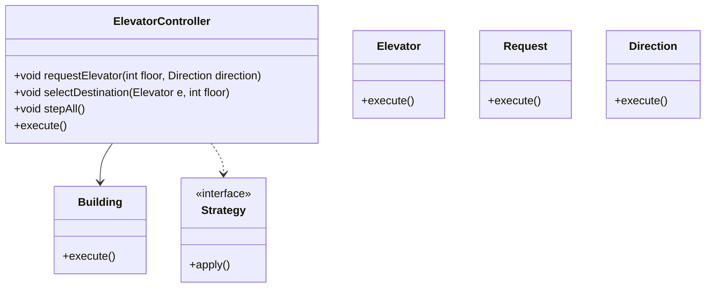
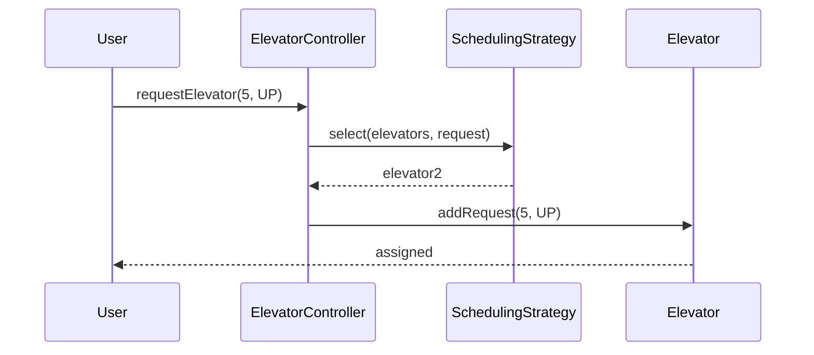
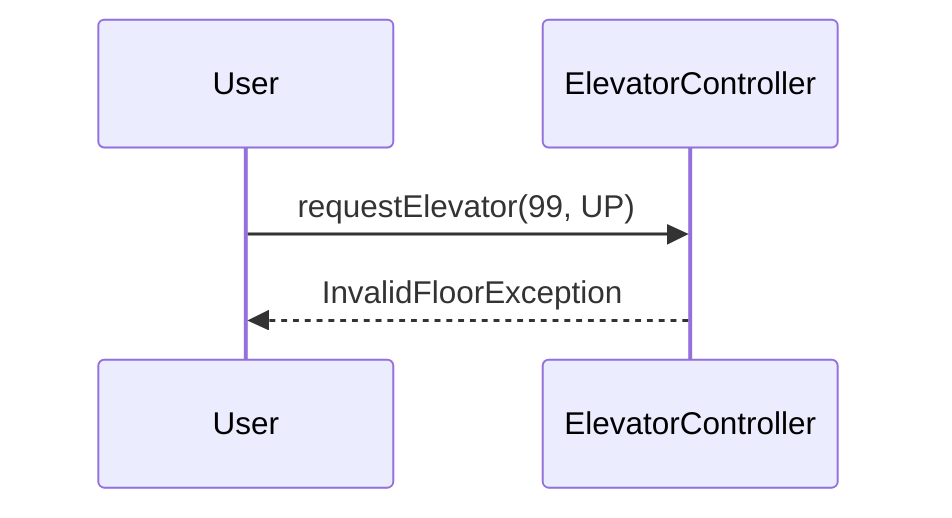

# Elevator System

**Track:** Classic OOD  
**Companies:** Amazon, Microsoft, Samsung  
**Difficulty:** Hard  

---

## Case Study

> **Full case study:** [CS-LLD-O02-elevator.md](../../../Case Studies/lld/classic-ood/CS-LLD-O02-elevator.md)
> **Read order:** Case Study → this question → [Java implementation](../09-code-implementations/)

**Business context:** Real-world context modeled after Otis elevator group dispatch algorithms. Read the full case study for requirements, constraints, ADRs, and ops.

**Key constraints:** budget, timeline, team size, tech stack

---

## 1. Problem Statement

Design an elevator system for a building with multiple elevators serving multiple floors. Support hall calls (up/down) and car calls (destination). Optimize dispatch.

---

## 2. Clarifying Questions

| # | Question | Expected answer |
|---|----------|-----------------|
| 1 | How many elevators and floors? | Configurable N elevators, M floors |
| 2 | Scheduling algorithm? | Strategy — SCAN default |
| 3 | Concurrent requests? | Yes — multiple floors press buttons simultaneously |
| 4 | Elevator types? | Standard passenger; freight is extension |
| 5 | Display status? | Show current floor and direction per elevator |
| 6 | Persistence? | In-memory |
| 7 | Emergency stop? | Extension — safety subsystem |
| 8 | Weight limit? | Extension — capacity check |

---

## 3. Functional & Non-Functional Requirements

**Functional:**
- Request elevator from floor with direction
- Select elevator via scheduling strategy
- Move elevator floor-by-floor serving queued requests
- Process internal destination buttons

**Non-Functional:**
- Thread-safe request queue
- Pluggable dispatch (Strategy)
- Low coupling between Building and Elevator state machines

---

## 4. Core Entities & Relationships

| Entity | Role |
|--------|------|
| `Building` | Owns floors and elevator bank |
| `Elevator` | Current floor, direction, door state |
| `ElevatorController` | Facade — accepts external requests |
| `Request` | Floor + direction or destination |
| `Direction` | UP, DOWN, IDLE enum |
| `SchedulingStrategy` | Pick best elevator for hall call |

**Nouns → classes:** `Building`, `Elevator`, `ElevatorController`, `Request`, `Direction`, `SchedulingStrategy`  
**Verbs → methods:** `requestElevator(floor, direction)`, `selectElevator(Request)`, `step()`

---

## 5. Class Diagram

```
┌─────────────────────┐       ┌──────────────────┐
│  ElevatorController │──────>│ Strategy         │<<interface>>
│─────────────────────│       │──────────────────│
│ +orchestrate()      │       │ +apply()         │
└─────────┬───────────┘       └────────┬─────────┘
          │ owns                       │ implements
          ▼                   ┌────────▼─────────┐
┌─────────────────────┐       │ ConcreteStrategy │
│  Building           │       └──────────────────┘
└─────────┬───────────┘
          │ *
          ▼
┌─────────────────────┐     ┌──────────────────┐
│  Elevator           │────>│  ElevatorController│
└─────────────────────┘     └──────────────────┘
```



---

## 6. Public API / Key Methods

```java
public class ElevatorController {
    public void requestElevator(int floor, Direction direction);
    public void selectDestination(Elevator e, int floor);
    public void stepAll();
}
```

---

## 7. Design Patterns & SOLID

| Pattern | Application |
|---------|-------------|
| Strategy | SCAN, nearest-car, load-balancing dispatch |
| State | Elevator door open/closed/moving |

**SOLID:**
- **S:** Elevator moves itself; controller only dispatches
- **O:** New scheduler without changing Elevator
- **D:** Controller depends on SchedulingStrategy interface

---

## 8. Sequence Diagrams

**Happy path:**



**Failure path:**



---

## 9. Extensibility

> "New dispatch policy: implement SchedulingStrategy and inject at startup."
>
> "Express elevator: subclass Elevator with restricted floor range."

---

## 10. Tradeoffs

| Decision | A | B | Pick |
|----------|---|---|------|
| Dispatch | if/else nearest | Strategy | Strategy — multiple algorithms |
| Movement | simulate ticks | event-driven | tick simulation for LLD clarity |
| Request storage | per-elevator PQ | global queue | per-elevator — locality |
| Door state | enum | State pattern | enum unless complex interlocks |

---

## 11. Concurrency & Edge Cases

- Synchronize addRequest on each Elevator instance
- Invalid floor → InvalidFloorException
- Duplicate hall call same floor — idempotent add
- All elevators idle — nearest responds

---

## 12. Interview Answer Script (15 min)

> "I'll model a building with N elevators and a controller facade for external requests."
>
> "Hall calls carry floor + direction; car calls are destination floors inside the cabin."
>
> "SchedulingStrategy picks the best elevator — default SCAN but swappable."
>
> "Each Elevator maintains a priority queue of pending stops sorted by direction sweep."
>
> "stepAll() advances simulation — move one floor, open doors, dequeue served requests."
>
> "Thread safety: synchronize mutation of elevator request queues."
>
> "State: IDLE, UP, DOWN with door OPEN/CLOSED enum on Elevator."
>
> "For HLD scale — central dispatch service; LLD object graph unchanged."

---

## 13. Follow-Up Questions

1. How would you handle peak morning traffic?
2. Design for elevator maintenance mode?
3. How to prevent starvation on high floors?
4. Unit test SCAN strategy in isolation?

---

## 14. Related Links

- [Strategy pattern](../../01-core-concepts/design-patterns-gof.md)
- [SOLID principles](../../01-core-concepts/solid-principles.md)
- [Concurrency fundamentals](../../01-core-concepts/concurrency-fundamentals.md)
- [Java implementation](../../09-code-implementations/java/classic/elevator/) (full)
- [HLD counterpart](../System%20Design%20-%20High%20Level%20Design/03-classic-hld/questions/Q30-parking-lot-elevator.md)
