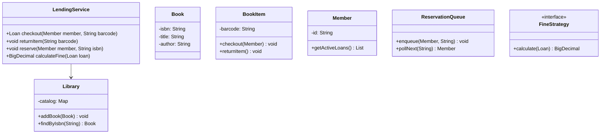
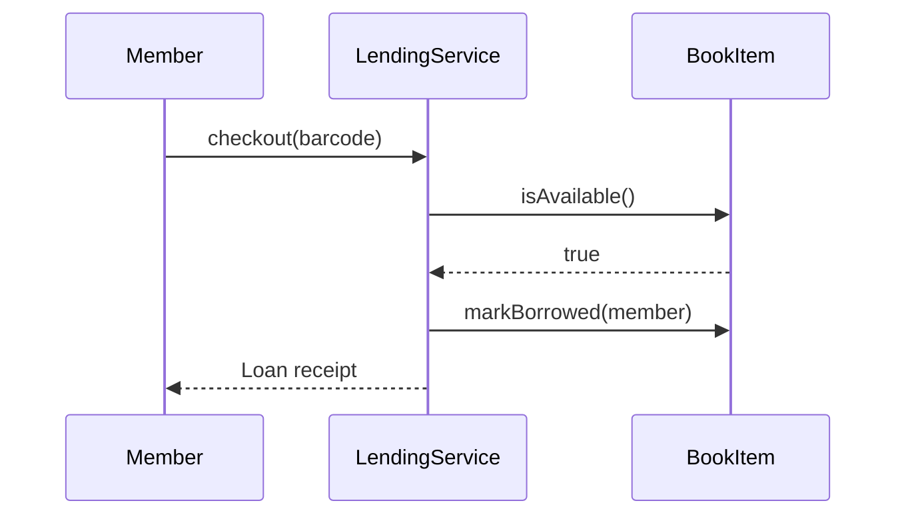
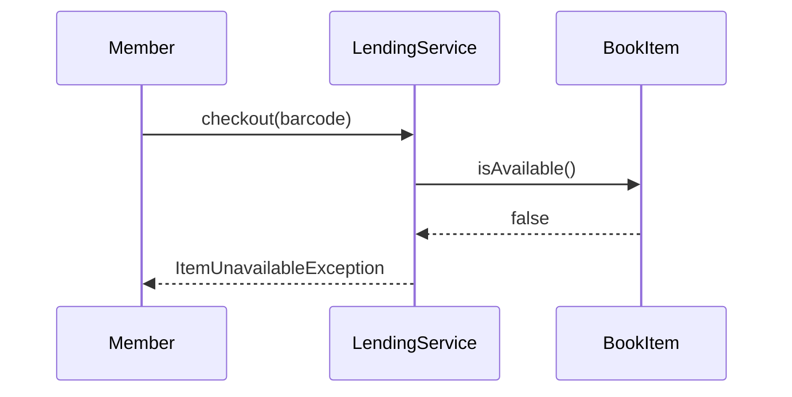

# Library Management System

**Track:** Classic OOD  
**Companies:** Amazon, Google, Microsoft  
**Difficulty:** Medium  

---

## Case Study

> **Full case study:** [CS-LLD-O03-library-management.md](../../../Case Studies/lld/classic-ood/CS-LLD-O03-library-management.md)
> **Read order:** Case Study → this question → [Java implementation](../09-code-implementations/)

**Business context:** Real-world context modeled after OCLC library catalog systems. Read the full case study for requirements, constraints, ADRs, and ops.

**Key constraints:** budget, timeline, team size, tech stack

---

## 1. Problem Statement

Design a library: catalog books, member accounts, checkout/return, reservations, fines.

---

## 2. Clarifying Questions

| # | Question | Expected answer |
|---|----------|-----------------|
| 1 | Physical or digital books? | Physical copies with ISBN; e-books extension |
| 2 | Multiple branches? | Single library MVP; branchId extension |
| 3 | Loan period? | 14 days default; configurable per item type |
| 4 | Reservation queue? | Yes — FIFO when all copies checked out |
| 5 | Fine calculation? | Per day overdue; FineStrategy injectable |
| 6 | Librarian roles? | Member vs Librarian for catalog edits |
| 7 | Concurrent checkout desks? | Yes — synchronize per BookItem |
| 8 | Search scope? | By title, author, ISBN |

---

## 3. Functional & Non-Functional Requirements

**Functional:**
- Checkout BookItem to Member if available and loan limit OK
- Return item, compute overdue fine, notify reservation queue
- Reserve Book when no copies available — FIFO queue
- Librarian add/remove catalog items

**Non-Functional:**
- Clear separation of concerns (SOLID)
- Open-Closed via FineStrategy interface at variation points
- Constructor injection for testability
- Thread-safe if concurrent access is in clarifying assumptions

---

## 4. Core Entities & Relationships

| Entity | Role |
|--------|------|
| `Library` | Catalog root |
| `Book` | Metadata |
| `BookItem` | Physical copy |
| `Member` | Borrower |
| `ReservationQueue` | FIFO waitlist |
| `FineStrategy` | Overdue fees |

**Nouns → classes:** `Library`, `Book`, `BookItem`, `Member`, `ReservationQueue`, `FineStrategy`  
**Verbs → methods:** `checkout(member, barcode)`, `returnItem(barcode)`, `reserve(member, isbn)`

---

## 5. Class Diagram

```
┌─────────────────────┐       ┌──────────────────┐
│  LendingService     │──────>│ Strategy         │<<interface>>
│─────────────────────│       │──────────────────│
│ +orchestrate()      │       │ +apply()         │
└─────────┬───────────┘       └────────┬─────────┘
          │ owns                       │ implements
          ▼                   ┌────────▼─────────┐
┌─────────────────────┐       │ ConcreteStrategy │
│  Library            │       └──────────────────┘
└─────────┬───────────┘
          │ *
          ▼
┌─────────────────────┐     ┌──────────────────┐
│  Book               │────>│  BookItem        │
└─────────────────────┘     └──────────────────┘
```



---

## 6. Public API / Key Methods

```java
public class LendingService {
    public Loan checkout(Member member, String barcode);
    public void returnItem(String barcode);
    public void reserve(Member member, String isbn);
    public BigDecimal calculateFine(Loan loan);
}
```

---

## 7. Design Patterns & SOLID

| Pattern | Application |
|---------|-------------|
| Strategy | Fine calculation policies |
| Observer | Notify when reserved book available |

**SOLID:**
- **S:** LendingService orchestrates; entities hold state
- **O:** New behavior via new FineStrategy impl
- **D:** Depend on FineStrategy interface

---

## 8. Sequence Diagrams

**Happy path:**



**Failure path:**



---

## 9. Extensibility

> "New `Strategy` implementation plugs in at runtime — no change to `LendingService`."
>
> "Add new `Library` subtypes or enum values for new categories — Open-Closed."

---

## 10. Tradeoffs

| Decision | A | B | Pick |
|----------|---|---|------|
| Variation | if/else | Strategy | Strategy — 2+ behaviors |
| State | enum | State pattern | enum for simple lifecycles |
| Storage | in-memory | Repository | in-memory MVP |
| API return | primitive | domain object | domain object — type safety |

---

## 11. Concurrency & Edge Cases

- Synchronize checkout/return on BookItem — prevent double borrow
- Return unknown barcode → NotFoundException
- Reserve when copies exist → reject or auto-checkout per policy
- Concurrent return + checkout on same item — lock per BookItem

---

## 12. Interview Answer Script (15 min)

> "Library owns Book metadata and physical BookItem copies with unique barcodes."
>
> "Member borrows a BookItem, not an abstract Book — one copy one borrower."
>
> "checkout validates membership, item availability, and per-member loan limit."
>
> "return computes overdue days via FineStrategy, frees item, wakes ReservationQueue."
>
> "ReservationQueue is FIFO per ISBN — fair ordering when copy returns."
>
> "CatalogService separated from LendingService — ISP for librarian operations."
>
> "FineStrategy injected — daily rate vs flat fee without changing return loop."
>
> "HLD: catalog in DB, search via Elasticsearch; LLD entities map cleanly."

---

## 13. Follow-Up Questions

1. How to support inter-library loan?
2. Design notification when reserved book becomes available?
3. How to handle lost book replacement fees?
4. Index structure for fast ISBN lookup?

---

## 14. Related Links

- [Strategy pattern](../../01-core-concepts/design-patterns-gof.md)
- [SOLID principles](../../01-core-concepts/solid-principles.md)
- [Concurrency fundamentals](../../01-core-concepts/concurrency-fundamentals.md)
- [Java implementation](../../09-code-implementations/java/classic/library-management/) (full)
