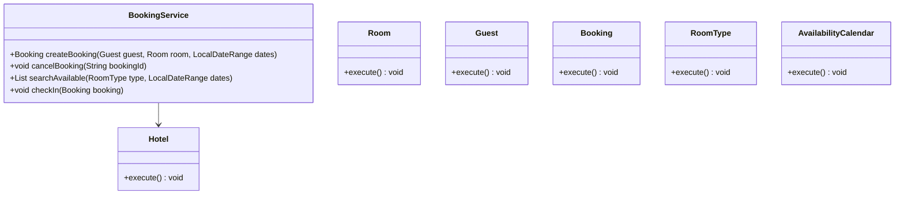
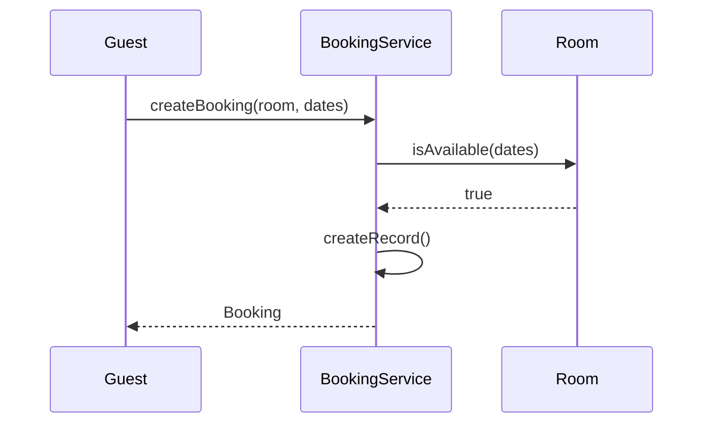
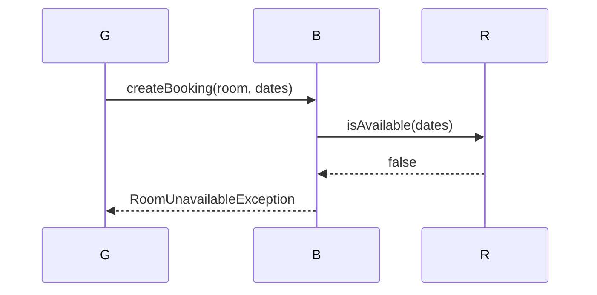

# Hotel Booking System

**Track:** Classic OOD  
**Companies:** Airbnb, Amazon, Booking.com  
**Difficulty:** Medium  

---

## Case Study

> **Full case study:** [CS-LLD-O04-hotel-booking.md](../../../Case Studies/lld/classic-ood/CS-LLD-O04-hotel-booking.md)
> **Read order:** Case Study → this question → [Java implementation](../09-code-implementations/)

**Business context:** Real-world context modeled after Booking.com reservation engine. Read the full case study for requirements, constraints, ADRs, and ops.

**Key constraints:** budget, timeline, team size, tech stack

---

## 1. Problem Statement

Design hotel room booking: search availability, reserve, cancel, check-in/out.

---

## 2. Clarifying Questions

| # | Question | Expected answer |
|---|----------|-----------------|
| 1 | What is MVP scope for Hotel Booking System? | Core entities + 2 primary user flows |
| 2 | Persistence required? | In-memory; Repository interface if interviewer asks |
| 3 | Multi-threaded access? | Yes if multiple users/gates — else single-threaded |
| 4 | Overbooking? | No — reject when room unavailable |
| 5 | Cancellation window? | Free cancel 24h before check-in |
| 6 | Room types? | Single, double, suite enum |
| 7 | Pricing? | Nightly rate × nights via PricingStrategy |

---

## 3. Functional & Non-Functional Requirements

**Functional:**
- Search and filter matching resources
- Create and cancel reservations with conflict checks

**Non-Functional:**
- Clear separation of concerns (SOLID)
- Open-Closed via PricingStrategy interface at variation points
- Constructor injection for testability
- Thread-safe if concurrent access is in clarifying assumptions

---

## 4. Core Entities & Relationships

| Entity | Role |
|--------|------|
| `Hotel` | Property |
| `Room` | Inventory unit |
| `Guest` | Customer |
| `Booking` | Reservation record |
| `RoomType` | Single/Double/Suite |
| `AvailabilityCalendar` | Date index |

**Nouns → classes:** `Hotel`, `Room`, `Guest`, `Booking`, `RoomType`, `AvailabilityCalendar`  
**Verbs → methods:** `createBooking()`, `cancelBooking()`, `searchAvailable()`, `checkIn()`

---

## 5. Class Diagram

```
┌─────────────────────┐       ┌──────────────────┐
│  BookingService     │──────>│ Strategy         │<<interface>>
│─────────────────────│       │──────────────────│
│ +orchestrate()      │       │ +apply()         │
└─────────┬───────────┘       └────────┬─────────┘
          │ owns                       │ implements
          ▼                   ┌────────▼─────────┐
┌─────────────────────┐       │ ConcreteStrategy │
│  Hotel              │       └──────────────────┘
└─────────┬───────────┘
          │ *
          ▼
┌─────────────────────┐     ┌──────────────────┐
│  Room               │────>│  Guest           │
└─────────────────────┘     └──────────────────┘
```



---

## 6. Public API / Key Methods

```java
public class BookingService {
    public Booking createBooking(Guest guest, Room room, LocalDateRange dates);
    public void cancelBooking(String bookingId);
    public List<Room> searchAvailable(RoomType type, LocalDateRange dates);
    public void checkIn(Booking booking);
}
```

---

## 7. Design Patterns & SOLID

| Pattern | Application |
|---------|-------------|
| Strategy | Variation point in Hotel Booking System |

**SOLID:**
- **S:** BookingService orchestrates; entities hold state
- **O:** New behavior via new PricingStrategy impl
- **D:** Depend on PricingStrategy interface

---

## 8. Sequence Diagrams

**Happy path:**



**Failure path:**



---

## 9. Extensibility

> "New `Strategy` implementation plugs in at runtime — no change to `BookingService`."
>
> "Add new `Hotel` subtypes or enum values for new categories — Open-Closed."

---

## 10. Tradeoffs

| Decision | A | B | Pick |
|----------|---|---|------|
| Variation | if/else | Strategy | Strategy — 2+ behaviors |
| State | enum | State pattern | enum for simple lifecycles |
| Storage | in-memory | Repository | in-memory MVP |
| API return | primitive | domain object | domain object — type safety |

---

## 11. Concurrency & Edge Cases

- synchronize createBooking per Room — prevent overlapping reservations
- Optimistic: check-then-act on availability calendar
- Cancel races with check-in — state machine on Booking
- RoomUnavailableException when dates overlap

---

## 12. Interview Answer Script (15 min)

> "I'll design Hotel Booking System — clarify in-memory scope and MVP flows first."
>
> "Entities: `Hotel`, `Room`, `Guest`, `Booking`, `RoomType`, `AvailabilityCalendar`. Domain structure separate from `BookingService` orchestration."
>
> "Problem: Design hotel room booking: search availability, reserve, cancel, check-in/out."
>
> "`Hotel` — property; owns its own invariants."
>
> "`Room` — inventory unit; owns its own invariants."
>
> "`Guest` — customer; owns its own invariants."
>
> "`BookingService` validates input, coordinates entities, returns typed results."
>
> "Identify variation points — inject interfaces for Open-Closed extensibility."
>
> "Walk happy path on whiteboard, then failure case with domain exception."
>
> "Tradeoff: enum vs State pattern; Strategy vs if/else — pick with justification."

---

## 13. Follow-Up Questions

1. How would you unit test `Strategy` in isolation?
2. How would you extend Hotel Booking System without modifying core service?
3. How would you add persistence behind a Repository?
4. How does this map to a distributed HLD?

---

## 14. Related Links

- [Strategy pattern](../../01-core-concepts/design-patterns-gof.md)
- [SOLID principles](../../01-core-concepts/solid-principles.md)
- [Concurrency fundamentals](../../01-core-concepts/concurrency-fundamentals.md)
- [Java implementation](../../09-code-implementations/java/classic/hotel-booking/) (full)
