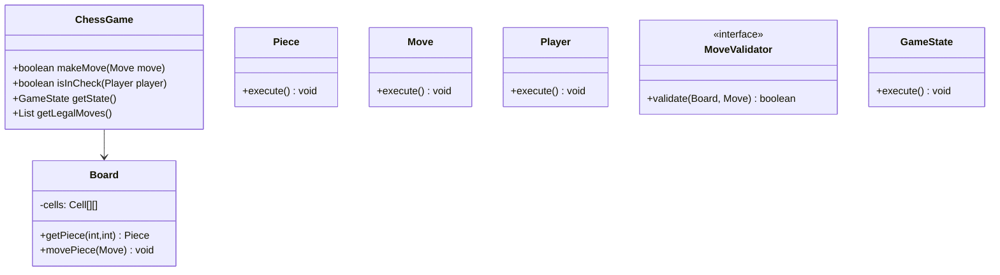
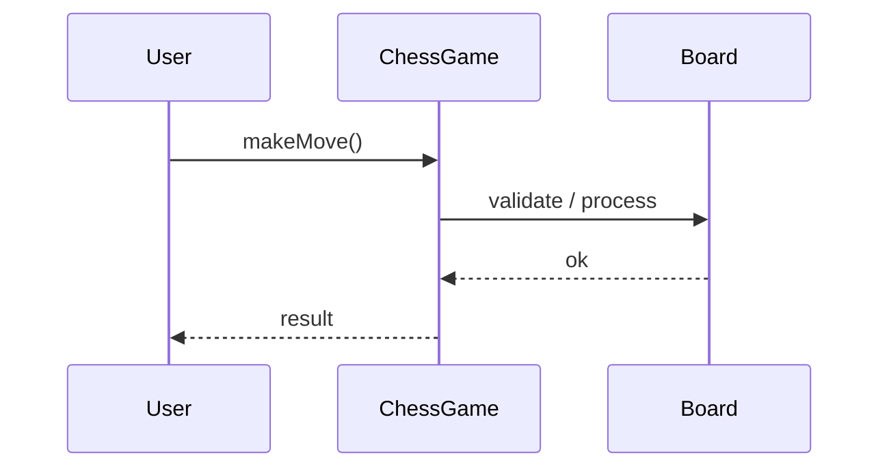
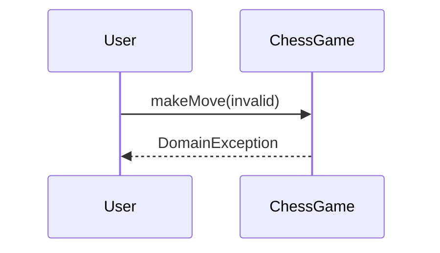

# Chess Game

**Track:** Classic OOD  
**Companies:** Microsoft, Google, Meta  
**Difficulty:** Hard  

---

## Case Study

> **Full case study:** [CS-LLD-O06-chess.md](../../../Case Studies/lld/classic-ood/CS-LLD-O06-chess.md)
> **Read order:** Case Study → this question → [Java implementation](../../09-code-implementations/)

**Business context:** Real-world context modeled after Chess.com game engine and move validation. Read the full case study for requirements, constraints, ADRs, and ops.

**Key constraints:** budget, timeline, team size, tech stack

---

## 1. Problem Statement

Design a two-player chess game with move validation, check/checkmate, turn management.

---

## 2. Clarifying Questions

| # | Question | Expected answer |
|---|----------|-----------------|
| 1 | What is MVP scope for Chess Game? | Core entities + 2 primary user flows |
| 2 | Persistence required? | In-memory; Repository interface if interviewer asks |
| 3 | Multi-threaded access? | Yes if multiple users/gates — else single-threaded |
| 4 | Two players? | Human vs human MVP |
| 5 | Castling / en passant? | Include in move rules |
| 6 | Draw rules? | Stalemate MVP; repetition extension |
| 7 | Undo? | Command pattern extension |

---

## 3. Functional & Non-Functional Requirements

**Functional:**
- Execute game turns with rule validation

**Non-Functional:**
- Clear separation of concerns (SOLID)
- Open-Closed via MoveValidator interface at variation points
- Constructor injection for testability
- Thread-safe if concurrent access is in clarifying assumptions

---

## 4. Core Entities & Relationships

| Entity | Role |
|--------|------|
| `Board` | 8x8 grid |
| `Piece` | Abstract piece |
| `Move` | From/to squares |
| `Player` | Color side |
| `MoveValidator` | Legal move rules |
| `GameState` | ACTIVE/CHECKMATE |

**Nouns → classes:** `Board`, `Piece`, `Move`, `Player`, `MoveValidator`, `GameState`  
**Verbs → methods:** `makeMove()`, `isInCheck()`, `getState()`, `getLegalMoves()`

---

## 5. Class Diagram

```
┌─────────────────────┐       ┌──────────────────┐
│  ChessGame          │──────>│ Strategy         │<<interface>>
│─────────────────────│       │──────────────────│
│ +orchestrate()      │       │ +apply()         │
└─────────┬───────────┘       └────────┬─────────┘
          │ owns                       │ implements
          ▼                   ┌────────▼─────────┐
┌─────────────────────┐       │ ConcreteStrategy │
│  Board              │       └──────────────────┘
└─────────┬───────────┘
          │ *
          ▼
┌─────────────────────┐     ┌──────────────────┐
│  Piece              │────>│  Move            │
└─────────────────────┘     └──────────────────┘
```



---

## 6. Public API / Key Methods

```java
public class ChessGame {
    public boolean makeMove(Move move);
    public boolean isInCheck(Player player);
    public GameState getState();
    public List<Move> getLegalMoves();
}
```

---

## 7. Design Patterns & SOLID

| Pattern | Application |
|---------|-------------|
| Strategy | Per-piece move rules |
| Template Method | Turn loop skeleton |

**SOLID:**
- **S:** ChessGame orchestrates; entities hold state
- **O:** New behavior via new MoveValidator impl
- **D:** Depend on MoveValidator interface

---

## 8. Sequence Diagrams

**Happy path:**



**Failure path:**



---

## 9. Extensibility

> "New `Strategy` implementation plugs in at runtime — no change to `ChessGame`."
>
> "Add new `Board` subtypes or enum values for new categories — Open-Closed."

---

## 10. Tradeoffs

| Decision | A | B | Pick |
|----------|---|---|------|
| Piece rules | switch type | polymorphism | polymorphism — OCP |
| Move validation | in Piece | MoveValidator | split — SRP |
| Board | 2D array | Map of squares | 2D array — simple |
| Undo | none | Command | Command extension |

---

## 11. Concurrency & Edge Cases

- Single-threaded MVP unless clarifying assumes concurrent access
- If multi-user: synchronize on mutable aggregates or use concurrent collections
- Fail fast on invalid input with domain exceptions
- Idempotent retries where duplicate operations are possible

---

## 12. Interview Answer Script (15 min)

> "I'll design Chess Game — clarify in-memory scope and MVP flows first."
>
> "Entities: `Board`, `Piece`, `Move`, `Player`, `MoveValidator`, `GameState`. Domain structure separate from `ChessGame` orchestration."
>
> "Problem: Design a two-player chess game with move validation, check/checkmate, turn management."
>
> "`Board` — 8x8 grid; owns its own invariants."
>
> "`Piece` — abstract piece; owns its own invariants."
>
> "`Move` — from/to squares; owns its own invariants."
>
> "`ChessGame` validates input, coordinates entities, returns typed results."
>
> "Identify variation points — inject interfaces for Open-Closed extensibility."
>
> "Walk happy path on whiteboard, then failure case with domain exception."
>
> "Tradeoff: enum vs State pattern; Strategy vs if/else — pick with justification."

---

## 13. Follow-Up Questions

1. Implement castling and en passant?
2. Add move history with Command undo?
3. Detect threefold repetition?
4. AI opponent via minimax extension?

---

## 14. Related Links

- [Strategy pattern](../../01-core-concepts/design-patterns-gof.md)
- [SOLID principles](../../01-core-concepts/solid-principles.md)
- [Concurrency fundamentals](../../01-core-concepts/concurrency-fundamentals.md)
- [Java implementation](../../09-code-implementations/java/classic/chess/Demo.java) (full)
