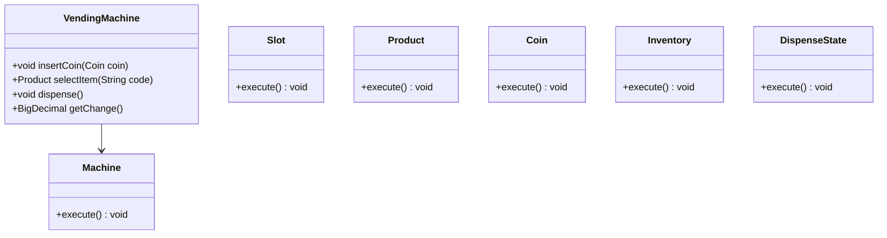
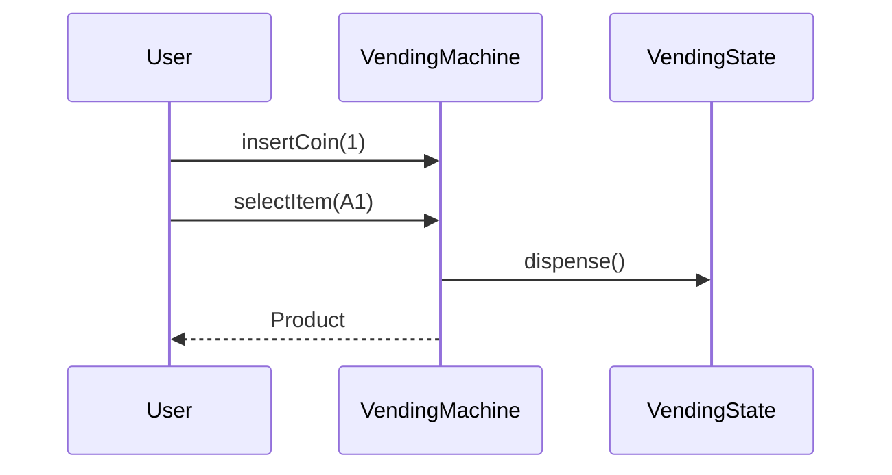
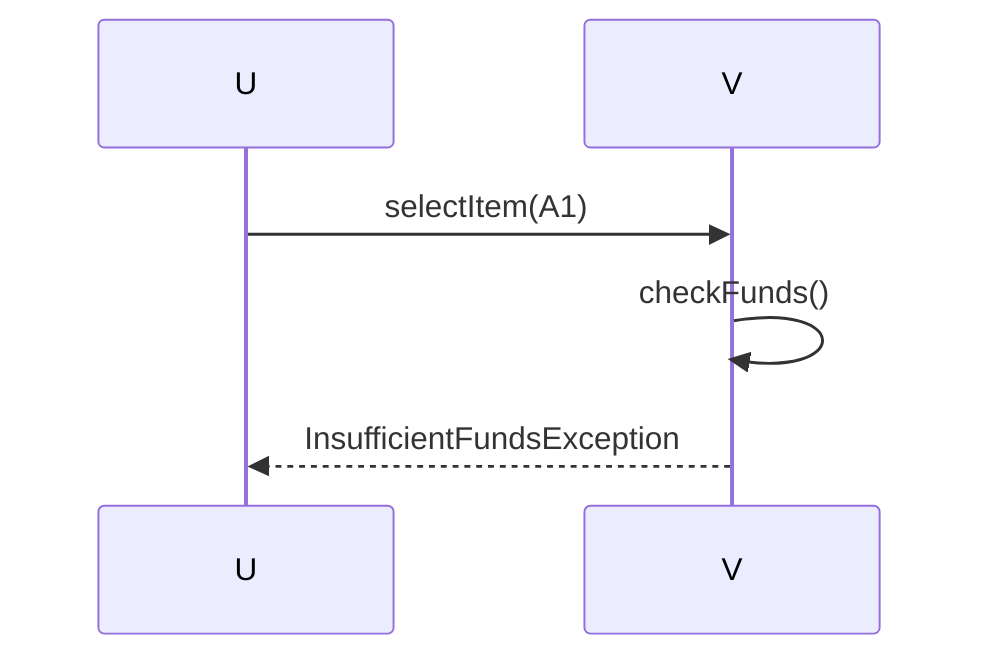

# Vending Machine

**Track:** Classic OOD  
**Companies:** Amazon, Coca-Cola  
**Difficulty:** Medium  

---

## Case Study

> **Full case study:** [CS-LLD-O10-vending-machine.md](../../../Case Studies/lld/classic-ood/CS-LLD-O10-vending-machine.md)
> **Read order:** Case Study → this question → [Java implementation](../09-code-implementations/)

**Business context:** Real-world context modeled after Automated retail inventory and change. Read the full case study for requirements, constraints, ADRs, and ops.

**Key constraints:** budget, timeline, team size, tech stack

---

## 1. Problem Statement

Design vending machine: select item, insert coins, dispense, return change.

---

## 2. Clarifying Questions

| # | Question | Expected answer |
|---|----------|-----------------|
| 1 | What is MVP scope for Vending Machine? | Core entities + 2 primary flows; extensions deferred |
| 2 | Persistence? | In-memory; Repository interface if interviewer asks |
| 3 | Multi-threaded? | Synchronize shared state if concurrent users assumed |
| 4 | Requirement: Design vending machine? | Include in MVP — Design vending machine |
| 5 | Requirement: select item? | Include in MVP — select item |
| 6 | Requirement: insert coins? | Include in MVP — insert coins |
| 7 | Scale to distributed? | Single JVM LLD; pivot HLD if asked |
| 8 | Scale to distributed? | Single JVM LLD; pivot HLD if asked |

---

## 3. Functional & Non-Functional Requirements

**Functional:**
- VendingMachine handles primary workflow described in requirements
- Validate inputs before state changes
- Enforce domain constraints with exceptions
- Support listing and lookup of core entities

**Non-Functional:**
- Clear separation of concerns (SOLID)
- Open-Closed via State interface at variation points
- Constructor injection for testability
- Thread-safe if concurrent access is in clarifying assumptions

---

## 4. Core Entities & Relationships

| Entity | Role |
|--------|------|
| `Machine` | Inventory + cash |
| `Slot` | Product row |
| `Product` | Item |
| `Coin` | Denomination |
| `Inventory` | Stock count |
| `DispenseState` | Idle/selection/payment |

**Nouns → classes:** `Machine`, `Slot`, `Product`, `Coin`, `Inventory`, `DispenseState`  
**Verbs → methods:** `insertCoin()`, `selectItem()`, `dispense()`, `getChange()`

---

## 5. Class Diagram

```
┌─────────────────────┐       ┌──────────────────┐
│  VendingMachine     │──────>│ State            │<<interface>>
│─────────────────────│       │──────────────────│
│ +orchestrate()      │       │ +apply()         │
└─────────┬───────────┘       └────────┬─────────┘
          │ owns                       │ implements
          ▼                   ┌────────▼─────────┐
┌─────────────────────┐       │ ConcreteState    │
│  Machine            │       └──────────────────┘
└─────────┬───────────┘
          │ *
          ▼
┌─────────────────────┐     ┌──────────────────┐
│  Slot               │────>│  Product         │
└─────────────────────┘     └──────────────────┘
```



---

## 6. Public API / Key Methods

```java
public class VendingMachine {
    public void insertCoin(Coin coin);
    public Product selectItem(String code);
    public void dispense();
    public BigDecimal getChange();
}
```

---

## 7. Design Patterns & SOLID

| Pattern | Application |
|---------|-------------|
| State | Idle / has-money / dispensing |
| Strategy | Change-making algorithm |

**SOLID:**
- **S:** VendingMachine orchestrates; entities hold state
- **O:** New behavior via new State impl
- **D:** Depend on State interface

---

## 8. Sequence Diagrams

**Happy path:**



**Failure path:**



---

## 9. Extensibility

> "Card payment: new PaymentProcessor alongside coin flow."
>
> "New product category: extend Product type enum and slot configuration."

---

## 10. Tradeoffs

| Decision | A | B | Pick |
|----------|---|---|------|
| State | enum | State pattern | State — side effects per state |
| Change | greedy coins | DP optimal | greedy — US coin standard |
| Inventory | per slot | central | per slot — realistic |
| Payment | coins only | multi-method | coins MVP |

---

## 11. Concurrency & Edge Cases

- Single-threaded MVP unless clarifying assumes concurrent access
- If multi-user: synchronize on mutable aggregates or use concurrent collections
- Fail fast on invalid input with domain exceptions
- Idempotent retries where duplicate operations are possible

---

## 12. Interview Answer Script (15 min)

> "I'll design Vending Machine — clarify in-memory scope and MVP flows first."
>
> "Entities: `Machine`, `Slot`, `Product`, `Coin`, `Inventory`, `DispenseState`. Domain structure separate from `VendingMachine` orchestration."
>
> "Problem: Design vending machine: select item, insert coins, dispense, return change."
>
> "`Machine` — inventory + cash; owns its own invariants."
>
> "`Slot` — product row; owns its own invariants."
>
> "`Product` — item; owns its own invariants."
>
> "`VendingMachine` validates input, coordinates entities, returns typed results."
>
> "Identify variation points — inject interfaces for Open-Closed extensibility."
>
> "Walk happy path on whiteboard, then failure case with domain exception."
>
> "Tradeoff: enum vs State pattern; Strategy vs if/else — pick with justification."

---

## 13. Follow-Up Questions

1. How would you unit test `State` in isolation?
2. How would you extend Vending Machine without modifying core service?
3. How would you add persistence behind a Repository?
4. How does this map to a distributed HLD?

---

## 14. Related Links

- [Strategy pattern](../../01-core-concepts/design-patterns-gof.md)
- [SOLID principles](../../01-core-concepts/solid-principles.md)
- [Concurrency fundamentals](../../01-core-concepts/concurrency-fundamentals.md)
- [Java implementation](../../09-code-implementations/java/classic/vending-machine/) (full)
