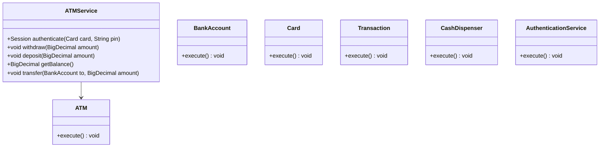
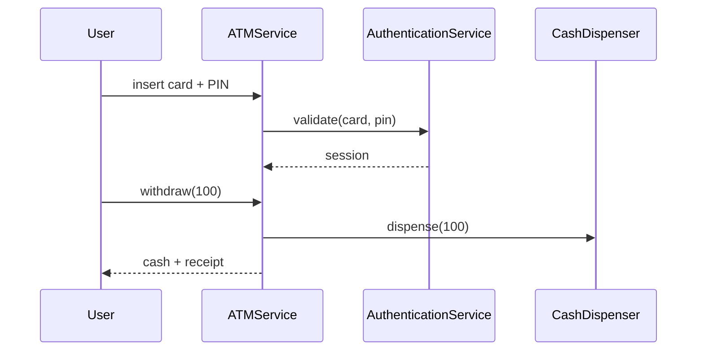
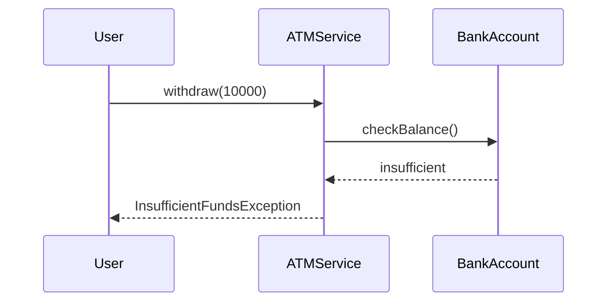

# ATM Machine

**Track:** Classic OOD  
**Companies:** Citibank, Amazon, Wells Fargo  
**Difficulty:** Medium  

---

## Case Study

> **Full case study:** [CS-LLD-O11-atm.md](../../../Case Studies/lld/classic-ood/CS-LLD-O11-atm.md)
> **Read order:** Case Study → this question → [Java implementation](../09-code-implementations/)

**Business context:** Real-world context modeled after NCR ATM transaction and cash dispensing. Read the full case study for requirements, constraints, ADRs, and ops.

**Key constraints:** budget, timeline, team size, tech stack

---

## 1. Problem Statement

Design ATM: card auth, PIN, balance, withdraw, deposit, transfer.

---

## 2. Clarifying Questions

| # | Question | Expected answer |
|---|----------|-----------------|
| 1 | Single ATM or bank network? | Single terminal MVP; network extension |
| 2 | Card authentication? | Insert card + 4-digit PIN |
| 3 | Supported operations? | Withdraw, deposit, balance inquiry, transfer |
| 4 | Cash denominations? | Configurable — $20 bills default in dispenser |
| 5 | Daily withdraw limit? | Per-account limit enforced |
| 6 | Concurrent sessions? | One active session per ATM |
| 7 | Receipt printing? | Optional ReceiptPrinter interface |
| 8 | Persistence? | In-memory BankAccount registry |

---

## 3. Functional & Non-Functional Requirements

**Functional:**
- Authenticate card + PIN before any transaction
- Withdraw if sufficient balance and CashDispenser has notes
- Deposit increases balance without dispensing
- Transfer between accounts at same bank

**Non-Functional:**
- Clear separation of concerns (SOLID)
- Open-Closed via TransactionStrategy interface at variation points
- Constructor injection for testability
- Thread-safe if concurrent access is in clarifying assumptions

---

## 4. Core Entities & Relationships

| Entity | Role |
|--------|------|
| `ATM` | Terminal |
| `BankAccount` | Balance |
| `Card` | Auth token |
| `Transaction` | Audit record |
| `CashDispenser` | Notes out |
| `AuthenticationService` | PIN check |

**Nouns → classes:** `ATM`, `BankAccount`, `Card`, `Transaction`, `CashDispenser`, `AuthenticationService`  
**Verbs → methods:** `authenticate(card, pin)`, `withdraw(amount)`, `deposit(amount)`, `transfer(to, amount)`

---

## 5. Class Diagram

```
┌─────────────────────┐       ┌──────────────────┐
│  ATMService         │──────>│ State            │<<interface>>
│─────────────────────│       │──────────────────│
│ +orchestrate()      │       │ +apply()         │
└─────────┬───────────┘       └────────┬─────────┘
          │ owns                       │ implements
          ▼                   ┌────────▼─────────┐
┌─────────────────────┐       │ ConcreteState    │
│  ATM                │       └──────────────────┘
└─────────┬───────────┘
          │ *
          ▼
┌─────────────────────┐     ┌──────────────────┐
│  BankAccount        │────>│  Card            │
└─────────────────────┘     └──────────────────┘
```



---

## 6. Public API / Key Methods

```java
public class ATMService {
    public Session authenticate(Card card, String pin);
    public void withdraw(BigDecimal amount);
    public void deposit(BigDecimal amount);
    public BigDecimal getBalance();
    public void transfer(BankAccount to, BigDecimal amount);
}
```

---

## 7. Design Patterns & SOLID

| Pattern | Application |
|---------|-------------|
| State | ATM session: idle, authenticated, transaction |
| Strategy | Transaction type handlers |

**SOLID:**
- **S:** ATMService orchestrates; entities hold state
- **O:** New behavior via new TransactionStrategy impl
- **D:** Depend on TransactionStrategy interface

---

## 8. Sequence Diagrams

**Happy path:**



**Failure path:**



---

## 9. Extensibility

> "New `Command` implementation plugs in at runtime — no change to `ATMService`."
>
> "Add new `ATM` subtypes or enum values for new categories — Open-Closed."

---

## 10. Tradeoffs

| Decision | A | B | Pick |
|----------|---|---|------|
| Variation | if/else | Command | Command — 2+ behaviors |
| State | enum | State pattern | enum for simple lifecycles |
| Storage | in-memory | Repository | in-memory MVP |
| API return | primitive | domain object | domain object — type safety |

---

## 11. Concurrency & Edge Cases

- One session per ATM — synchronized session state
- Insufficient funds → InsufficientFundsException
- Wrong PIN 3 times → CardRetainedException
- Dispenser empty → TemporarilyUnavailableException

---

## 12. Interview Answer Script (15 min)

> "ATM is a facade over authentication, account operations, and cash hardware."
>
> "Session state machine: IDLE until card inserted, AUTHENTICATED after PIN, back to IDLE on eject."
>
> "AuthenticationService validates PIN against Card — not stored on ATM."
>
> "Withdraw checks balance, daily limit, then asks CashDispenser for note combination."
>
> "Deposit updates balance immediately — no cash validation in MVP."
>
> "Transfer debits source, credits target atomically on same bank."
>
> "Transaction log records every operation for audit."
>
> "HLD: ATM connects to core banking via secure API; LLD models terminal behavior."

---

## 13. Follow-Up Questions

1. How to model cash denomination optimization in dispenser?
2. Design for ATM network with shared cash management?
3. How to prevent concurrent sessions on same card?
4. Rollback if dispense fails after debit?

---

## 14. Related Links

- [Strategy pattern](../../01-core-concepts/design-patterns-gof.md)
- [SOLID principles](../../01-core-concepts/solid-principles.md)
- [Concurrency fundamentals](../../01-core-concepts/concurrency-fundamentals.md)
- [Java implementation](../../09-code-implementations/java/classic/atm/) (full)
