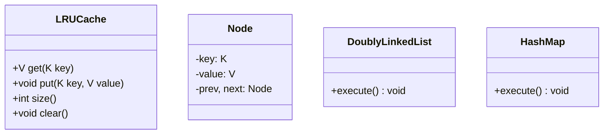
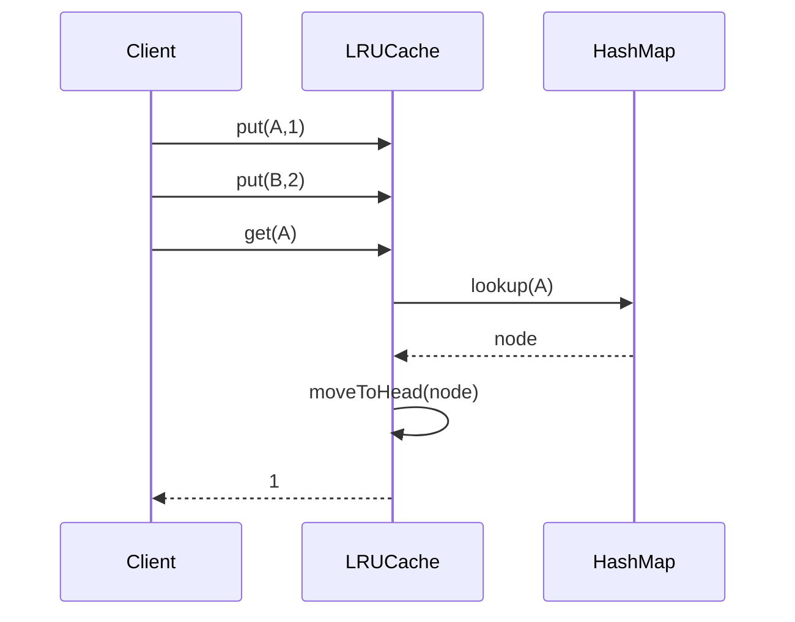
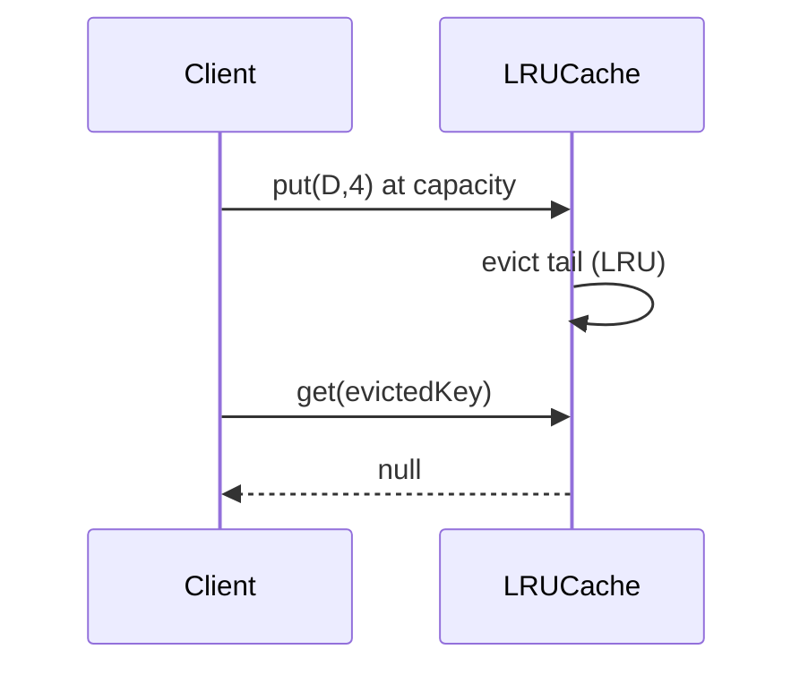

# LRU Cache

**Track:** Classic OOD  
**Companies:** Amazon, Google, Meta  
**Difficulty:** Medium  

---

## Case Study

> **Full case study:** [CS-LLD-O13-lru-cache.md](../../../Case Studies/lld/classic-ood/CS-LLD-O13-lru-cache.md)
> **End-to-end pair:** [Distributed Cache / LRU](../../../Case Studies/paired/CS-PAIR-07-distributed-cache-lru.md)
> **Read order:** Case Study → this question → [Java implementation](../09-code-implementations/)

**Business context:** Real-world context modeled after Redis and Memcached — in-process cache vs distributed cache. Read the full case study for requirements, constraints, ADRs, and ops.

**Key constraints:** budget, timeline, team size, tech stack

---

## 1. Problem Statement

Design in-memory LRU cache with O(1) get/put and capacity eviction.

---

## 2. Clarifying Questions

| # | Question | Expected answer |
|---|----------|-----------------|
| 1 | Capacity fixed or dynamic? | Fixed at construction |
| 2 | Thread-safe? | Single-threaded MVP; concurrent variant separate |
| 3 | Eviction policy? | Least Recently Used only |
| 4 | Null keys/values allowed? | No — reject null |
| 5 | get() behavior on miss? | Return null or Optional.empty |
| 6 | put() on existing key? | Update value and mark most recent |
| 7 | Time complexity requirement? | O(1) get and put |
| 8 | Persistence? | In-memory only |

---

## 3. Functional & Non-Functional Requirements

**Functional:**
- get(key) returns value and marks entry most recently used
- put(key, value) inserts or updates; evicts LRU when at capacity
- O(1) operations via HashMap + doubly linked list
- Evict least recently used entry when size exceeds capacity

**Non-Functional:**
- Clear separation of concerns (SOLID)
- Open-Closed via EvictionPolicy interface at variation points
- Constructor injection for testability
- Thread-safe if concurrent access is in clarifying assumptions

---

## 4. Core Entities & Relationships

| Entity | Role |
|--------|------|
| `LRUCache` | Capacity-bound store |
| `Node` | Key-value DLL node |
| `DoublyLinkedList` | Recency order |
| `HashMap` | Key to node |

**Nouns → classes:** `LRUCache`, `Node`, `DoublyLinkedList`, `HashMap`  
**Verbs → methods:** `get(key)`, `put(key, value)`

---

## 5. Class Diagram

```
┌─────────────────────┐       ┌──────────────────┐
│  LRUCache           │──────>│ Composite        │<<interface>>
│─────────────────────│       │──────────────────│
│ +orchestrate()      │       │ +apply()         │
└─────────┬───────────┘       └────────┬─────────┘
          │ owns                       │ implements
          ▼                   ┌────────▼─────────┐
┌─────────────────────┐       │ ConcreteComposite│
│  LRUCache           │       └──────────────────┘
└─────────┬───────────┘
          │ *
          ▼
┌─────────────────────┐     ┌──────────────────┐
│  Node               │────>│  DoublyLinkedList│
└─────────────────────┘     └──────────────────┘
```



---

## 6. Public API / Key Methods

```java
public class LRUCache {
    public V get(K key);
    public void put(K key, V value);
    public int size();
    public void clear();
}
```

---

## 7. Design Patterns & SOLID

| Pattern | Application |
|---------|-------------|
| Composite | HashMap + DLL working together |
| Template | EvictionPolicy hook optional |

**SOLID:**
- **S:** LRUCache orchestrates; entities hold state
- **O:** New behavior via new EvictionPolicy impl
- **D:** Depend on EvictionPolicy interface

---

## 8. Sequence Diagrams

**Happy path:**



**Failure path:**



---

## 9. Extensibility

> "New `Doubly Linked List + HashMap` implementation plugs in at runtime — no change to `LRUCache`."
>
> "Add new `LRUCache` subtypes or enum values for new categories — Open-Closed."

---

## 10. Tradeoffs

| Decision | A | B | Pick |
|----------|---|---|------|
| Structure | LinkedHashMap | HashMap + DLL | DLL — explicit O(1) control |
| Eviction | FIFO | LRU | LRU per requirement |
| Thread safety | None | synchronized | sync for MVP concurrent |
| Capacity | fixed | dynamic resize | fixed at construction |

---

## 11. Concurrency & Edge Cases

- Single-threaded — no locking needed in MVP
- Capacity 0 → reject put or no-op per design choice
- get on missing key → return null
- put same key → update in place, no size change, mark MRU

---

## 12. Interview Answer Script (15 min)

> "LRUCache combines HashMap for O(1) lookup with doubly linked list for recency order."
>
> "Each Node holds key, value, prev, next pointers."
>
> "get: lookup node in map; if miss return null; else move node to head and return value."
>
> "put: if key exists update value and move to head; else add at head, evict tail if over capacity."
>
> "Dummy head/tail sentinels simplify edge cases — no null checks on insert."
>
> "Eviction removes tail.prev from both list and map."
>
> "This is classic LLD — interviewer may ask concurrent version next."
>
> "HLD: distributed cache uses Redis with TTL; LLD teaches local eviction logic."

---

## 13. Follow-Up Questions

1. Design thread-safe LRU cache?
2. How to add TTL expiry alongside LRU?
3. Implement LFU instead — what changes?
4. How would Redis implement approximate LRU?

---

## 14. Related Links

- [Strategy pattern](../../01-core-concepts/design-patterns-gof.md)
- [SOLID principles](../../01-core-concepts/solid-principles.md)
- [Concurrency fundamentals](../../01-core-concepts/concurrency-fundamentals.md)
- [Java implementation](../../09-code-implementations/java/classic/lru-cache/) (full)
