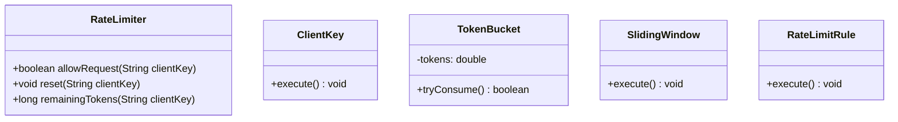
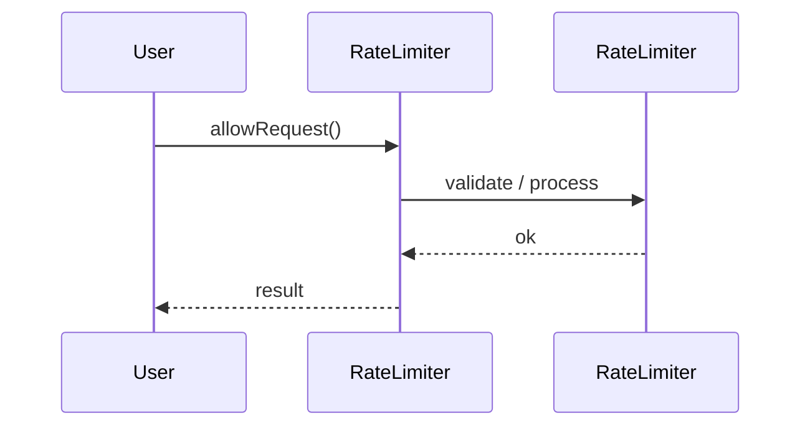
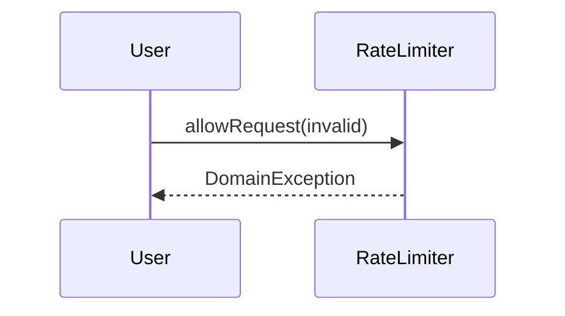

# Rate Limiter

**Track:** Classic OOD  
**Companies:** Amazon, Stripe, Cloudflare  
**Difficulty:** Medium  

---

## Case Study

> **Full case study:** [CS-LLD-O14-rate-limiter.md](../../../Case Studies/lld/classic-ood/CS-LLD-O14-rate-limiter.md)
> **End-to-end pair:** [Rate-Limited API Platform](../../../Case Studies/paired/CS-PAIR-04-rate-limited-api.md)
> **Read order:** Case Study → this question → [Java implementation](../../09-code-implementations/)

**Business context:** Real-world context modeled after Stripe rate limiter and Envoy local rate limit. Read the full case study for requirements, constraints, ADRs, and ops.

**Key constraints:** budget, timeline, team size, tech stack

---

## 1. Problem Statement

Design rate limiter: allow N requests per window per client key.

---

## 2. Clarifying Questions

| # | Question | Expected answer |
|---|----------|-----------------|
| 1 | What is MVP scope for Rate Limiter? | Core entities + 2 primary user flows |
| 2 | Persistence required? | In-memory; Repository interface if interviewer asks |
| 3 | Multi-threaded access? | Yes if multiple users/gates — else single-threaded |
| 4 | Per client key? | userId or IP string |
| 5 | Algorithm? | Token bucket default; sliding window via Strategy |
| 6 | Burst allowed? | Yes — bucket capacity > steady rate |
| 7 | Distributed? | HLD — in-process only for LLD |

---

## 3. Functional & Non-Functional Requirements

**Functional:**
- RateLimiter handles primary workflow described in requirements
- Validate inputs before state changes
- Enforce domain constraints with exceptions
- Support listing and lookup of core entities

**Non-Functional:**
- Clear separation of concerns (SOLID)
- Open-Closed via RateLimitAlgorithm interface at variation points
- Constructor injection for testability
- Thread-safe if concurrent access is in clarifying assumptions

---

## 4. Core Entities & Relationships

| Entity | Role |
|--------|------|
| `RateLimiter` | Facade |
| `ClientKey` | User/IP id |
| `TokenBucket` | Burst control |
| `SlidingWindow` | Time buckets |
| `RateLimitRule` | N per window |

**Nouns → classes:** `RateLimiter`, `ClientKey`, `TokenBucket`, `SlidingWindow`, `RateLimitRule`  
**Verbs → methods:** `allowRequest()`, `reset()`, `remainingTokens()`

---

## 5. Class Diagram

```
┌─────────────────────┐       ┌──────────────────┐
│  RateLimiter        │──────>│ Strategy         │<<interface>>
│─────────────────────│       │──────────────────│
│ +orchestrate()      │       │ +apply()         │
└─────────┬───────────┘       └────────┬─────────┘
          │ owns                       │ implements
          ▼                   ┌────────▼─────────┐
┌─────────────────────┐       │ ConcreteStrategy │
│  RateLimiter        │       └──────────────────┘
└─────────┬───────────┘
          │ *
          ▼
┌─────────────────────┐     ┌──────────────────┐
│  ClientKey          │────>│  TokenBucket     │
└─────────────────────┘     └──────────────────┘
```



---

## 6. Public API / Key Methods

```java
public class RateLimiter {
    public boolean allowRequest(String clientKey);
    public void reset(String clientKey);
    public long remainingTokens(String clientKey);
}
```

---

## 7. Design Patterns & SOLID

| Pattern | Application |
|---------|-------------|
| Strategy | Token bucket vs sliding window |

**SOLID:**
- **S:** RateLimiter orchestrates; entities hold state
- **O:** New behavior via new RateLimitAlgorithm impl
- **D:** Depend on RateLimitAlgorithm interface

---

## 8. Sequence Diagrams

**Happy path:**



**Failure path:**



---

## 9. Extensibility

> "New `Strategy` implementation plugs in at runtime — no change to `RateLimiter`."
>
> "Add new `RateLimiter` subtypes or enum values for new categories — Open-Closed."

---

## 10. Tradeoffs

| Decision | A | B | Pick |
|----------|---|---|------|
| Variation | if/else | Strategy | Strategy — 2+ behaviors |
| State | enum | State pattern | enum for simple lifecycles |
| Storage | in-memory | Repository | in-memory MVP |
| API return | primitive | domain object | domain object — type safety |

---

## 11. Concurrency & Edge Cases

- synchronized allowRequest or AtomicLong for token count
- Refill tokens based on elapsed time — monotonic clock
- Per-client map — ConcurrentHashMap for client state
- RateLimitExceededException when rejected

---

## 12. Interview Answer Script (15 min)

> "I'll design Rate Limiter — clarify in-memory scope and MVP flows first."
>
> "Entities: `RateLimiter`, `ClientKey`, `TokenBucket`, `SlidingWindow`, `RateLimitRule`. Domain structure separate from `RateLimiter` orchestration."
>
> "Problem: Design rate limiter: allow N requests per window per client key."
>
> "`RateLimiter` — facade; owns its own invariants."
>
> "`ClientKey` — user/ip id; owns its own invariants."
>
> "`TokenBucket` — burst control; owns its own invariants."
>
> "`RateLimiter` validates input, coordinates entities, returns typed results."
>
> "Identify variation points — inject interfaces for Open-Closed extensibility."
>
> "Walk happy path on whiteboard, then failure case with domain exception."
>
> "Tradeoff: enum vs State pattern; Strategy vs if/else — pick with justification."

---

## 13. Follow-Up Questions

1. How would you unit test `Strategy` in isolation?
2. How would you extend Rate Limiter without modifying core service?
3. How would you add persistence behind a Repository?
4. How does this map to a distributed HLD?

---

## 14. Related Links

- [Strategy pattern](../../01-core-concepts/design-patterns-gof.md)
- [SOLID principles](../../01-core-concepts/solid-principles.md)
- [Concurrency fundamentals](../../01-core-concepts/concurrency-fundamentals.md)
- [Java implementation](../../09-code-implementations/java/classic/rate-limiter/RateLimiter.java) (full)
