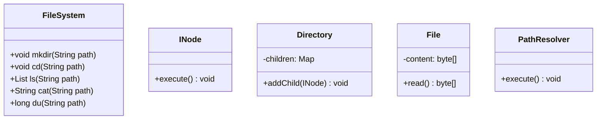
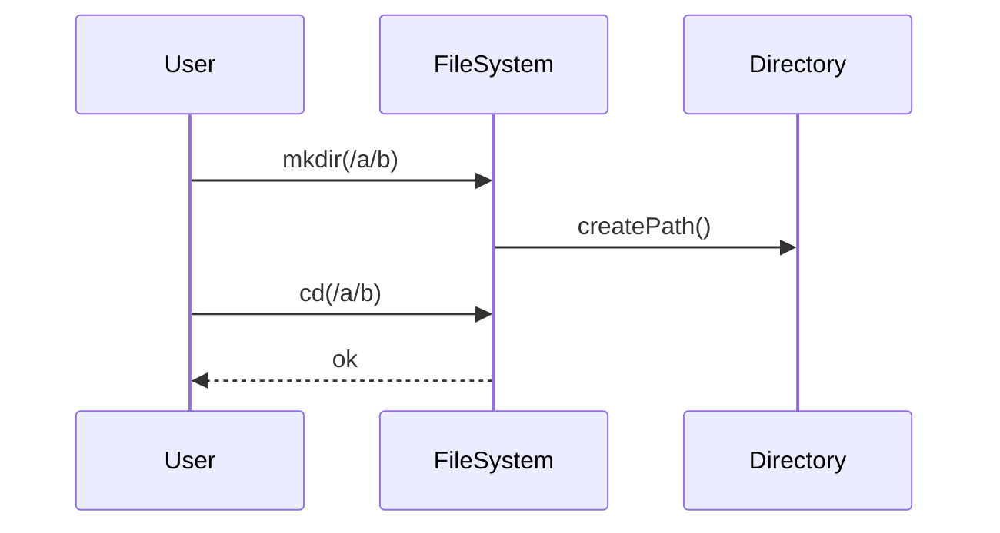
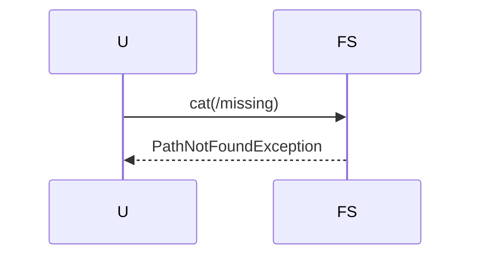

# In-Memory File System

**Track:** Classic OOD  
**Companies:** Amazon, Google  
**Difficulty:** Hard  

---

## Case Study

> **Full case study:** [CS-LLD-O17-in-memory-file-system.md](../../../Case Studies/lld/classic-ood/CS-LLD-O17-in-memory-file-system.md)
> **Read order:** Case Study → this question → [Java implementation](../../09-code-implementations/)

**Business context:** Real-world context modeled after Leading products in the In-Memory File System domain. Read the full case study for requirements, constraints, ADRs, and ops.

**Key constraints:** budget, timeline, team size, tech stack

---

## 1. Problem Statement

Design Unix-like in-memory FS: mkdir, ls, cd, touch, cat, find.

---

## 2. Clarifying Questions

| # | Question | Expected answer |
|---|----------|-----------------|
| 1 | What is MVP scope for In-Memory File System? | Core entities + 2 primary user flows |
| 2 | Persistence required? | In-memory; Repository interface if interviewer asks |
| 3 | Multi-threaded access? | Yes if multiple users/gates — else single-threaded |
| 4 | Operations? | mkdir, ls, cd, touch, cat, find, du |
| 5 | Symlinks? | Extension |
| 6 | Permissions? | Extension |
| 7 | Max file size? | Unbounded in-memory |

---

## 3. Functional & Non-Functional Requirements

**Functional:**
- FileSystem handles primary workflow described in requirements
- Validate inputs before state changes
- Enforce domain constraints with exceptions
- Support listing and lookup of core entities

**Non-Functional:**
- Clear separation of concerns (SOLID)
- Open-Closed via INode interface at variation points
- Constructor injection for testability
- Thread-safe if concurrent access is in clarifying assumptions

---

## 4. Core Entities & Relationships

| Entity | Role |
|--------|------|
| `FileSystem` | Root / |
| `INode` | File or directory |
| `Directory` | Children map |
| `File` | Byte content |
| `PathResolver` | Normalize paths |

**Nouns → classes:** `FileSystem`, `INode`, `Directory`, `File`, `PathResolver`  
**Verbs → methods:** `mkdir()`, `cd()`, `ls()`, `cat()`

---

## 5. Class Diagram

```
┌─────────────────────┐       ┌──────────────────┐
│  FileSystem         │──────>│ Composite        │<<interface>>
│─────────────────────│       │──────────────────│
│ +orchestrate()      │       │ +apply()         │
└─────────┬───────────┘       └────────┬─────────┘
          │ owns                       │ implements
          ▼                   ┌────────▼─────────┐
┌─────────────────────┐       │ ConcreteComposite│
│  FileSystem         │       └──────────────────┘
└─────────┬───────────┘
          │ *
          ▼
┌─────────────────────┐     ┌──────────────────┐
│  INode              │────>│  Directory       │
└─────────────────────┘     └──────────────────┘
```



---

## 6. Public API / Key Methods

```java
public class FileSystem {
    public void mkdir(String path);
    public void cd(String path);
    public List<String> ls(String path);
    public String cat(String path);
    public long du(String path);
}
```

---

## 7. Design Patterns & SOLID

| Pattern | Application |
|---------|-------------|
| Composite | Directory contains files and subdirs |

**SOLID:**
- **S:** FileSystem orchestrates; entities hold state
- **O:** New behavior via new INode impl
- **D:** Depend on INode interface

---

## 8. Sequence Diagrams

**Happy path:**



**Failure path:**



---

## 9. Extensibility

> "New `Composite` implementation plugs in at runtime — no change to `FileSystem`."
>
> "Add new `FileSystem` subtypes or enum values for new categories — Open-Closed."

---

## 10. Tradeoffs

| Decision | A | B | Pick |
|----------|---|---|------|
| Variation | if/else | Composite | Composite — 2+ behaviors |
| State | enum | State pattern | enum for simple lifecycles |
| Storage | in-memory | Repository | in-memory MVP |
| API return | primitive | domain object | domain object — type safety |

---

## 11. Concurrency & Edge Cases

- Single-threaded MVP unless clarifying assumes concurrent access
- If multi-user: synchronize on mutable aggregates or use concurrent collections
- Fail fast on invalid input with domain exceptions
- Idempotent retries where duplicate operations are possible

---

## 12. Interview Answer Script (15 min)

> "I'll design In-Memory File System — clarify in-memory scope and MVP flows first."
>
> "Entities: `FileSystem`, `INode`, `Directory`, `File`, `PathResolver`. Domain structure separate from `FileSystem` orchestration."
>
> "Problem: Design Unix-like in-memory FS: mkdir, ls, cd, touch, cat, find."
>
> "`FileSystem` — root /; owns its own invariants."
>
> "`INode` — file or directory; owns its own invariants."
>
> "`Directory` — children map; owns its own invariants."
>
> "`FileSystem` validates input, coordinates entities, returns typed results."
>
> "Identify variation points — inject interfaces for Open-Closed extensibility."
>
> "Walk happy path on whiteboard, then failure case with domain exception."
>
> "Tradeoff: enum vs State pattern; Strategy vs if/else — pick with justification."

---

## 13. Follow-Up Questions

1. Add permissions chmod?
2. Symbolic links?
3. Copy/move operations?
4. Persist FS snapshot?

---

## 14. Related Links

- [Strategy pattern](../../01-core-concepts/design-patterns-gof.md)
- [SOLID principles](../../01-core-concepts/solid-principles.md)
- [Concurrency fundamentals](../../01-core-concepts/concurrency-fundamentals.md)
- [Java implementation](../../09-code-implementations/java/classic/in-memory-file-system/Demo.java) (full)
