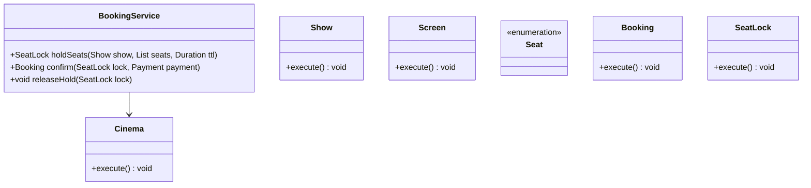
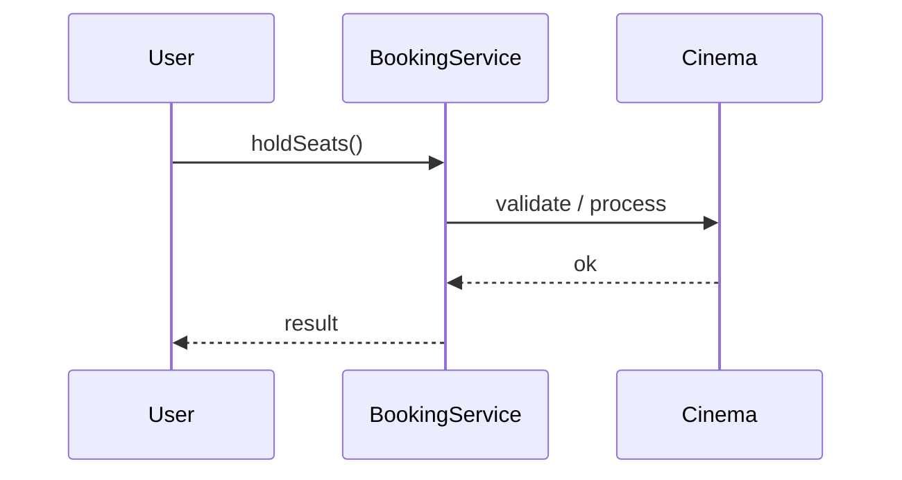
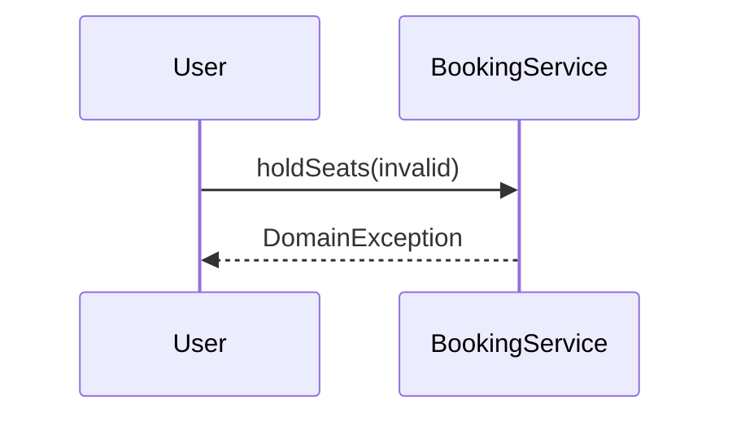

# Movie Ticket Booking

**Track:** Classic OOD  
**Companies:** BookMyShow, Amazon  
**Difficulty:** Medium  

---

## Case Study

> **Full case study:** [CS-LLD-O19-movie-ticket-booking.md](../../../Case Studies/lld/classic-ood/CS-LLD-O19-movie-ticket-booking.md)
> **Read order:** Case Study → this question → [Java implementation](../09-code-implementations/)

**Business context:** Real-world context modeled after BookMyShow seat lock and payment. Read the full case study for requirements, constraints, ADRs, and ops.

**Key constraints:** budget, timeline, team size, tech stack

---

## 1. Problem Statement

Design cinema booking: shows, seats, lock seats, payment, confirm.

---

## 2. Clarifying Questions

| # | Question | Expected answer |
|---|----------|-----------------|
| 1 | What is MVP scope for Movie Ticket Booking? | Core entities + 2 primary flows; extensions deferred |
| 2 | Persistence? | In-memory; Repository interface if interviewer asks |
| 3 | Multi-threaded? | Synchronize shared state if concurrent users assumed |
| 4 | Requirement: Design cinema booking? | Include in MVP — Design cinema booking |
| 5 | Requirement: lock seats? | Include in MVP — lock seats |
| 6 | Requirement: payment? | Include in MVP — payment |
| 7 | Scale to distributed? | Single JVM LLD; pivot HLD if asked |
| 8 | Scale to distributed? | Single JVM LLD; pivot HLD if asked |

---

## 3. Functional & Non-Functional Requirements

**Functional:**
- BookingService handles primary workflow described in requirements
- Validate inputs before state changes
- Enforce domain constraints with exceptions
- Support listing and lookup of core entities

**Non-Functional:**
- Clear separation of concerns (SOLID)
- Open-Closed via PricingStrategy interface at variation points
- Constructor injection for testability
- Thread-safe if concurrent access is in clarifying assumptions

---

## 4. Core Entities & Relationships

| Entity | Role |
|--------|------|
| `Cinema` | Theater |
| `Show` | Movie + time |
| `Screen` | Hall |
| `Seat` | Row/col status |
| `Booking` | Confirmed tickets |
| `SeatLock` | Temporary hold |

**Nouns → classes:** `Cinema`, `Show`, `Screen`, `Seat`, `Booking`, `SeatLock`  
**Verbs → methods:** `holdSeats()`, `confirm()`, `releaseHold()`

---

## 5. Class Diagram

```
┌─────────────────────┐       ┌──────────────────┐
│  BookingService     │──────>│ State            │<<interface>>
│─────────────────────│       │──────────────────│
│ +orchestrate()      │       │ +apply()         │
└─────────┬───────────┘       └────────┬─────────┘
          │ owns                       │ implements
          ▼                   ┌────────▼─────────┐
┌─────────────────────┐       │ ConcreteState    │
│  Cinema             │       └──────────────────┘
└─────────┬───────────┘
          │ *
          ▼
┌─────────────────────┐     ┌──────────────────┐
│  Show               │────>│  Screen          │
└─────────────────────┘     └──────────────────┘
```



---

## 6. Public API / Key Methods

```java
public class BookingService {
    public SeatLock holdSeats(Show show, List<Seat> seats, Duration ttl);
    public Booking confirm(SeatLock lock, Payment payment);
    public void releaseHold(SeatLock lock);
}
```

---

## 7. Design Patterns & SOLID

| Pattern | Application |
|---------|-------------|
| State | Seat available / held / booked |
| Strategy | Pricing |

**SOLID:**
- **S:** BookingService orchestrates; entities hold state
- **O:** New behavior via new PricingStrategy impl
- **D:** Depend on PricingStrategy interface

---

## 8. Sequence Diagrams

**Happy path:**



**Failure path:**



---

## 9. Extensibility

> "New `State` implementation plugs in at runtime — no change to `BookingService`."
>
> "Add new `Cinema` subtypes or enum values for new categories — Open-Closed."

---

## 10. Tradeoffs

| Decision | A | B | Pick |
|----------|---|---|------|
| Variation | if/else | State | State — 2+ behaviors |
| State | enum | State pattern | enum for simple lifecycles |
| Storage | in-memory | Repository | in-memory MVP |
| API return | primitive | domain object | domain object — type safety |

---

## 11. Concurrency & Edge Cases

- SeatLock with TTL — synchronized per Seat during hold
- Double booking prevented by atomic seat state transition
- Expired hold releases seat for other buyers
- confirm() validates lock still valid and owned by session

---

## 12. Interview Answer Script (15 min)

> "I'll design Movie Ticket Booking — clarify in-memory scope and MVP flows first."
>
> "Entities: `Cinema`, `Show`, `Screen`, `Seat`, `Booking`, `SeatLock`. Domain structure separate from `BookingService` orchestration."
>
> "Problem: Design cinema booking: shows, seats, lock seats, payment, confirm."
>
> "`Cinema` — theater; owns its own invariants."
>
> "`Show` — movie + time; owns its own invariants."
>
> "`Screen` — hall; owns its own invariants."
>
> "`BookingService` validates input, coordinates entities, returns typed results."
>
> "Identify variation points — inject interfaces for Open-Closed extensibility."
>
> "Walk happy path on whiteboard, then failure case with domain exception."
>
> "Tradeoff: enum vs State pattern; Strategy vs if/else — pick with justification."

---

## 13. Follow-Up Questions

1. How would you unit test `State` in isolation?
2. How would you extend Movie Ticket Booking without modifying core service?
3. How would you add persistence behind a Repository?
4. How does this map to a distributed HLD?

---

## 14. Related Links

- [Strategy pattern](../../01-core-concepts/design-patterns-gof.md)
- [SOLID principles](../../01-core-concepts/solid-principles.md)
- [Concurrency fundamentals](../../01-core-concepts/concurrency-fundamentals.md)
- [Java implementation](../../09-code-implementations/java/classic/movie-ticket-booking/) (full)
