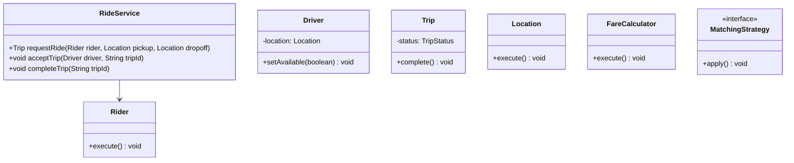
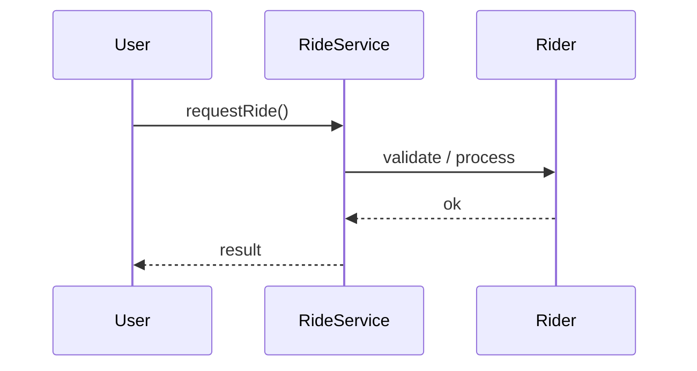
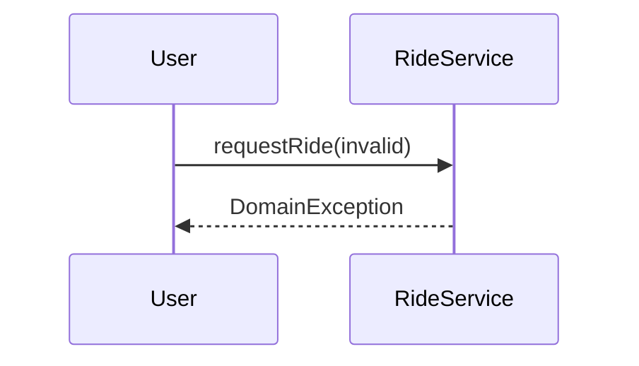

# Ride Sharing (Uber)

**Track:** Classic OOD  
**Companies:** Uber, Lyft, Amazon  
**Difficulty:** Hard  

---

## Case Study

> **Full case study:** [CS-LLD-O21-ride-sharing-uber.md](../../../Case Studies/lld/classic-ood/CS-LLD-O21-ride-sharing-uber.md)
> **End-to-end pair:** [Uber Ride Sharing](../../../Case Studies/paired/CS-PAIR-12-uber-ride-sharing.md)
> **Read order:** Case Study → this question → [Java implementation](../09-code-implementations/)

**Business context:** Real-world context modeled after Uber trip state machine and matching. Read the full case study for requirements, constraints, ADRs, and ops.

**Key constraints:** budget, timeline, team size, tech stack

---

## 1. Problem Statement

Design ride matching: request ride, match driver, trip lifecycle, fare.

---

## 2. Clarifying Questions

| # | Question | Expected answer |
|---|----------|-----------------|
| 1 | What is MVP scope for Ride Sharing (Uber)? | Core entities + 2 primary user flows |
| 2 | Persistence required? | In-memory; Repository interface if interviewer asks |
| 3 | Multi-threaded access? | Yes if multiple users/gates — else single-threaded |
| 4 | Matching? | Nearest available driver via MatchingStrategy |
| 5 | Surge? | FareCalculator multiplier extension |
| 6 | Trip states? | REQUESTED → ACCEPTED → IN_PROGRESS → COMPLETED |
| 7 | Pool rides? | Extension |

---

## 3. Functional & Non-Functional Requirements

**Functional:**
- RideService handles primary workflow described in requirements
- Validate inputs before state changes
- Enforce domain constraints with exceptions
- Support listing and lookup of core entities

**Non-Functional:**
- Clear separation of concerns (SOLID)
- Open-Closed via MatchingStrategy interface at variation points
- Constructor injection for testability
- Thread-safe if concurrent access is in clarifying assumptions

---

## 4. Core Entities & Relationships

| Entity | Role |
|--------|------|
| `Rider` | Passenger |
| `Driver` | Supply side |
| `Trip` | Active ride |
| `Location` | GPS point |
| `FareCalculator` | Pricing |
| `MatchingStrategy` | Driver selection |

**Nouns → classes:** `Rider`, `Driver`, `Trip`, `Location`, `FareCalculator`, `MatchingStrategy`  
**Verbs → methods:** `requestRide()`, `acceptTrip()`, `completeTrip()`

---

## 5. Class Diagram

```
┌─────────────────────┐       ┌──────────────────┐
│  RideService        │──────>│ Strategy         │<<interface>>
│─────────────────────│       │──────────────────│
│ +orchestrate()      │       │ +apply()         │
└─────────┬───────────┘       └────────┬─────────┘
          │ owns                       │ implements
          ▼                   ┌────────▼─────────┐
┌─────────────────────┐       │ ConcreteStrategy │
│  Rider              │       └──────────────────┘
└─────────┬───────────┘
          │ *
          ▼
┌─────────────────────┐     ┌──────────────────┐
│  Driver             │────>│  Trip            │
└─────────────────────┘     └──────────────────┘
```



---

## 6. Public API / Key Methods

```java
public class RideService {
    public Trip requestRide(Rider rider, Location pickup, Location dropoff);
    public void acceptTrip(Driver driver, String tripId);
    public void completeTrip(String tripId);
}
```

---

## 7. Design Patterns & SOLID

| Pattern | Application |
|---------|-------------|
| Strategy | Driver matching |
| State | Trip lifecycle |

**SOLID:**
- **S:** RideService orchestrates; entities hold state
- **O:** New behavior via new MatchingStrategy impl
- **D:** Depend on MatchingStrategy interface

---

## 8. Sequence Diagrams

**Happy path:**



**Failure path:**



---

## 9. Extensibility

> "New `Strategy` implementation plugs in at runtime — no change to `RideService`."
>
> "Add new `Rider` subtypes or enum values for new categories — Open-Closed."

---

## 10. Tradeoffs

| Decision | A | B | Pick |
|----------|---|---|------|
| Variation | if/else | Strategy | Strategy — 2+ behaviors |
| State | enum | State pattern | enum for simple lifecycles |
| Storage | in-memory | Repository | in-memory MVP |
| API return | primitive | domain object | domain object — type safety |

---

## 11. Concurrency & Edge Cases

- Single-threaded MVP unless clarifying assumes concurrent access
- If multi-user: synchronize on mutable aggregates or use concurrent collections
- Fail fast on invalid input with domain exceptions
- Idempotent retries where duplicate operations are possible

---

## 12. Interview Answer Script (15 min)

> "I'll design Ride Sharing (Uber) — clarify in-memory scope and MVP flows first."
>
> "Entities: `Rider`, `Driver`, `Trip`, `Location`, `FareCalculator`, `MatchingStrategy`. Domain structure separate from `RideService` orchestration."
>
> "Problem: Design ride matching: request ride, match driver, trip lifecycle, fare."
>
> "`Rider` — passenger; owns its own invariants."
>
> "`Driver` — supply side; owns its own invariants."
>
> "`Trip` — active ride; owns its own invariants."
>
> "`RideService` validates input, coordinates entities, returns typed results."
>
> "Identify variation points — inject interfaces for Open-Closed extensibility."
>
> "Walk happy path on whiteboard, then failure case with domain exception."
>
> "Tradeoff: enum vs State pattern; Strategy vs if/else — pick with justification."

---

## 13. Follow-Up Questions

1. How would you unit test `Strategy` in isolation?
2. How would you extend Ride Sharing (Uber) without modifying core service?
3. How would you add persistence behind a Repository?
4. How does this map to a distributed HLD?

---

## 14. Related Links

- [Strategy pattern](../../01-core-concepts/design-patterns-gof.md)
- [SOLID principles](../../01-core-concepts/solid-principles.md)
- [Concurrency fundamentals](../../01-core-concepts/concurrency-fundamentals.md)
- [Java implementation](../../09-code-implementations/java/classic/ride-sharing-uber/) (full)
- [HLD counterpart](../System%20Design%20-%20High%20Level%20Design/03-classic-hld/questions/Q12-ride-sharing.md)
