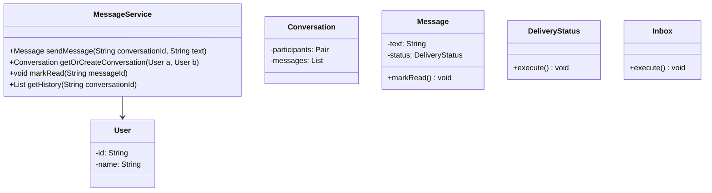
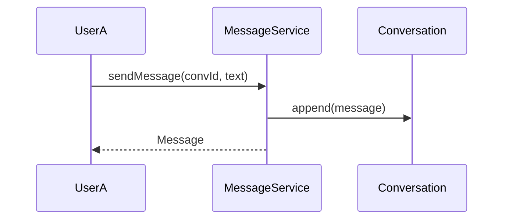
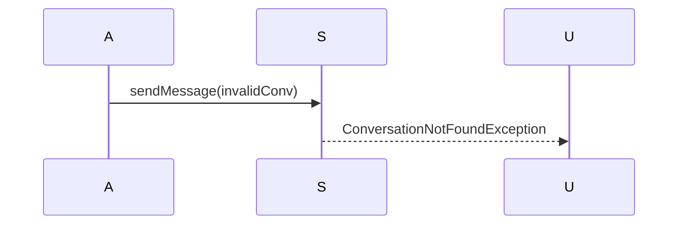

# Messenger (1:1 Chat)

**Track:** Classic OOD  
**Companies:** Meta, WhatsApp, Slack  
**Difficulty:** Medium  

---

## Case Study

> **Full case study:** [CS-LLD-O24-messenger-1to1.md](../../../Case Studies/lld/classic-ood/CS-LLD-O24-messenger-1to1.md)
> **End-to-end pair:** [WhatsApp / 1:1 Messenger](../../../Case Studies/paired/CS-PAIR-05-whatsapp-messenger.md)
> **Read order:** Case Study → this question → [Java implementation](../../09-code-implementations/)

**Business context:** Real-world context modeled after WhatsApp message delivery states. Read the full case study for requirements, constraints, ADRs, and ops.

**Key constraints:** budget, timeline, team size, tech stack

---

## 1. Problem Statement

Design 1:1 messaging: send, deliver, read receipts, conversation threads.

---

## 2. Clarifying Questions

| # | Question | Expected answer |
|---|----------|-----------------|
| 1 | What is MVP scope for Messenger (1:1 Chat)? | Core entities + 2 primary user flows |
| 2 | Persistence required? | In-memory; Repository interface if interviewer asks |
| 3 | Multi-threaded access? | Yes if multiple users/gates — else single-threaded |
| 4 | Group chat? | Extension — 1:1 MVP |
| 5 | Message order? | Per-conversation FIFO |
| 6 | Read receipts? | Per-message DeliveryStatus enum |
| 7 | Offline delivery? | Queue extension — in-memory MVP |

---

## 3. Functional & Non-Functional Requirements

**Functional:**
- Send messages with delivery status tracking

**Non-Functional:**
- Clear separation of concerns (SOLID)
- Open-Closed via MessageStore interface at variation points
- Constructor injection for testability
- Thread-safe if concurrent access is in clarifying assumptions

---

## 4. Core Entities & Relationships

| Entity | Role |
|--------|------|
| `User` | Participant |
| `Conversation` | Two-user thread |
| `Message` | Text payload |
| `DeliveryStatus` | Sent/delivered/read |
| `Inbox` | Conversation list |

**Nouns → classes:** `User`, `Conversation`, `Message`, `DeliveryStatus`, `Inbox`  
**Verbs → methods:** `sendMessage()`, `getOrCreateConversation()`, `markRead()`, `getHistory()`

---

## 5. Class Diagram

```
┌─────────────────────┐       ┌──────────────────┐
│  MessageService     │──────>│ Repository       │<<interface>>
│─────────────────────│       │──────────────────│
│ +orchestrate()      │       │ +apply()         │
└─────────┬───────────┘       └────────┬─────────┘
          │ owns                       │ implements
          ▼                   ┌────────▼─────────┐
┌─────────────────────┐       │ ConcreteRepository│
│  User               │       └──────────────────┘
└─────────┬───────────┘
          │ *
          ▼
┌─────────────────────┐     ┌──────────────────┐
│  Conversation       │────>│  Message         │
└─────────────────────┘     └──────────────────┘
```



---

## 6. Public API / Key Methods

```java
public class MessageService {
    public Message sendMessage(String conversationId, String text);
    public Conversation getOrCreateConversation(User a, User b);
    public void markRead(String messageId);
    public List<Message> getHistory(String conversationId);
}
```

---

## 7. Design Patterns & SOLID

| Pattern | Application |
|---------|-------------|
| Repository | Message persistence abstraction |

**SOLID:**
- **S:** MessageService orchestrates; entities hold state
- **O:** New behavior via new MessageStore impl
- **D:** Depend on MessageStore interface

---

## 8. Sequence Diagrams

**Happy path:**



**Failure path:**



---

## 9. Extensibility

> "New `Repository` implementation plugs in at runtime — no change to `MessageService`."
>
> "Add new `User` subtypes or enum values for new categories — Open-Closed."

---

## 10. Tradeoffs

| Decision | A | B | Pick |
|----------|---|---|------|
| Storage | in-memory list | Repository | Repository interface |
| Ordering | timestamp | sequence ID | sequence — strict order |
| Group chat | extend Conversation | new model | extend with type enum |
| Delivery | fire-and-forget | ack/retry | status enum MVP |

---

## 11. Concurrency & Edge Cases

- Single-threaded MVP unless clarifying assumes concurrent access
- If multi-user: synchronize on mutable aggregates or use concurrent collections
- Fail fast on invalid input with domain exceptions
- Idempotent retries where duplicate operations are possible

---

## 12. Interview Answer Script (15 min)

> "I'll design Messenger (1:1 Chat) — clarify in-memory scope and MVP flows first."
>
> "Entities: `User`, `Conversation`, `Message`, `DeliveryStatus`, `Inbox`. Domain structure separate from `MessageService` orchestration."
>
> "Problem: Design 1:1 messaging: send, deliver, read receipts, conversation threads."
>
> "`User` — participant; owns its own invariants."
>
> "`Conversation` — two-user thread; owns its own invariants."
>
> "`Message` — text payload; owns its own invariants."
>
> "`MessageService` validates input, coordinates entities, returns typed results."
>
> "Identify variation points — inject interfaces for Open-Closed extensibility."
>
> "Walk happy path on whiteboard, then failure case with domain exception."
>
> "Tradeoff: enum vs State pattern; Strategy vs if/else — pick with justification."

---

## 13. Follow-Up Questions

1. How would you unit test `Repository` in isolation?
2. How would you extend Messenger (1:1 Chat) without modifying core service?
3. How would you add persistence behind a Repository?
4. How does this map to a distributed HLD?

---

## 14. Related Links

- [Strategy pattern](../../01-core-concepts/design-patterns-gof.md)
- [SOLID principles](../../01-core-concepts/solid-principles.md)
- [Concurrency fundamentals](../../01-core-concepts/concurrency-fundamentals.md)
- [Java implementation](../../09-code-implementations/java/classic/messenger-1to1/README.md) (full)
