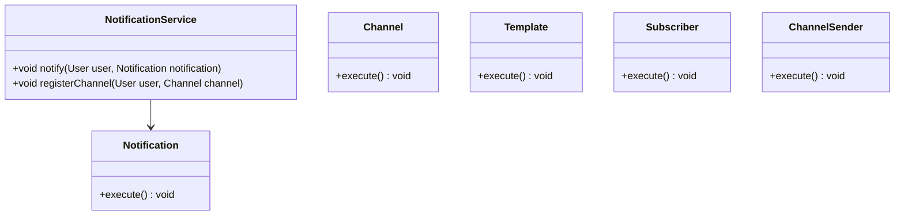
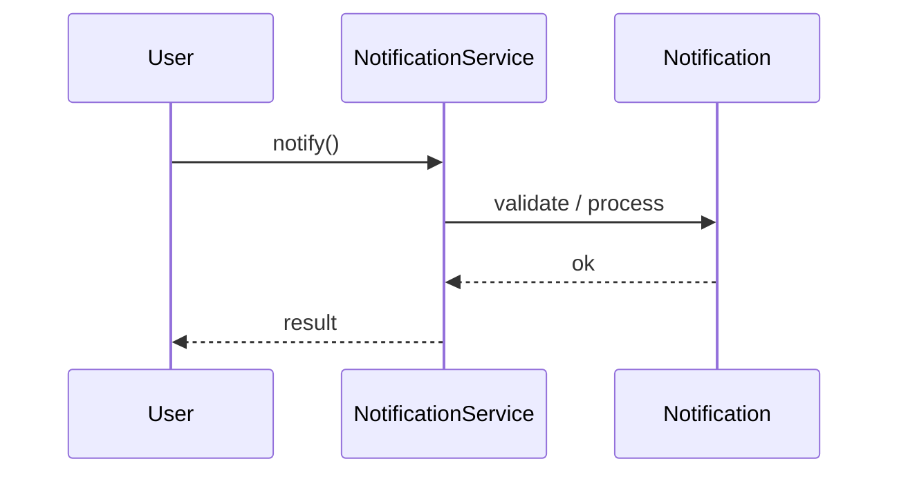
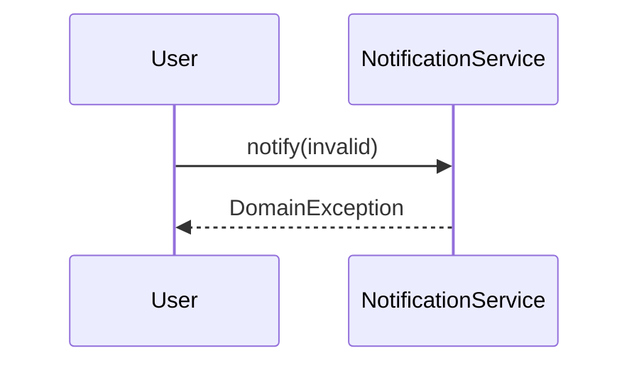

# Notification System

**Track:** Classic OOD  
**Companies:** Amazon, Twilio, Slack  
**Difficulty:** Medium  

---

## Case Study

> **Full case study:** [CS-LLD-O25-notification-system.md](../../../Case Studies/lld/classic-ood/CS-LLD-O25-notification-system.md)
> **End-to-end pair:** [Notification System](../../../Case Studies/paired/CS-PAIR-13-notification-system.md)
> **Read order:** Case Study → this question → [Java implementation](../../09-code-implementations/)

**Business context:** Real-world context modeled after Twilio and Firebase Cloud Messaging. Read the full case study for requirements, constraints, ADRs, and ops.

**Key constraints:** budget, timeline, team size, tech stack

---

## 1. Problem Statement

Design multi-channel notifications: email, SMS, push with templates.

---

## 2. Clarifying Questions

| # | Question | Expected answer |
|---|----------|-----------------|
| 1 | What is MVP scope for Notification System? | Core entities + 2 primary flows; extensions deferred |
| 2 | Persistence? | In-memory; Repository interface if interviewer asks |
| 3 | Multi-threaded? | Synchronize shared state if concurrent users assumed |
| 4 | Requirement: Design multi-channel notifications? | Include in MVP — Design multi-channel notifications |
| 5 | Requirement: push with templates.? | Include in MVP — push with templates. |
| 6 | Scale to distributed? | Single JVM LLD; pivot HLD if asked |
| 7 | Scale to distributed? | Single JVM LLD; pivot HLD if asked |
| 8 | Scale to distributed? | Single JVM LLD; pivot HLD if asked |

---

## 3. Functional & Non-Functional Requirements

**Functional:**
- NotificationService handles primary workflow described in requirements
- Validate inputs before state changes
- Enforce domain constraints with exceptions
- Support listing and lookup of core entities

**Non-Functional:**
- Clear separation of concerns (SOLID)
- Open-Closed via ChannelSender interface at variation points
- Constructor injection for testability
- Thread-safe if concurrent access is in clarifying assumptions

---

## 4. Core Entities & Relationships

| Entity | Role |
|--------|------|
| `Notification` | Payload |
| `Channel` | EMAIL/SMS/PUSH |
| `Template` | Message body |
| `Subscriber` | Recipient prefs |
| `ChannelSender` | Delivery adapter |

**Nouns → classes:** `Notification`, `Channel`, `Template`, `Subscriber`, `ChannelSender`  
**Verbs → methods:** `notify()`, `registerChannel()`

---

## 5. Class Diagram

```
┌─────────────────────┐       ┌──────────────────┐
│  NotificationService│──────>│ Strategy         │<<interface>>
│─────────────────────│       │──────────────────│
│ +orchestrate()      │       │ +apply()         │
└─────────┬───────────┘       └────────┬─────────┘
          │ owns                       │ implements
          ▼                   ┌────────▼─────────┐
┌─────────────────────┐       │ ConcreteStrategy │
│  Notification       │       └──────────────────┘
└─────────┬───────────┘
          │ *
          ▼
┌─────────────────────┐     ┌──────────────────┐
│  Channel            │────>│  Template        │
└─────────────────────┘     └──────────────────┘
```



---

## 6. Public API / Key Methods

```java
public class NotificationService {
    public void notify(User user, Notification notification);
    public void registerChannel(User user, Channel channel);
}
```

---

## 7. Design Patterns & SOLID

| Pattern | Application |
|---------|-------------|
| Strategy | Channel selection |
| Factory | Channel sender creation |

**SOLID:**
- **S:** NotificationService orchestrates; entities hold state
- **O:** New behavior via new ChannelSender impl
- **D:** Depend on ChannelSender interface

---

## 8. Sequence Diagrams

**Happy path:**



**Failure path:**



---

## 9. Extensibility

> "New channel: implement ChannelSender for Slack, webhook, etc."
>
> "User prefs: Subscriber chooses channels per notification type."

---

## 10. Tradeoffs

| Decision | A | B | Pick |
|----------|---|---|------|
| Variation | if/else | Strategy | Strategy — 2+ behaviors |
| State | enum | State pattern | enum for simple lifecycles |
| Storage | in-memory | Repository | in-memory MVP |
| API return | primitive | domain object | domain object — type safety |

---

## 11. Concurrency & Edge Cases

- Single-threaded MVP unless clarifying assumes concurrent access
- If multi-user: synchronize on mutable aggregates or use concurrent collections
- Fail fast on invalid input with domain exceptions
- Idempotent retries where duplicate operations are possible

---

## 12. Interview Answer Script (15 min)

> "I'll design Notification System — clarify in-memory scope and MVP flows first."
>
> "Entities: `Notification`, `Channel`, `Template`, `Subscriber`, `ChannelSender`. Domain structure separate from `NotificationService` orchestration."
>
> "Problem: Design multi-channel notifications: email, SMS, push with templates."
>
> "`Notification` — payload; owns its own invariants."
>
> "`Channel` — email/sms/push; owns its own invariants."
>
> "`Template` — message body; owns its own invariants."
>
> "`NotificationService` validates input, coordinates entities, returns typed results."
>
> "Identify variation points — inject interfaces for Open-Closed extensibility."
>
> "Walk happy path on whiteboard, then failure case with domain exception."
>
> "Tradeoff: enum vs State pattern; Strategy vs if/else — pick with justification."

---

## 13. Follow-Up Questions

1. How would you unit test `Strategy` in isolation?
2. How would you extend Notification System without modifying core service?
3. How would you add persistence behind a Repository?
4. How does this map to a distributed HLD?

---

## 14. Related Links

- [Strategy pattern](../../01-core-concepts/design-patterns-gof.md)
- [SOLID principles](../../01-core-concepts/solid-principles.md)
- [Concurrency fundamentals](../../01-core-concepts/concurrency-fundamentals.md)
- [Java implementation](../../09-code-implementations/java/classic/notification-system/README.md) (full)
