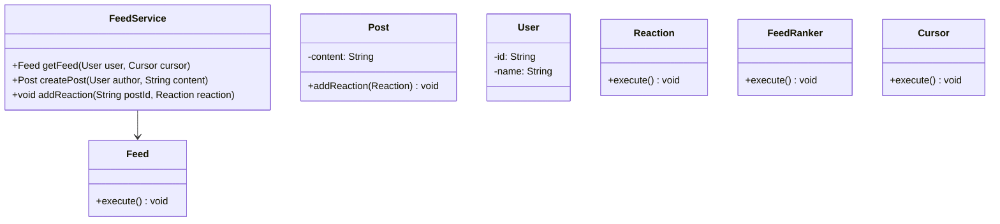
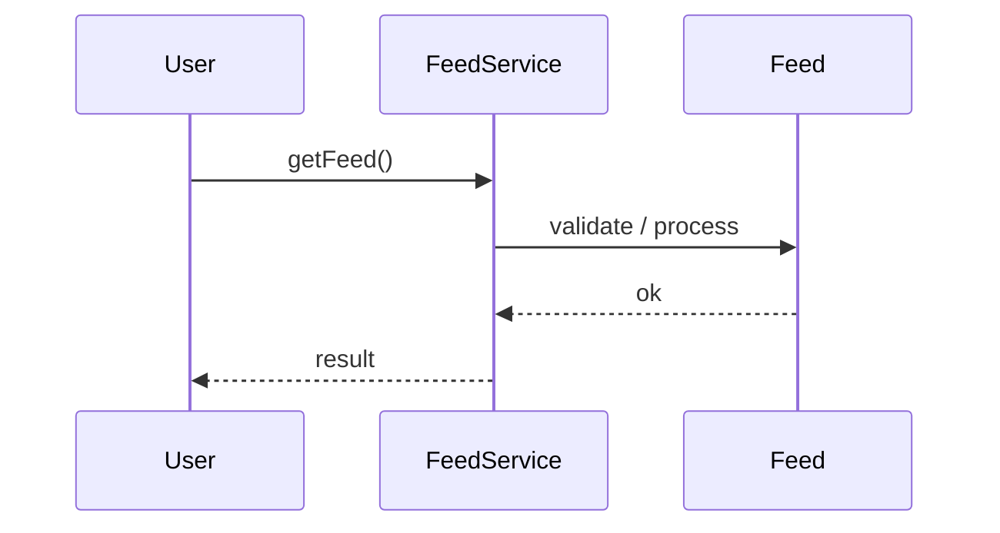
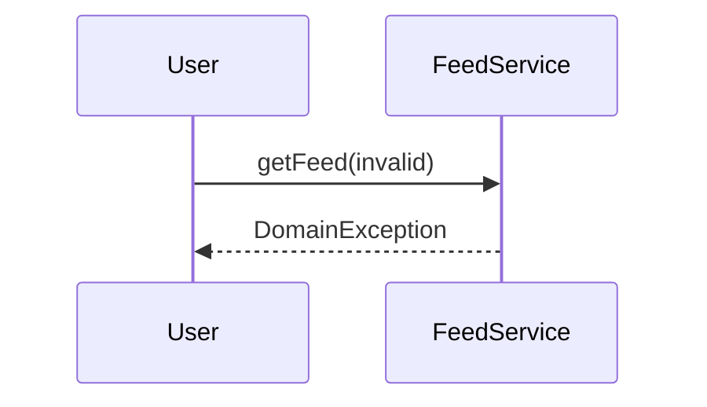

# News Feed Object Model

**Track:** Classic OOD  
**Companies:** Meta, Twitter, LinkedIn  
**Difficulty:** Medium  

---

## Case Study

> **Full case study:** [CS-LLD-O43-news-feed-object-model.md](../../../Case Studies/lld/classic-ood/CS-LLD-O43-news-feed-object-model.md)
> **End-to-end pair:** [Twitter News Feed](../../../Case Studies/paired/CS-PAIR-06-twitter-news-feed.md)
> **Read order:** Case Study → this question → [Java implementation](../09-code-implementations/)

**Business context:** Real-world context modeled after Facebook News Feed object graph. Read the full case study for requirements, constraints, ADRs, and ops.

**Key constraints:** budget, timeline, team size, tech stack

---

## 1. Problem Statement

Design feed object model: posts, reactions, ranking stub, pagination.

---

## 2. Clarifying Questions

| # | Question | Expected answer |
|---|----------|-----------------|
| 1 | What is MVP scope for News Feed Object Model? | Core entities + 2 primary flows; extensions deferred |
| 2 | Persistence? | In-memory; Repository interface if interviewer asks |
| 3 | Multi-threaded? | Synchronize shared state if concurrent users assumed |
| 4 | Requirement: Design feed object model? | Include in MVP — Design feed object model |
| 5 | Requirement: reactions? | Include in MVP — reactions |
| 6 | Requirement: ranking stub? | Include in MVP — ranking stub |
| 7 | Scale to distributed? | Single JVM LLD; pivot HLD if asked |
| 8 | Scale to distributed? | Single JVM LLD; pivot HLD if asked |

---

## 3. Functional & Non-Functional Requirements

**Functional:**
- FeedService handles primary workflow described in requirements
- Validate inputs before state changes
- Enforce domain constraints with exceptions
- Support listing and lookup of core entities

**Non-Functional:**
- Clear separation of concerns (SOLID)
- Open-Closed via FeedRanker interface at variation points
- Constructor injection for testability
- Thread-safe if concurrent access is in clarifying assumptions

---

## 4. Core Entities & Relationships

| Entity | Role |
|--------|------|
| `Feed` | Post list |
| `Post` | Content item |
| `User` | Author |
| `Reaction` | Like/emoji |
| `FeedRanker` | Ordering strategy |
| `Cursor` | Pagination token |

**Nouns → classes:** `Feed`, `Post`, `User`, `Reaction`, `FeedRanker`, `Cursor`  
**Verbs → methods:** `getFeed()`, `createPost()`, `addReaction()`

---

## 5. Class Diagram

```
┌─────────────────────┐       ┌──────────────────┐
│  FeedService        │──────>│ Strategy         │<<interface>>
│─────────────────────│       │──────────────────│
│ +orchestrate()      │       │ +apply()         │
└─────────┬───────────┘       └────────┬─────────┘
          │ owns                       │ implements
          ▼                   ┌────────▼─────────┐
┌─────────────────────┐       │ ConcreteStrategy │
│  Feed               │       └──────────────────┘
└─────────┬───────────┘
          │ *
          ▼
┌─────────────────────┐     ┌──────────────────┐
│  Post               │────>│  User            │
└─────────────────────┘     └──────────────────┘
```



---

## 6. Public API / Key Methods

```java
public class FeedService {
    public Feed getFeed(User user, Cursor cursor);
    public Post createPost(User author, String content);
    public void addReaction(String postId, Reaction reaction);
}
```

---

## 7. Design Patterns & SOLID

| Pattern | Application |
|---------|-------------|
| Strategy | Feed ranking |
| Observer | New post notifications |

**SOLID:**
- **S:** FeedService orchestrates; entities hold state
- **O:** New behavior via new FeedRanker impl
- **D:** Depend on FeedRanker interface

---

## 8. Sequence Diagrams

**Happy path:**



**Failure path:**



---

## 9. Extensibility

> "New `Strategy` implementation plugs in at runtime — no change to `FeedService`."
>
> "Add new `Feed` subtypes or enum values for new categories — Open-Closed."

---

## 10. Tradeoffs

| Decision | A | B | Pick |
|----------|---|---|------|
| Variation | if/else | Strategy | Strategy — 2+ behaviors |
| State | enum | State pattern | enum for simple lifecycles |
| Storage | in-memory | Repository | in-memory MVP |
| API return | primitive | domain object | domain object — type safety |

---

## 11. Concurrency & Edge Cases

- Single-threaded MVP unless clarifying assumes concurrent access
- If multi-user: synchronize on mutable aggregates or use concurrent collections
- Fail fast on invalid input with domain exceptions
- Idempotent retries where duplicate operations are possible

---

## 12. Interview Answer Script (15 min)

> "I'll design News Feed Object Model — clarify in-memory scope and MVP flows first."
>
> "Entities: `Feed`, `Post`, `User`, `Reaction`, `FeedRanker`, `Cursor`. Domain structure separate from `FeedService` orchestration."
>
> "Problem: Design feed object model: posts, reactions, ranking stub, pagination."
>
> "`Feed` — post list; owns its own invariants."
>
> "`Post` — content item; owns its own invariants."
>
> "`User` — author; owns its own invariants."
>
> "`FeedService` validates input, coordinates entities, returns typed results."
>
> "Identify variation points — inject interfaces for Open-Closed extensibility."
>
> "Walk happy path on whiteboard, then failure case with domain exception."
>
> "Tradeoff: enum vs State pattern; Strategy vs if/else — pick with justification."

---

## 13. Follow-Up Questions

1. How would you unit test `Strategy` in isolation?
2. How would you extend News Feed Object Model without modifying core service?
3. How would you add persistence behind a Repository?
4. How does this map to a distributed HLD?

---

## 14. Related Links

- [Strategy pattern](../../01-core-concepts/design-patterns-gof.md)
- [SOLID principles](../../01-core-concepts/solid-principles.md)
- [Concurrency fundamentals](../../01-core-concepts/concurrency-fundamentals.md)
- [Java implementation](../../09-code-implementations/java/classic/news-feed-object-model/) (skeleton)
