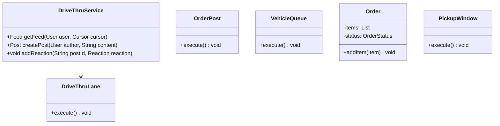
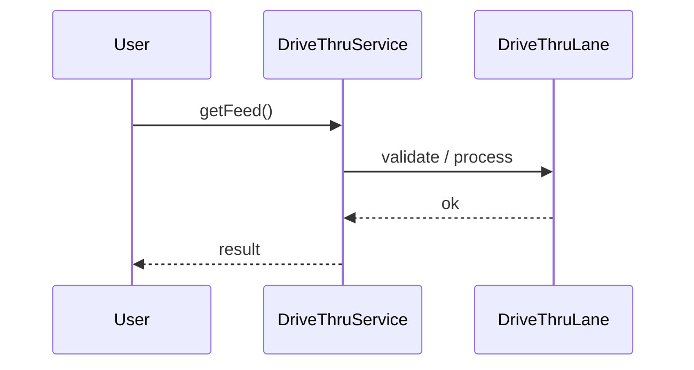
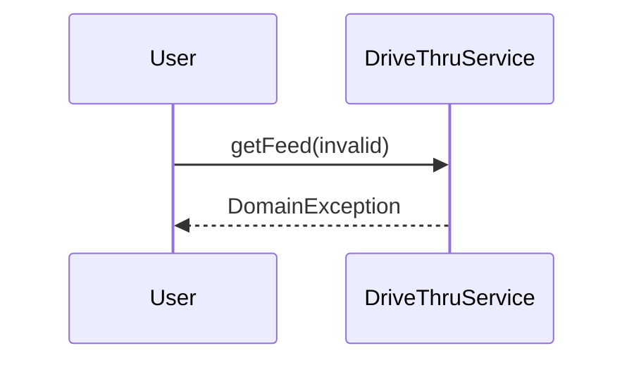

# Drive-Thru System

**Track:** Classic OOD  
**Companies:** Chick-fil-A, McDonald's  
**Difficulty:** Medium  

---

## Case Study

> **Full case study:** [CS-LLD-O53-drive-thru.md](../../../Case Studies/lld/classic-ood/CS-LLD-O53-drive-thru.md)
> **Read order:** Case Study → this question → [Java implementation](../../09-code-implementations/)

**Business context:** Real-world context modeled after Leading products in the Drive-Thru System domain. Read the full case study for requirements, constraints, ADRs, and ops.

**Key constraints:** budget, timeline, team size, tech stack

---

## 1. Problem Statement

Design drive-thru lane: order post, payment, pickup window sequencing.

---

## 2. Clarifying Questions

| # | Question | Expected answer |
|---|----------|-----------------|
| 1 | What is MVP scope for Drive-Thru System? | Core entities + 2 primary flows; extensions deferred |
| 2 | Persistence? | In-memory; Repository interface if interviewer asks |
| 3 | Multi-threaded? | Synchronize shared state if concurrent users assumed |
| 4 | Requirement: Design drive-thru lane? | Include in MVP — Design drive-thru lane |
| 5 | Requirement: order post? | Include in MVP — order post |
| 6 | Requirement: payment? | Include in MVP — payment |
| 7 | Scale to distributed? | Single JVM LLD; pivot HLD if asked |
| 8 | Scale to distributed? | Single JVM LLD; pivot HLD if asked |

---

## 3. Functional & Non-Functional Requirements

**Functional:**
- DriveThruService handles primary workflow described in requirements
- Validate inputs before state changes
- Enforce domain constraints with exceptions
- Support listing and lookup of core entities

**Non-Functional:**
- Clear separation of concerns (SOLID)
- Open-Closed via LaneSequence interface at variation points
- Constructor injection for testability
- Thread-safe if concurrent access is in clarifying assumptions

---

## 4. Core Entities & Relationships

| Entity | Role |
|--------|------|
| `DriveThruLane` | Single lane |
| `OrderPost` | Menu board |
| `VehicleQueue` | FIFO cars |
| `Order` | Meal order |
| `PickupWindow` | Handoff point |

**Nouns → classes:** `DriveThruLane`, `OrderPost`, `VehicleQueue`, `Order`, `PickupWindow`  
**Verbs → methods:** `getFeed()`, `createPost()`, `addReaction()`

---

## 5. Class Diagram

```
┌─────────────────────┐       ┌──────────────────┐
│  DriveThruService   │──────>│ Queue            │<<interface>>
│─────────────────────│       │──────────────────│
│ +orchestrate()      │       │ +apply()         │
└─────────┬───────────┘       └────────┬─────────┘
          │ owns                       │ implements
          ▼                   ┌────────▼─────────┐
┌─────────────────────┐       │ ConcreteQueue    │
│  DriveThruLane      │       └──────────────────┘
└─────────┬───────────┘
          │ *
          ▼
┌─────────────────────┐     ┌──────────────────┐
│  OrderPost          │────>│  VehicleQueue    │
└─────────────────────┘     └──────────────────┘
```



---

## 6. Public API / Key Methods

```java
public class DriveThruService {
    public Feed getFeed(User user, Cursor cursor);
    public Post createPost(User author, String content);
    public void addReaction(String postId, Reaction reaction);
}
```

---

## 7. Design Patterns & SOLID

| Pattern | Application |
|---------|-------------|
| Queue | FIFO ordering of work items |

**SOLID:**
- **S:** DriveThruService orchestrates; entities hold state
- **O:** New behavior via new LaneSequence impl
- **D:** Depend on LaneSequence interface

---

## 8. Sequence Diagrams

**Happy path:**



**Failure path:**



---

## 9. Extensibility

> "New `Queue` implementation plugs in at runtime — no change to `DriveThruService`."
>
> "Add new `DriveThruLane` subtypes or enum values for new categories — Open-Closed."

---

## 10. Tradeoffs

| Decision | A | B | Pick |
|----------|---|---|------|
| Variation | if/else | Queue | Queue — 2+ behaviors |
| State | enum | State pattern | enum for simple lifecycles |
| Storage | in-memory | Repository | in-memory MVP |
| API return | primitive | domain object | domain object — type safety |

---

## 11. Concurrency & Edge Cases

- Single-threaded MVP unless clarifying assumes concurrent access
- If multi-user: synchronize on mutable aggregates or use concurrent collections
- Fail fast on invalid input with domain exceptions
- Idempotent retries where duplicate operations are possible

---

## 12. Interview Answer Script (15 min)

> "I'll design Drive-Thru System — clarify in-memory scope and MVP flows first."
>
> "Entities: `DriveThruLane`, `OrderPost`, `VehicleQueue`, `Order`, `PickupWindow`. Domain structure separate from `DriveThruService` orchestration."
>
> "Problem: Design drive-thru lane: order post, payment, pickup window sequencing."
>
> "`DriveThruLane` — single lane; owns its own invariants."
>
> "`OrderPost` — menu board; owns its own invariants."
>
> "`VehicleQueue` — fifo cars; owns its own invariants."
>
> "`DriveThruService` validates input, coordinates entities, returns typed results."
>
> "Identify variation points — inject interfaces for Open-Closed extensibility."
>
> "Walk happy path on whiteboard, then failure case with domain exception."
>
> "Tradeoff: enum vs State pattern; Strategy vs if/else — pick with justification."

---

## 13. Follow-Up Questions

1. How would you unit test `Queue` in isolation?
2. How would you extend Drive-Thru System without modifying core service?
3. How would you add persistence behind a Repository?
4. How does this map to a distributed HLD?

---

## 14. Related Links

- [Strategy pattern](../../01-core-concepts/design-patterns-gof.md)
- [SOLID principles](../../01-core-concepts/solid-principles.md)
- [Concurrency fundamentals](../../01-core-concepts/concurrency-fundamentals.md)
- [Java implementation](../../09-code-implementations/java/classic/drive-thru/README.md) (skeleton)
