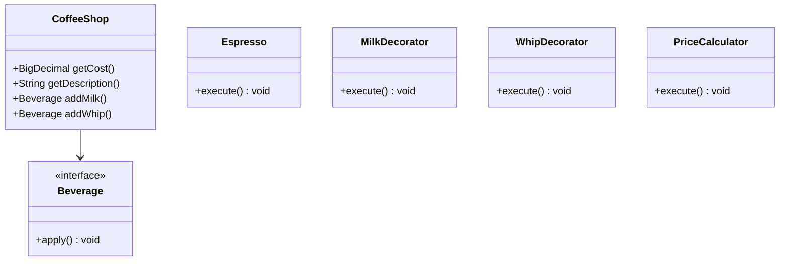
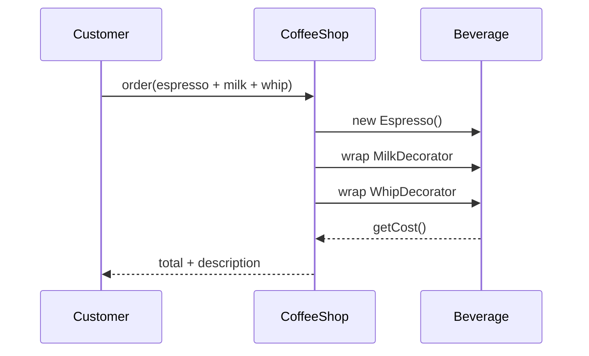
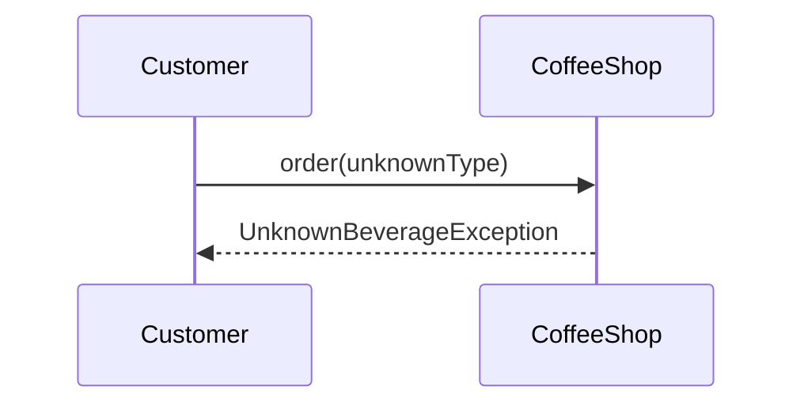

# Decorator — Coffee Shop

**Track:** Design Patterns  
**Companies:** Starbucks  
**Difficulty:** Medium  

---

## Case Study

> **Full case study:** [CS-LLD-P08-decorator-coffee.md](../../../Case Studies/lld/design-patterns/CS-LLD-P08-decorator-coffee.md)
> **Read order:** Case Study → this question → [Java implementation](../09-code-implementations/)

**Business context:** Real-world context modeled after Leading products in the Decorator — Coffee Shop domain. Read the full case study for requirements, constraints, ADRs, and ops.

**Key constraints:** budget, timeline, team size, tech stack

---

## 1. Problem Statement

Design decorator adding milk, whip, caramel to base coffee with dynamic price.

---

## 2. Clarifying Questions

| # | Question | Expected answer |
|---|----------|-----------------|
| 1 | Which add-ons? | Milk, whip, caramel, extra shot — each adds cost |
| 2 | Base beverages? | Espresso, HouseBlend, DarkRoast |
| 3 | Can add-ons stack? | Yes — milk + whip on same base |
| 4 | Size variants? | Extension — Tall/Grande via decorator or enum |
| 5 | Discount rules? | Extension — CouponDecorator |
| 6 | Takeaway vs dine-in? | Out of scope |
| 7 | Recipe display? | getDescription() returns full stack string |
| 8 | Pricing source? | Each component reports getCost() |

---

## 3. Functional & Non-Functional Requirements

**Functional:**
- Compose beverage from base + zero or more add-on decorators
- getCost() sums base and all decorator prices
- getDescription() lists full recipe chain
- Add decorators at runtime — open for extension

**Non-Functional:**
- Clear separation of concerns (SOLID)
- Open-Closed via Beverage interface at variation points
- Constructor injection for testability
- Thread-safe if concurrent access is in clarifying assumptions

---

## 4. Core Entities & Relationships

| Entity | Role |
|--------|------|
| `Beverage` | Component interface |
| `Espresso` | Concrete |
| `MilkDecorator` | Add-on |
| `WhipDecorator` | Add-on |
| `PriceCalculator` | Sum cost |

**Nouns → classes:** `Beverage`, `Espresso`, `MilkDecorator`, `WhipDecorator`, `PriceCalculator`  
**Verbs → methods:** `getCost()`, `getDescription()`, `addMilk()`, `addWhip()`

---

## 5. Class Diagram

```
┌─────────────────────┐       ┌──────────────────┐
│  CoffeeShop         │──────>│ Decorator        │<<interface>>
│─────────────────────│       │──────────────────│
│ +orchestrate()      │       │ +apply()         │
└─────────┬───────────┘       └────────┬─────────┘
          │ owns                       │ implements
          ▼                   ┌────────▼─────────┐
┌─────────────────────┐       │ ConcreteDecorator│
│  Beverage           │       └──────────────────┘
└─────────┬───────────┘
          │ *
          ▼
┌─────────────────────┐     ┌──────────────────┐
│  Espresso           │────>│  MilkDecorator   │
└─────────────────────┘     └──────────────────┘
```



---

## 6. Public API / Key Methods

```java
public class CoffeeShop {
    public BigDecimal getCost();
    public String getDescription();
    public Beverage addMilk();
    public Beverage addWhip();
}
```

---

## 7. Design Patterns & SOLID

| Pattern | Application |
|---------|-------------|
| Decorator | Wrap Beverage with add-ons dynamically |
| Component | Beverage interface unifies base and decorated |

**SOLID:**
- **S:** CoffeeDecorator orchestrates; entities hold state
- **O:** New behavior via new Beverage impl
- **D:** Depend on Beverage interface

---

## 8. Sequence Diagrams

**Happy path:**



**Failure path:**



---

## 9. Extensibility

> "New `Decorator` implementation plugs in at runtime — no change to `CoffeeShop`."
>
> "Add new `Beverage` subtypes or enum values for new categories — Open-Closed."

---

## 10. Tradeoffs

| Decision | A | B | Pick |
|----------|---|---|------|
| Variation | if/else | Decorator | Decorator — 2+ behaviors |
| State | enum | State pattern | enum for simple lifecycles |
| Storage | in-memory | Repository | in-memory MVP |
| API return | primitive | domain object | domain object — type safety |

---

## 11. Concurrency & Edge Cases

- Immutable decorator chain — thread-safe after construction
- Unknown base type → UnknownBeverageException
- Null wrap target → NullPointerException — validate in constructor
- Deep stack — no hard limit in MVP

---

## 12. Interview Answer Script (15 min)

> "Beverage interface declares getCost() and getDescription()."
>
> "Concrete bases: Espresso, HouseBlend implement Beverage directly."
>
> "Decorator abstract class implements Beverage and holds wrapped Beverage."
>
> "MilkDecorator adds milk cost/description delegating to inner beverage."
>
> "Customer order builds chain: new MilkDecorator(new WhipDecorator(new Espresso()))."
>
> "Open-Closed: new add-on = new Decorator subclass, no change to existing code."
>
> "Contrast with subclass explosion — Latte extends EspressoWithMilk extends..."
>
> "This is canonical Gang-of-Four Decorator interview question."

---

## 13. Follow-Up Questions

1. Decorator vs subclassing for add-ons?
2. How to serialize order for receipt?
3. Add size as decorator or property?
4. Remove an add-on from middle of chain?

---

## 14. Related Links

- [Strategy pattern](../../01-core-concepts/design-patterns-gof.md)
- [SOLID principles](../../01-core-concepts/solid-principles.md)
- [Concurrency fundamentals](../../01-core-concepts/concurrency-fundamentals.md)
- [Java implementation](../../09-code-implementations/java/patterns/decorator-coffee/) (full)
