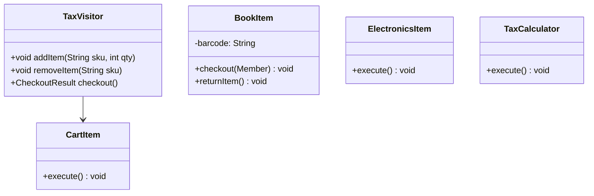
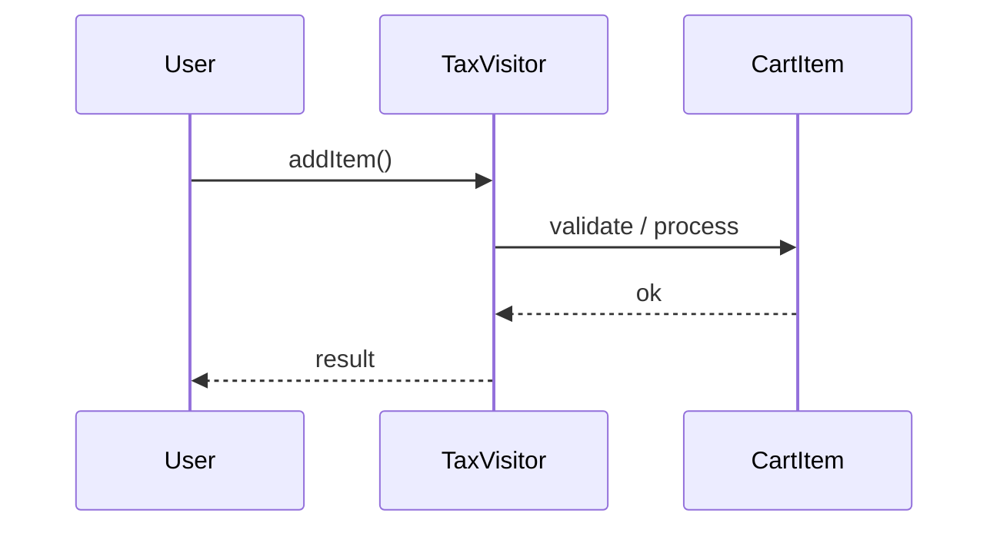
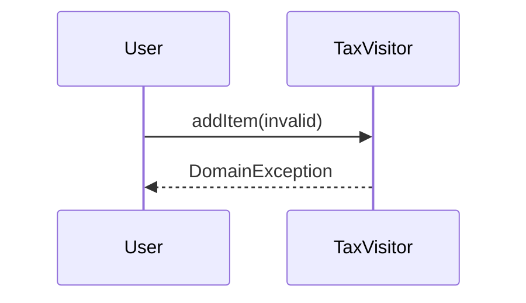

# Visitor — Cart Tax

**Track:** Design Patterns  
**Companies:** Amazon, Intuit  
**Difficulty:** Medium  

---

## Case Study

> **Full case study:** [CS-LLD-P22-visitor-shopping-cart-tax.md](../../../Case Studies/lld/design-patterns/CS-LLD-P22-visitor-shopping-cart-tax.md)
> **Read order:** Case Study → this question → [Java implementation](../09-code-implementations/)

**Business context:** Real-world context modeled after Amazon cart and checkout session. Read the full case study for requirements, constraints, ADRs, and ops.

**Key constraints:** budget, timeline, team size, tech stack

---

## 1. Problem Statement

Design visitor computing tax for mixed cart item types without double dispatch mess.

---

## 2. Clarifying Questions

| # | Question | Expected answer |
|---|----------|-----------------|
| 1 | What is MVP scope for Visitor — Cart Tax? | Core entities + 2 primary flows; extensions deferred |
| 2 | Persistence? | In-memory; Repository interface if interviewer asks |
| 3 | Multi-threaded? | Synchronize shared state if concurrent users assumed |
| 4 | Requirement: Design visitor computing tax for mixed c? | Include in MVP — Design visitor computing tax for mixed cart item t |
| 5 | Scale to distributed? | Single JVM LLD; pivot HLD if asked |
| 6 | Scale to distributed? | Single JVM LLD; pivot HLD if asked |
| 7 | Scale to distributed? | Single JVM LLD; pivot HLD if asked |
| 8 | Scale to distributed? | Single JVM LLD; pivot HLD if asked |

---

## 3. Functional & Non-Functional Requirements

**Functional:**
- TaxVisitor handles primary workflow described in requirements
- Validate inputs before state changes
- Enforce domain constraints with exceptions
- Support listing and lookup of core entities

**Non-Functional:**
- Clear separation of concerns (SOLID)
- Open-Closed via TaxVisitor interface at variation points
- Constructor injection for testability
- Thread-safe if concurrent access is in clarifying assumptions

---

## 4. Core Entities & Relationships

| Entity | Role |
|--------|------|
| `CartItem` | Element |
| `TaxVisitor` | Visitor |
| `BookItem` | Element |
| `ElectronicsItem` | Element |
| `TaxCalculator` | Context |

**Nouns → classes:** `CartItem`, `TaxVisitor`, `BookItem`, `ElectronicsItem`, `TaxCalculator`  
**Verbs → methods:** `addItem()`, `removeItem()`, `checkout()`

---

## 5. Class Diagram

```
┌─────────────────────┐       ┌──────────────────┐
│  TaxVisitor         │──────>│ Visitor          │<<interface>>
│─────────────────────│       │──────────────────│
│ +orchestrate()      │       │ +apply()         │
└─────────┬───────────┘       └────────┬─────────┘
          │ owns                       │ implements
          ▼                   ┌────────▼─────────┐
┌─────────────────────┐       │ ConcreteVisitor  │
│  CartItem           │       └──────────────────┘
└─────────┬───────────┘
          │ *
          ▼
┌─────────────────────┐     ┌──────────────────┐
│  TaxVisitor         │────>│  BookItem        │
└─────────────────────┘     └──────────────────┘
```



---

## 6. Public API / Key Methods

```java
public class TaxVisitor {
    public void addItem(String sku, int qty);
    public void removeItem(String sku);
    public CheckoutResult checkout();
}
```

---

## 7. Design Patterns & SOLID

| Pattern | Application |
|---------|-------------|
| Visitor | Tax calc per item type |

**SOLID:**
- **S:** TaxVisitor orchestrates; entities hold state
- **O:** New behavior via new TaxVisitor impl
- **D:** Depend on TaxVisitor interface

---

## 8. Sequence Diagrams

**Happy path:**



**Failure path:**



---

## 9. Extensibility

> "New `Visitor` implementation plugs in at runtime — no change to `TaxVisitor`."
>
> "Add new `CartItem` subtypes or enum values for new categories — Open-Closed."

---

## 10. Tradeoffs

| Decision | A | B | Pick |
|----------|---|---|------|
| Variation | if/else | Visitor | Visitor — 2+ behaviors |
| State | enum | State pattern | enum for simple lifecycles |
| Storage | in-memory | Repository | in-memory MVP |
| API return | primitive | domain object | domain object — type safety |

---

## 11. Concurrency & Edge Cases

- Single-threaded MVP unless clarifying assumes concurrent access
- If multi-user: synchronize on mutable aggregates or use concurrent collections
- Fail fast on invalid input with domain exceptions
- Idempotent retries where duplicate operations are possible

---

## 12. Interview Answer Script (15 min)

> "I'll design Visitor — Cart Tax — clarify in-memory scope and MVP flows first."
>
> "Entities: `CartItem`, `TaxVisitor`, `BookItem`, `ElectronicsItem`, `TaxCalculator`. Domain structure separate from `TaxVisitor` orchestration."
>
> "Problem: Design visitor computing tax for mixed cart item types without double dispatch mess."
>
> "`CartItem` — element; owns its own invariants."
>
> "`TaxVisitor` — visitor; owns its own invariants."
>
> "`BookItem` — element; owns its own invariants."
>
> "`TaxVisitor` validates input, coordinates entities, returns typed results."
>
> "Identify variation points — inject interfaces for Open-Closed extensibility."
>
> "Walk happy path on whiteboard, then failure case with domain exception."
>
> "Tradeoff: enum vs State pattern; Strategy vs if/else — pick with justification."

---

## 13. Follow-Up Questions

1. How would you unit test `Visitor` in isolation?
2. How would you extend Visitor — Cart Tax without modifying core service?
3. How would you add persistence behind a Repository?
4. How does this map to a distributed HLD?

---

## 14. Related Links

- [Strategy pattern](../../01-core-concepts/design-patterns-gof.md)
- [SOLID principles](../../01-core-concepts/solid-principles.md)
- [Concurrency fundamentals](../../01-core-concepts/concurrency-fundamentals.md)
- [Java implementation](../../09-code-implementations/java/patterns/visitor-shopping-cart-tax/) (full)
