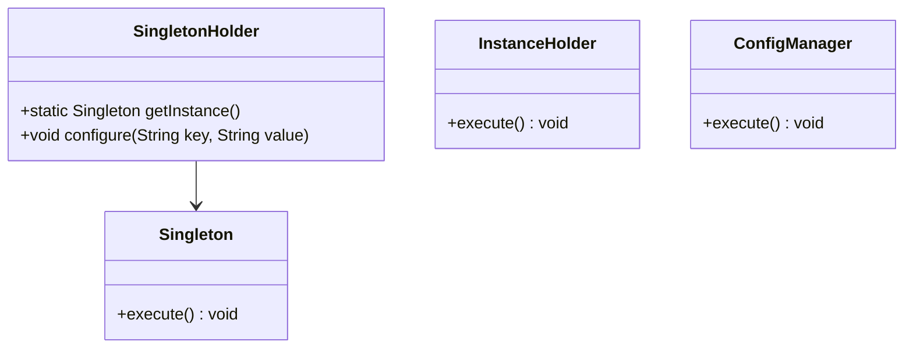
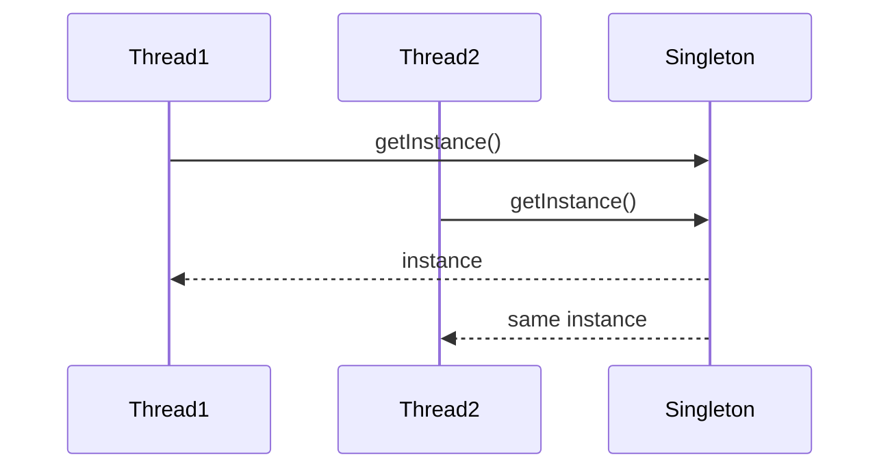
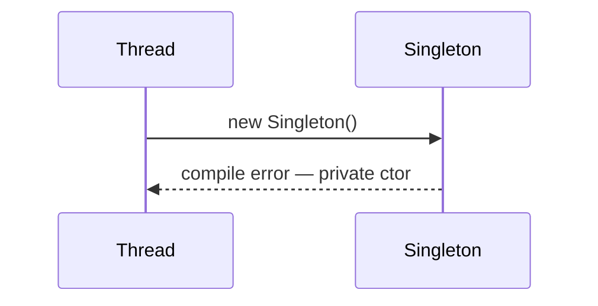

# Thread-Safe Singleton

**Track:** Concurrency LLD  
**Companies:** Amazon, Google, Microsoft  
**Difficulty:** Medium  

---

## Case Study

> **Full case study:** [CS-LLD-X01-thread-safe-singleton.md](../../../Case Studies/lld/concurrency/CS-LLD-X01-thread-safe-singleton.md)
> **Read order:** Case Study → this question → [Java implementation](../../09-code-implementations/)

**Business context:** Real-world context modeled after Leading products in the Thread-Safe Singleton domain. Read the full case study for requirements, constraints, ADRs, and ops.

**Key constraints:** budget, timeline, team size, tech stack

---

## 1. Problem Statement

Implement thread-safe singleton with double-checked locking or enum idiom.

---

## 2. Clarifying Questions

| # | Question | Expected answer |
|---|----------|-----------------|
| 1 | Lazy or eager init? | Lazy — created on first getInstance() |
| 2 | Which approach? | Double-checked locking or enum singleton |
| 3 | Reflection attack? | Enum singleton prevents; DCL needs guard |
| 4 | Serialization? | readResolve for DCL; enum handles automatically |
| 5 | Subclassing? | No — private constructor |
| 6 | Testability? | Package-private ctor for tests or reset hook |
| 7 | Multiple class loaders? | Edge case — one instance per loader |
| 8 | Java version? | volatile + DCL safe since Java 5 |

---

## 3. Functional & Non-Functional Requirements

**Functional:**
- getInstance() returns same instance across all threads
- Lazy initialization on first access
- Thread-safe without global synchronized bottleneck after init
- Prevent duplicate instance via private constructor

**Non-Functional:**
- Clear separation of concerns (SOLID)
- Open-Closed via Singleton interface at variation points
- Constructor injection for testability
- Correctness under concurrent access — no data races
- Avoid deadlock — consistent lock ordering where multiple locks

---

## 4. Core Entities & Relationships

| Entity | Role |
|--------|------|
| `Singleton` | Single instance |
| `InstanceHolder` | DCL holder |
| `ConfigManager` | Use case |

**Nouns → classes:** `Singleton`, `InstanceHolder`, `ConfigManager`  
**Verbs → methods:** `getInstance()`, `configure(key, value)`

---

## 5. Class Diagram

```
┌─────────────────────┐       ┌──────────────────┐
│  SingletonHolder    │──────>│ Singleton        │<<interface>>
│─────────────────────│       │──────────────────│
│ +orchestrate()      │       │ +apply()         │
└─────────┬───────────┘       └────────┬─────────┘
          │ owns                       │ implements
          ▼                   ┌────────▼─────────┐
┌─────────────────────┐       │ ConcreteSingleton│
│  Singleton          │       └──────────────────┘
└─────────┬───────────┘
          │ *
          ▼
┌─────────────────────┐     ┌──────────────────┐
│  InstanceHolder     │────>│  ConfigManager   │
└─────────────────────┘     └──────────────────┘
```



---

## 6. Public API / Key Methods

```java
public class SingletonHolder {
    public static Singleton getInstance();
    public void configure(String key, String value);
}
```

---

## 7. Design Patterns & SOLID

| Pattern | Application |
|---------|-------------|
| Singleton | Single instance guarantee |
| Holder | Initialization-on-demand holder idiom |

**SOLID:**
- **S:** SingletonHolder orchestrates; entities hold state
- **O:** New behavior via new Singleton impl
- **D:** Depend on Singleton interface

---

## 8. Sequence Diagrams

**Happy path:**



**Failure path:**



---

## 9. Extensibility

> "New `Concurrency` implementation plugs in at runtime — no change to `SingletonHolder`."
>
> "Add new `Singleton` subtypes or enum values for new categories — Open-Closed."

---

## 10. Tradeoffs

| Decision | A | B | Pick |
|----------|---|---|------|
| Variation | if/else | Concurrency | Concurrency — 2+ behaviors |
| State | enum | State pattern | enum for simple lifecycles |
| Storage | in-memory | Repository | in-memory MVP |
| API return | primitive | domain object | domain object — type safety |

---

## 11. Concurrency & Edge Cases

- DCL: volatile instance + synchronized block on first create
- Enum singleton — preferred for simplicity and serialization safety
- No locking after instance published — performance
- Class loading initializes holder only when referenced

---

## 12. Interview Answer Script (15 min)

> "Singleton ensures exactly one instance in the JVM."
>
> "Enum approach: public enum Singleton { INSTANCE; } — Joshua Bloch recommended."
>
> "DCL: check null, synchronize, check null again, construct with volatile field."
>
> "Holder idiom: static nested class holds instance — lazy and thread-safe via class init."
>
> "Avoid synchronized getInstance() every call — performance bottleneck."
>
> "Private constructor blocks external new; reflection needs test awareness."
>
> "ConfigManager example: singleton holds app settings loaded once."
>
> "In DI frameworks singleton is container-scoped — different lifecycle."

---

## 13. Follow-Up Questions

1. Why is volatile required in DCL?
2. Enum vs DCL — when to pick each?
3. How to test code that calls getInstance()?
4. Singleton anti-pattern in microservices?

---

## 14. Related Links

- [Concurrency LLD track](../../04-concurrency-lld/README.md)
- [Strategy pattern](../../01-core-concepts/design-patterns-gof.md)
- [SOLID principles](../../01-core-concepts/solid-principles.md)
- [Concurrency fundamentals](../../01-core-concepts/concurrency-fundamentals.md)
- [Java implementation](../../09-code-implementations/java/concurrency/thread-safe-singleton/README.md) (full)
