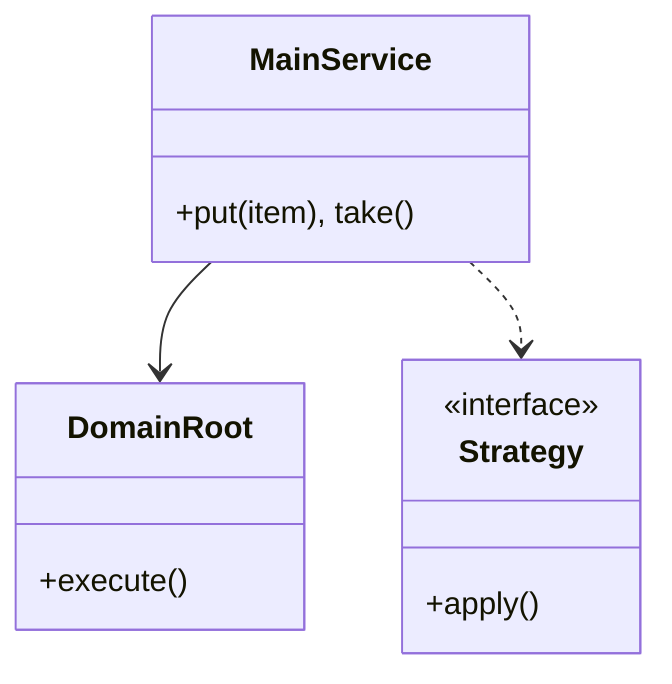
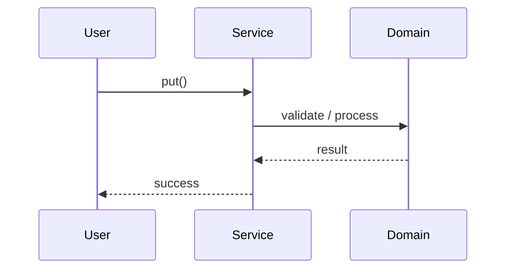

# Bounded Blocking Queue

**Track:** Concurrency LLD  
**Companies:** Amazon, Google  
**Difficulty:** Hard  

---

## 1. Problem Statement

Design bounded blocking queue with put/take blocking semantics.

---

## 2. Clarifying Questions

| # | Question | Expected answer |
|---|----------|-----------------|
| 1 | Single process or multi-threaded? | In-memory, single JVM; thread-safe if concurrent |
| 2 | Persistence needed? | In-memory for MVP; Repository interface if asked |
| 3 | MVP scope? | Core entities + 2 main flows |
| 4 | Extensibility? | One variation point via Strategy/interface |
| 5 | Error handling? | Domain exceptions, fail fast |

---

## 3. Functional & Non-Functional Requirements

**Functional:**
- Core operations for bounded blocking queue
- Validate inputs and enforce business rules
- Support primary user flows end-to-end

**Non-Functional:**
- Clear separation of concerns (SOLID)
- Extensible without modifying core logic (Open-Closed)
- Testable via dependency injection
- **Thread safety:** ReentrantLock + Condition

---

## 4. Core Entities & Relationships

| Entity | Role |
|--------|------|
| BoundedBlockingQueue | Core domain entity / service |
| Condition | Core domain entity / service |
| Lock | Core domain entity / service |

**Relationships:** Service orchestrates domain entities; Strategy/interface at variation points.

**Nouns → classes:** `BoundedBlockingQueue`, `Condition`, `Lock`  
**Verbs → methods:** `put(item), take()` and related operations

---

## 5. Class Diagram

```
┌─────────────────────┐
│  BoundedBlockingQueueService │──────> Strategy / Factory (interface)
│─────────────────────│
│ +put()  │
└─────────┬───────────┘
          │ uses
          ▼
┌─────────────────────┐     ┌──────────────────┐
│  BoundedBlockingQueue     │────>│  Condition  │
└─────────────────────┘     └──────────────────┘
```



---

## 6. Public API / Key Methods

```java
public class BoundedBlockingQueueService {
    public Result put(item), take();
    // Additional: validate, lookup, list as needed for Bounded Blocking Queue
}
```

---

## 7. Design Patterns & SOLID

| Pattern | Application |
|---------|-------------|
| Producer-Consumer | Primary variation point for bounded blocking queue |


**SOLID:**
- **S:** Service orchestrates; entities hold domain state
- **O:** New behavior via new Strategy/impl
- **D:** Depend on interfaces, not concrete classes

---

## 8. Sequence Diagrams

**Happy path:**



**Failure path:** Invalid input → throw `ConcurrencyException` with clear message.

---

## 9. Extensibility

> "To add new behavior, I'd introduce a new implementation of the Strategy interface — e.g. new pricing rule, allocation policy, or payment gateway — without editing `BoundedBlockingQueueService` core loop."

Extension example: add new `Lock` subclass or enum value + plug new Strategy at runtime.

---

## 10. Tradeoffs

| Decision | A | B | Pick |
|----------|---|---|------|
| State modeling | enum | State pattern | enum for simple; State for complex transitions |
| Variation | Strategy | if/else | Strategy for 2+ algorithms |
| Storage | in-memory Map | Repository interface | in-memory MVP; Repository if persistence asked |
| API return | domain object | primitive | domain object (type safety) |

---

## 11. Concurrency & Edge Cases


**Thread safety:** ReentrantLock + Condition

- Null/invalid input → fail fast with domain exception
- Empty collections → handle gracefully
- Duplicate operations → idempotent where applicable (ConcurrencyException)

---

## 12. Interview Answer Script (15 min)

> "I'll design bounded blocking queue starting with clarifying scope — in-memory, single process, core flows only."
>
> "Entities I see: `BoundedBlockingQueue`, `Condition`, `Lock`. I'll group them into domain structure and a service facade."
>
> "The variation point is Producer-Consumer — for example different policies or algorithms without changing the orchestration loop."
>
> "Core API: `put(item), take()` — validate first, delegate to domain, return typed result."
>
> "For extensibility, new behavior = new interface implementation. Open-Closed principle."
>
> "Tradeoff: I'd use enum for simple states; State pattern only if transitions have side effects."
>
> "I can sketch the service method in Java — inject dependencies via constructor for testability."
>
> "If we needed millions of users and distributed deployment, I'd pivot to HLD — cache, queue, DB — but object model stays the same."

---

## 13. Follow-Up Questions

1. How would you make this thread-safe?
2. How would you add persistence?
3. How would you unit test the service?
4. What if we need plugin-style extensibility?
5. How does this map to a microservices HLD?

---

## 14. Related Links

- [Producer-Consumer pattern](../../01-core-concepts/design-patterns-gof.md)
- [SOLID principles](../../01-core-concepts/solid-principles.md)
- [Pattern picker](../../00-interview-framework/04-pattern-picker.md)
- [Java implementation](../../09-code-implementations/java/concurrency/bounded-blocking-queue/) (skeleton)

