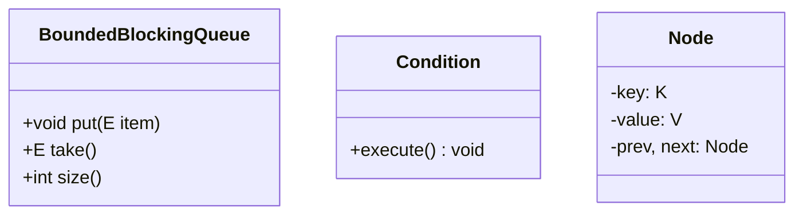
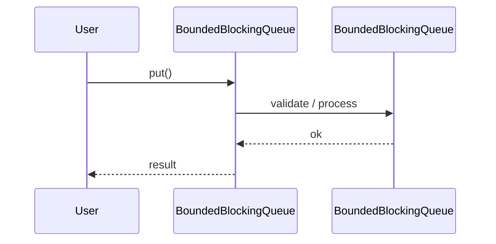
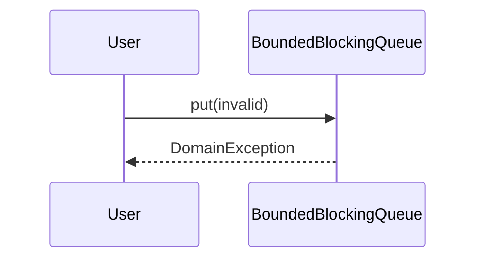

# Bounded Blocking Queue

**Track:** Concurrency LLD  
**Companies:** Amazon, LinkedIn  
**Difficulty:** Hard  

---

## Case Study

> **Full case study:** [CS-LLD-X02-bounded-blocking-queue.md](../../../Case Studies/lld/concurrency/CS-LLD-X02-bounded-blocking-queue.md)
> **Read order:** Case Study → this question → [Java implementation](../09-code-implementations/)

**Business context:** Real-world context modeled after Leading products in the Bounded Blocking Queue domain. Read the full case study for requirements, constraints, ADRs, and ops.

**Key constraints:** budget, timeline, team size, tech stack

---

## 1. Problem Statement

Design bounded blocking queue with put/take blocking on full/empty.

---

## 2. Clarifying Questions

| # | Question | Expected answer |
|---|----------|-----------------|
| 1 | What is MVP scope for Bounded Blocking Queue? | Core entities + 2 primary flows; extensions deferred |
| 2 | Persistence? | In-memory; Repository interface if interviewer asks |
| 3 | Multi-threaded? | Synchronize shared state if concurrent users assumed |
| 4 | Lock vs synchronized? | Justify choice |
| 5 | Deadlock prevention? | Ordering or timeout |
| 6 | Fairness? | Document starvation risk |
| 7 | Scale to distributed? | Single JVM LLD; pivot HLD if asked |
| 8 | Scale to distributed? | Single JVM LLD; pivot HLD if asked |

---

## 3. Functional & Non-Functional Requirements

**Functional:**
- BoundedBlockingQueue handles primary workflow described in requirements
- Validate inputs before state changes
- Enforce domain constraints with exceptions
- Support listing and lookup of core entities

**Non-Functional:**
- Clear separation of concerns (SOLID)
- Open-Closed via BlockingQueue interface at variation points
- Constructor injection for testability
- Correctness under concurrent access — no data races
- Avoid deadlock — consistent lock ordering where multiple locks

---

## 4. Core Entities & Relationships

| Entity | Role |
|--------|------|
| `BoundedBlockingQueue` | Buffer |
| `Condition` | Not full/not empty |
| `Node` | Queue element |

**Nouns → classes:** `BoundedBlockingQueue`, `Condition`, `Node`  
**Verbs → methods:** `put()`, `take()`, `size()`

---

## 5. Class Diagram

```
┌─────────────────────┐       ┌──────────────────┐
│  BoundedBlockingQueue│──────>│ Concurrency      │<<interface>>
│─────────────────────│       │──────────────────│
│ +orchestrate()      │       │ +apply()         │
└─────────┬───────────┘       └────────┬─────────┘
          │ owns                       │ implements
          ▼                   ┌────────▼─────────┐
┌─────────────────────┐       │ ConcreteConcurrency│
│  BoundedBlockingQueue│       └──────────────────┘
└─────────┬───────────┘
          │ *
          ▼
┌─────────────────────┐     ┌──────────────────┐
│  Condition          │────>│  Node            │
└─────────────────────┘     └──────────────────┘
```



---

## 6. Public API / Key Methods

```java
public class BoundedBlockingQueue {
    public void put(E item);
    public E take();
    public int size();
}
```

---

## 7. Design Patterns & SOLID

| Pattern | Application |
|---------|-------------|
| Concurrency | Thread-safe design for Bounded Blocking Queue |
| Synchronization | Locks, volatile, or concurrent collections |

**SOLID:**
- **S:** BoundedBlockingQueue orchestrates; entities hold state
- **O:** New behavior via new BlockingQueue impl
- **D:** Depend on BlockingQueue interface

---

## 8. Sequence Diagrams

**Happy path:**



**Failure path:**



---

## 9. Extensibility

> "New `Concurrency` implementation plugs in at runtime — no change to `BoundedBlockingQueue`."
>
> "Add new `BoundedBlockingQueue` subtypes or enum values for new categories — Open-Closed."

---

## 10. Tradeoffs

| Decision | A | B | Pick |
|----------|---|---|------|
| Variation | if/else | Concurrency | Concurrency — 2+ behaviors |
| State | enum | State pattern | enum for simple lifecycles |
| Storage | in-memory | Repository | in-memory MVP |
| API return | primitive | domain object | domain object — type safety |

---

## 11. Concurrency & Edge Cases

- Identify shared mutable state across threads
- Use synchronized, Lock, or concurrent collections appropriately
- Avoid deadlock — consistent lock acquisition order
- Document happens-before relationships for interview clarity

---

## 12. Interview Answer Script (15 min)

> "I'll design Bounded Blocking Queue — clarify in-memory scope and MVP flows first."
>
> "Entities: `BoundedBlockingQueue`, `Condition`, `Node`. Domain structure separate from `BoundedBlockingQueue` orchestration."
>
> "Problem: Design bounded blocking queue with put/take blocking on full/empty."
>
> "`BoundedBlockingQueue` — buffer; owns its own invariants."
>
> "`Condition` — not full/not empty; owns its own invariants."
>
> "`Node` — queue element; owns its own invariants."
>
> "`BoundedBlockingQueue` validates input, coordinates entities, returns typed results."
>
> "Identify variation points — inject interfaces for Open-Closed extensibility."
>
> "Walk happy path on whiteboard, then failure case with domain exception."
>
> "Tradeoff: enum vs State pattern; Strategy vs if/else — pick with justification."

---

## 13. Follow-Up Questions

1. How would you unit test `Concurrency` in isolation?
2. How would you extend Bounded Blocking Queue without modifying core service?
3. How would you add persistence behind a Repository?
4. How does this map to a distributed HLD?

---

## 14. Related Links

- [Concurrency LLD track](../../04-concurrency-lld/README.md)
- [Strategy pattern](../../01-core-concepts/design-patterns-gof.md)
- [SOLID principles](../../01-core-concepts/solid-principles.md)
- [Concurrency fundamentals](../../01-core-concepts/concurrency-fundamentals.md)
- [Java implementation](../../09-code-implementations/java/concurrency/bounded-blocking-queue/) (full)
