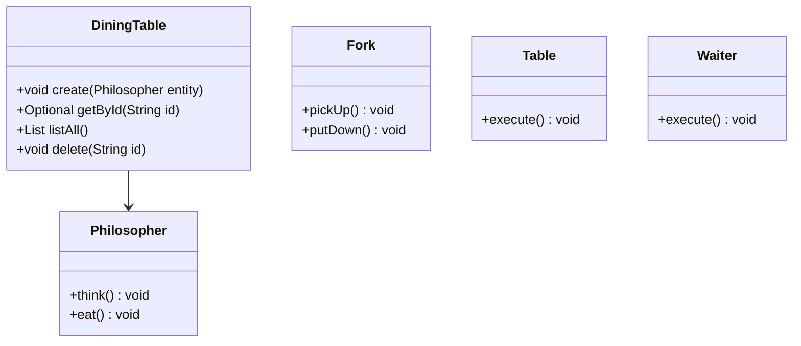
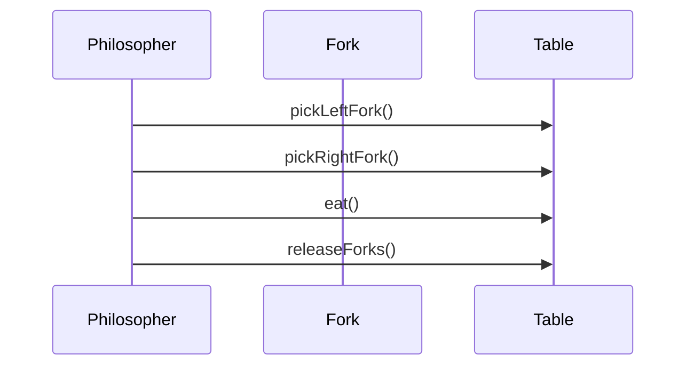
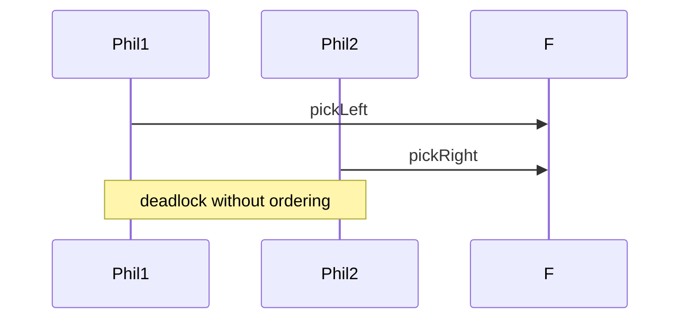

# Dining Philosophers

**Track:** Concurrency LLD  
**Companies:** Amazon, Microsoft  
**Difficulty:** Hard  

---

## Case Study

> **Full case study:** [CS-LLD-X05-dining-philosophers.md](../../../Case Studies/lld/concurrency/CS-LLD-X05-dining-philosophers.md)
> **Read order:** Case Study → this question → [Java implementation](../../09-code-implementations/)

**Business context:** Real-world context modeled after Classic concurrency problem — resource ordering. Read the full case study for requirements, constraints, ADRs, and ops.

**Key constraints:** budget, timeline, team size, tech stack

---

## 1. Problem Statement

Design deadlock-free dining philosophers with fork acquisition ordering.

---

## 2. Clarifying Questions

| # | Question | Expected answer |
|---|----------|-----------------|
| 1 | What is MVP scope for Dining Philosophers? | Core entities + 2 primary user flows |
| 2 | Persistence required? | In-memory; Repository interface if interviewer asks |
| 3 | Multi-threaded access? | Yes if multiple users/gates — else single-threaded |
| 4 | Deadlock prevention? | Ordered fork pickup or waiter |
| 5 | Philosopher count? | Configurable N |
| 6 | Eat time? | Random or fixed think/eat cycles |
| 7 | Waiter arbitrator? | Alternative to ordered forks |

---

## 3. Functional & Non-Functional Requirements

**Functional:**
- DiningTable handles primary workflow described in requirements
- Validate inputs before state changes
- Enforce domain constraints with exceptions
- Support listing and lookup of core entities

**Non-Functional:**
- Clear separation of concerns (SOLID)
- Open-Closed via Fork interface at variation points
- Constructor injection for testability
- Correctness under concurrent access — no data races
- Avoid deadlock — consistent lock ordering where multiple locks

---

## 4. Core Entities & Relationships

| Entity | Role |
|--------|------|
| `Philosopher` | Thread |
| `Fork` | Shared resource |
| `Table` | Seat arrangement |
| `Waiter` | Arbitrator optional |

**Nouns → classes:** `Philosopher`, `Fork`, `Table`, `Waiter`  
**Verbs → methods:** `create()`, `getById()`, `listAll()`, `delete()`

---

## 5. Class Diagram

```
┌─────────────────────┐       ┌──────────────────┐
│  DiningTable        │──────>│ Concurrency      │<<interface>>
│─────────────────────│       │──────────────────│
│ +orchestrate()      │       │ +apply()         │
└─────────┬───────────┘       └────────┬─────────┘
          │ owns                       │ implements
          ▼                   ┌────────▼─────────┐
┌─────────────────────┐       │ ConcreteConcurrency│
│  Philosopher        │       └──────────────────┘
└─────────┬───────────┘
          │ *
          ▼
┌─────────────────────┐     ┌──────────────────┐
│  Fork               │────>│  Table           │
└─────────────────────┘     └──────────────────┘
```



---

## 6. Public API / Key Methods

```java
public class DiningTable {
    public void create(Philosopher entity);
    public Optional<Philosopher> getById(String id);
    public List<Philosopher> listAll();
    public void delete(String id);
}
```

---

## 7. Design Patterns & SOLID

| Pattern | Application |
|---------|-------------|
| Concurrency | Ordered fork acquisition avoids deadlock |

**SOLID:**
- **S:** DiningTable orchestrates; entities hold state
- **O:** New behavior via new Fork impl
- **D:** Depend on Fork interface

---

## 8. Sequence Diagrams

**Happy path:**



**Failure path:**



---

## 9. Extensibility

> "New `Concurrency` implementation plugs in at runtime — no change to `DiningTable`."
>
> "Add new `Philosopher` subtypes or enum values for new categories — Open-Closed."

---

## 10. Tradeoffs

| Decision | A | B | Pick |
|----------|---|---|------|
| Variation | if/else | Concurrency | Concurrency — 2+ behaviors |
| State | enum | State pattern | enum for simple lifecycles |
| Storage | in-memory | Repository | in-memory MVP |
| API return | primitive | domain object | domain object — type safety |

---

## 11. Concurrency & Edge Cases

- Deadlock without ordering — demonstrate then fix with fork ID ordering
- synchronized(fork) or ReentrantLock per fork
- Waiter pattern: centralized arbitrator avoids hold-and-wait
- Starvation possible — fair lock or waiter queue extension

---

## 12. Interview Answer Script (15 min)

> "I'll design Dining Philosophers — clarify in-memory scope and MVP flows first."
>
> "Entities: `Philosopher`, `Fork`, `Table`, `Waiter`. Domain structure separate from `DiningTable` orchestration."
>
> "Problem: Design deadlock-free dining philosophers with fork acquisition ordering."
>
> "`Philosopher` — thread; owns its own invariants."
>
> "`Fork` — shared resource; owns its own invariants."
>
> "`Table` — seat arrangement; owns its own invariants."
>
> "`DiningTable` validates input, coordinates entities, returns typed results."
>
> "Identify variation points — inject interfaces for Open-Closed extensibility."
>
> "Walk happy path on whiteboard, then failure case with domain exception."
>
> "Tradeoff: enum vs State pattern; Strategy vs if/else — pick with justification."

---

## 13. Follow-Up Questions

1. Compare waiter vs ordered forks?
2. What if one philosopher is greedy?
3. Extend to multiple tables?
4. Model with semaphores instead?

---

## 14. Related Links

- [Concurrency LLD track](../../04-concurrency-lld/README.md)
- [Strategy pattern](../../01-core-concepts/design-patterns-gof.md)
- [SOLID principles](../../01-core-concepts/solid-principles.md)
- [Concurrency fundamentals](../../01-core-concepts/concurrency-fundamentals.md)
- [Java implementation](../../09-code-implementations/java/concurrency/dining-philosophers/README.md) (full)
