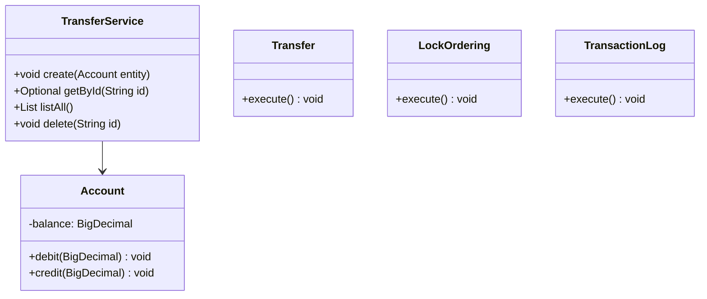
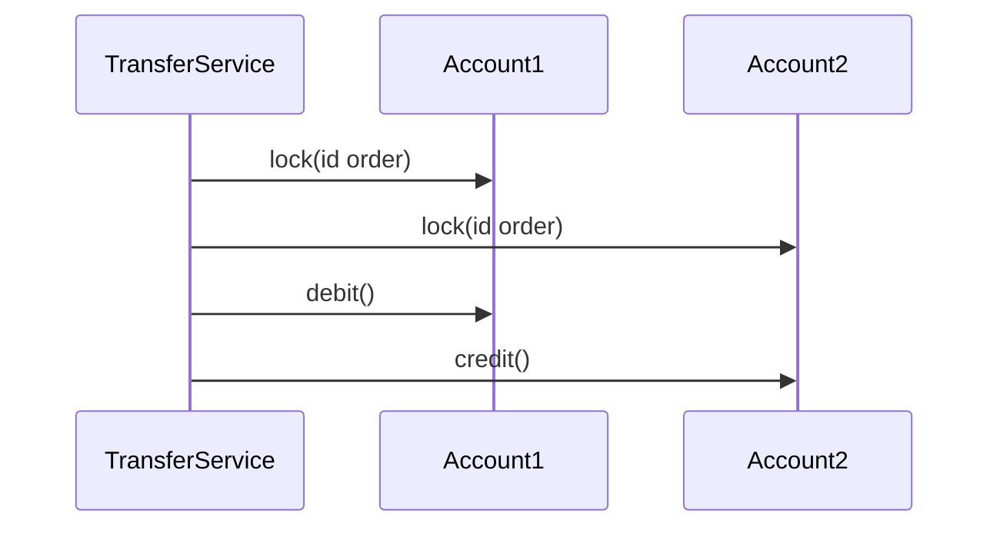
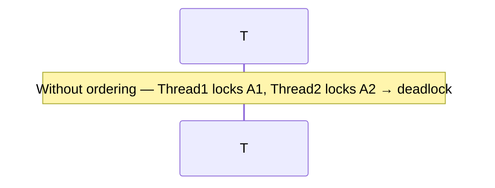

# Bank Transfer Deadlock

**Track:** Concurrency LLD  
**Companies:** Goldman, Citibank  
**Difficulty:** Hard  

---

## Case Study

> **Full case study:** [CS-LLD-X14-bank-transfer-deadlock.md](../../../Case Studies/lld/concurrency/CS-LLD-X14-bank-transfer-deadlock.md)
> **Read order:** Case Study → this question → [Java implementation](../09-code-implementations/)

**Business context:** Real-world context modeled after Banking transfer ordering to prevent deadlock. Read the full case study for requirements, constraints, ADRs, and ops.

**Key constraints:** budget, timeline, team size, tech stack

---

## 1. Problem Statement

Design deadlock-free concurrent transfers between bank accounts.

---

## 2. Clarifying Questions

| # | Question | Expected answer |
|---|----------|-----------------|
| 1 | What is MVP scope for Bank Transfer Deadlock? | Core entities + 2 primary flows; extensions deferred |
| 2 | Persistence? | In-memory; Repository interface if interviewer asks |
| 3 | Multi-threaded? | Synchronize shared state if concurrent users assumed |
| 4 | Lock vs synchronized? | Justify choice |
| 5 | Deadlock prevention? | Ordering or timeout |
| 6 | Fairness? | Document starvation risk |
| 7 | Scale to distributed? | Single JVM LLD; pivot HLD if asked |
| 8 | Scale to distributed? | Single JVM LLD; pivot HLD if asked |

---

## 3. Functional & Non-Functional Requirements

**Functional:**
- TransferService handles primary workflow described in requirements
- Validate inputs before state changes
- Enforce domain constraints with exceptions
- Support listing and lookup of core entities

**Non-Functional:**
- Clear separation of concerns (SOLID)
- Open-Closed via LockOrdering interface at variation points
- Constructor injection for testability
- Correctness under concurrent access — no data races
- Avoid deadlock — consistent lock ordering where multiple locks

---

## 4. Core Entities & Relationships

| Entity | Role |
|--------|------|
| `Account` | Balance |
| `Transfer` | Move funds |
| `LockOrdering` | Consistent lock order |
| `TransactionLog` | Audit |

**Nouns → classes:** `Account`, `Transfer`, `LockOrdering`, `TransactionLog`  
**Verbs → methods:** `create()`, `getById()`, `listAll()`, `delete()`

---

## 5. Class Diagram

```
┌─────────────────────┐       ┌──────────────────┐
│  TransferService    │──────>│ Concurrency      │<<interface>>
│─────────────────────│       │──────────────────│
│ +orchestrate()      │       │ +apply()         │
└─────────┬───────────┘       └────────┬─────────┘
          │ owns                       │ implements
          ▼                   ┌────────▼─────────┐
┌─────────────────────┐       │ ConcreteConcurrency│
│  Account            │       └──────────────────┘
└─────────┬───────────┘
          │ *
          ▼
┌─────────────────────┐     ┌──────────────────┐
│  Transfer           │────>│  LockOrdering    │
└─────────────────────┘     └──────────────────┘
```



---

## 6. Public API / Key Methods

```java
public class TransferService {
    public void create(Account entity);
    public Optional<Account> getById(String id);
    public List<Account> listAll();
    public void delete(String id);
}
```

---

## 7. Design Patterns & SOLID

| Pattern | Application |
|---------|-------------|
| Concurrency | Thread-safe design for Bank Transfer Deadlock |
| Synchronization | Locks, volatile, or concurrent collections |

**SOLID:**
- **S:** TransferService orchestrates; entities hold state
- **O:** New behavior via new LockOrdering impl
- **D:** Depend on LockOrdering interface

---

## 8. Sequence Diagrams

**Happy path:**



**Failure path:**



---

## 9. Extensibility

> "New `Concurrency` implementation plugs in at runtime — no change to `TransferService`."
>
> "Add new `Account` subtypes or enum values for new categories — Open-Closed."

---

## 10. Tradeoffs

| Decision | A | B | Pick |
|----------|---|---|------|
| Variation | if/else | Concurrency | Concurrency — 2+ behaviors |
| State | enum | State pattern | enum for simple lifecycles |
| Storage | in-memory | Repository | in-memory MVP |
| API return | primitive | domain object | domain object — type safety |

---

## 11. Concurrency & Edge Cases

- Always lock accounts in ascending ID order — global total ordering
- Never hold lock on A then try B while another thread holds B and tries A
- Transfer is atomic: debit source, credit dest in same synchronized block
- Insufficient funds → InsufficientFundsException before any mutation

---

## 12. Interview Answer Script (15 min)

> "I'll design Bank Transfer Deadlock — clarify in-memory scope and MVP flows first."
>
> "Entities: `Account`, `Transfer`, `LockOrdering`, `TransactionLog`. Domain structure separate from `TransferService` orchestration."
>
> "Problem: Design deadlock-free concurrent transfers between bank accounts."
>
> "`Account` — balance; owns its own invariants."
>
> "`Transfer` — move funds; owns its own invariants."
>
> "`LockOrdering` — consistent lock order; owns its own invariants."
>
> "`TransferService` validates input, coordinates entities, returns typed results."
>
> "Identify variation points — inject interfaces for Open-Closed extensibility."
>
> "Walk happy path on whiteboard, then failure case with domain exception."
>
> "Tradeoff: enum vs State pattern; Strategy vs if/else — pick with justification."

---

## 13. Follow-Up Questions

1. How would you unit test `Concurrency` in isolation?
2. How would you extend Bank Transfer Deadlock without modifying core service?
3. How would you add persistence behind a Repository?
4. How does this map to a distributed HLD?

---

## 14. Related Links

- [Concurrency LLD track](../../04-concurrency-lld/README.md)
- [Strategy pattern](../../01-core-concepts/design-patterns-gof.md)
- [SOLID principles](../../01-core-concepts/solid-principles.md)
- [Concurrency fundamentals](../../01-core-concepts/concurrency-fundamentals.md)
- [Java implementation](../../09-code-implementations/java/concurrency/bank-transfer-deadlock/) (full)
