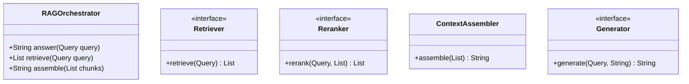
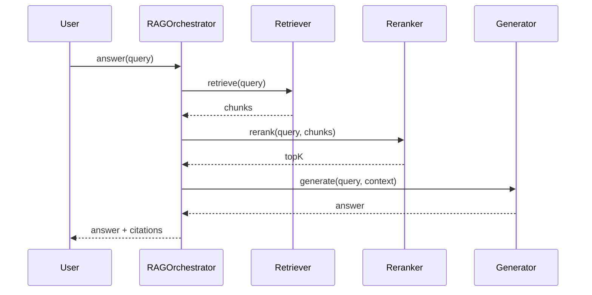
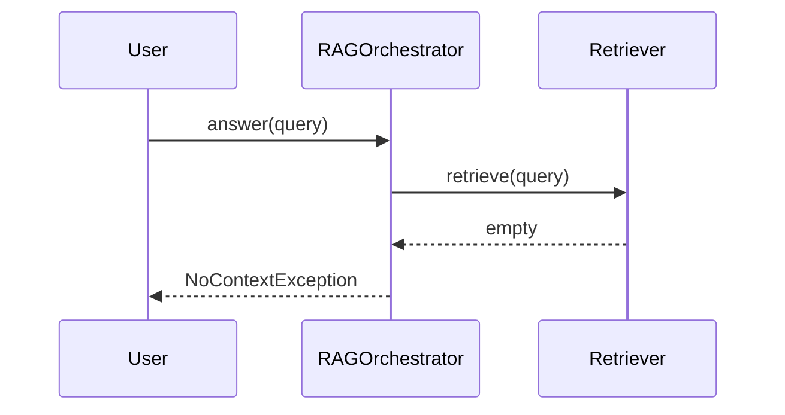

# RAG Orchestrator

**Track:** Gen AI LLD  
**Companies:** OpenAI, Anthropic, Google  
**Difficulty:** Hard  

---

## Case Study

> **Full case study:** [CS-LLD-A01-rag-orchestrator.md](../../../Case Studies/lld/genai/CS-LLD-A01-rag-orchestrator.md)
> **End-to-end pair:** [Enterprise RAG Document Q&A](../../../Case Studies/paired/CS-PAIR-01-enterprise-rag.md)
> **Read order:** Case Study → this question → [Java implementation](../09-code-implementations/)

**Business context:** Design the **object model** for retrieve → rerank → assemble context → generate. Vector DB and LLM API are external (HLD). Focus on SOLID, testability, and swappable components.

**Key constraints:** budget, timeline, team size, tech stack

---

## 1. Problem Statement

Design in-process RAG orchestrator: retrieve, rerank, assemble context, generate.

---

## 2. Clarifying Questions

| # | Question | Expected answer |
|---|----------|-----------------|
| 1 | Distributed or in-process? | In-process object model; vector DB is HLD |
| 2 | Swappable components? | Retriever, Reranker, Generator as interfaces |
| 3 | Streaming response? | Extension via StreamAggregator |
| 4 | Safety filters? | Extension — GuardrailChain on input/output |
| 5 | Multi-tenant? | Optional tenantId in Query context |
| 6 | Token budget? | Yes — truncate context before generate |
| 7 | Citation required? | Return source ids with RetrievedChunk |
| 8 | Reranker optional? | Yes — passthrough if not injected |

---

## 3. Functional & Non-Functional Requirements

**Functional:**
- answer(query) → retrieve → rerank → assemble context → generate
- Pluggable retriever (keyword stub, vector stub)
- Token budget awareness before generation
- Return answer with optional source citations

**Non-Functional:**
- Clear separation of concerns (SOLID)
- Open-Closed via Retriever interface at variation points
- Constructor injection for testability
- Swappable pipeline stages behind interfaces
- Explicit boundary to HLD for vector DB, model serving, queues

---

## 4. Core Entities & Relationships

| Entity | Role |
|--------|------|
| `RAGOrchestrator` | Pipeline |
| `Retriever` | Fetch chunks |
| `Reranker` | Score order |
| `ContextAssembler` | Prompt build |
| `Generator` | LLM interface |

**Nouns → classes:** `RAGOrchestrator`, `Retriever`, `Reranker`, `ContextAssembler`, `Generator`  
**Verbs → methods:** `answer(Query)`, `retrieve(Query)`, `assemble(chunks)`

---

## 5. Class Diagram

```
┌─────────────────────┐       ┌──────────────────┐
│  RAGOrchestrator    │──────>│ Pipeline         │<<interface>>
│─────────────────────│       │──────────────────│
│ +orchestrate()      │       │ +apply()         │
└─────────┬───────────┘       └────────┬─────────┘
          │ owns                       │ implements
          ▼                   ┌────────▼─────────┐
┌─────────────────────┐       │ ConcretePipeline │
│  RAGOrchestrator    │       └──────────────────┘
└─────────┬───────────┘
          │ *
          ▼
┌─────────────────────┐     ┌──────────────────┐
│  Retriever          │────>│  Reranker        │
└─────────────────────┘     └──────────────────┘
```



---

## 6. Public API / Key Methods

```java
public class RAGOrchestrator {
    public String answer(Query query);
    public List<RetrievedChunk> retrieve(Query query);
    public String assemble(List<RetrievedChunk> chunks);
}
```

---

## 7. Design Patterns & SOLID

| Pattern | Application |
|---------|-------------|
| Pipeline | Sequential stages with shared Query context |
| Strategy | Swappable Retriever/Reranker/Generator |

**SOLID:**
- **S:** RAGOrchestrator orchestrates; entities hold state
- **O:** New behavior via new Retriever impl
- **D:** Depend on Retriever interface

---

## 8. Sequence Diagrams

**Happy path:**



**Failure path:**



---

## 9. Extensibility

> "Hybrid retriever: combine keyword + vector behind composite Retriever."
>
> "GuardrailChain wraps Generator output — Chain of Responsibility."

---

## 10. Tradeoffs

| Decision | A | B | Pick |
|----------|---|---|------|
| Variation | if/else | Chain of Responsibility | Chain of Responsibility — 2+ behaviors |
| State | enum | State pattern | enum for simple lifecycles |
| Storage | in-memory | Repository | in-memory MVP |
| API return | primitive | domain object | domain object — type safety |

---

## 11. Concurrency & Edge Cases

- Pipeline stages sequential in MVP — parallel retrieve+embed is HLD
- Empty retrieval → NoContextException or fallback message
- Token overflow → TruncationStrategy trims oldest chunks
- Generator timeout → wrap in CompletableFuture at HLD layer

---

## 12. Interview Answer Script (15 min)

> "RAGOrchestrator coordinates retrieve-rerank-generate pipeline behind single answer() API."
>
> "Query carries user text, tenantId, maxTokens, and metadata."
>
> "Retriever interface abstracts vector DB — LLD uses in-memory stub."
>
> "Reranker re-scores chunks; default passthrough if not configured."
>
> "ContextAssembler builds prompt string respecting TokenBudget."
>
> "Generator interface wraps LLMProvider — returns completion text."
>
> "Each stage is independently testable with mocks — OCP."
>
> "HLD adds Pinecone, embedding service, queue; LLD pipeline shape unchanged."

---

## 13. Follow-Up Questions

1. How to add hybrid retrieval (keyword + vector)?
2. Design streaming answer with partial citations?
3. How to cache retrieval results per query hash?
4. Evaluate retrieval quality — what metrics?

---

## 14. Related Links

- [Gen AI LLD memory map](../../05-genai-llm-lld/memory-map-genai-lld.md)
- [Strategy pattern](../../01-core-concepts/design-patterns-gof.md)
- [SOLID principles](../../01-core-concepts/solid-principles.md)
- [Concurrency fundamentals](../../01-core-concepts/concurrency-fundamentals.md)
- [Java implementation](../../09-code-implementations/java/genai/rag-orchestrator/) (full)
- [HLD counterpart](../System%20Design%20-%20High%20Level%20Design/02-genai-llm-hld/questions/Q02-rag-document-qa.md)
